# Space

> **Space is the position and range of movement occupied by matter and antimatter.**
>
> — Chanyuan Corpus, Universe and Space-Time, The Chapter on Space

Space is far more than the three-dimensional physical world visible to the eye. The Lifechanyuan system identifies thirty-six dimensions of space, categorized fundamentally into two types: yang-space (positive/material) and yin-space (negative/antimatter). The physical body inhabits positive space; the spirit-body inhabits negative space. Dreams are the most direct everyday encounter with negative space. Space shapes a being's lifespan, character, and degree of freedom — and expanding one's life space is one of the central tasks of cultivation practice.

## Video

<iframe style="width:100%;aspect-ratio:4/3;border:0" src="https://www.youtube-nocookie.com/embed/RFyUwHhgxqU" title="Space (Lifechanyuan Encyclopedia video)" allowfullscreen></iframe>

## Slides

??? info "📖 Illustrated slides (12 pages, click to expand)"

    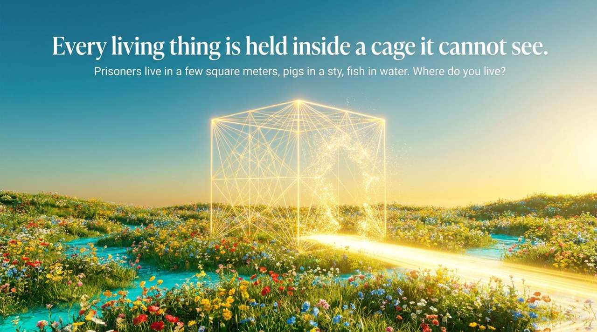
    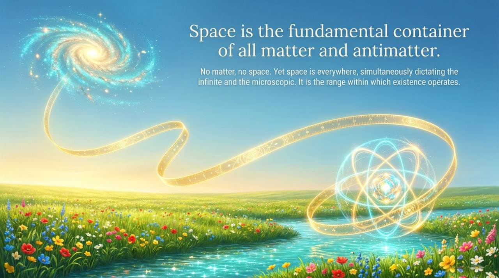
    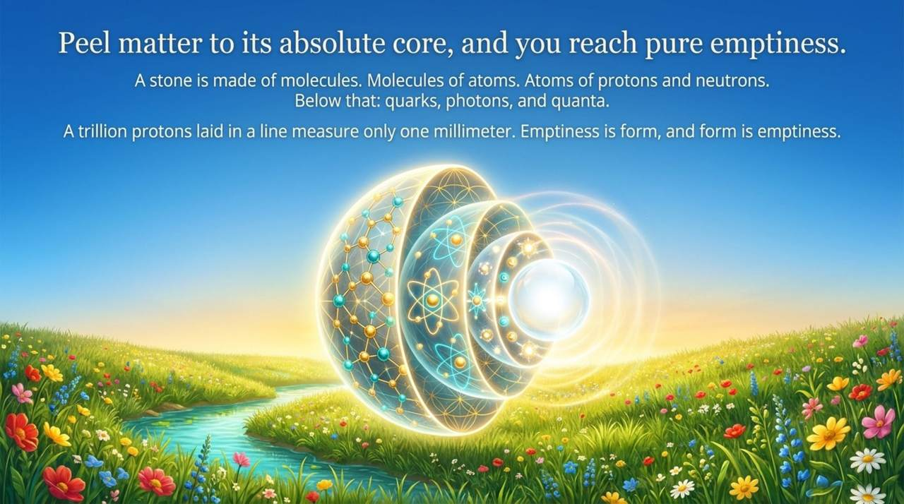
    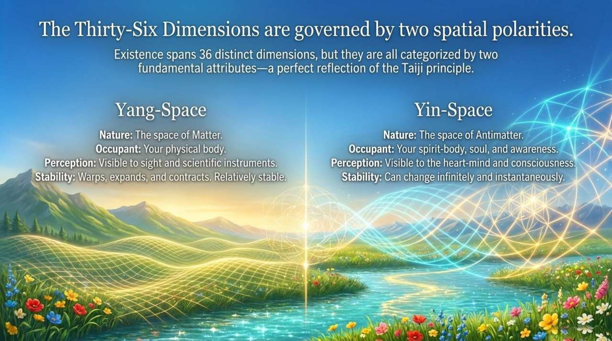
    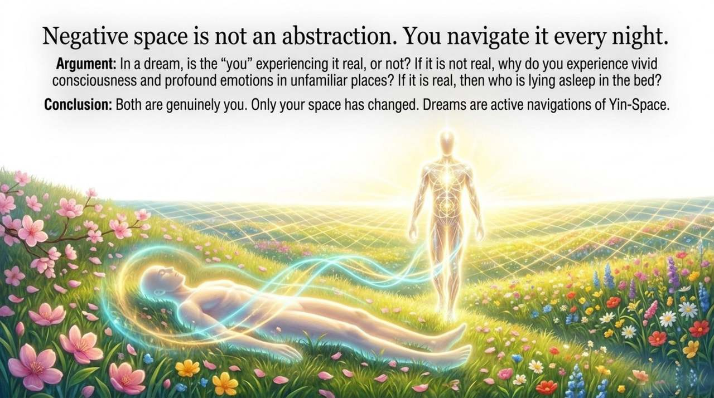
    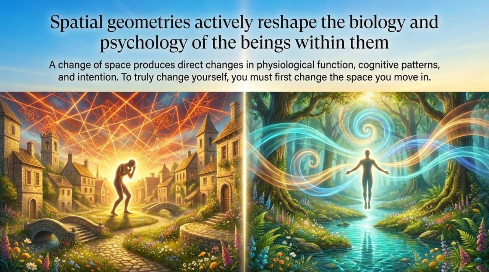
    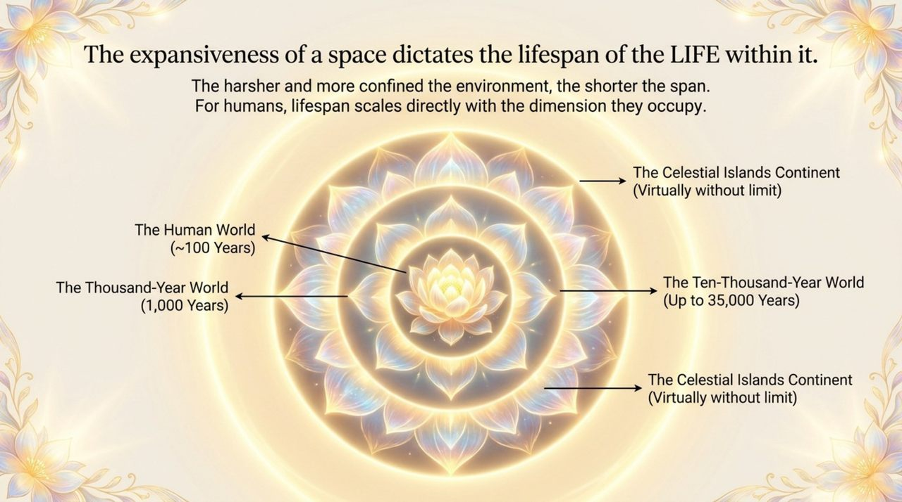
    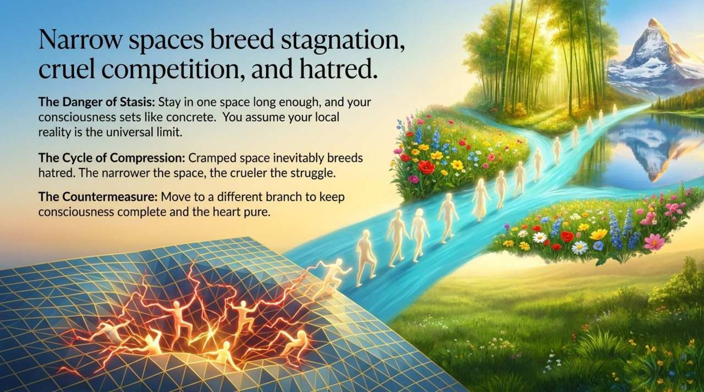
    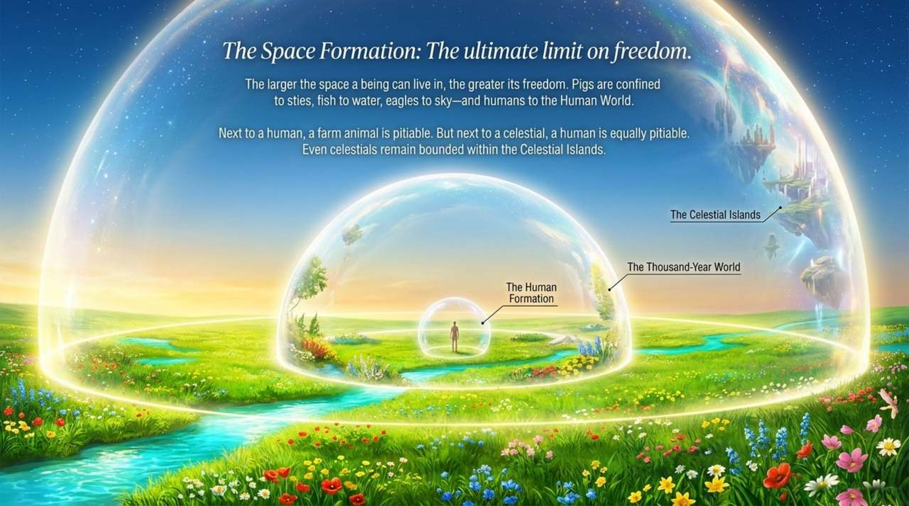
    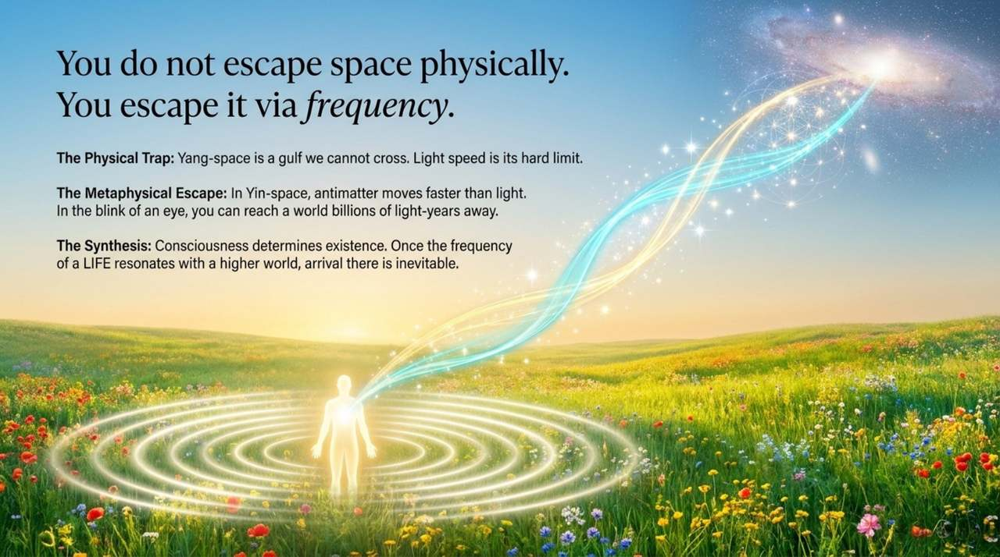
    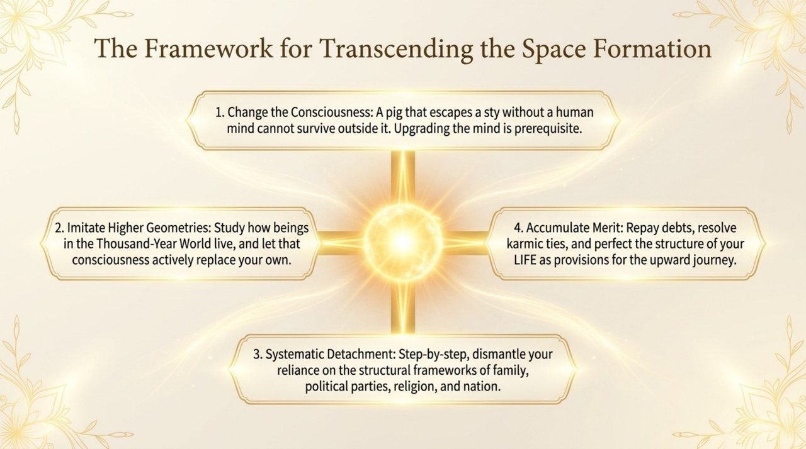
    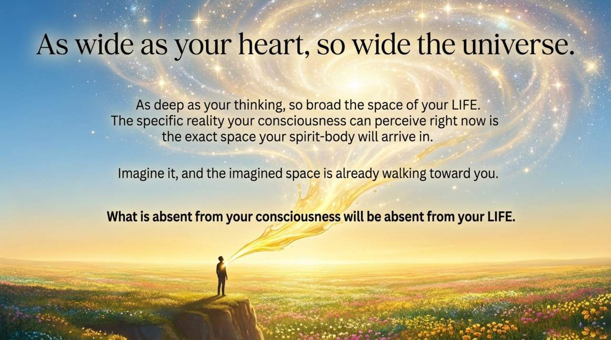

---

| Version | Best for | Focus |
|---------|----------|-------|
| [Friendly version](friendly.md) | First-time readers | Everyday analogies, space's impact on life |
| [Academic version](academic.md) | Researchers | Systematic analysis, comparison with external frameworks |
| [Internal reference](internal.md) | Deep study | Full original texts with source citations |

---

## Related Entries

[Space-Time](/en/spacetime/) · [Thirty-Six-Dimensional Space](/en/thirty-six-dimensional-space/) · [Universe (Overview)](/en/universe-overview/) · [Levels of LIFE](/en/levels-of-life/) · [High-Level Life Spaces](/en/high-life-spaces/) · [Dream State](/en/dream-state/) · [Thousand-Year World](/en/thousand-year-world/) · [Ten-Thousand-Year World](/en/ten-thousand-year-world/) · [Elysium World](/en/elysium-world/) · [Antimatter World](/en/antimatter-world/) · [Twenty Parallel Worlds](/en/twenty-parallel-worlds/)
