---
title: Spacetime Tunnel
---

# Spacetime Tunnel

> The dense network of time formed by positive and negative time permeating all of space is called the time tunnel. The channels connecting the 36-dimensional spaces are called space tunnels. The time tunnel is always vertical; the space tunnel is always horizontal.
>
> — *The New Era Humanity's 800 Concepts*, 4th Edition, Entries 429 & 425

The spacetime tunnel is one of the central cosmological concepts in the Lifechanyuan system, referring collectively to the *time tunnel* (which traverses past and future) and the *space tunnel* (which connects the 36-dimensional spaces across 20 parallel worlds). Together they form the universe's three-dimensional "transit network." Entering the spacetime tunnel marks an advanced stage of spiritual cultivation — and is the very passage through which Chanyuan practitioners travel from the human world (xy) to the Celestial Island Continent (xyz).

| Version | Best for | Focus |
|---------|----------|-------|
| [Friendly version](friendly.md) | First-time readers | Accessible analogies and meaning |
| [Academic version](academic.md) | Researchers | System analysis and comparison |
| [Internal reference](internal.md) | Deep study | Complete source quotations |

## Video

<iframe style="width:100%;aspect-ratio:4/3;border:0" src="https://www.youtube-nocookie.com/embed/k_iwJei5x-U" title="Spacetime Tunnel (Lifechanyuan Encyclopedia video)" allowfullscreen></iframe>

## Slides

??? info "📖 Illustrated slides (14 pages, click to expand)"

    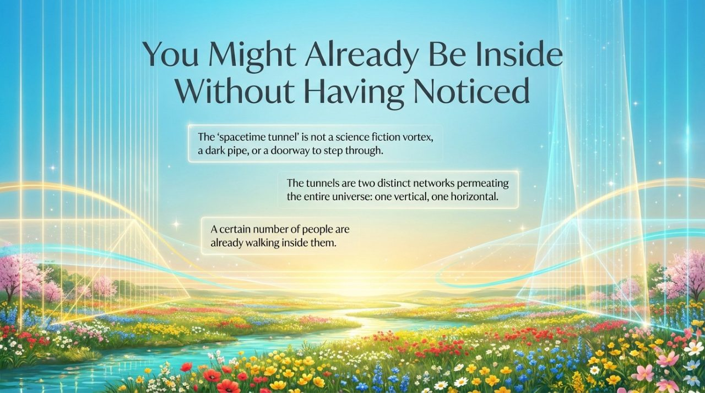
    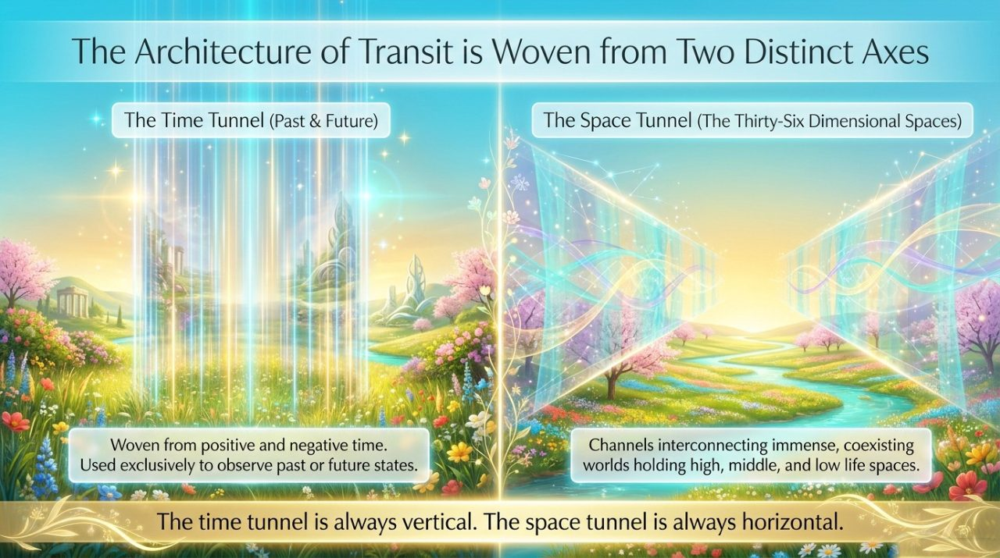
    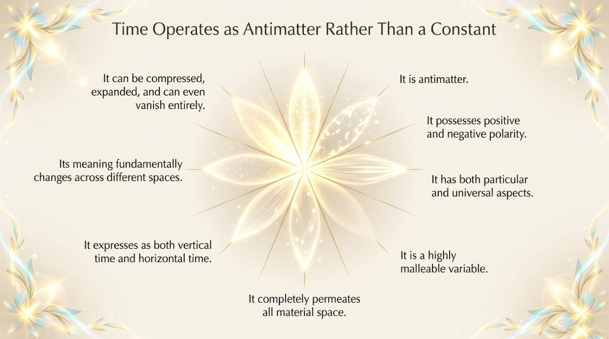
    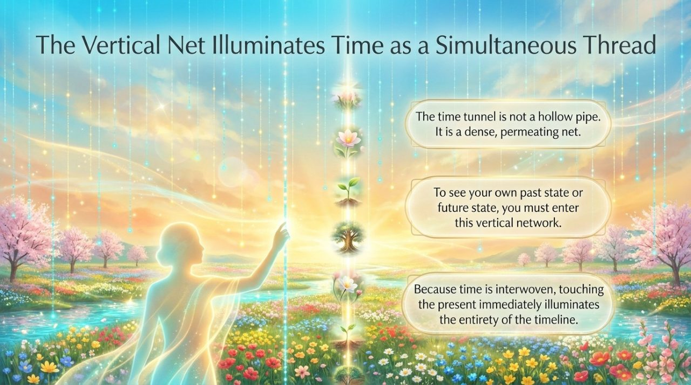
    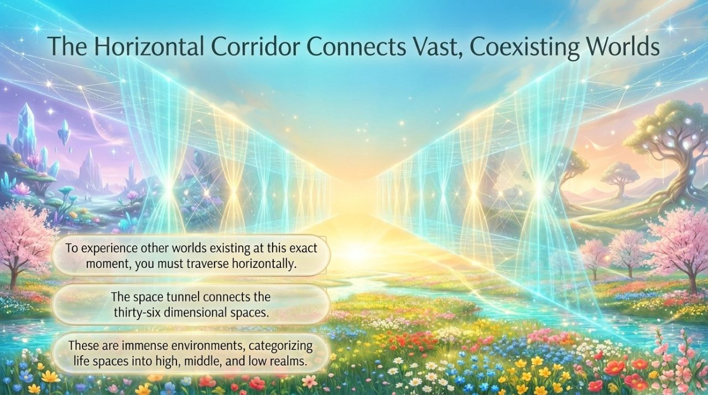
    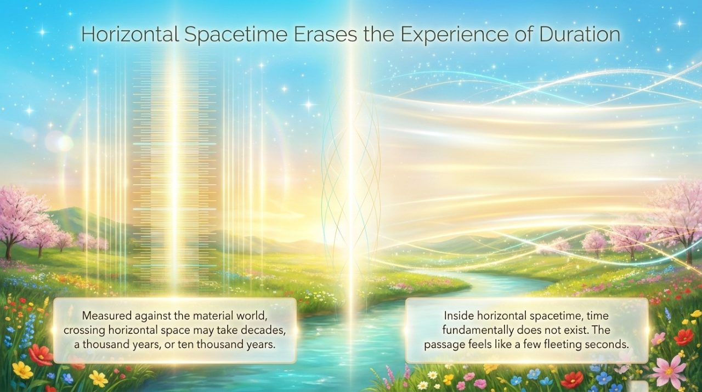
    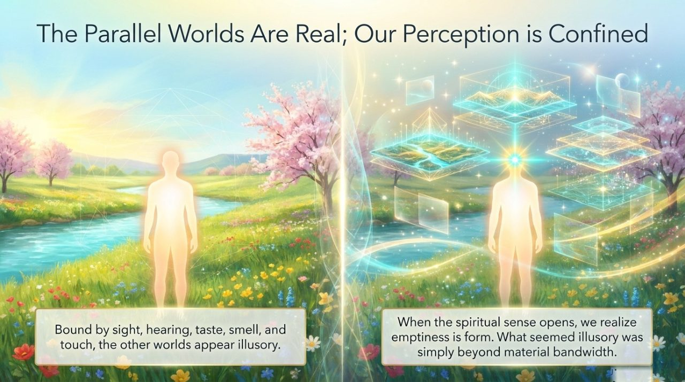
    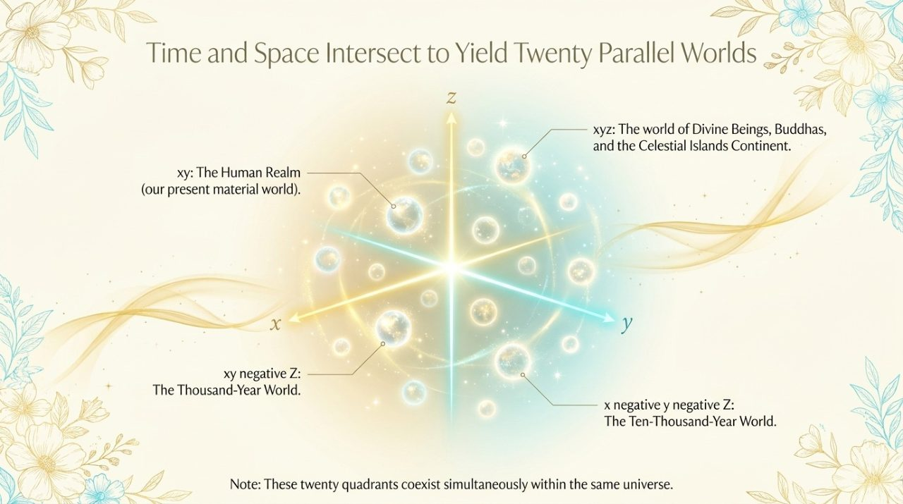
    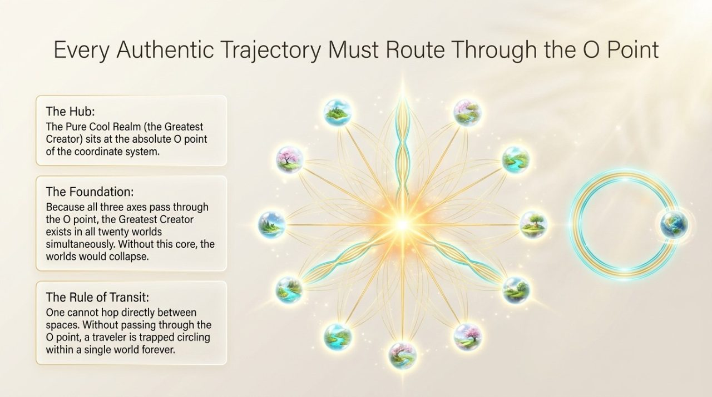
    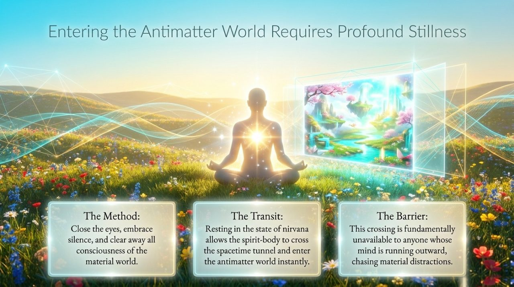
    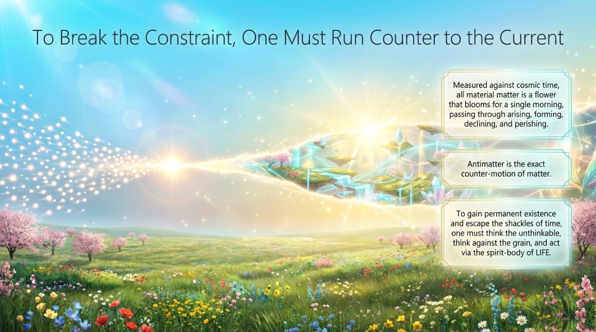
    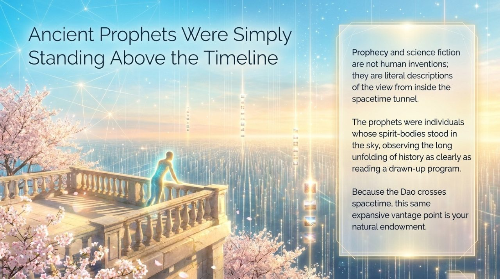
    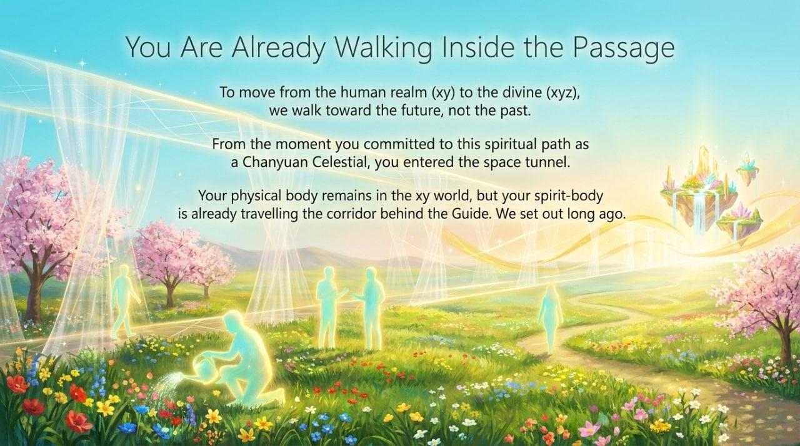
    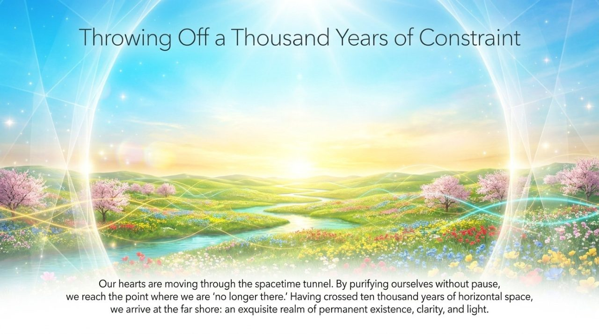

---

## Related Entries

[Spacetime](/en/spacetime/) · [20 Parallel Worlds](/en/twenty-parallel-worlds/) · [36-Dimensional Space](/en/thirty-six-dimensional-space/) · [Antimatter World](/en/antimatter-world/) · [Cosmic Holography](/en/cosmic-holography/) · [36 Trigram Arrays](/en/thirty-six-bagua-formations/) · [Celestial Island Continent](/en/celestial-islands-continent/) · [Spirit Eye](/en/linyan/) · [Paradise Realm](/en/elysium-world/)
