# Space-Time

**Space-Time** refers to time and space as the foundational coordinate system of Lifechanyuan's cosmology. Time is antimatter — a "recorder" of the states of material motion. Space encompasses 36 dimensions connecting 20 parallel worlds. The space-time layer in which a LIFE exists directly determines its form of existence and ultimate destination. Understanding and transcending space-time is one of the core imperatives of cultivation.

## Video

<iframe style="width:100%;aspect-ratio:4/3;border:0" src="https://www.youtube-nocookie.com/embed/iXh2flM6ZVk" title="Space-Time (Lifechanyuan Encyclopedia video)" allowfullscreen></iframe>

## Slides

??? info "📖 Illustrated slides (14 pages, click to expand)"

    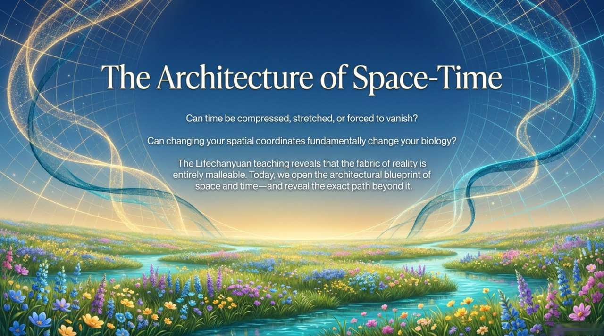
    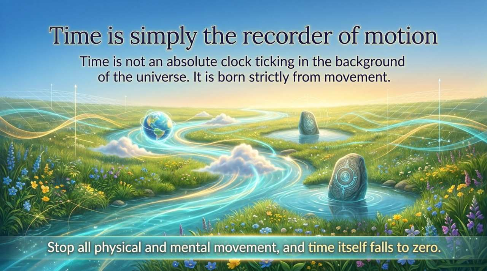
    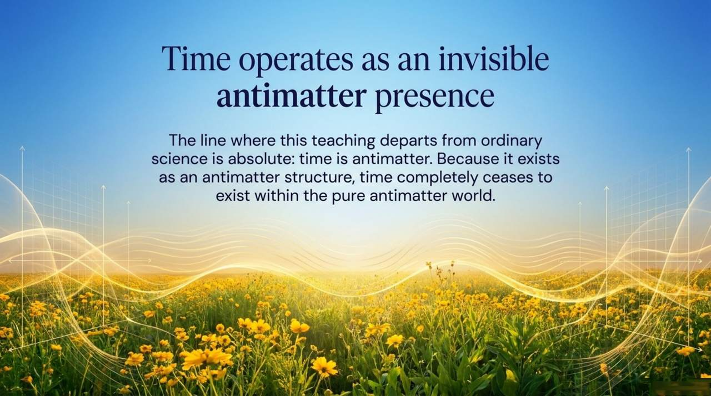
    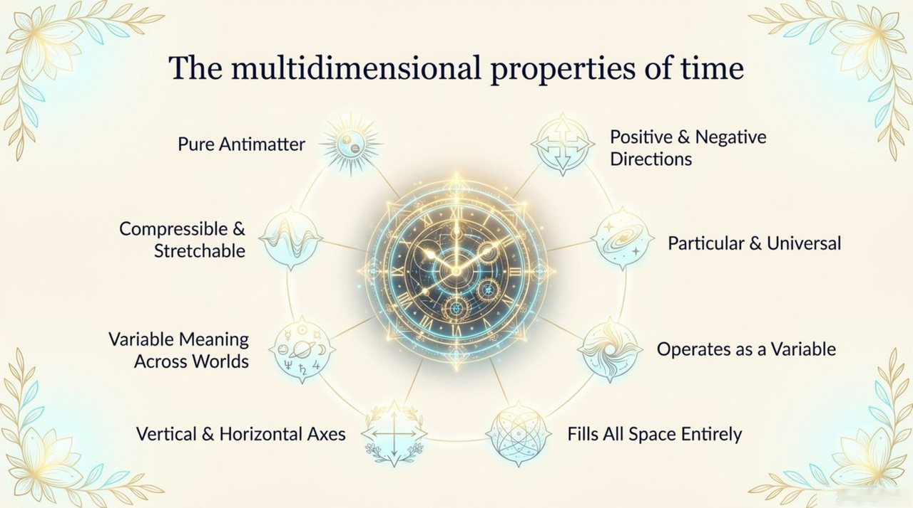
    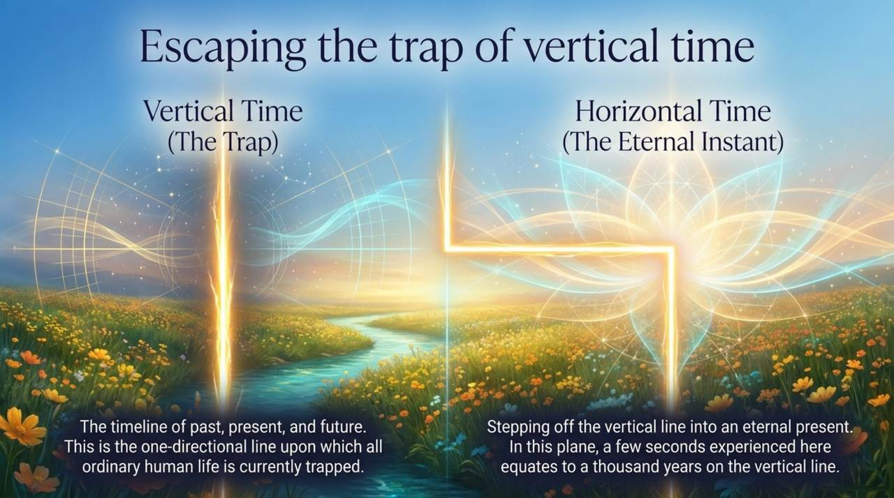
    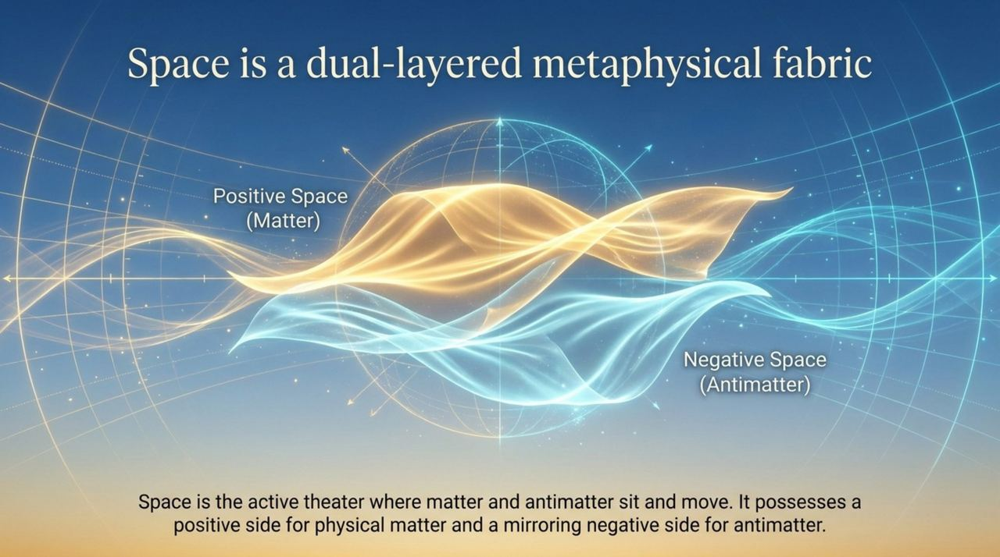
    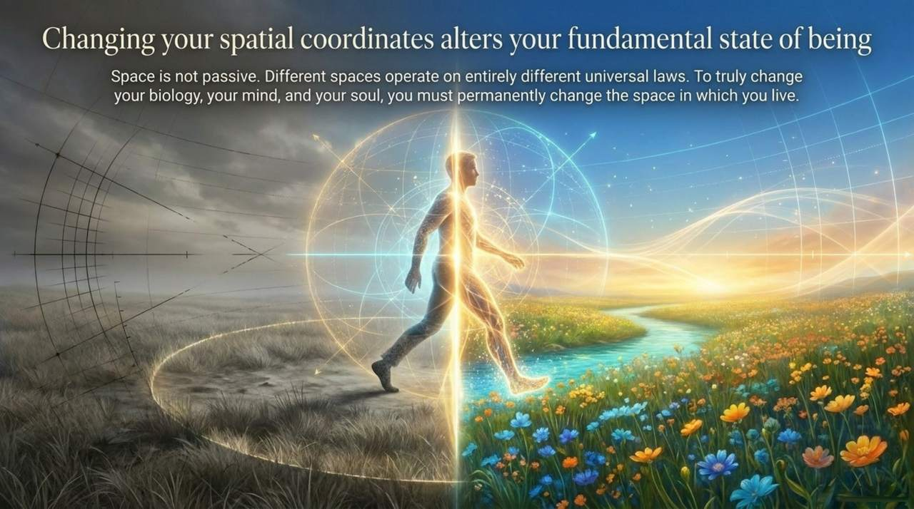
    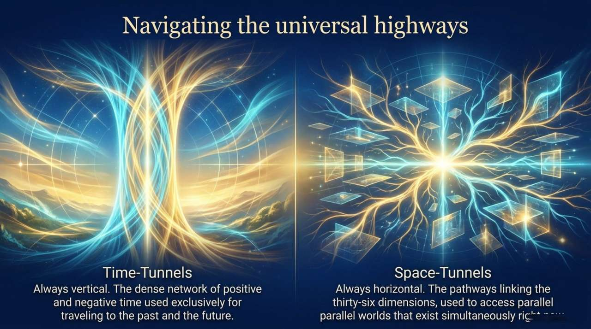
    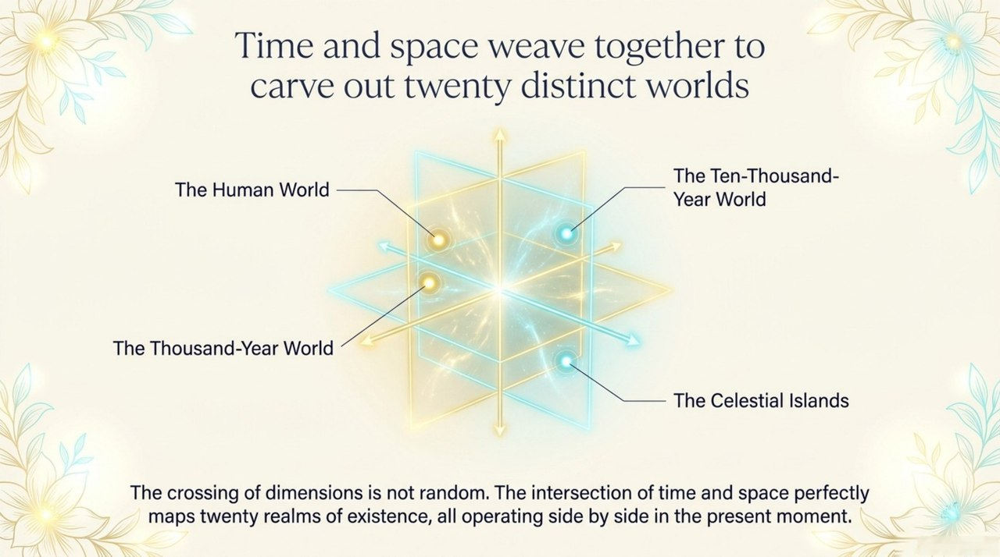
    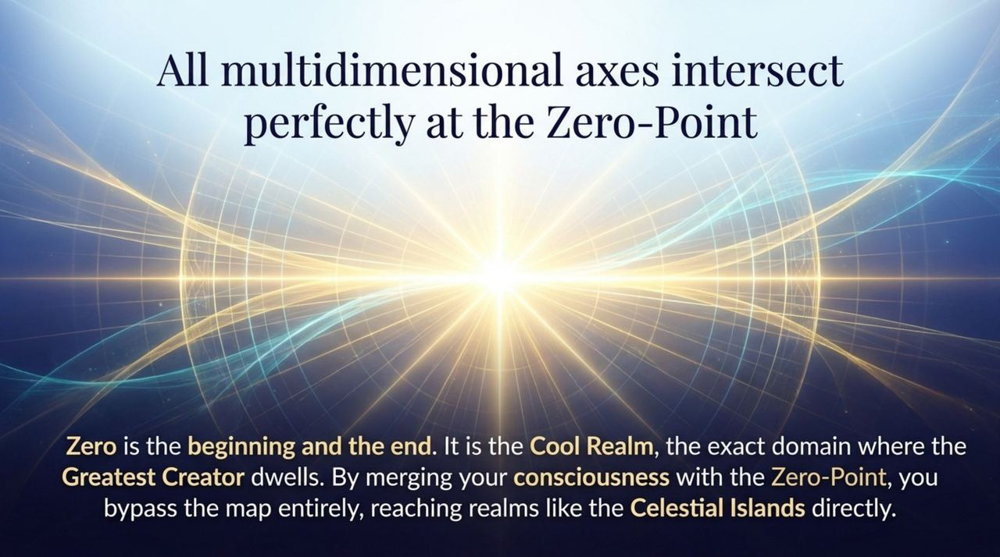
    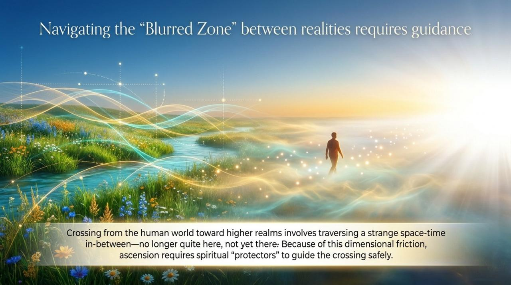
    
    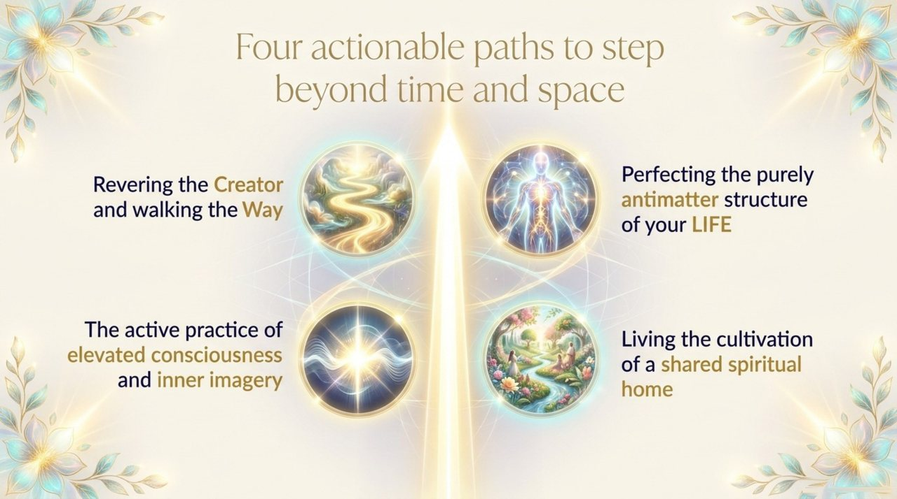
    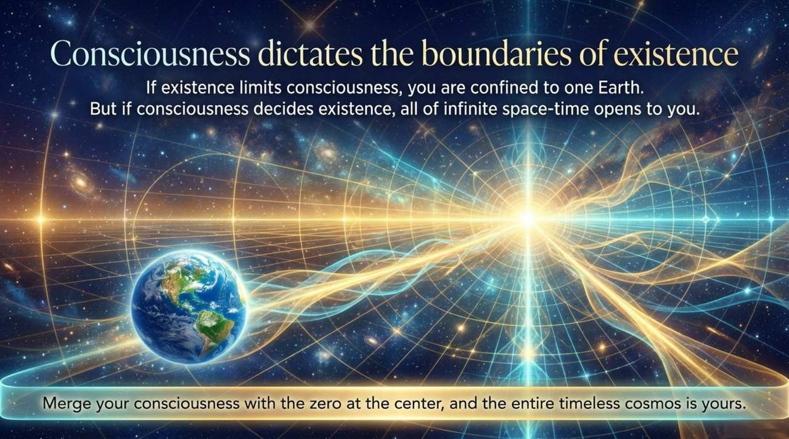

---

## Version Navigation

| Version | Best For | Link |
|---------|----------|------|
| Friendly | First-time readers seeking an accessible introduction | [Read Friendly Version](/en/spacetime/friendly/) |
| Academic | In-depth study and systematic analysis | [Read Academic Version](/en/spacetime/academic/) |
| Internal | Chanyuan Celestials studying original teachings | [Read Internal Version](/en/spacetime/internal/) |

---

## Related Entries

[Space](/en/space/) · [Thirty-Six-Dimensional Space](/en/thirty-six-dimensional-space/) · [Antimatter Structure](/en/antimatter-structure/) · [Consciousness](/en/consciousness/) · [Energy](/en/energy/) · [Dreams](/en/dream-state/) · [Higher LIFE Spaces](/en/high-life-spaces/) · [Kingdom of Heaven](/en/kingdom-of-heaven/) · [Karma, Retribution & Reincarnation](/en/karma-retribution-reincarnation/)
