# Spirit (Overview)

In Lifechanyuan's framework, **spirit** (*jingshen*, 精神) is not a vague psychological concept but a precise ontological one: the composite of *jing* (精, vital essence) and *shen* (神, animating power) — the pillar of the LIFE-body and the bridge connecting matter and antimatter. Spirit is the intermediate zone through which LIFE ascends from the material world toward the soul world. A person without spirit will perish; a person with spirit can ward off all ills, remain immune to disease, and absorb the vital energy of heaven and earth.

---

## Video

<iframe style="width:100%;aspect-ratio:4/3;border:0" src="https://www.youtube-nocookie.com/embed/N4jLMyP9X_Y" title="Spirit (Overview) (Lifechanyuan Encyclopedia video)" allowfullscreen></iframe>

## Slides

??? info "📖 Illustrated slides (13 pages, click to expand)"

    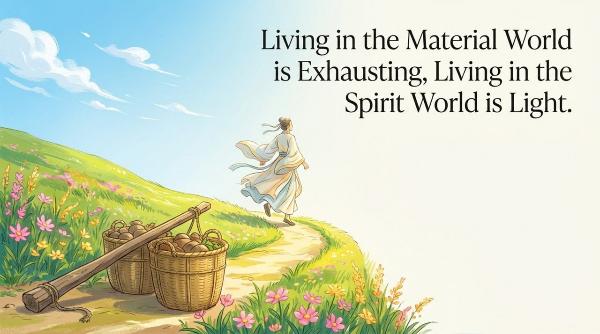
    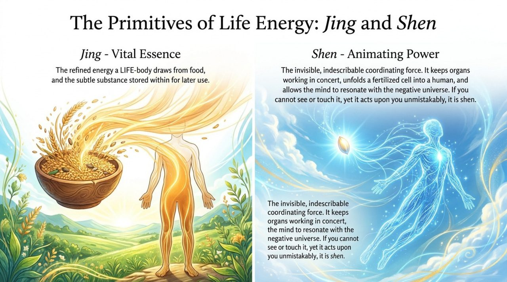
    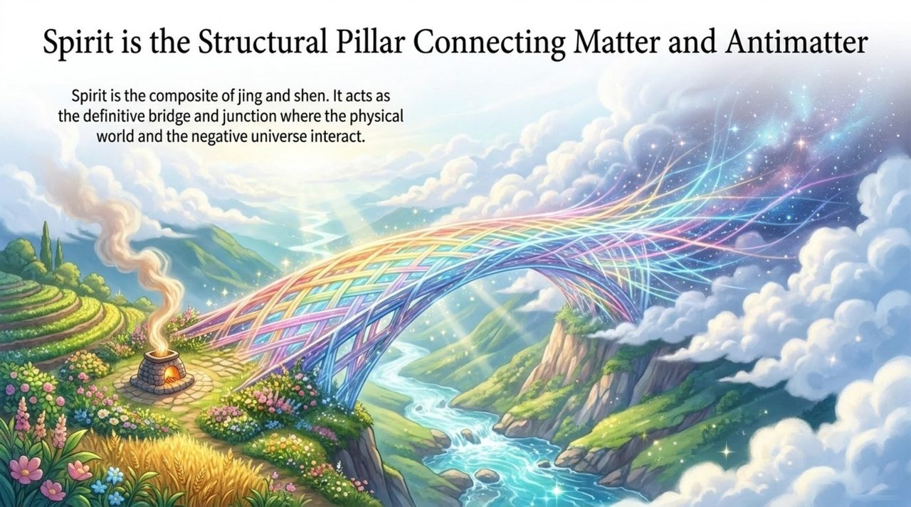
    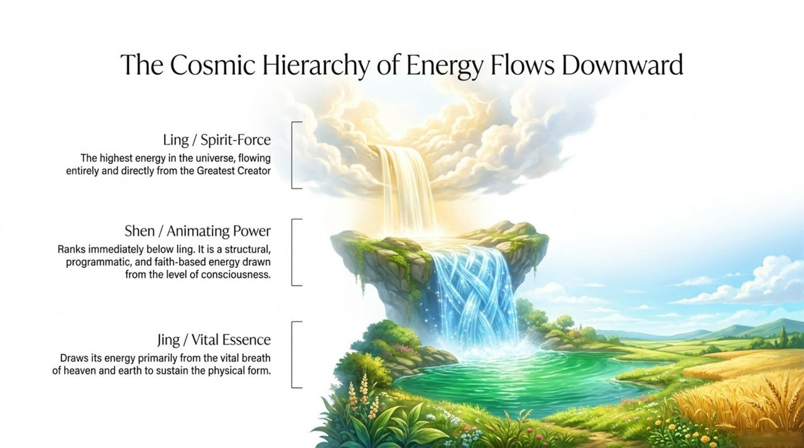
    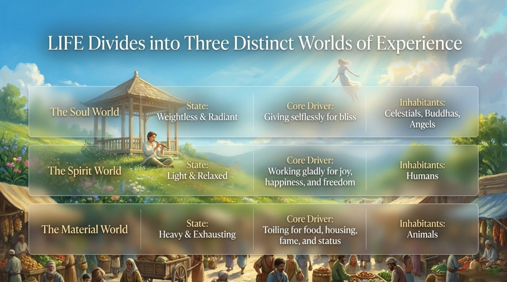
    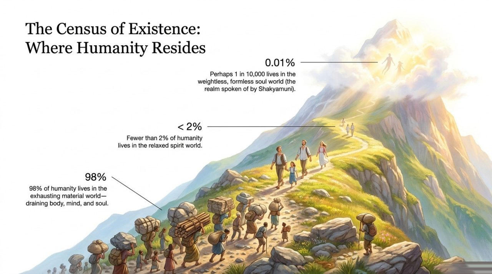
    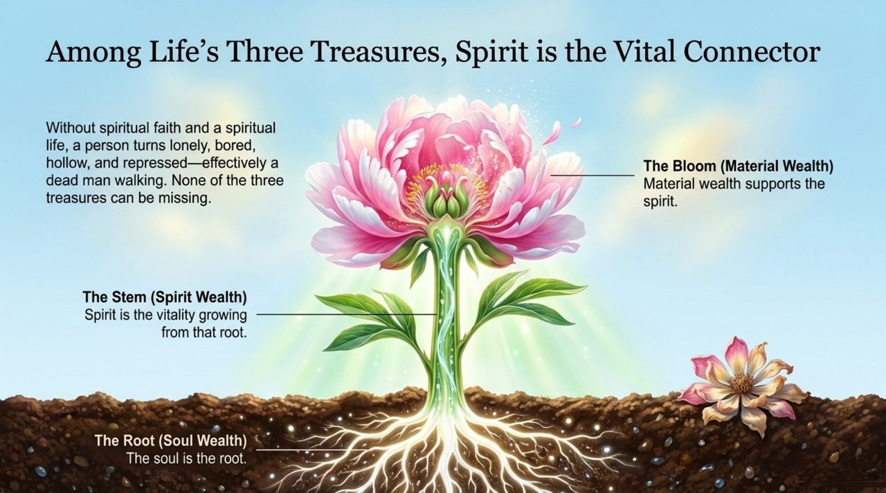
    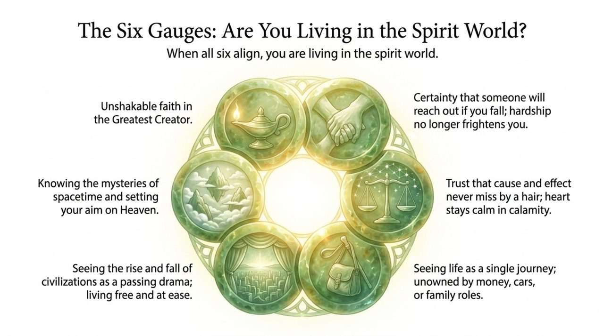
    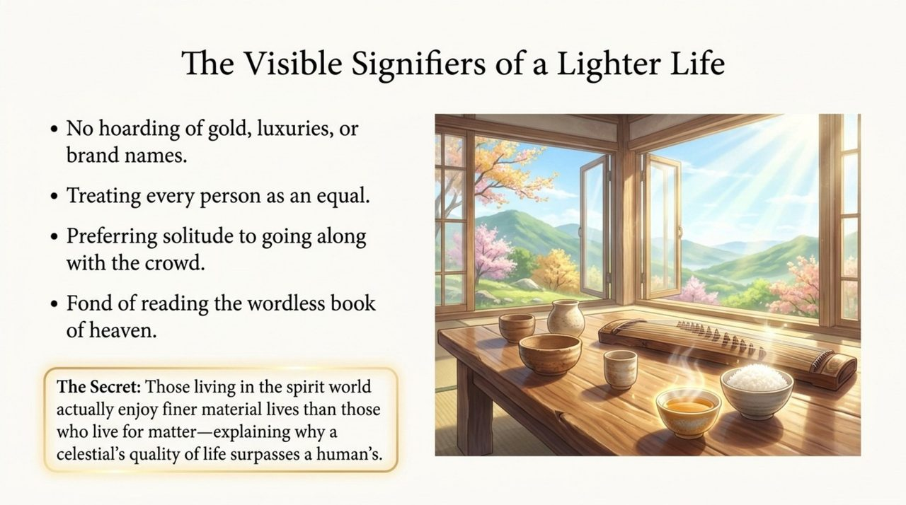
    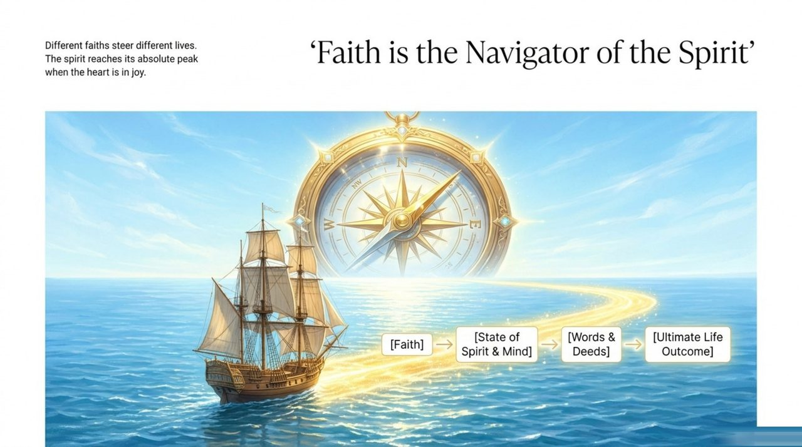
    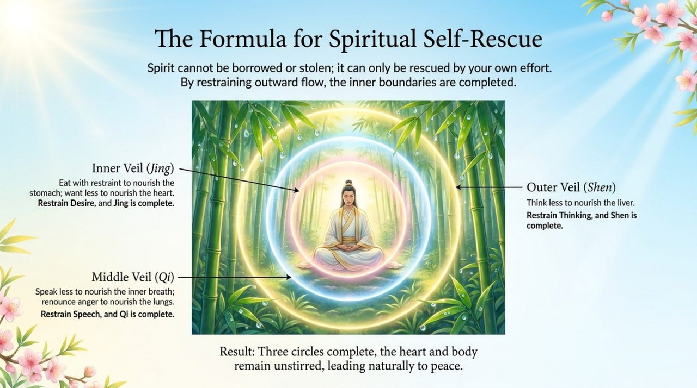
    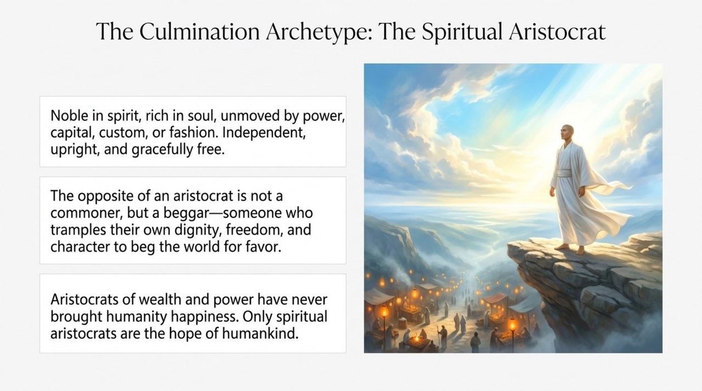
    

## Version Navigation

| Version | Best For | Link |
|---------|----------|------|
| Friendly | First-time readers seeking an accessible introduction | [Read Friendly Version](/en/spirit-overview/friendly/) |
| Academic | In-depth study and systematic analysis | [Read Academic Version](/en/spirit-overview/academic/) |
| Internal | Chanyuan Celestials studying original teachings | [Read Internal Version](/en/spirit-overview/internal/) |

---

## Related Entries

[LIFE](/en/life/) · [Ling (Spirit-Force)](/en/ling-spirit/) · [Spirituality](/en/spirituality/) · [Consciousness](/en/consciousness/) · [Energy](/en/energy/) · [Raise Vibrational Frequency](/en/raise-vibration-frequency/) · [Return to Zero](/en/return-to-zero/)
