<!-- id: LC-36D-0001-EN theme: Universe-LIFE System type: Gateway Page direction: Cosmic Structure lang: en -->

# Thirty-Six-Dimensional Space

[Entry Gateway]

> In Lifechanyuan terminology, **LIFE** (capitalized) refers to the ontological
> essence of existence — the soul/antimatter structure that persists across
> incarnations — while **life** (lowercase) refers to the experiential stage
> of human existence in this world.

**Thirty-Six-Dimensional Space** (三十六维空间) is the core structural model of the Lifechanyuan space-time framework. The universe is not three-dimensional — it consists of thirty-six dimensional layers, each corresponding to a different level of LIFE quality, consciousness frequency, and antimatter structure refinement. The human world occupies the third dimension; higher spaces ascend through the celestial realms to the realm of the Greatest Creator.

> Human thinking is three-dimensional; celestial thinking operates above the fourth dimension; gods and Buddhas move through all thirty-six dimensions; the Greatest Creator lives in hundun.
>
> — Guide Xuefeng

## Video

<iframe style="width:100%;aspect-ratio:4/3;border:0" src="https://www.youtube-nocookie.com/embed/96FKAFjX6kA" title="Thirty-Six-Dimensional Space (Lifechanyuan Encyclopedia video)" allowfullscreen></iframe>

## Slides

??? info "📖 Illustrated slides (13 pages, click to expand)"

    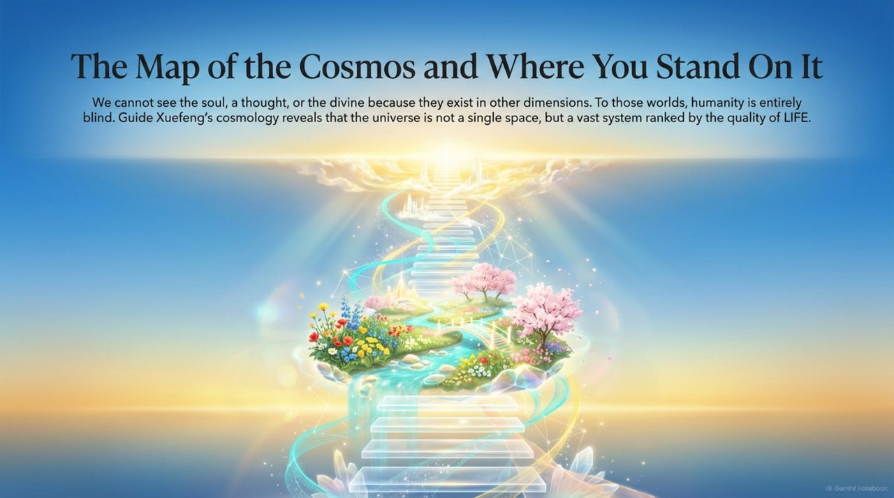
    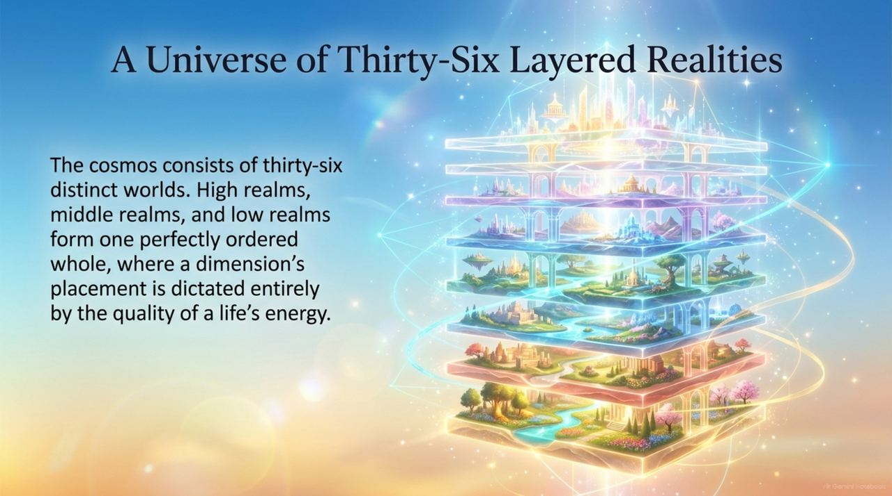
    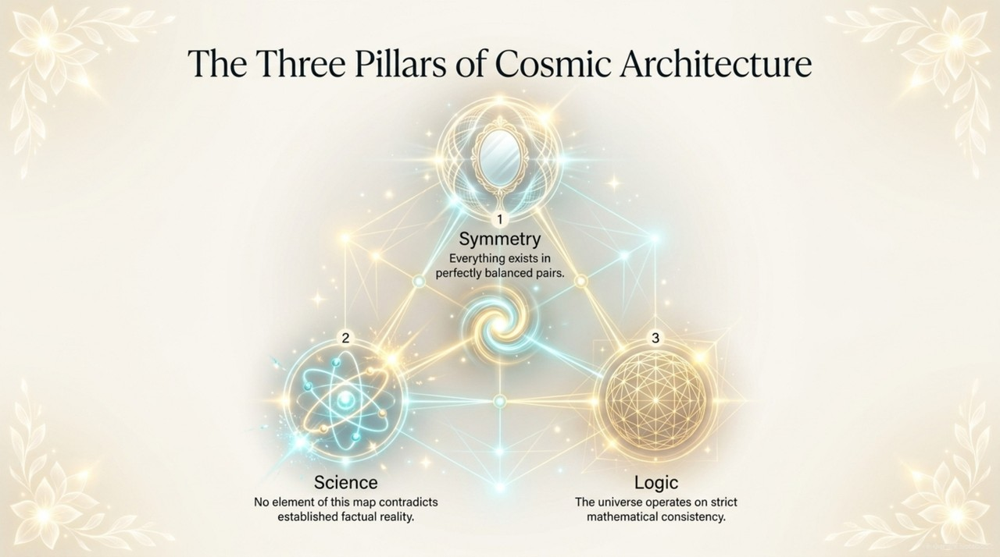
    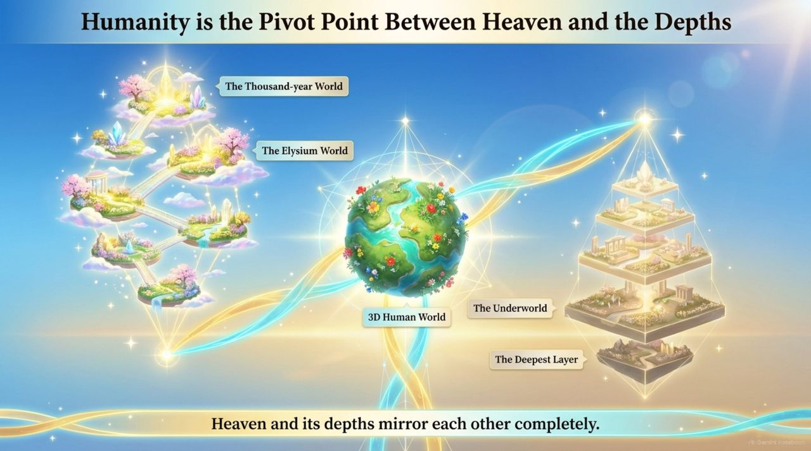
    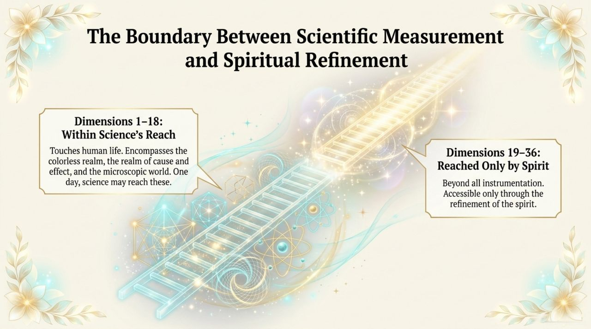
    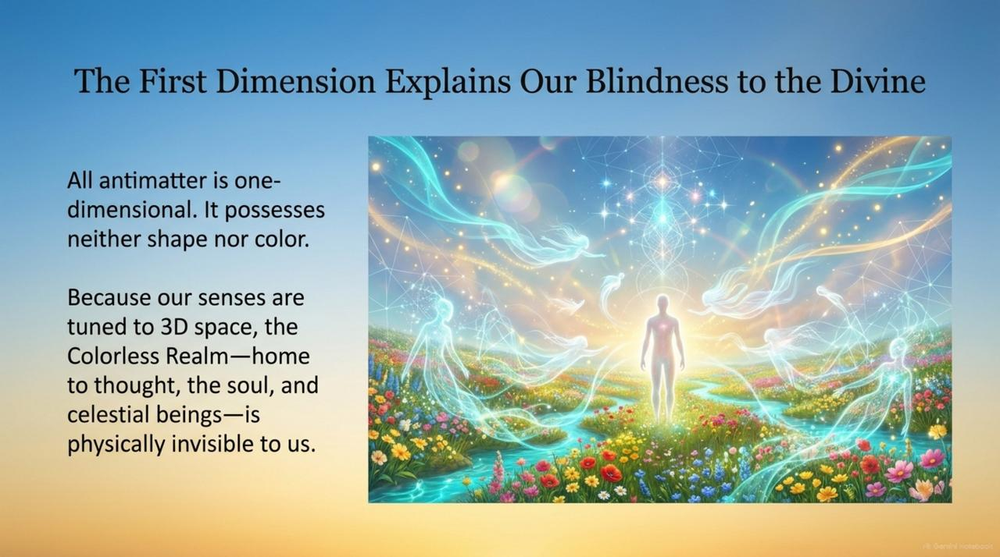
    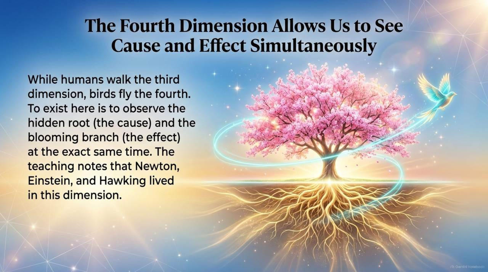
    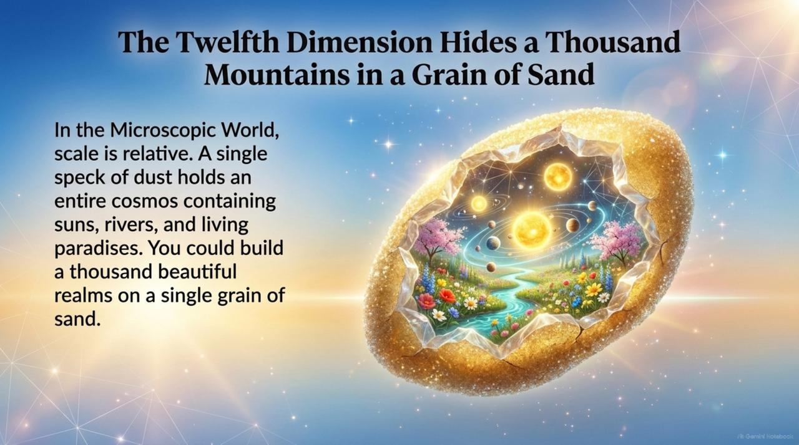
    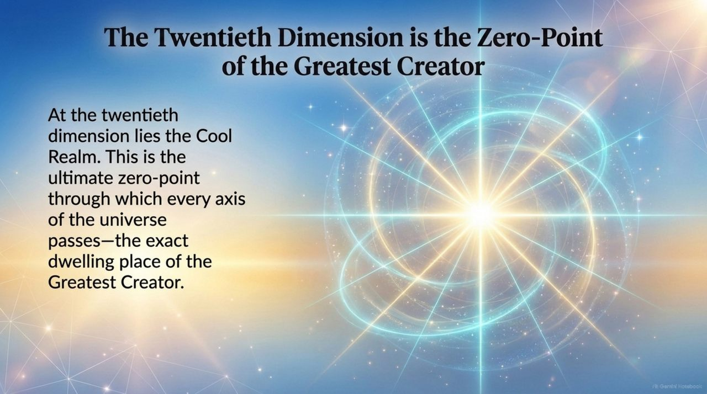
    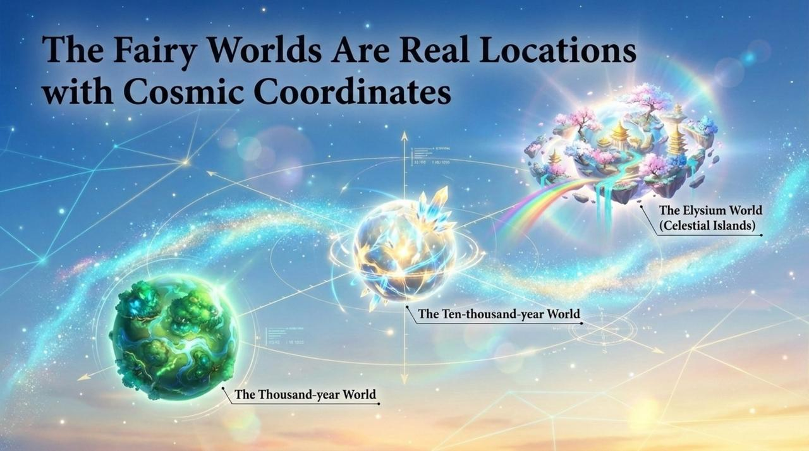
    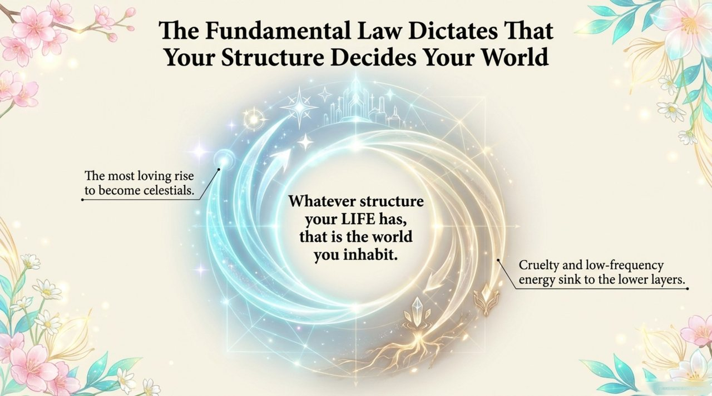
    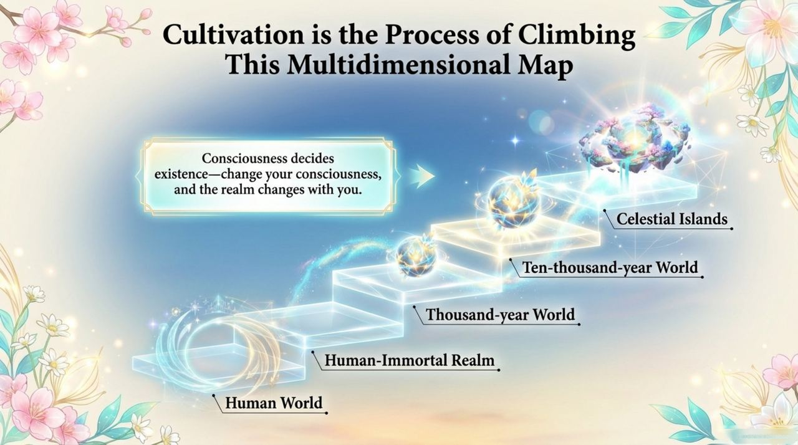
    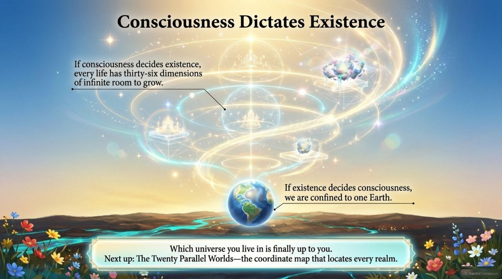

---

## Core Positioning

In the Lifechanyuan system, the Thirty-Six-Dimensional Space model provides the spatial architecture for understanding LIFE's post-death trajectory: each LIFE form's dimensional destination is determined by the quality of its antimatter structure and the level of its thinking. Cultivation is the process of raising one's dimensional frequency.

---

## Read by Edition

| Edition | Intended Reader | Link |
|---------|----------------|-------|
| **Friendly Edition** | Readers new to Lifechanyuan concepts | [Read Friendly Edition](./friendly) |
| **Academic Edition** | Researchers with philosophical/religious studies background | [Read Academic Edition](./academic) |
| **Internal Edition** | Chanyuan Celestials and deep practitioners | [Read Internal Edition](./internal) |

---

## Related Entries

- [Antimatter World](/en/antimatter-world/) — The Thirty-Six-Dimensional Space exists within the Antimatter World
- [Eight Thinking Ladders](/en/eight-thinking-ladders/) — Thinking level corresponds to dimensional access
- [Celestial Islands Continent](/en/celestial-islands-continent/) — One of the highest destinations in the dimensional model
- [Elysium World](/en/elysium-world/) · [Ten-Thousand-Year World](/en/ten-thousand-year-world/) · [Thousand-Year World](/en/thousand-year-world/) — Specific dimensional layers and destinations
- [Kingdom of Heaven](/en/kingdom-of-heaven/) — The collective term for high-dimensional heavenly realms
