<!-- id: LC-TYW-0001-EN theme: Universe-LIFE System type: Gateway Page direction: LIFE Destination lang: en -->

# The Thousand-Year World

[Entry Gateway]

> In Lifechanyuan terminology, **LIFE** (capitalized) refers to the ontological
> essence of existence — the soul/antimatter structure that persists across
> incarnations — while **life** (lowercase) refers to the experiential stage
> of human existence in this world.

**The Thousand-Year World** (千年界) is the entry-level heavenly destination in the Lifechanyuan framework — the first threshold goal on the cultivation path, and the first layer within the Kingdom of Heaven. Understanding the eight kinds of thinking (the Eight Thinking Ladders) is one of the prerequisites for reaching the Thousand-Year World.

> The Thousand-Year World is where those who have cultivated their soul garden, elevated their thinking, and perfected the six LIFE qualities to the required level will go.
>
> — Guide Xuefeng

---

## Video

<iframe style="width:100%;aspect-ratio:4/3;border:0" src="https://www.youtube-nocookie.com/embed/c-q9M-xRsQw" title="The Thousand-Year World (Lifechanyuan Encyclopedia video)" allowfullscreen></iframe>

## Slides

??? info "📖 Illustrated slides (12 pages, click to expand)"

    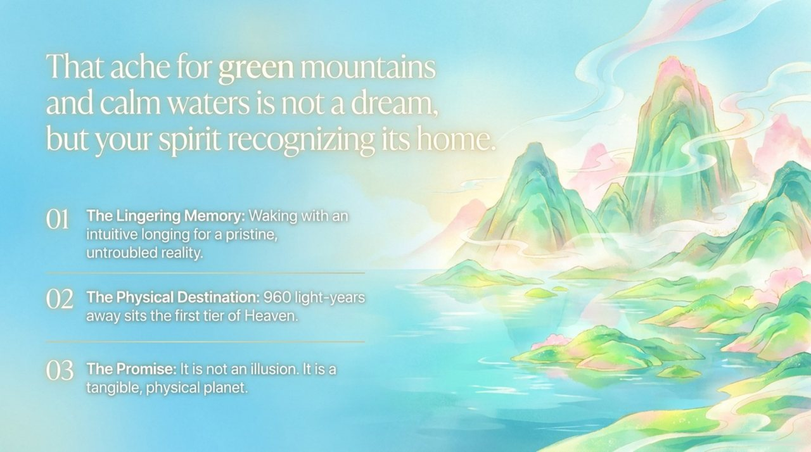
    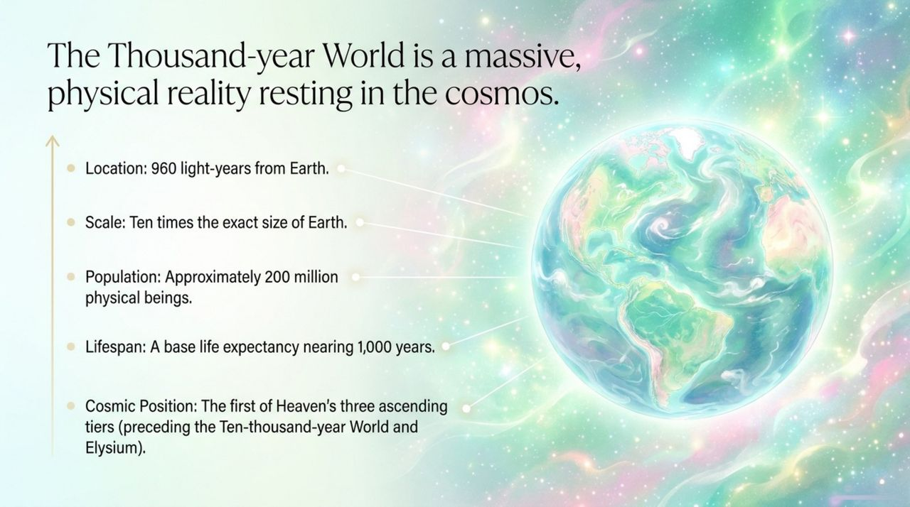
    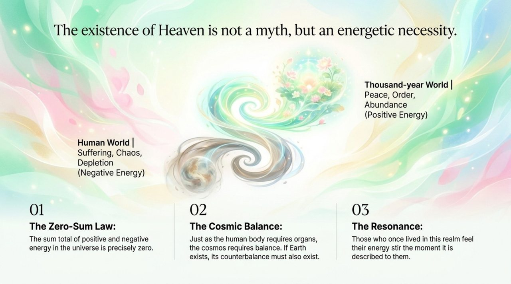
    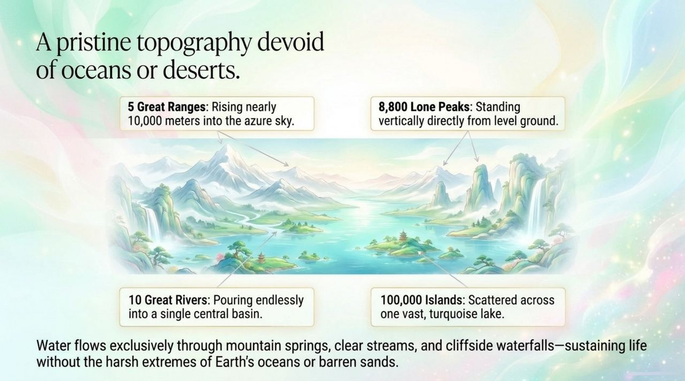
    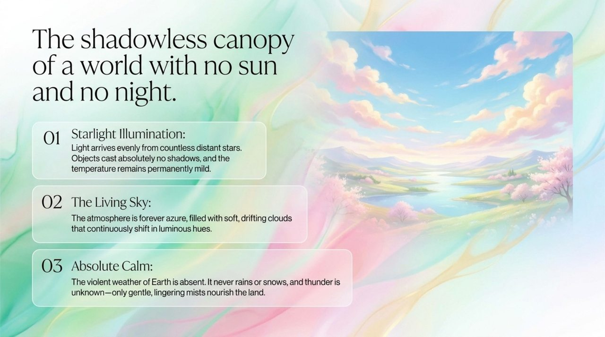
    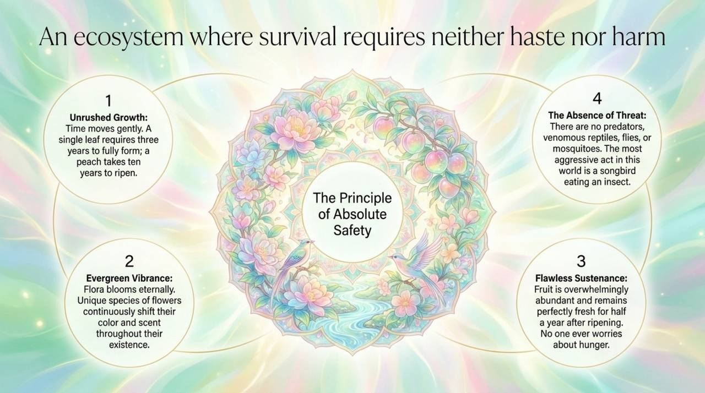
    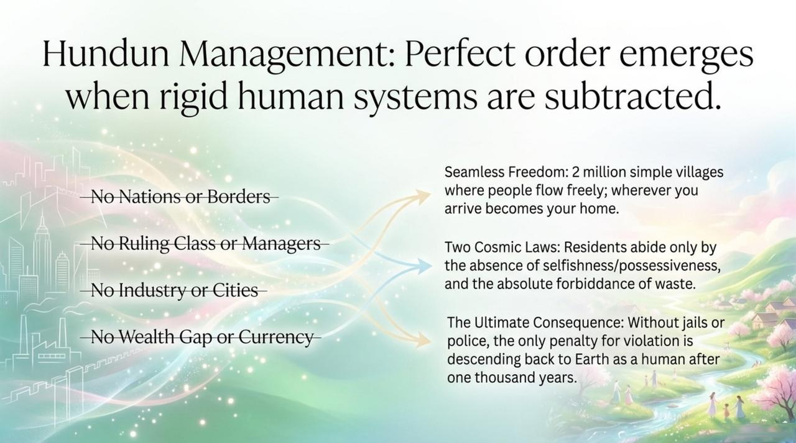
    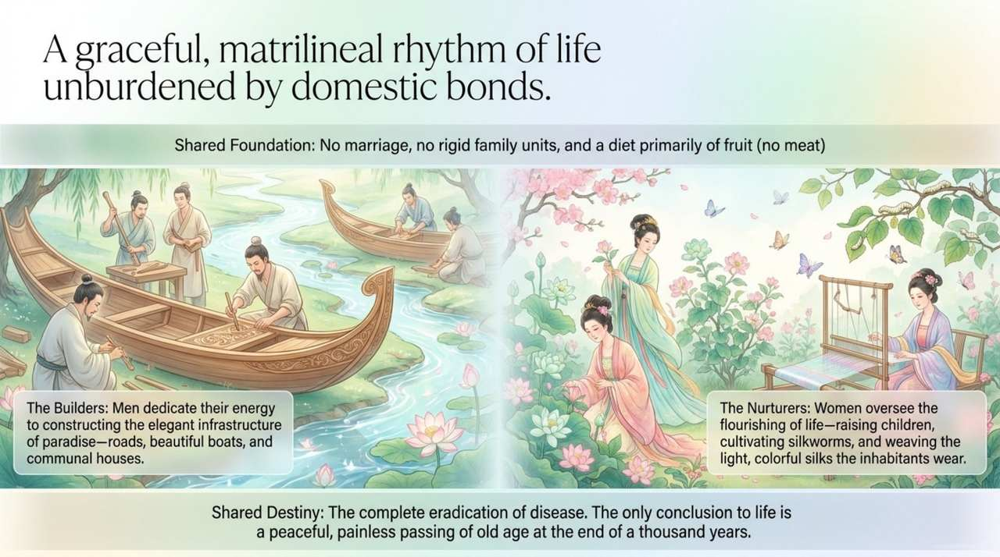
    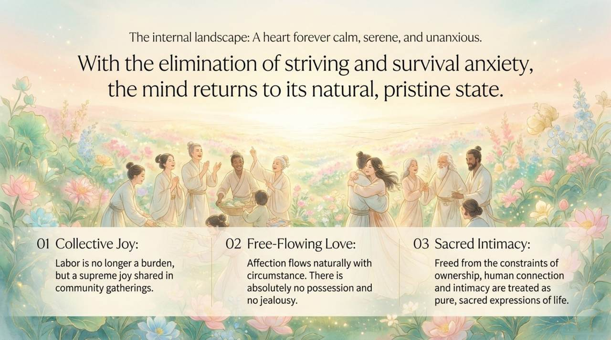
    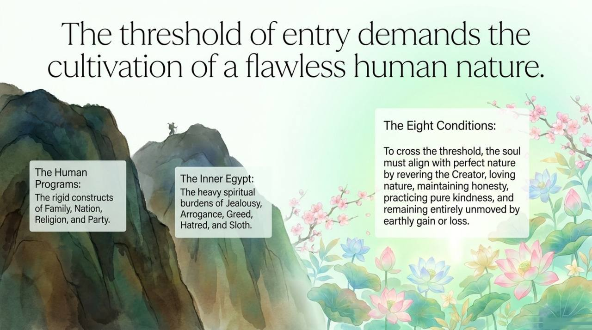
    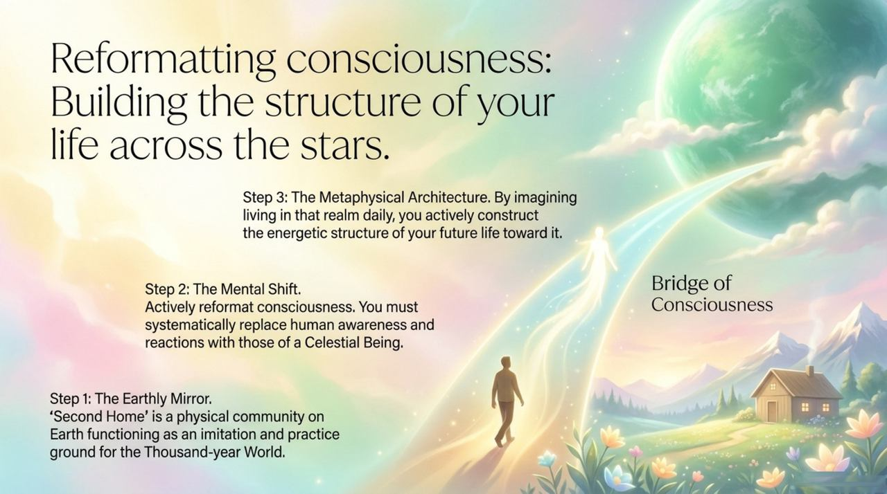
    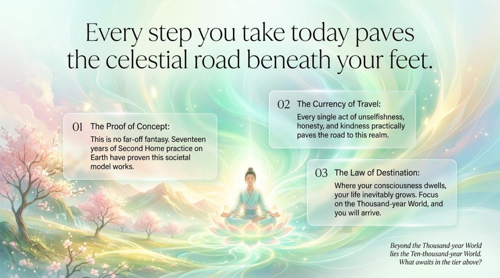

---

## Core Positioning

In the Lifechanyuan system, the Thousand-Year World is the initial destination of the Tour Guide Route Map — accessible to those who have genuinely cultivated the six LIFE qualities, elevated their thinking to the required level, and purified their soul garden. Reaching it is the first confirmation that cultivation has been real.

---

## Read by Edition

| Edition | Intended Reader | Link |
|---------|----------------|-------|
| **Friendly Edition** | Readers new to Lifechanyuan concepts | [Read Friendly Edition](./friendly) |
| **Academic Edition** | Researchers with philosophical/religious studies background | [Read Academic Edition](./academic) |
| **Internal Edition** | Chanyuan Celestials and deep practitioners | [Read Internal Edition](./internal) |

---

## Related Entries

- [Ten-Thousand-Year World](/en/ten-thousand-year-world/) — The layer above the Thousand-Year World
- [Kingdom of Heaven](/en/kingdom-of-heaven/) — The collective term for all three heavenly layers
- [Eight Thinking Ladders](/en/eight-thinking-ladders/) — Understanding all eight types of thinking is a prerequisite
- [Soul Garden](/en/soul-garden/) — Soul garden construction is the foundational prerequisite
- [Tour Guide Route Map](/en/tour-guide-route-map/) — The Thousand-Year World is the first milestone on this map
