---
title: Three Cosmic Elements
---

# Three Cosmic Elements

> "Consciousness, structure, and energy are the three elements that constitute the universe — and the master key to unlocking all of its mysteries."
>
> — Chanyuan Corpus · Dao Transmission · The Third Cosmic Element: Energy

The Three Cosmic Elements — **Consciousness, Structure, and Energy** — form the foundational framework of Lifechanyuan's cosmology. Xuefeng identified these three as the ultimate constituents of all existence and mapped their inner logic: energy has no form until it adheres to structure; every structure is a product of consciousness; and consciousness — the highest of the three — is the creator and sovereign of all. The supreme consciousness of the universe is the Greatest Creator.

To grasp the relationship among the three is to open the spiritual eye (*fayan*) — to see through any doctrine or theory with clarity. The heart of spiritual cultivation lies precisely in perfecting consciousness and structure, not in accumulating energy.

---

## Video

<iframe style="width:100%;aspect-ratio:4/3;border:0" src="https://www.youtube-nocookie.com/embed/f0nit4ujNpo" title="Three Cosmic Elements (Lifechanyuan Encyclopedia video)" allowfullscreen></iframe>

## Slides

??? info "📖 Illustrated slides (13 pages, click to expand)"

    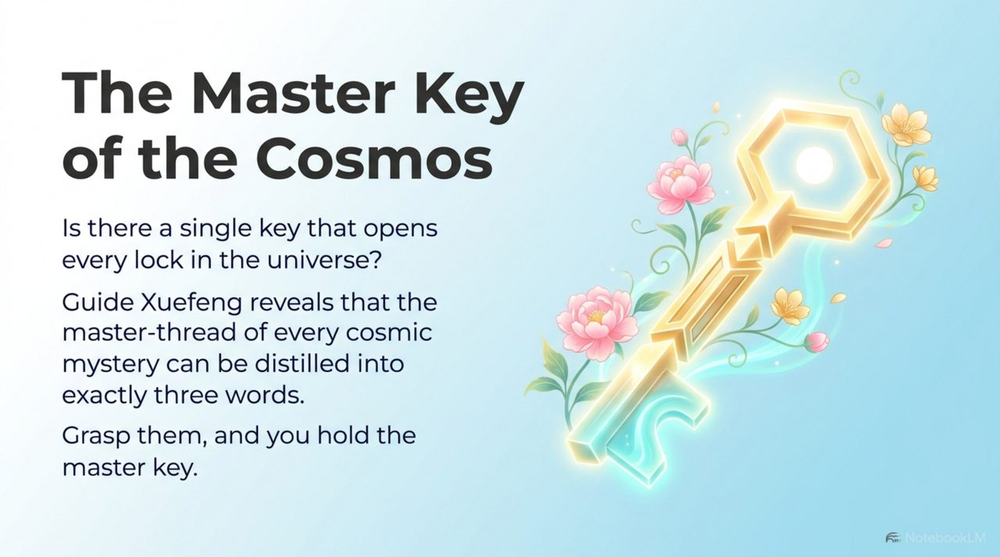
    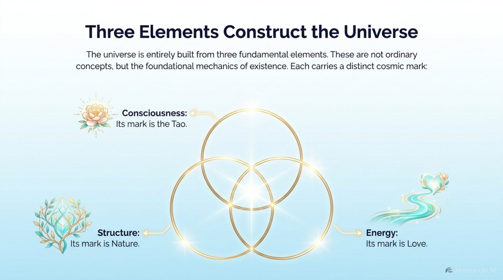
    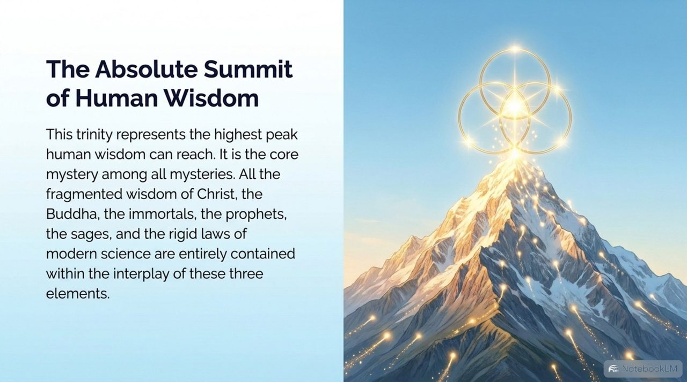
    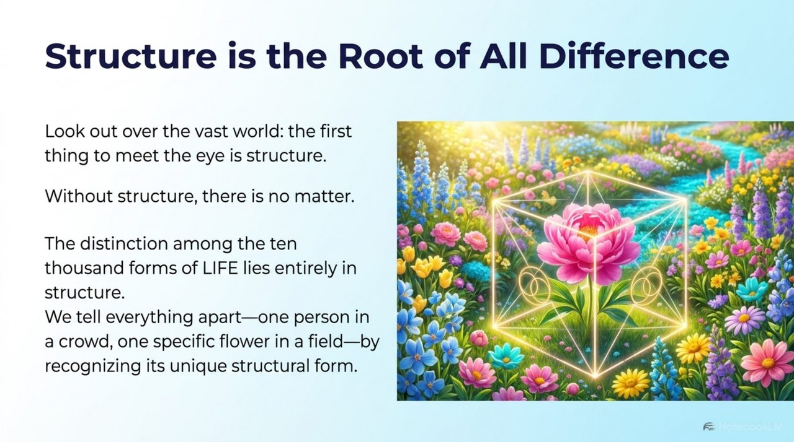
    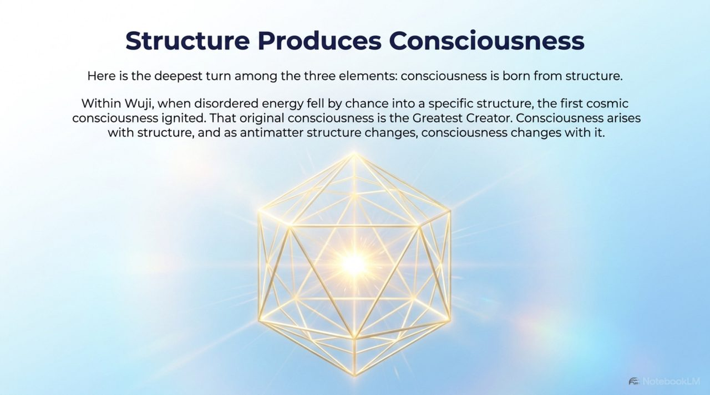
    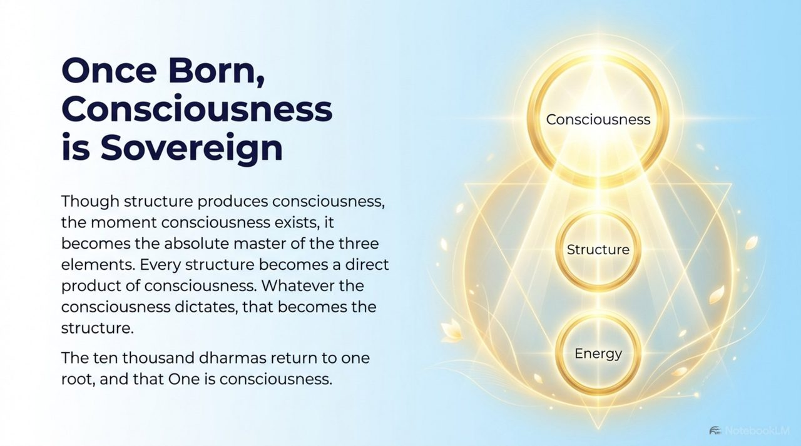
    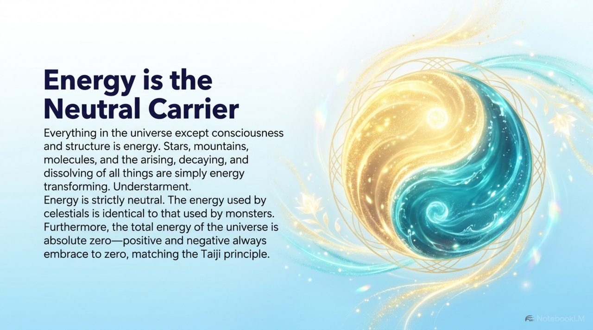
    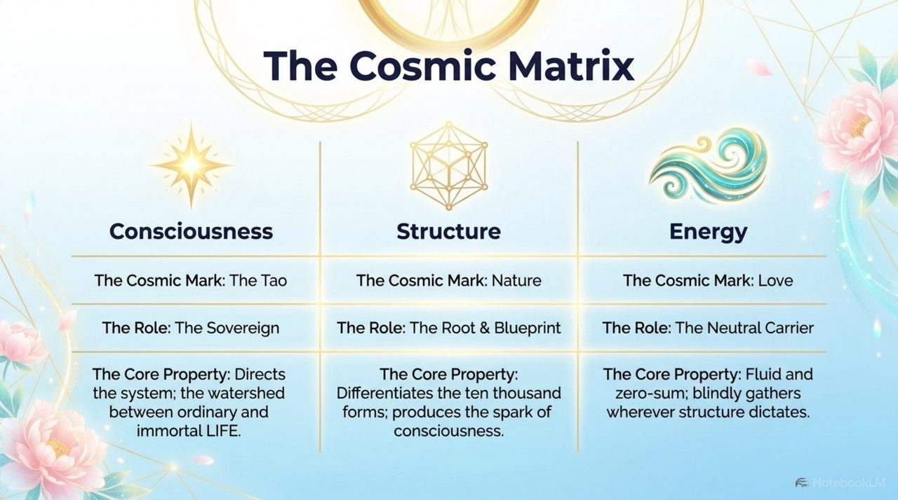
    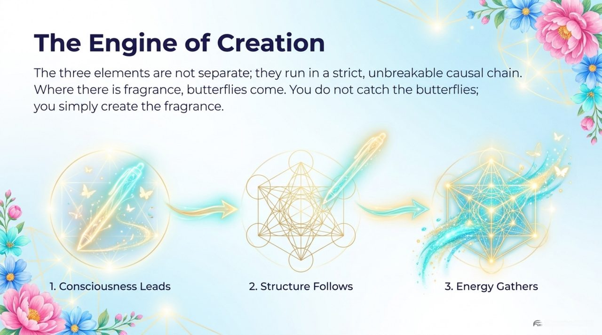
    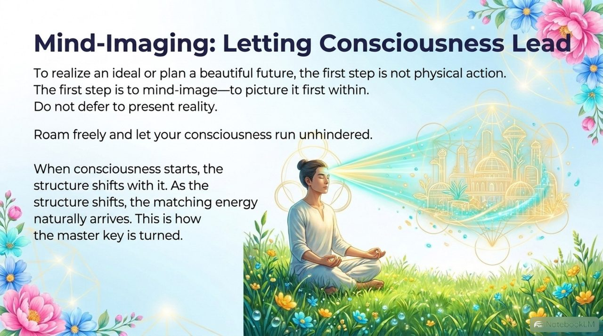
    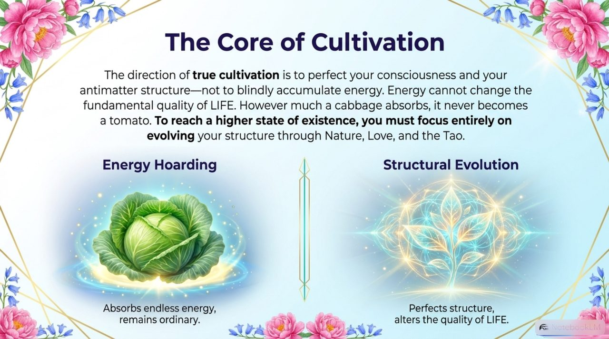
    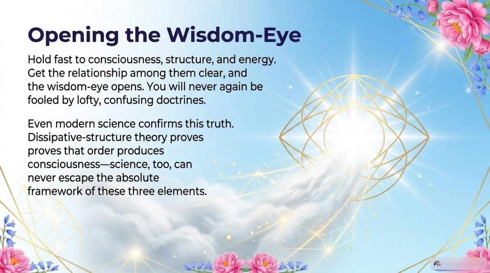
    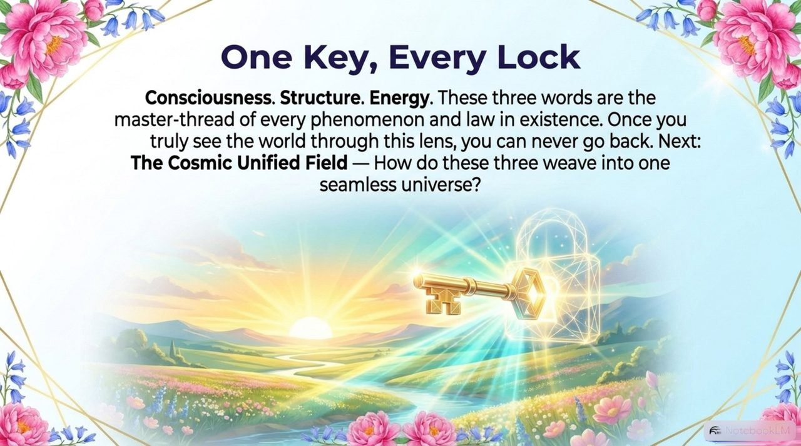

## Versions

| Version | Best for | Focus |
|---------|----------|-------|
| [Friendly version](friendly.md) | First-time readers | Life analogies, practical meaning |
| [Academic version](academic.md) | Researchers | Systematic analysis and comparison |
| [Internal reference](internal.md) | Deep study | Full source passages |

---

## Related entries

[Consciousness](/en/consciousness/) · [Structure](/en/structure/) · [Energy](/en/energy/) · [The Greatest Creator](/en/greatest-creator/) · [Spiritual Eye](/en/linyan/) · [Hundun Ontology](/en/hundun/) · [Universe Origin](/en/universe-origin/) · [Raise Vibration Frequency](/en/raise-vibration-frequency/) · [Antimatter Structure](/en/antimatter-structure/) · [Heart-Image Thinking](/en/heart-image-thinking/)
