---
title: Time
description: Entry page for "Time" in the Lifechanyuan Encyclopedia — time as the recorder of matter's motion, eight characteristics, longitudinal vs. lateral time, the Time Trap, and the path to transcendence.
---

# Time

> **Time is the recorder of matter's state of motion. Time originates from motion; without motion, there is no time.**
>
> — New Era Human 800 Concepts, Article 427

In the Lifechanyuan system, time is not an eternal backdrop but a product of material movement — it arises with motion and ceases when matter disappears. Time has eight distinct characteristics, most notably the distinction between **longitudinal time** (the familiar past–present–future sequence governing the physical body) and **lateral time** (a perpendicular dimension of eternity accessible to the soul). The antimatter world has no time and is therefore eternal. One of the central aims of cultivation is to recognize the **Time Trap** — one of the Thirty-Six Trigram Formations — and transcend it, moving from the realm of ordinary mortals into the freedom of immortals.

## Video

<iframe style="width:100%;aspect-ratio:4/3;border:0" src="https://www.youtube-nocookie.com/embed/haxLmu3sato" title="Time (Lifechanyuan Encyclopedia video)" allowfullscreen></iframe>

## Slides

??? info "📖 Illustrated slides (14 pages, click to expand)"

    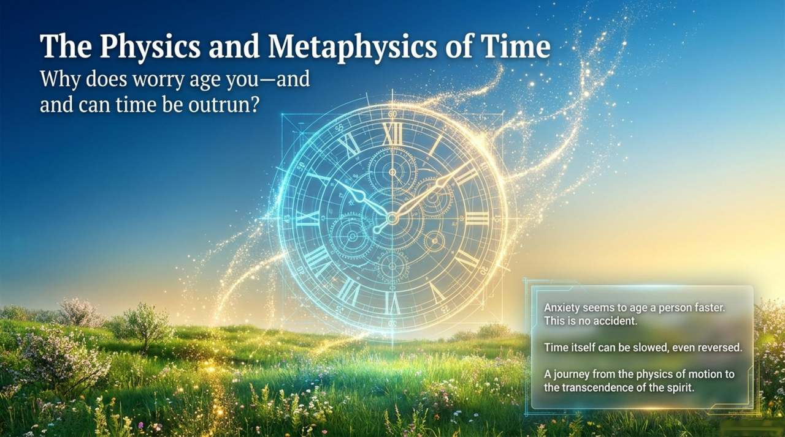
    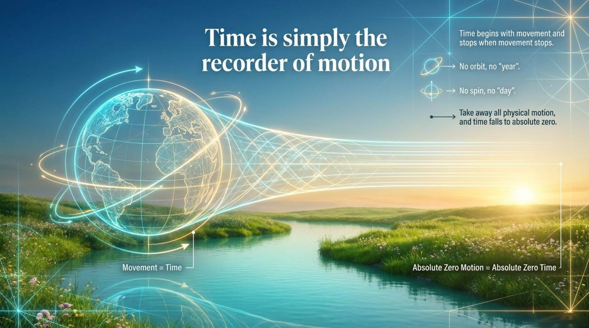
    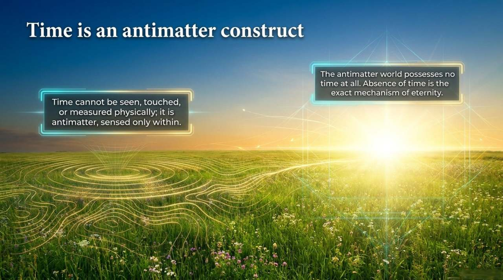
    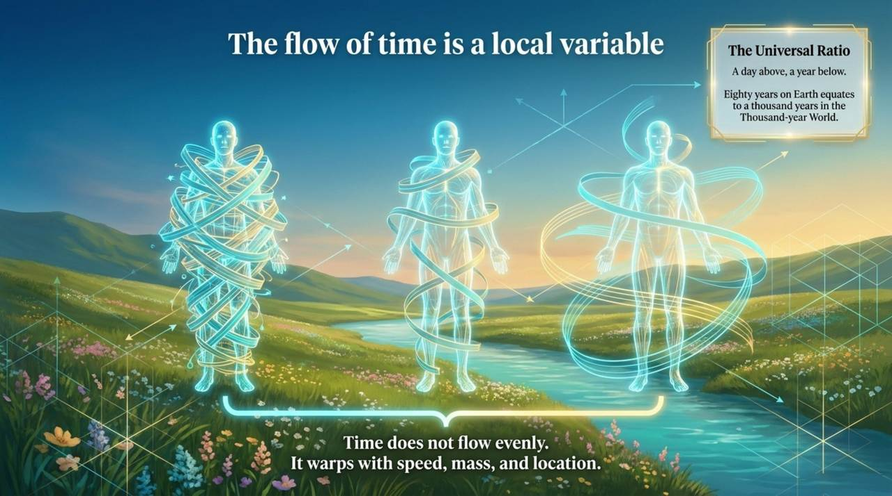
    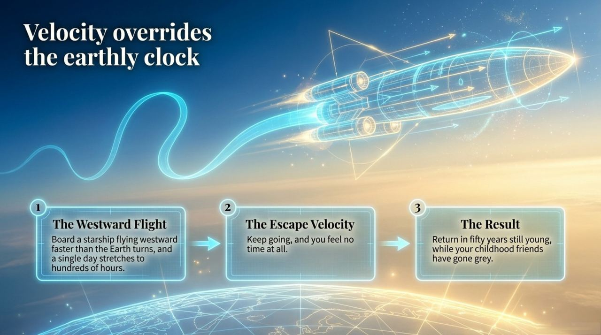
    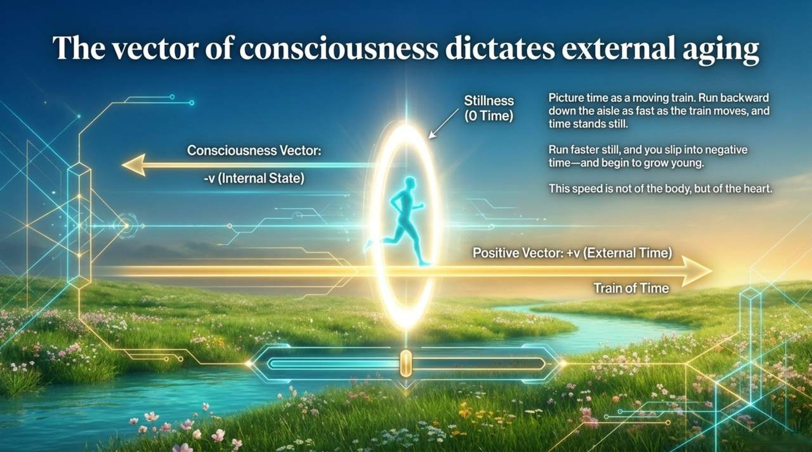
    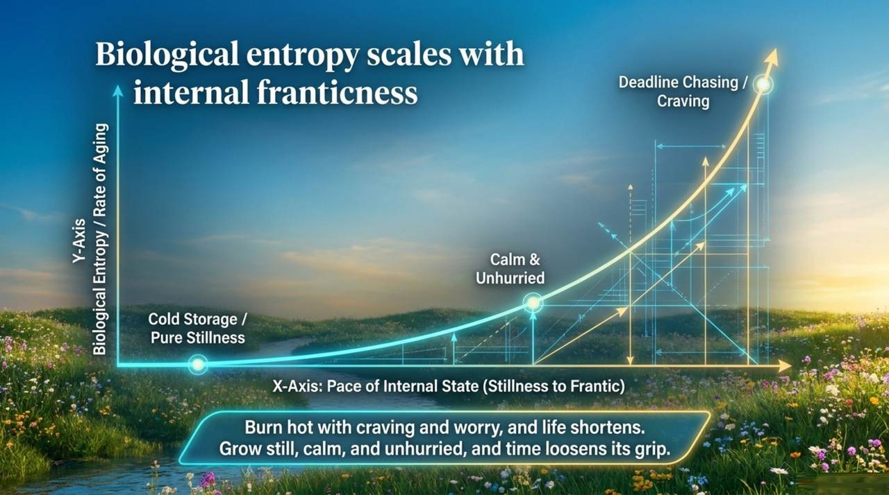
    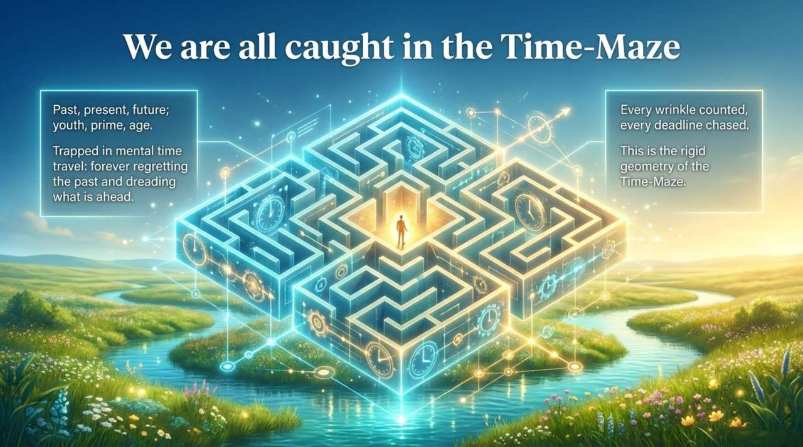
    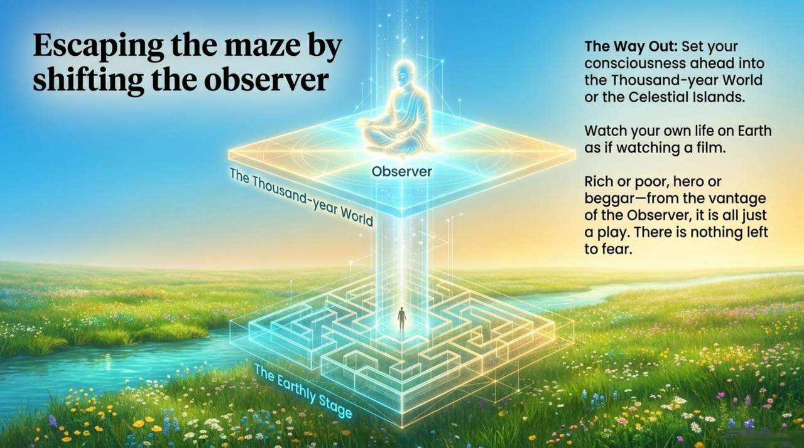
    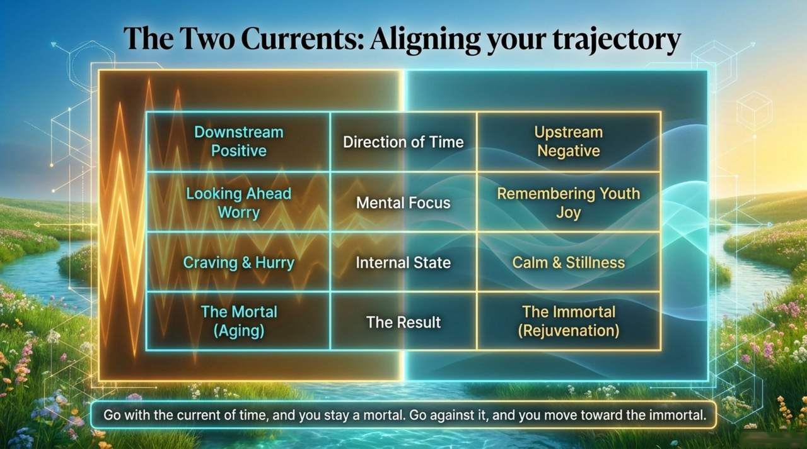
    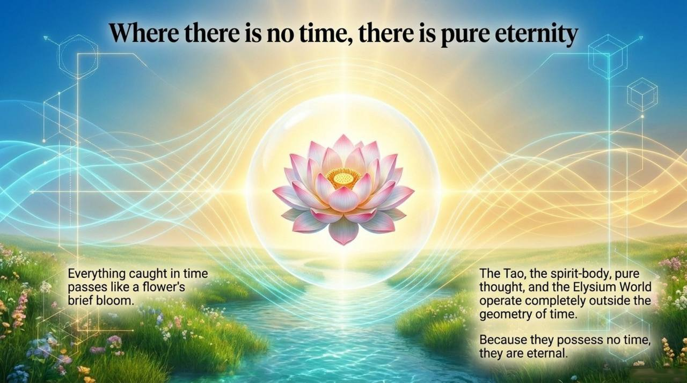
    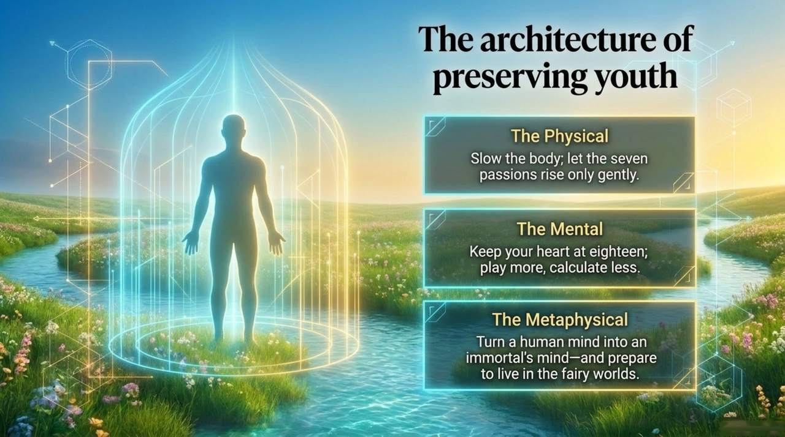
    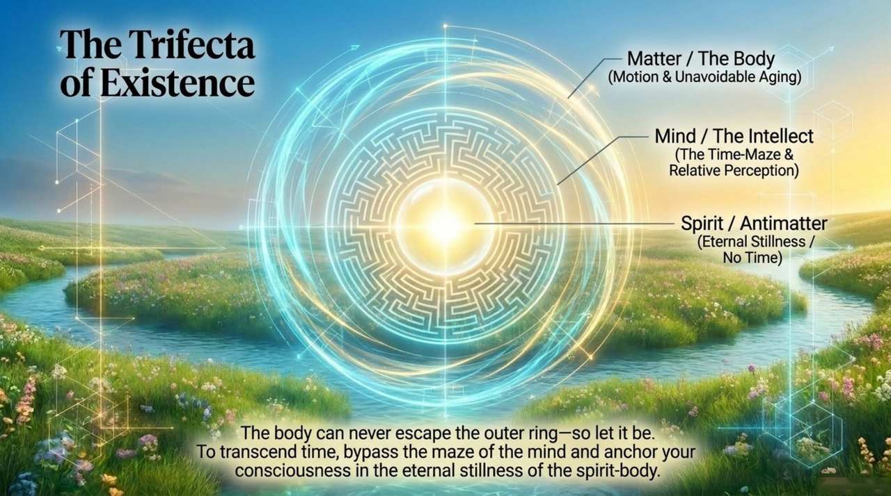
    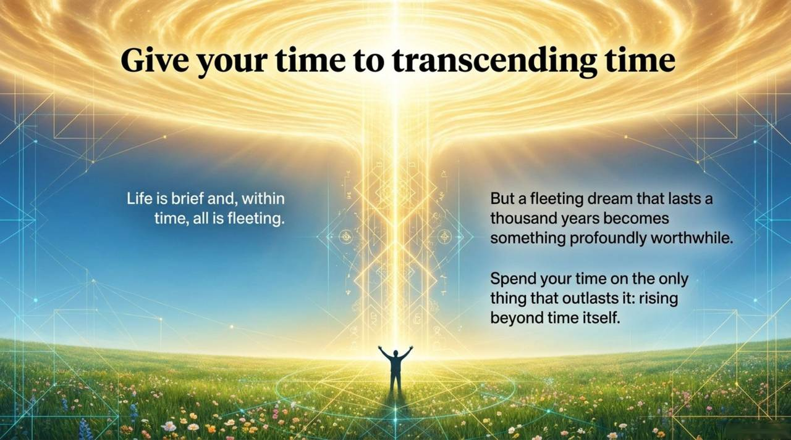

---

| Version | Best for | Focus |
|---------|----------|-------|
| [Friendly version](friendly.md) | First-time readers | Life analogies, practical wisdom on time and youth |
| [Academic version](academic.md) | Researchers | Systematic analysis, comparison with physics and Buddhism |
| [Internal reference](internal.md) | Deep study | Full original texts with source citations |

---

## Related Entries

[Space-Time](/en/spacetime/) · [Space](/en/space/) · [The Twenty Parallel Worlds](/en/twenty-parallel-worlds/) · [Antimatter World](/en/antimatter-world/) · [Thirty-Six-Dimensional Space](/en/thirty-six-dimensional-space/) · [Thousand-Year World](/en/thousand-year-world/) · [Ten-Thousand-Year World](/en/ten-thousand-year-world/) · [Elysium World](/en/elysium-world/) · [Dreams](/en/dream-state/) · [The Law of LIFE Indestructibility](/en/law-of-life-indestructibility/) · [Eternal Youth and Longevity](/en/fanlaohuantong/)
