<!-- id: LC-TPW-0001-EN theme: universe type: navigation direction: cosmic-structure lang: en -->

# The Twenty Parallel Worlds

The universe contains twenty coexisting worlds — also called the "Twenty Parallel Worlds" or "Twenty Collective Worlds" — derived by Guide Xuefeng from the mathematics of a three-dimensional coordinate system. The human world (the XY realm) where we currently live is only one of them. All twenty worlds connect through a single hub, the Cool Realm at the coordinate origin (O point), where the Greatest Creator resides. Understanding these twenty parallel worlds is a key step toward awakening to space and walking the path of the Greatest Creator.

## Video

<iframe style="width:100%;aspect-ratio:4/3;border:0" src="https://www.youtube-nocookie.com/embed/FyfB956kDvs" title="The Twenty Parallel Worlds (Lifechanyuan Encyclopedia video)" allowfullscreen></iframe>

## Slides

??? info "📖 Illustrated slides (13 pages, click to expand)"

    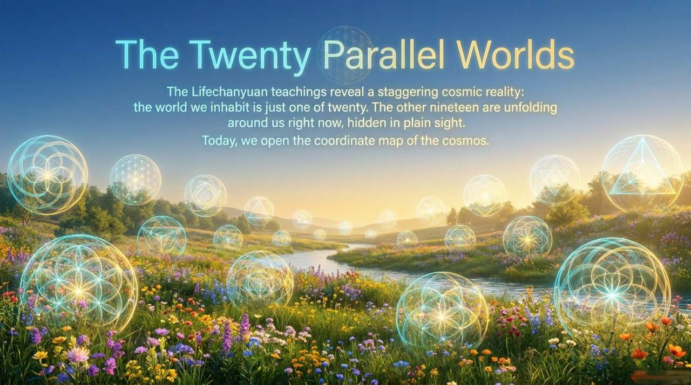
    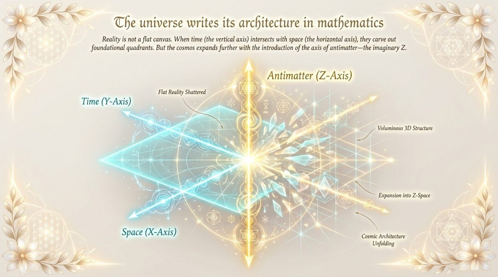
    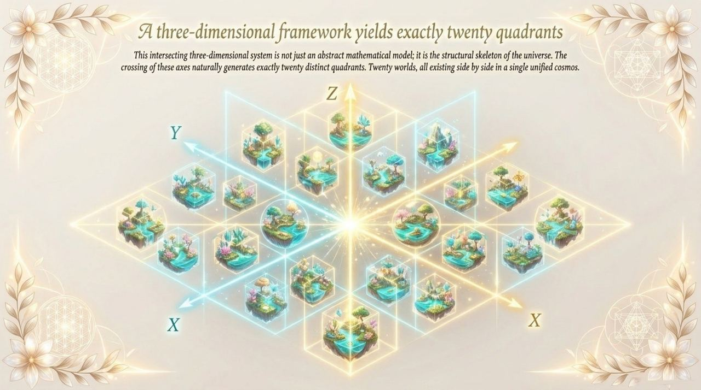
    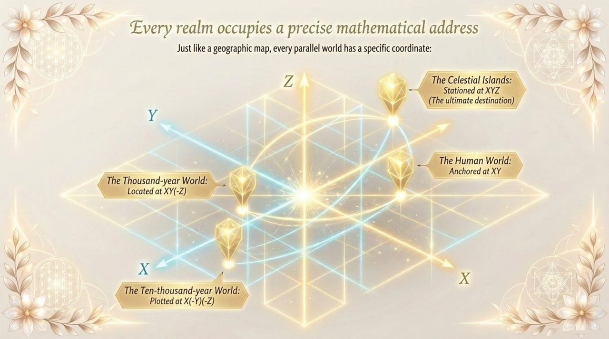
    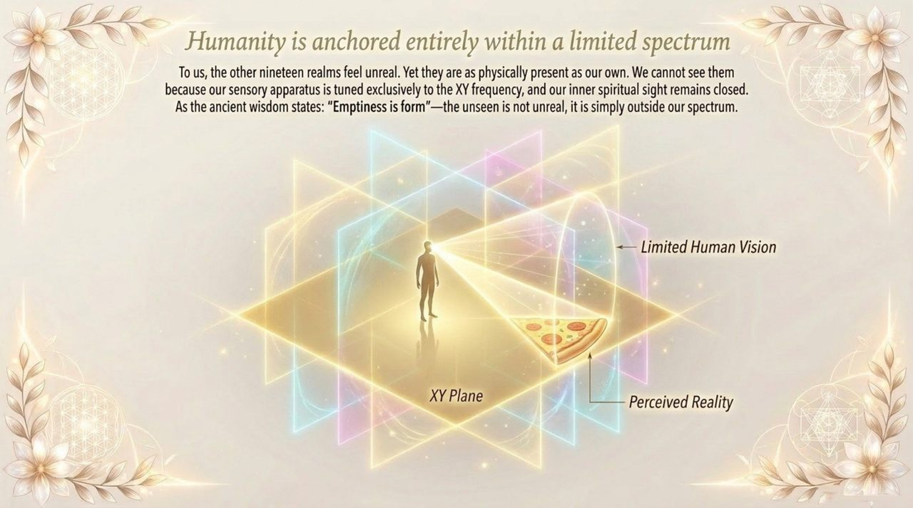
    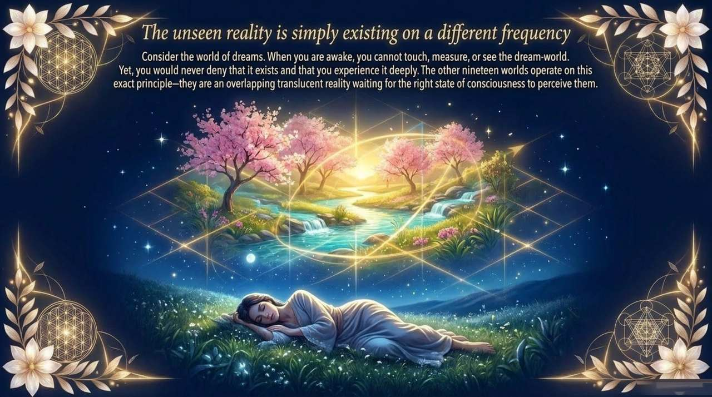
    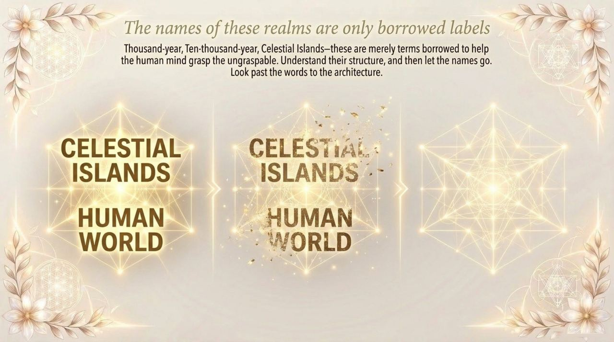
    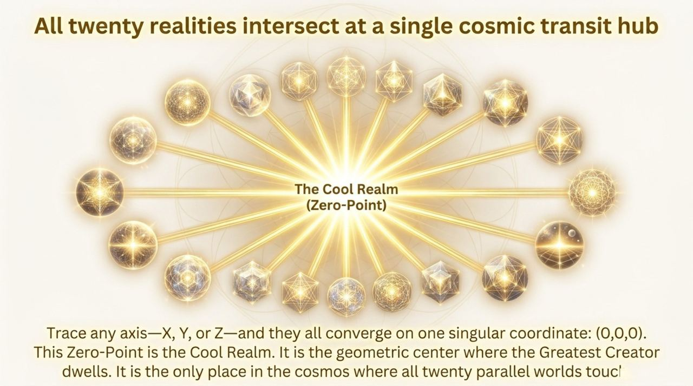
    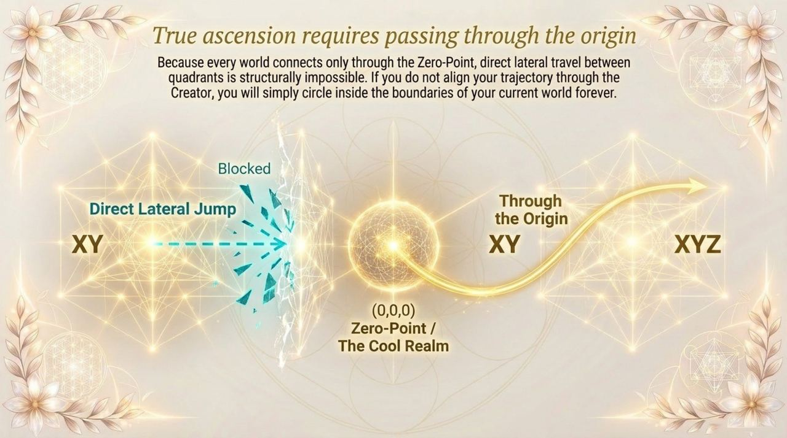
    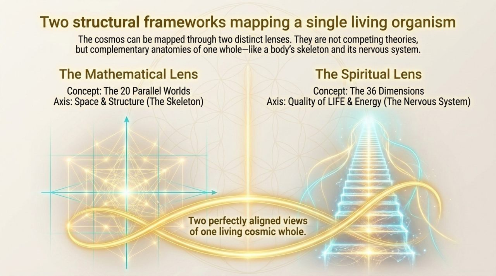
    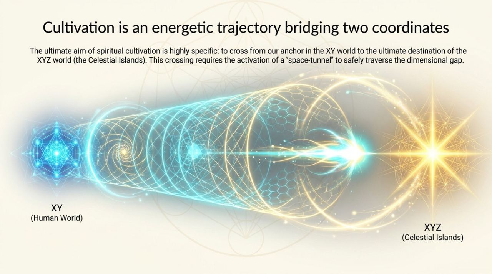
    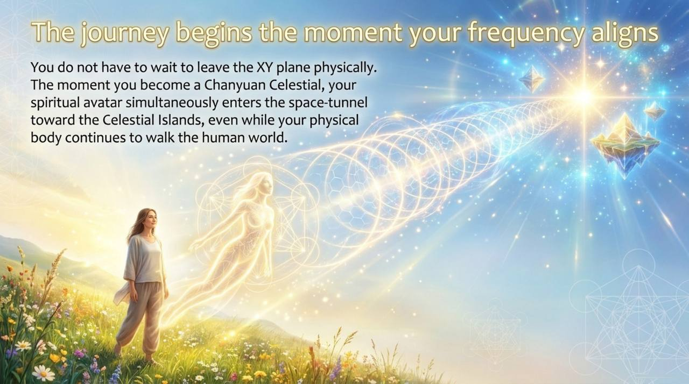
    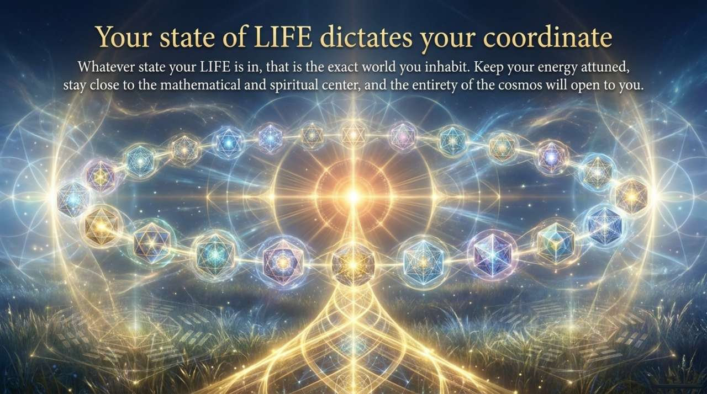

---

## Version Navigation

| Version | Best for | Focus |
|---------|----------|-------|
| [Friendly version](friendly.md) | First-time readers | Plain walkthrough of all 20 worlds, why we can't see them, cultivation path |
| [Academic version](academic.md) | Researchers | Mathematical derivation, comparison with Buddhist and Taoist cosmology |
| [Internal reference](internal.md) | Deep study | Complete source texts, coordinate table, Q&A with Guide Xuefeng |

---

## Related Entries

[Thirty-Six-Dimensional Space](/en/thirty-six-dimensional-space/) · [Spacetime Tunnel](/en/spacetime-tunnel/) · [Universe (Overview)](/en/universe-overview/) · [The Greatest Creator](/en/greatest-creator/) · [Space-Time](/en/spacetime/) · [Antimatter World](/en/antimatter-world/) · [Millennium Realm](/en/thousand-year-world/) · [Ten-Thousand-Year Realm](/en/ten-thousand-year-world/) · [Elysium World](/en/elysium-world/) · [Black Hole](/en/black-hole/)
