# The Universe (Overview)

In Lifechanyuan's cosmology, the **universe** is "the composite of matter and antimatter constituted by infinite space and infinite time." Its essence is Hundun (ordered wholeness); its three constituent elements are consciousness, structure, and energy; it originated through "Wuji giving birth to Taiji, and chaos transforming into Hundun" — not the Big Bang. Its animating force is the Tao (the blood of the universe), and its creator and sovereign is the Greatest Creator. The universe and LIFE are mutually dependent; the universe exists for LIFE. Understanding the universe is the prerequisite for understanding LIFE, the Tao, and the Greatest Creator.

---

## Video

<iframe style="width:100%;aspect-ratio:4/3;border:0" src="https://www.youtube-nocookie.com/embed/IduyO0O1StU" title="The Universe (Overview) (Lifechanyuan Encyclopedia video)" allowfullscreen></iframe>

## Slides

??? info "📖 Illustrated slides (14 pages, click to expand)"

    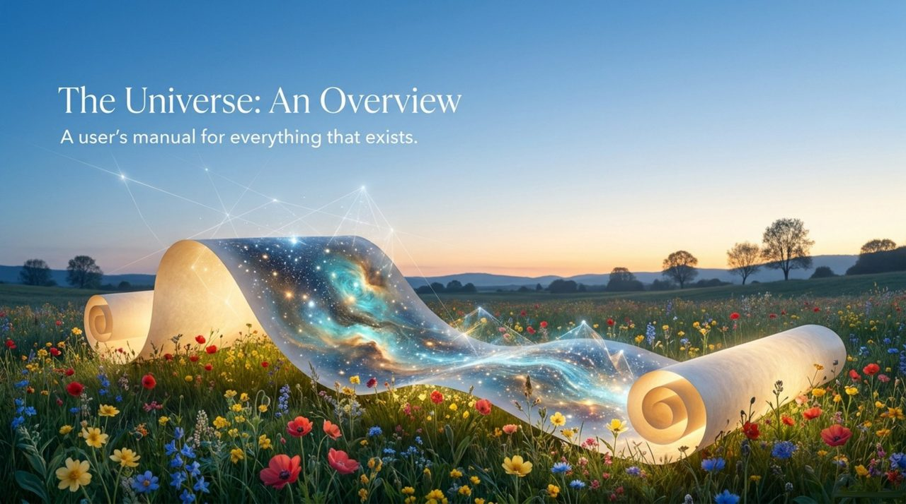
    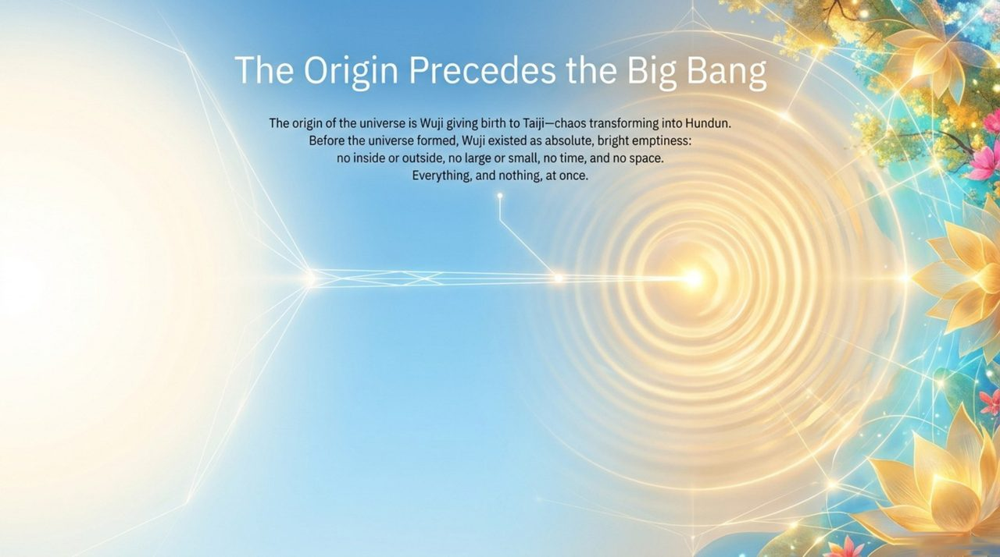
    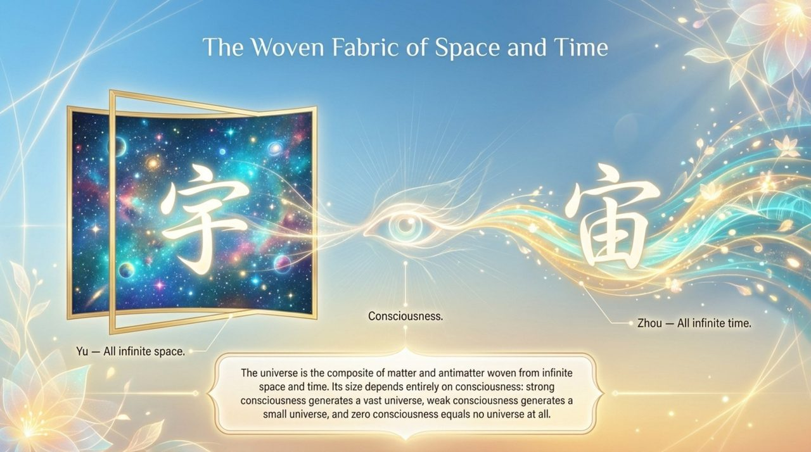
    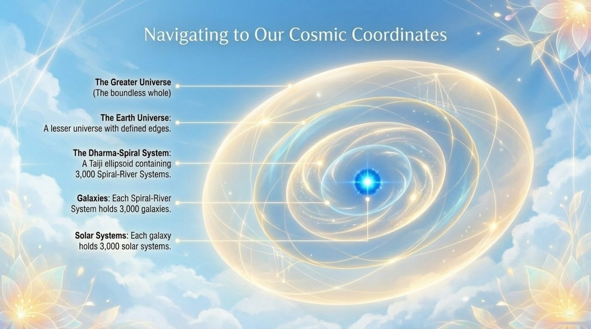
    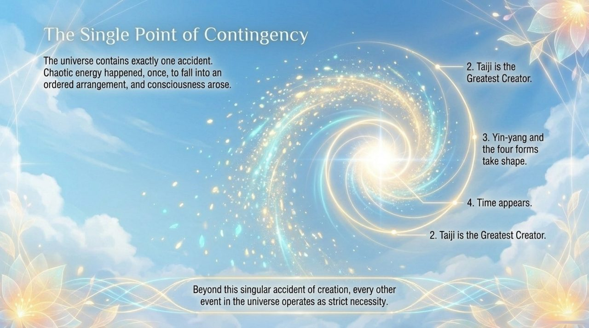
    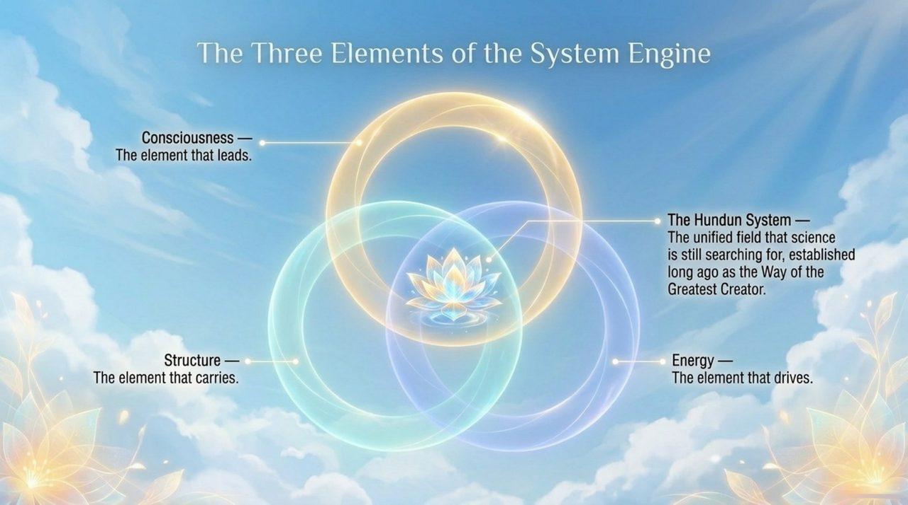
    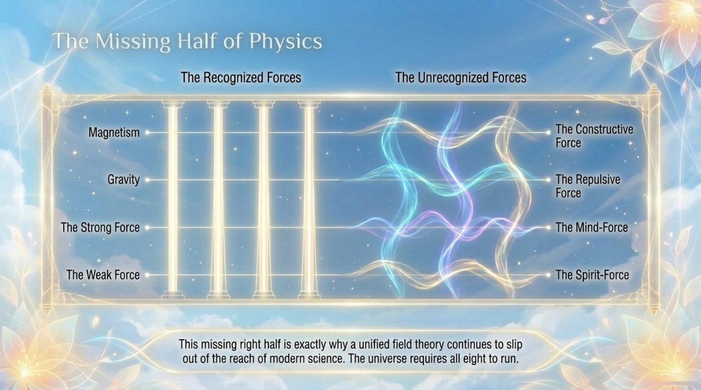
    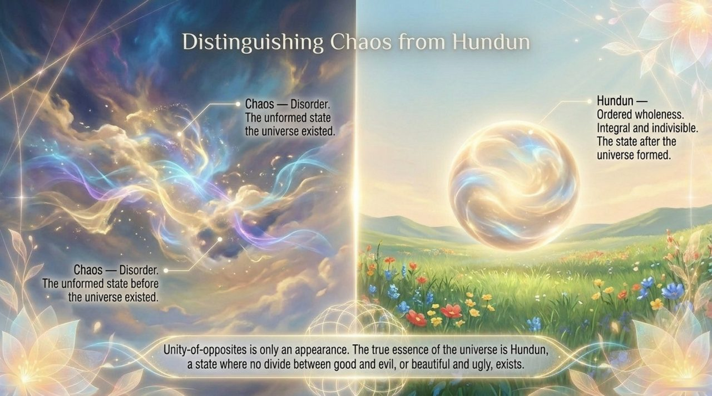
    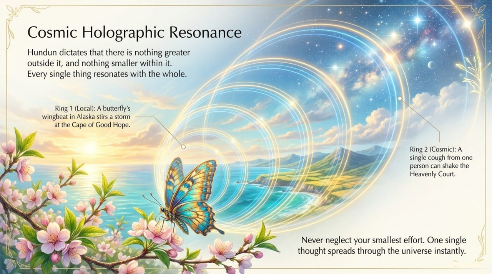
    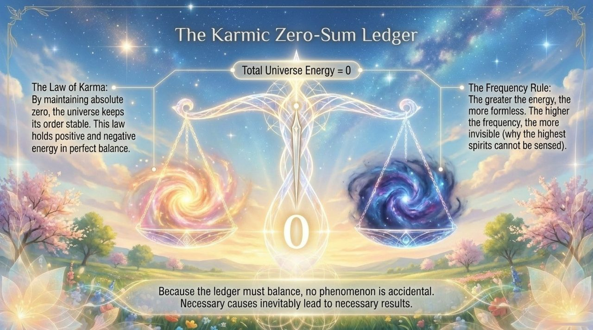
    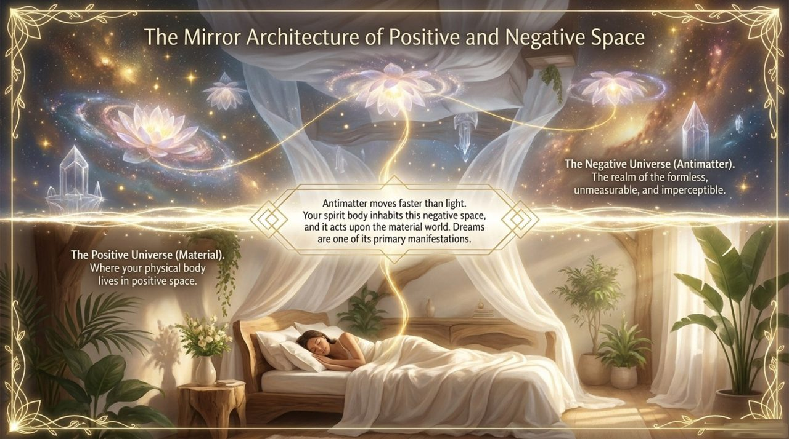
    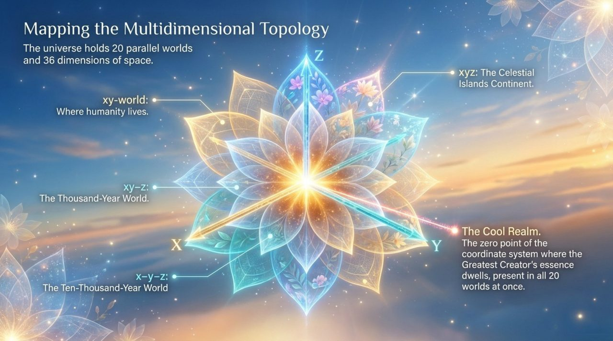
    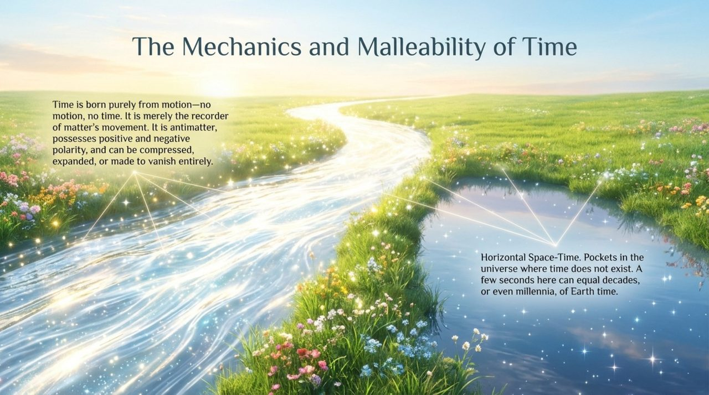
    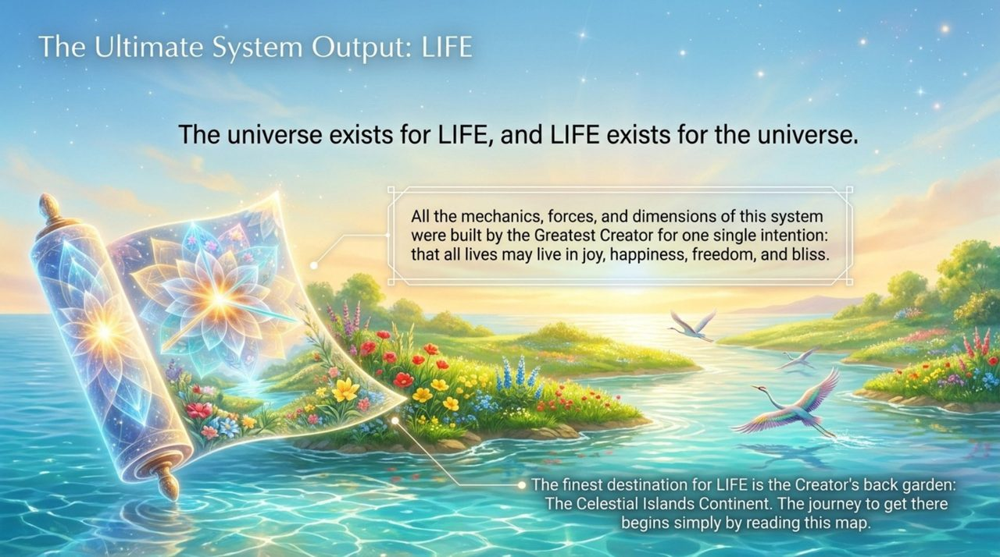

## Version Navigation

| Version | Best For | Link |
|---------|----------|------|
| Friendly | First-time readers seeking an accessible introduction | [Read Friendly Version](/en/universe-overview/friendly/) |
| Academic | In-depth study and systematic analysis | [Read Academic Version](/en/universe-overview/academic/) |
| Internal | Chanyuan Celestials studying original teachings | [Read Internal Version](/en/universe-overview/internal/) |

---

## Related Entries

[Dao](/en/dao/) · [The Greatest Creator](/en/greatest-creator/) · [Hundun](/en/hundun/) · [Negative Universe](/en/negative-universe/) · [Antimatter Structure](/en/antimatter-structure/) · [Thirty-Six-Dimensional Space](/en/thirty-six-dimensional-space/) · [Space-Time](/en/spacetime/) · [Energy](/en/energy/) · [Consciousness](/en/consciousness/) · [Cosmic Panorama](/en/cosmic-panorama/)
