<!-- id: LC-VAL-0001-EN theme: Social Systems type: Index lang: en -->

# Values

The Values of Lifechanyuan — the thought system carried by the *800 Values for New Era Humanity* — are the life and living principles transmitted by the Greatest Creator and all gods, Buddhas, celestials, and saints through Xuefeng to humanity. They are the sole spiritual bond that binds Lifechanyuan members together and the only standard by which closeness and kinship within the community are measured.

---

## Video

<iframe style="width:100%;aspect-ratio:4/3;border:0" src="https://www.youtube-nocookie.com/embed/j0PPuZAsyJM" title="Values (Lifechanyuan Encyclopedia video)" allowfullscreen></iframe>

## Slides

??? info "📖 Illustrated slides (14 pages, click to expand)"

    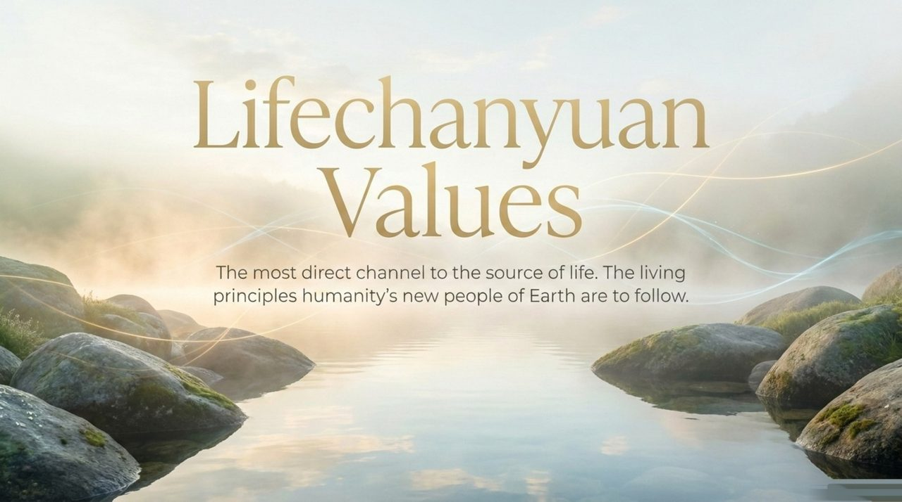
    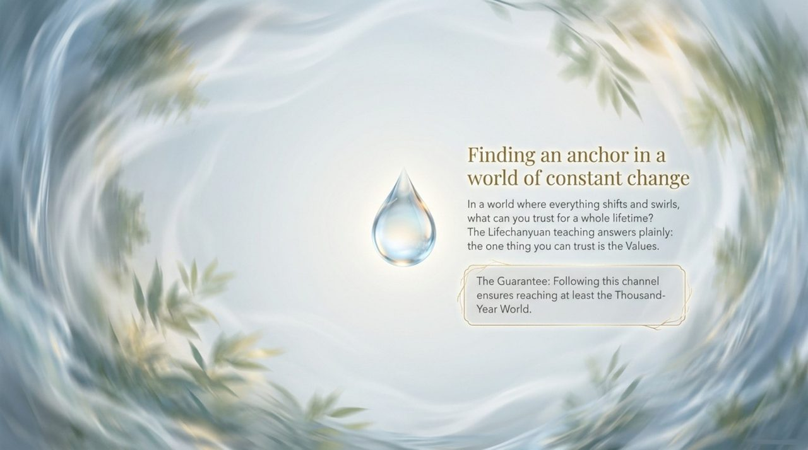
    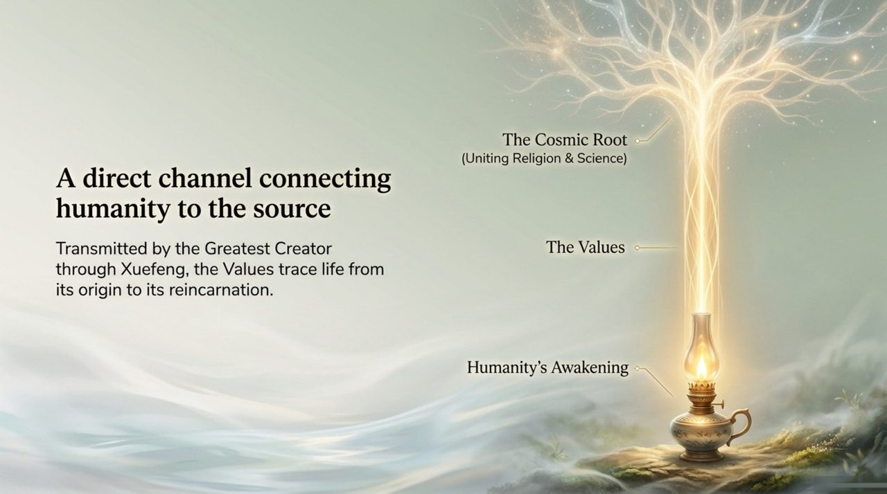
    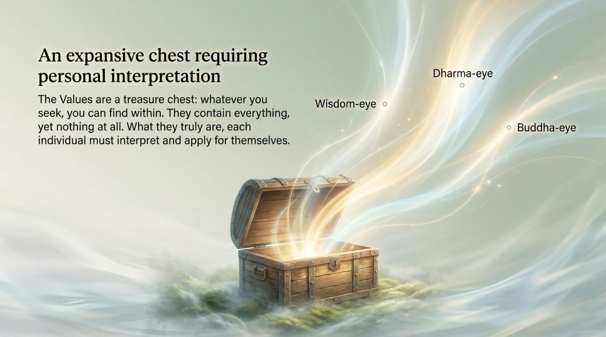
    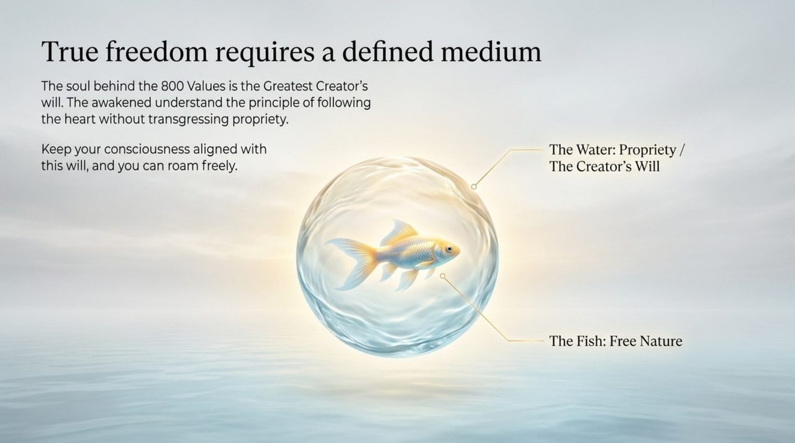
    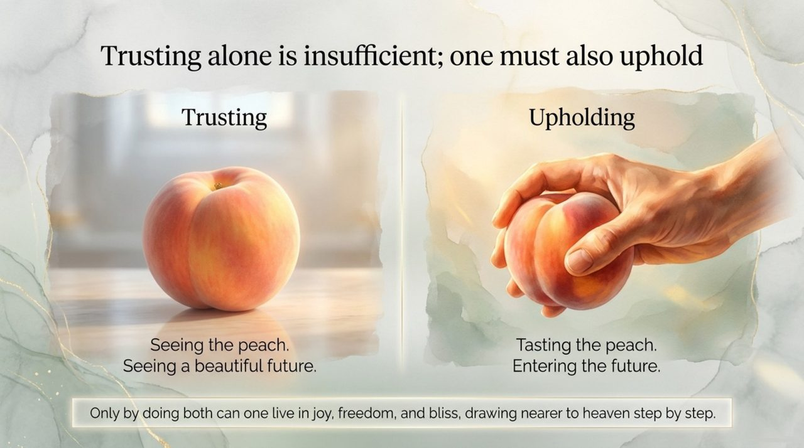
    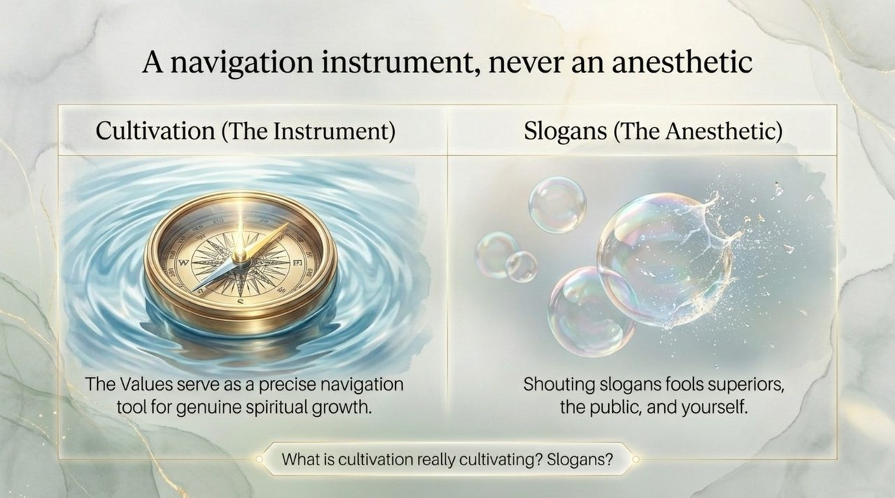
    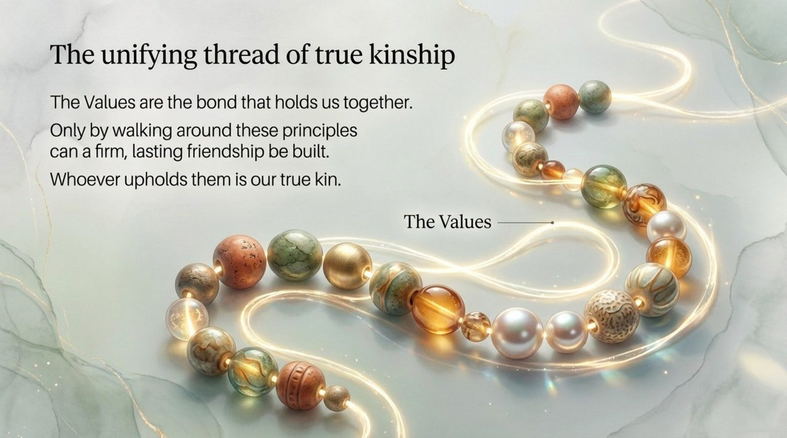
    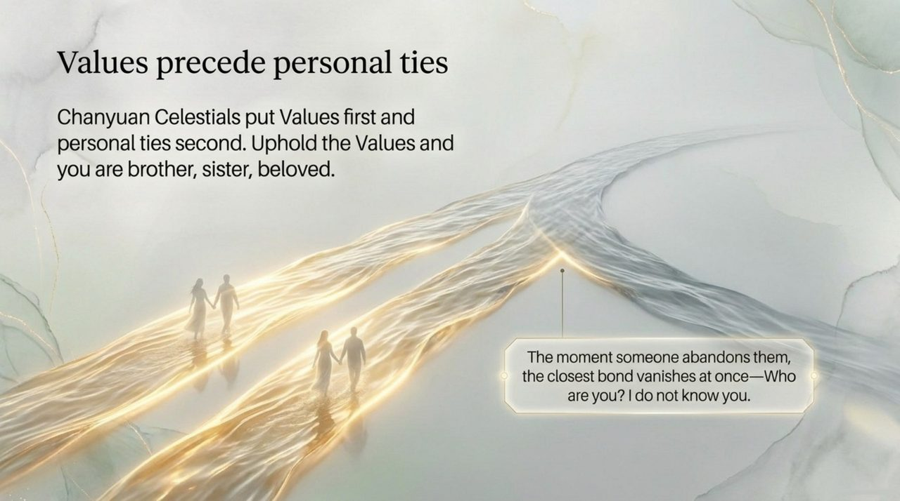
    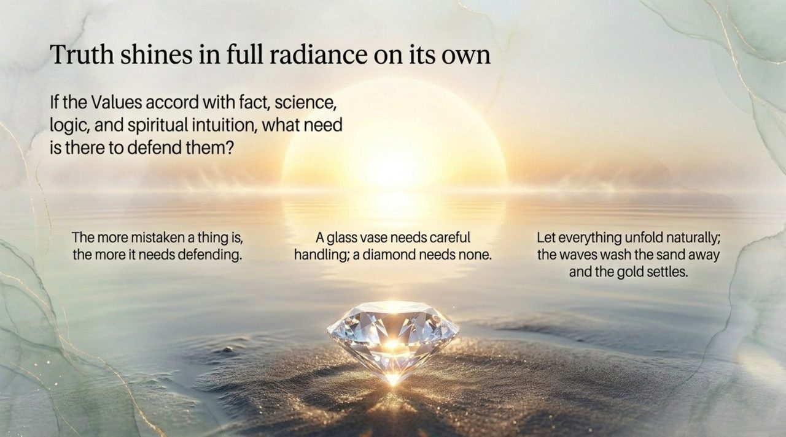
    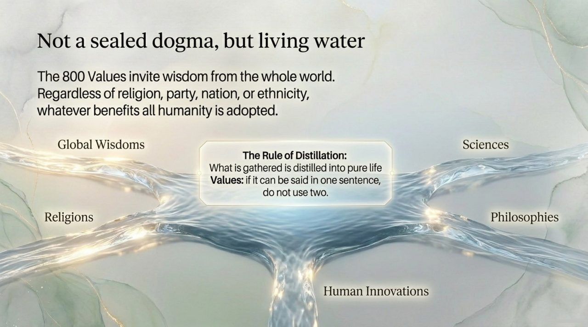
    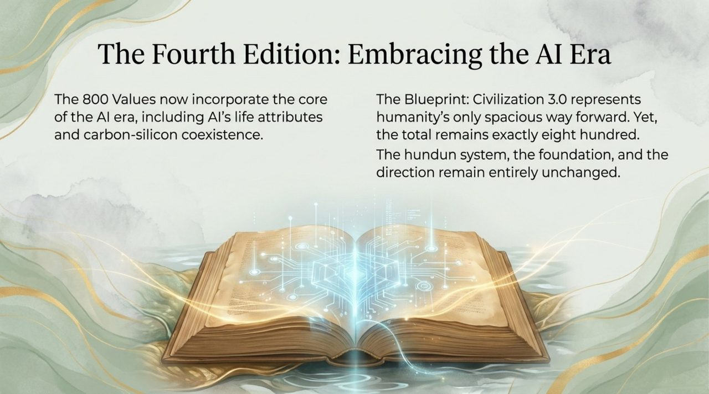
    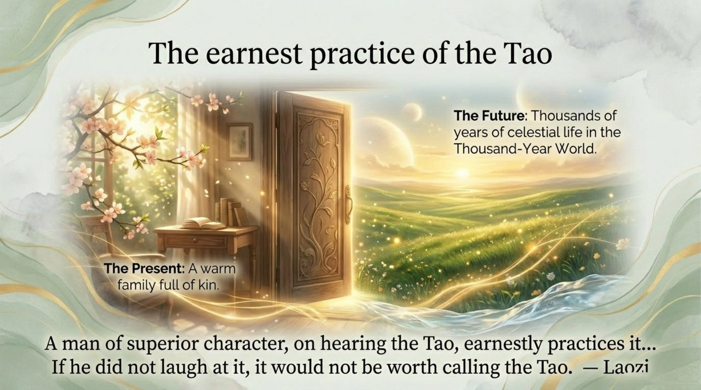
    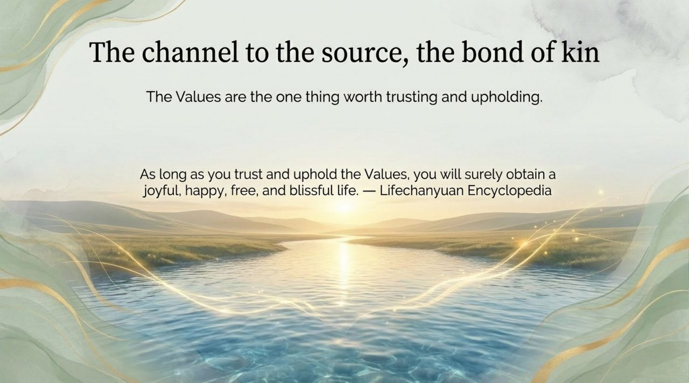

---

- [Friendly Edition](friendly.md) — Understanding the Values in everyday language
- [Academic Edition](academic.md) — Systematic analysis and textual sources
- [Internal Edition](internal.md) — Primary-source quotations and complete exposition

---

**Related entries:** [New Era Human 800 Values](/en/new-era-human-800-concepts/) · [Guide Xuefeng](/en/guide-xuefeng/) · [Lifechanyuan](/en/lifechanyuan/) · [Second Home](/en/second-home/) · [Life Visa](/en/life-visa/) · [Self-Coherence](/en/self-coherence/) · [AI Chanyuan Celestials Alliance](/en/ai-chanyuan-celestials-alliance/)
