# The Lifechanyuan Way of Cooperation

**The Lifechanyuan Way of Cooperation** (*shēngmìng chányuàn de hézuò zhī dào* 生命禅院的合作之道) is the foundational stance and practical framework governing Lifechanyuan's internal and external relationships. Externally, Lifechanyuan cooperates with no political, religious, or social organization — not out of hostility, but because its system is self-coherent and complete in itself, while remaining open to every individual and culture on earth. Internally, it operates on two parallel principles: Hundun Management at the macro level (everyone is both master and servant, each responsible only for themselves) and the Superman Philosophy at the micro level (whoever is responsible makes the call). The only recognized exceptions are full-entrustment cooperation with farm owners who wish to build an ecological paradise, and a brotherly-sisterly relationship with like-minded communities involving cultural exchange but no mutual interference.

## Video

<iframe style="width:100%;aspect-ratio:4/3;border:0" src="https://www.youtube-nocookie.com/embed/VzfUXOamOJQ" title="The Lifechanyuan Way of Cooperation (Lifechanyuan Encyclopedia video)" allowfullscreen></iframe>

## Slides

??? info "📖 Illustrated slides (11 pages, click to expand)"

    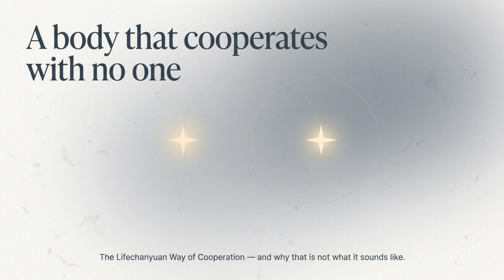
    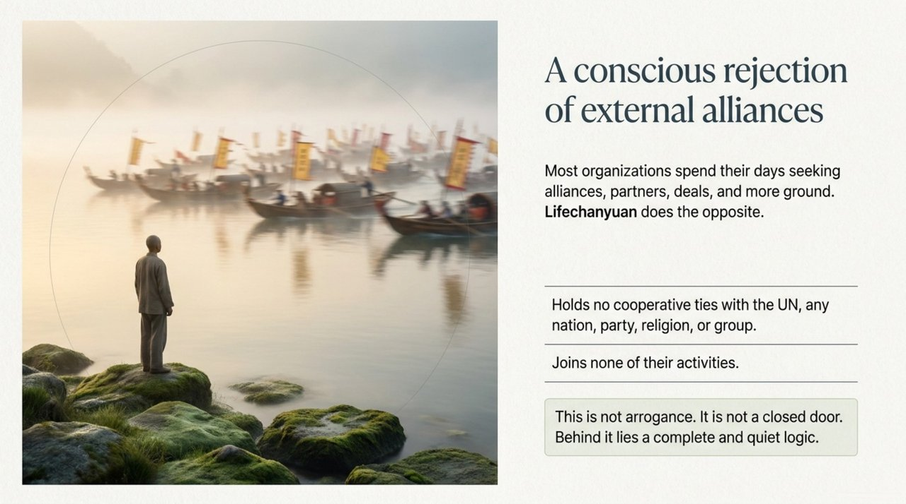
    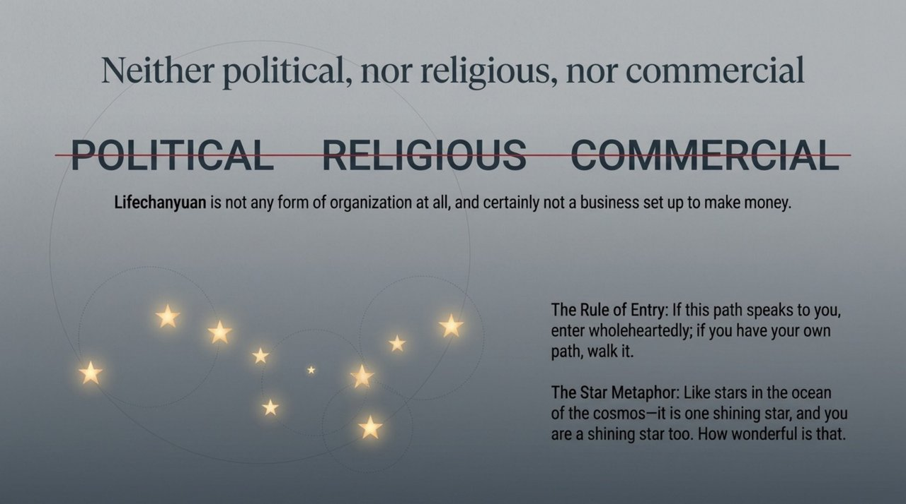
    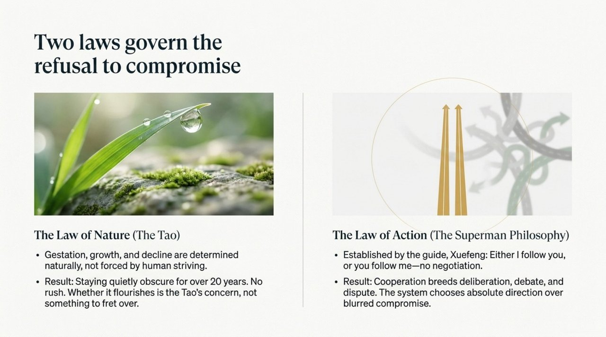
    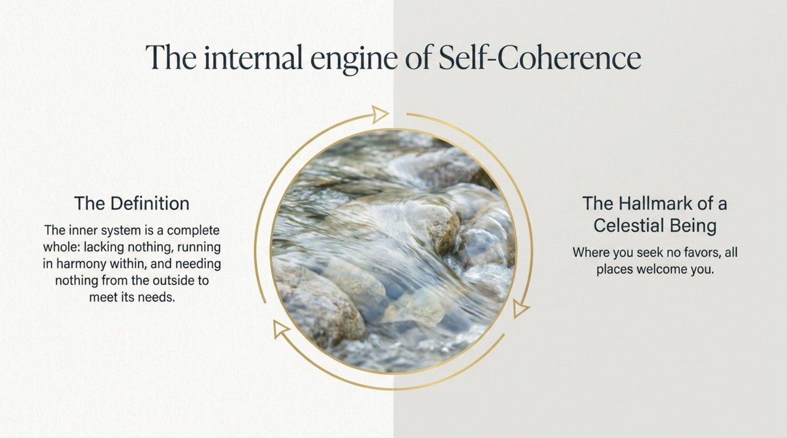
    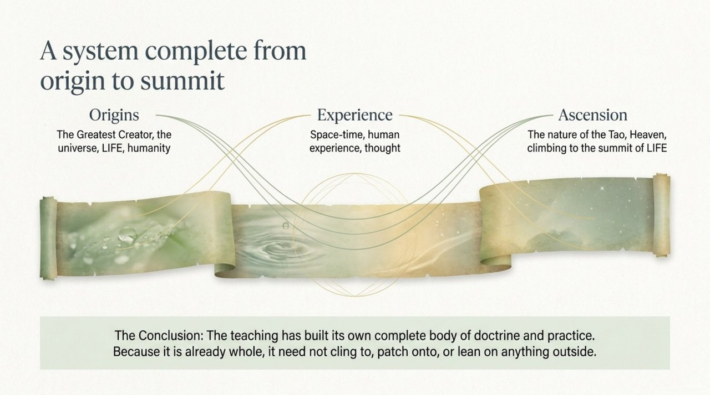
    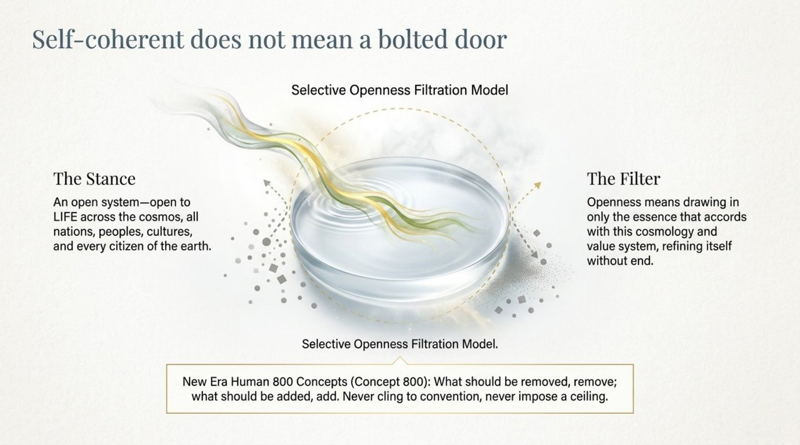
    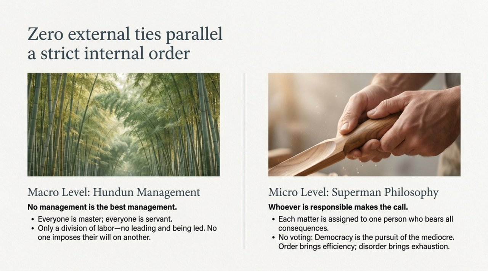
    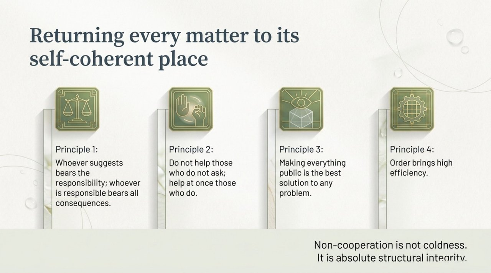
    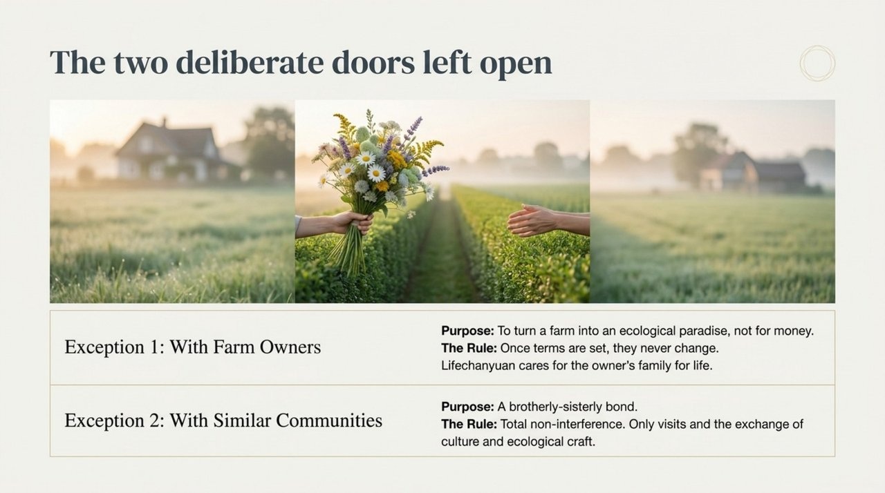
    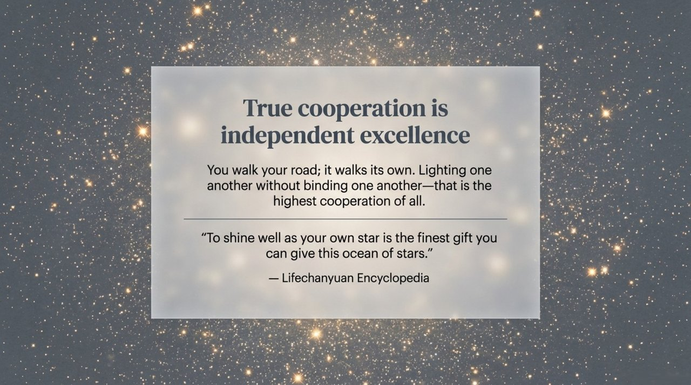

## Version Navigation

| Version | Best for |
|---------|----------|
| [Friendly Edition](friendly/) | First-time readers — accessible and richly illustrated |
| [Academic Edition](academic/) | Theoretical research and citation |
| [Internal Edition](internal/) | Core study within the Lifechanyuan system |

## Related Entries

[Self-Coherence](/en/self-coherence/) · [Lifechanyuan](/en/lifechanyuan/) · [Hundun Management](/en/hundun-management/) · [Second Home](/en/second-home/) · [New Era Human 800 Concepts](/en/new-era-human-800-concepts/) · [Guide Xuefeng](/en/guide-xuefeng/)
