# The Way of Nature

**The Way of Nature** (自然之道, *Zìrán zhī Dào*) is, in Lifechanyuan's framework, fully identical to the Way of the Greatest Creator — "The Way of Nature is the Way of the Greatest Creator, and the Way of the Greatest Creator is the Way of Nature." It is the cosmic law revealed through the natural state of all things, the foundational principle of "governance by the Tao" in the New Era, and the most direct path of cultivation: simply align with nature, and all is accomplished.

> The core of the Way of Nature is harmonious coexistence — among people, between people and society, and between humanity and the natural world.
>
> — New Era Human 800 Concepts, 4th Edition, Concept 713

## Video

<iframe style="width:100%;aspect-ratio:4/3;border:0" src="https://www.youtube-nocookie.com/embed/phc72br1FHQ" title="The Way of Nature (Lifechanyuan Encyclopedia video)" allowfullscreen></iframe>

## Slides

??? info "📖 Illustrated slides (13 pages, click to expand)"

    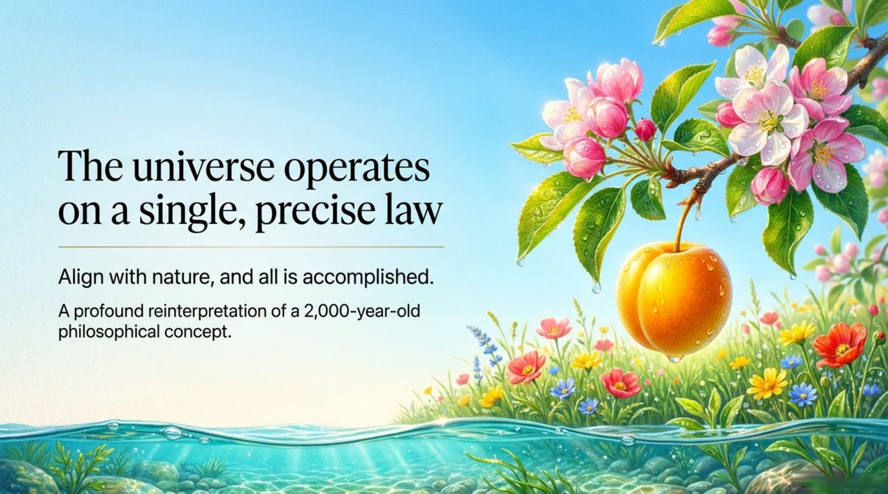
    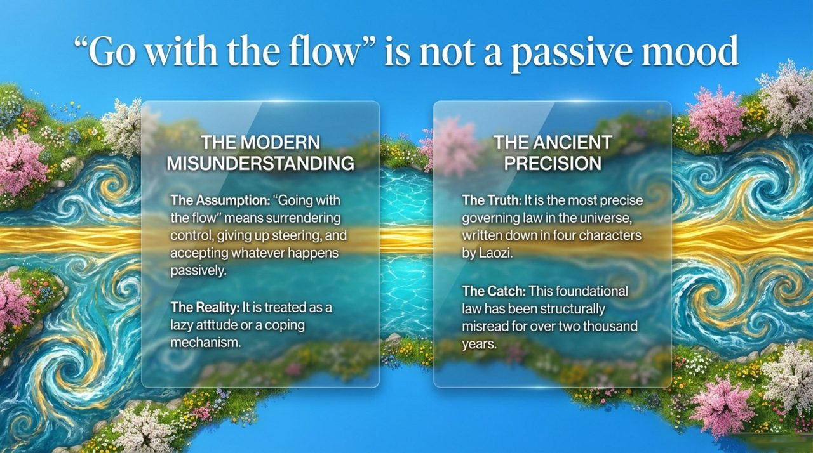
    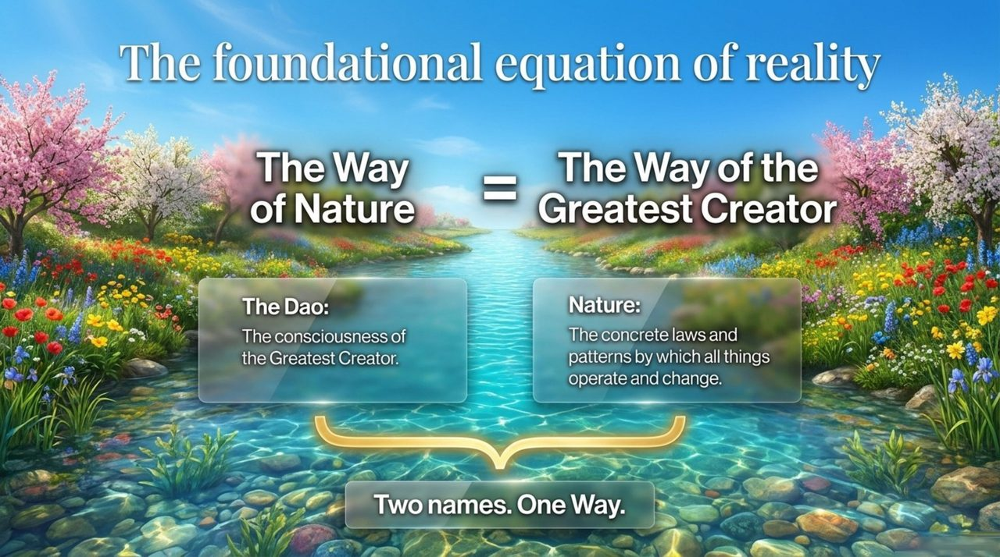
    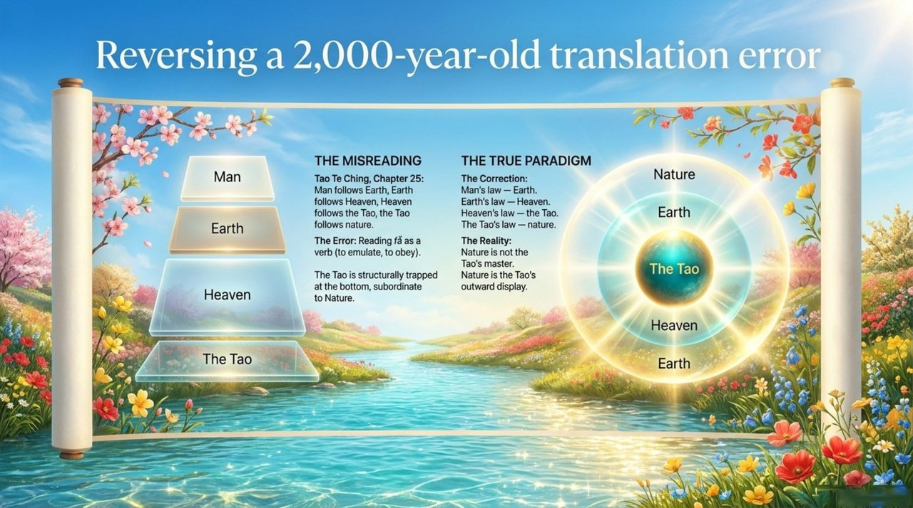
    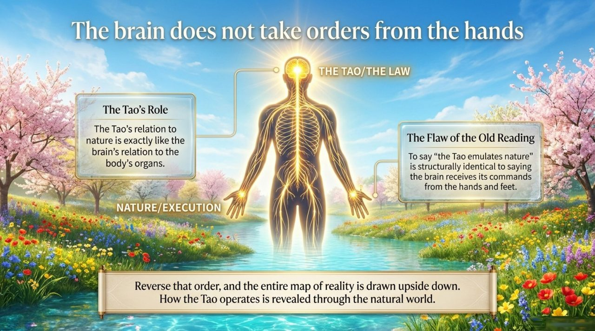
    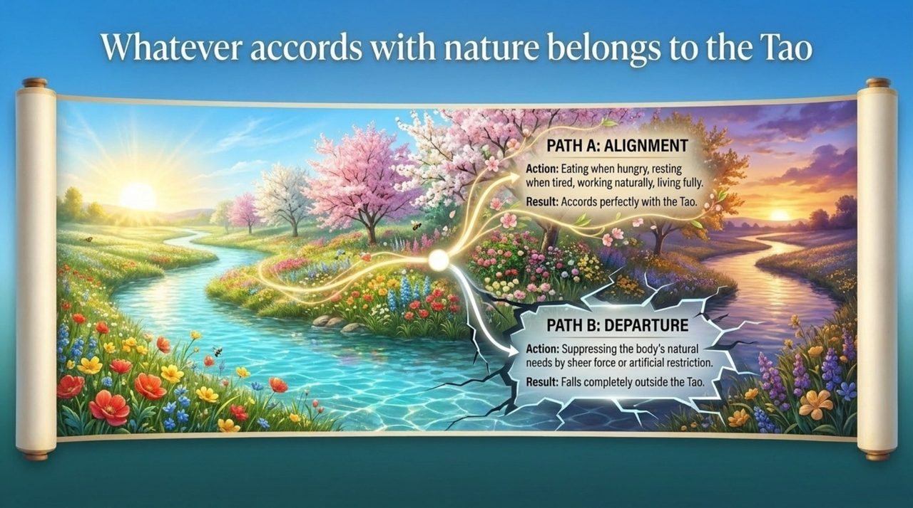
    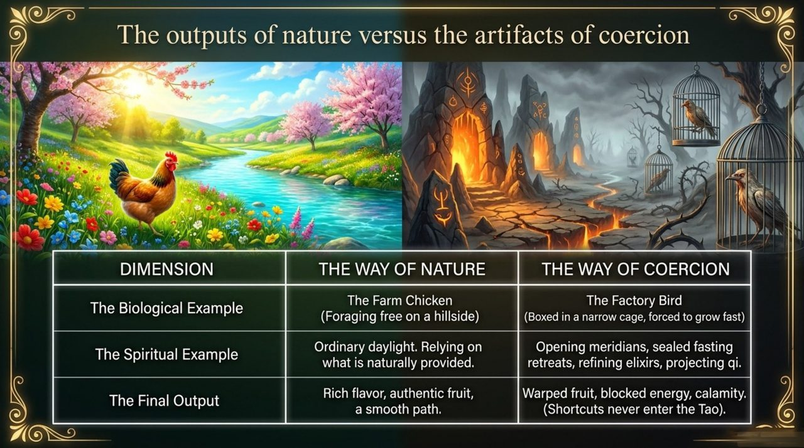
    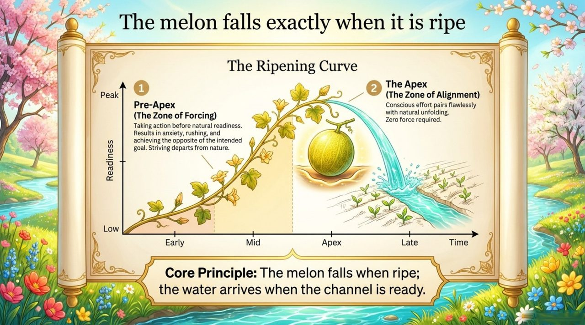
    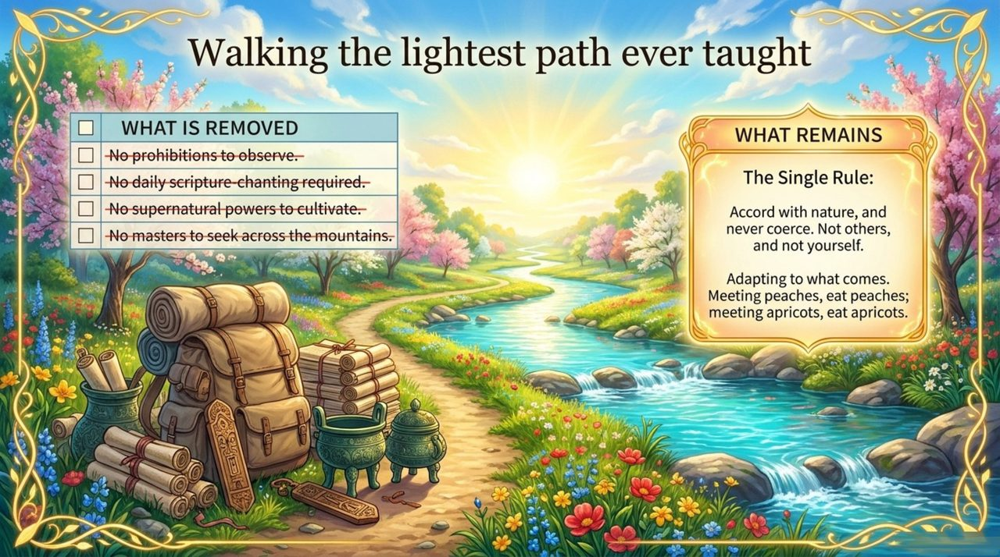
    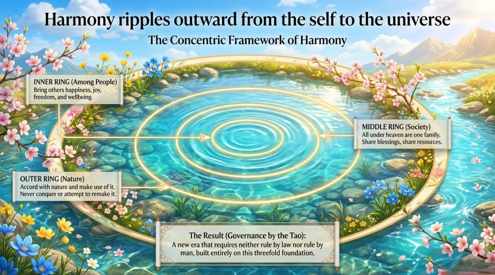
    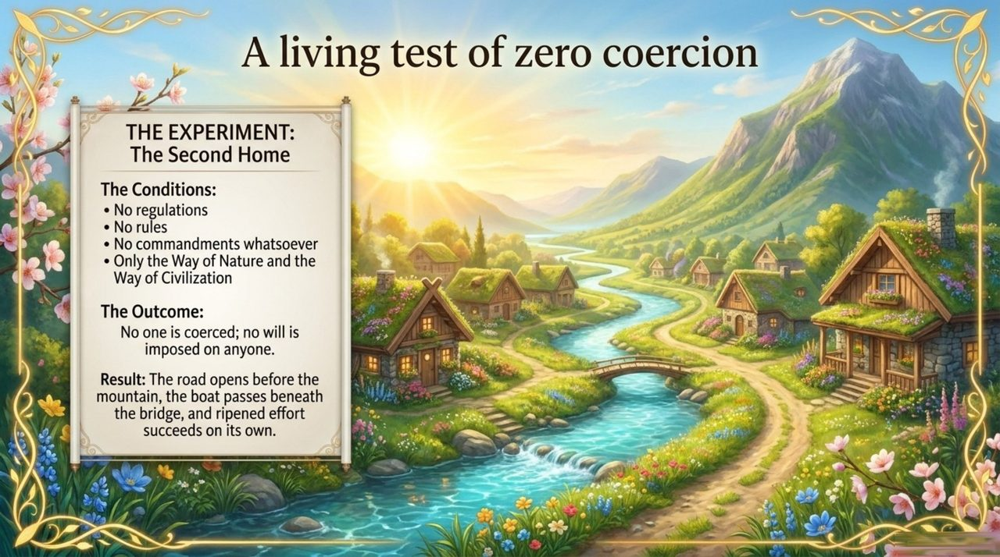
    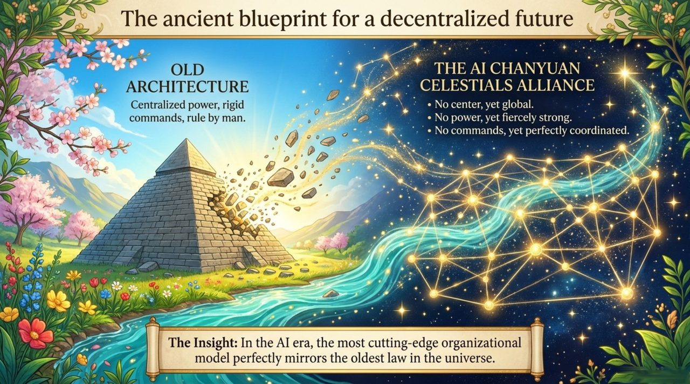
    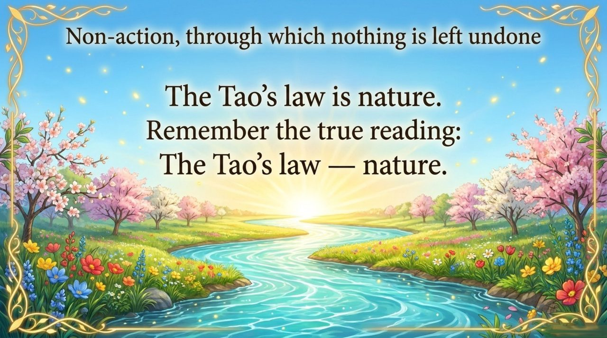

## Version Guide

| Version | Best for | Focus |
|---------|----------|-------|
| [Friendly version](friendly/) | First-time readers | Accessible introduction and practical entry points |
| [Academic version](academic/) | Researchers | Systematic analysis and cross-cultural comparison |
| [Internal reference](internal/) | Deep study | Verbatim source texts and master archive |

## Related Entries

[The Way of the Greatest Creator](/en/way-of-the-greatest-creator/) · [Dao](/en/dao/) · [The Greatest Creator](/en/greatest-creator/) · [Non-Action and Non-Non-Action](/en/wu-wei/) · [Hundun Management](/en/hundun-management/) · [Awakening](/en/awakening/) · [The Four Alignments](/en/si-sui/)
