<!-- id: LC-WGC-0001-EN theme: The Greatest Creator and the Tao type: Gateway Page direction: The Way of the Greatest Creator lang: en -->

# The Way of the Greatest Creator

[Entry Gateway]

> In Lifechanyuan terminology, **LIFE** (capitalized) refers to the ontological
> essence of existence — the soul/antimatter structure that persists across
> incarnations — while **life** (lowercase) refers to the experiential stage
> of human existence in this world.

**The Way of the Greatest Creator** (上帝之道) is one of the central axis concepts in the Lifechanyuan framework — simultaneously the universal operating law and the practical path for LIFE elevation. The core proposition: the Way of the Greatest Creator is the natural Way, and the natural Way is the Way of the Greatest Creator. Align with it and prosper; deviate from it and pay the cost.

> Revere the Greatest Creator, revere LIFE, revere Nature — walk the Way of the Greatest Creator.
>
> — Guide Xuefeng

---

## Video

<iframe style="width:100%;aspect-ratio:4/3;border:0" src="https://www.youtube-nocookie.com/embed/ykfQY9_q_KM" title="The Way of the Greatest Creator (Lifechanyuan Encyclopedia video)" allowfullscreen></iframe>

## Slides

??? info "📖 Illustrated slides (12 pages, click to expand)"

    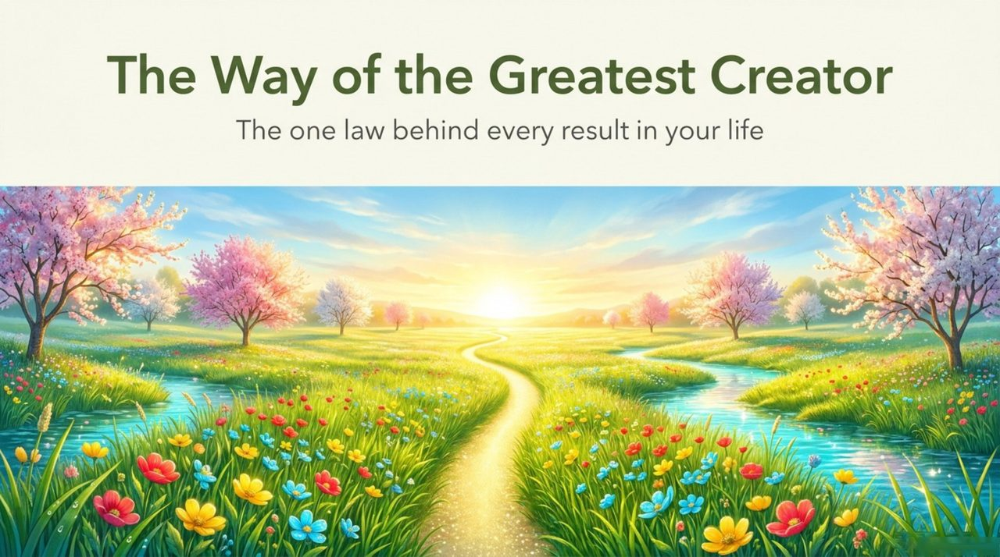
    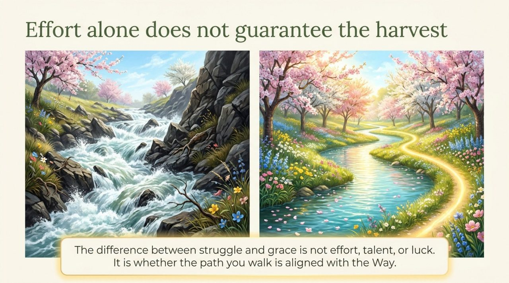
    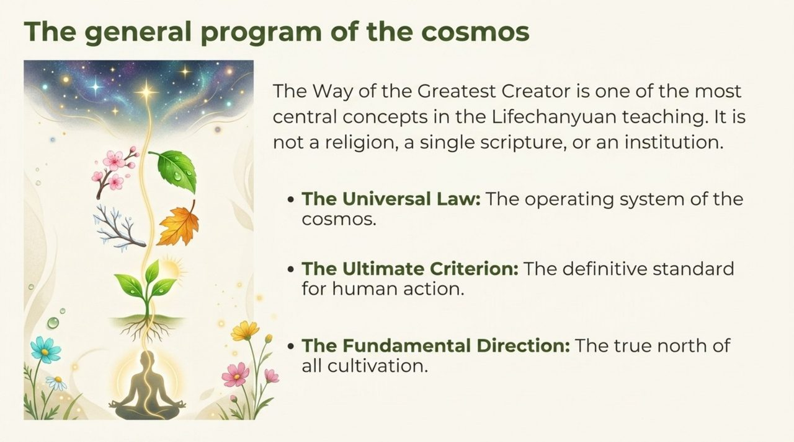
    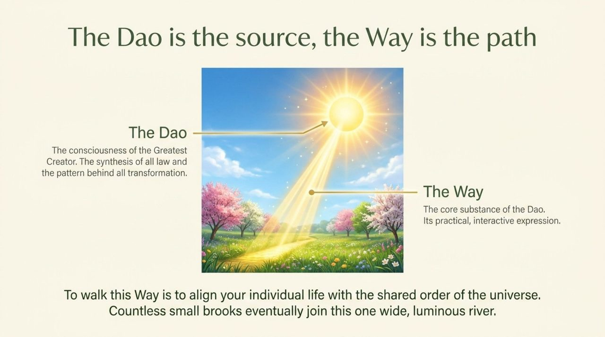
    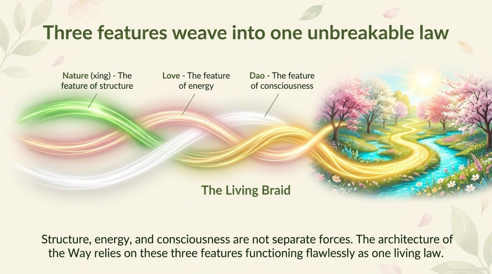
    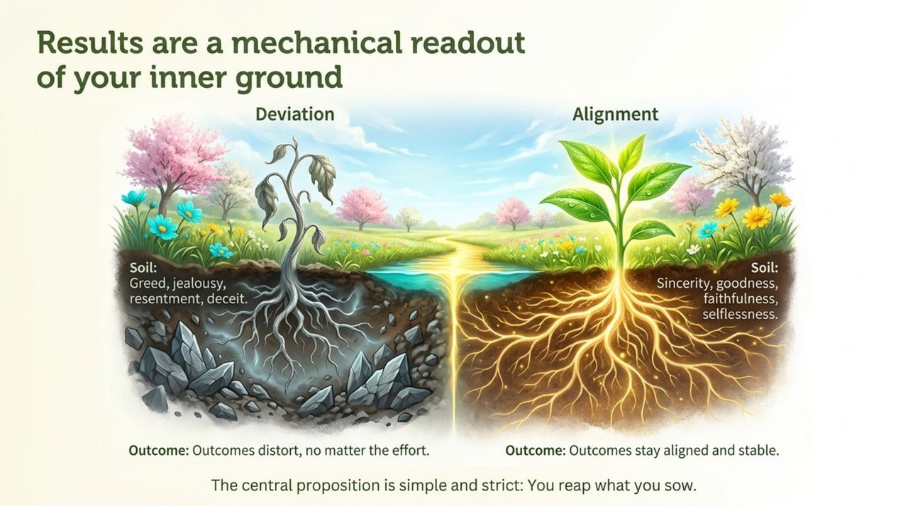
    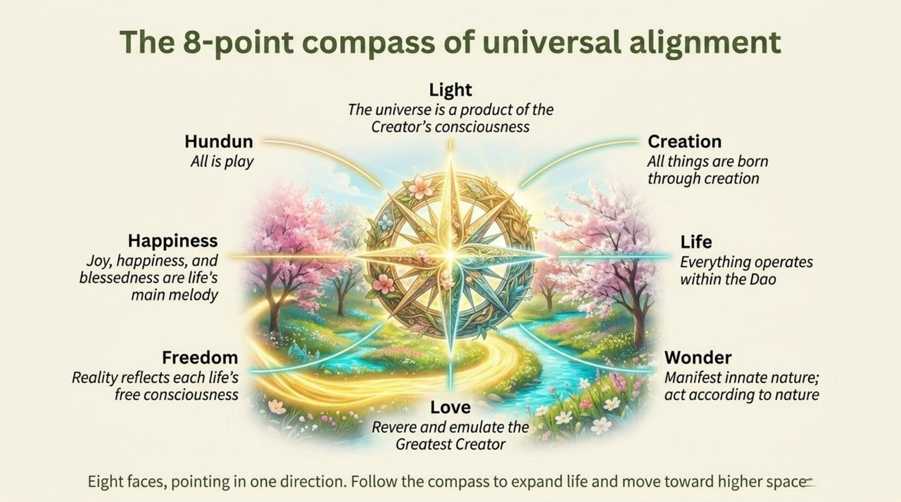
    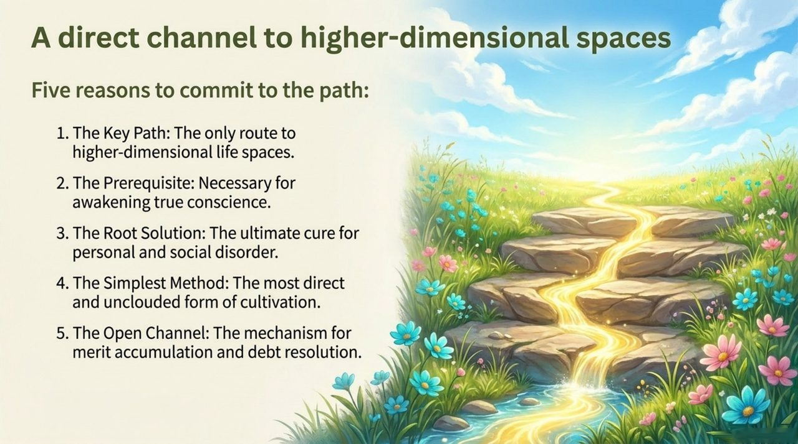
    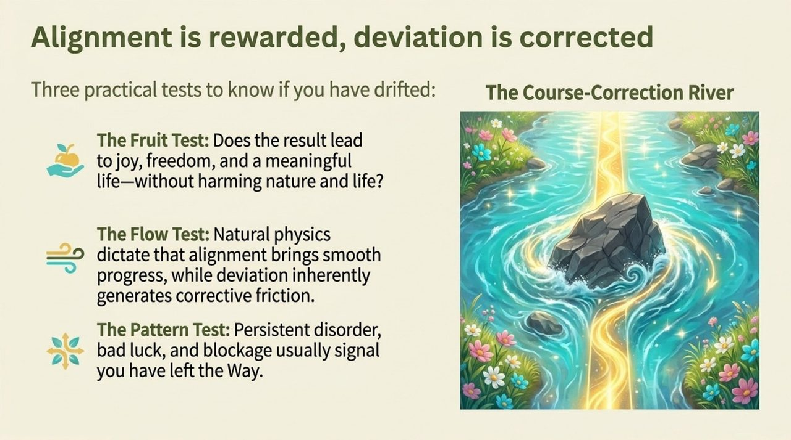
    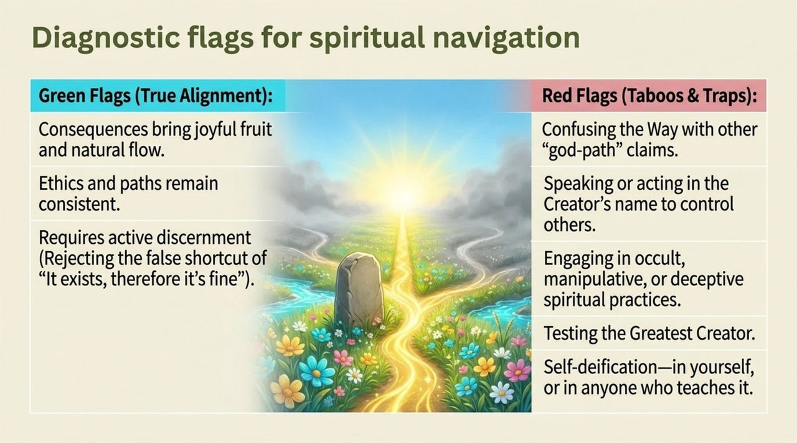
    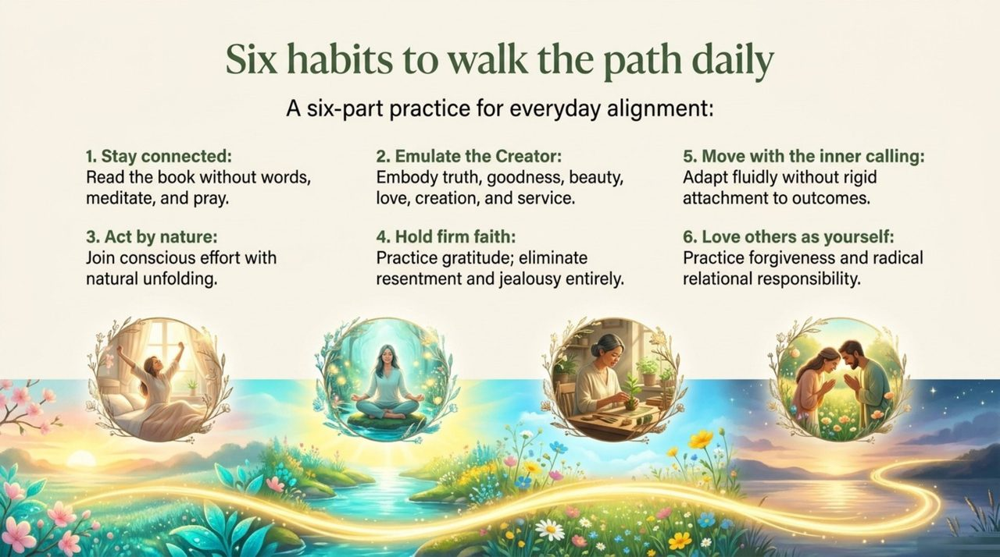
    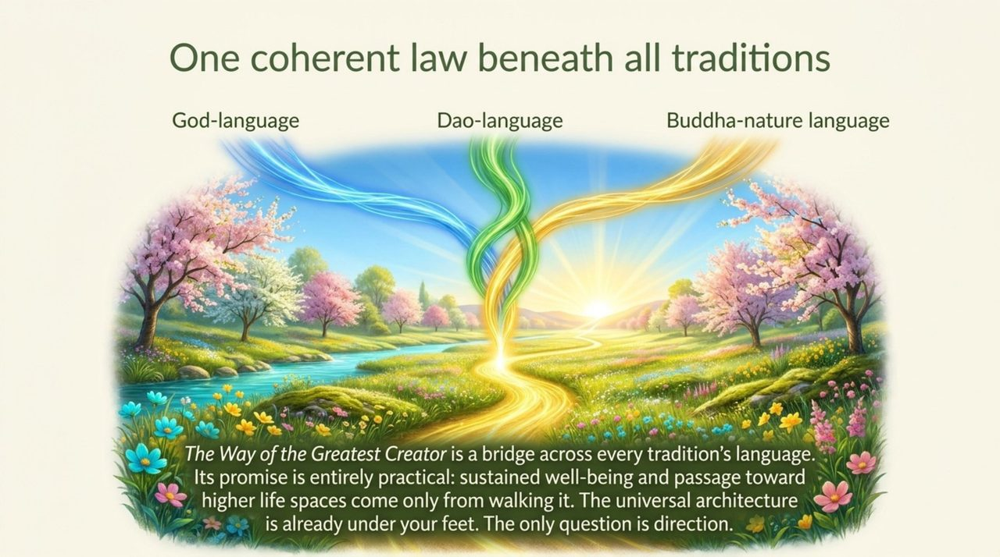

---

## Core Positioning

In the Lifechanyuan system, the Way of the Greatest Creator is the central axis of Chanyuan Celestial cultivation, the theoretical basis of Hundun Management in the Second Home, and the key pivot of the transition from Civilization 2.0 to Civilization 3.0. Its essential triad: Nature (the characteristic of Structure), Love (the characteristic of Energy), and Dao (the characteristic of Consciousness).

---

## Read by Edition

| Edition | Intended Reader | Link |
|---------|----------------|-------|
| **Friendly Edition** | Readers new to Lifechanyuan concepts | [Read Friendly Edition](./friendly) |
| **Academic Edition** | Researchers with philosophical/religious studies background | [Read Academic Edition](./academic) |
| **Internal Edition** | Chanyuan Celestials and deep practitioners | [Read Internal Edition](./internal) |

---

## Related Entries

- [The Greatest Creator](/en/greatest-creator/) — The source and embodiment of the Way
- [Dao](/en/dao/) — Dao as cosmological principle; the consciousness of the Greatest Creator
- [Hundun Management](/en/hundun-management/) — "The Way of the Greatest Creator, Hundun Management" — the governance model
- [Civilization 3.0](/en/civilization-3-0/) — The civilizational transition built on the Way
- [Kingdom of Heaven](/en/kingdom-of-heaven/) — The destination for those who walk the Way faithfully
