# Five Skandhas Are Empty (Wuyun Jiekong)

> "The Bodhisattva Avalokitesvara, while practising deep prajnaparamita, clearly saw that all five skandhas are empty, and thus relieved all suffering and distress."  
> — Heart Sutra (New Era Human 800 Concepts, 4th Edition, No. 689)

"Five Skandhas Are Empty" (*wuyun jiekong* 五蕴皆空) is a cornerstone realization in Lifechanyuan's cultivation system. The five skandhas — form, sensation, perception, mental formations, and consciousness — all dissolve back into emptiness; only the three cosmic essentials (consciousness, structure, energy) remain eternal. Returning constantly to this zero-state is the supreme method for reaching everlasting Elysian bliss.

| Version | Best for | Focus |
|---------|----------|-------|
| [Friendly version](friendly.md) | First-time readers | Letting go of attachment, returning to zero |
| [Academic version](academic.md) | Researchers | Lifechanyuan's reinterpretation vs. Buddhist tradition |
| [Internal reference](internal.md) | Deep study | Complete original texts from the Guide |

---

## Video

<iframe style="width:100%;aspect-ratio:4/3;border:0" src="https://www.youtube-nocookie.com/embed/RkFvY2e7t-I" title="Five Skandhas Are Empty (Lifechanyuan Encyclopedia video)" allowfullscreen></iframe>

## Slides

??? info "📖 Illustrated slides (14 pages, click to expand)"

    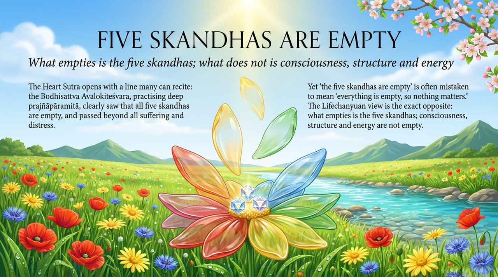
    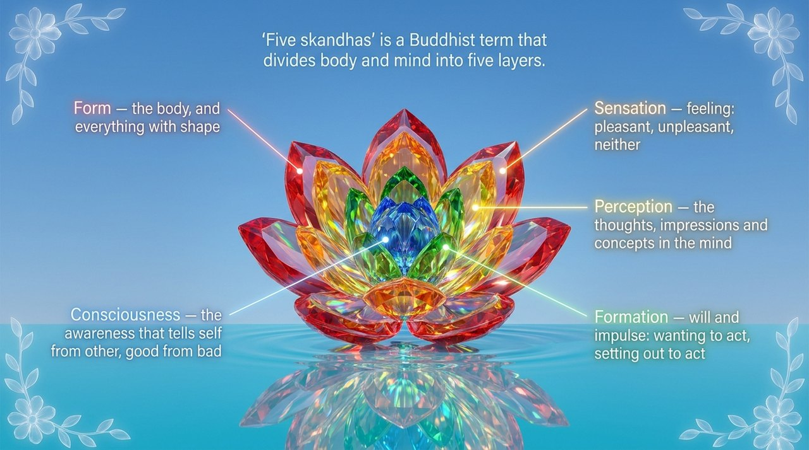
    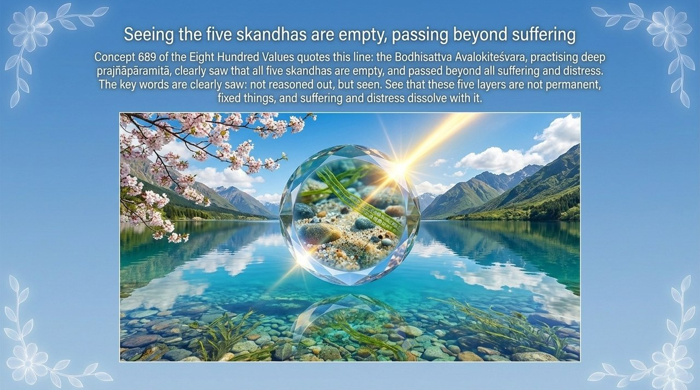
    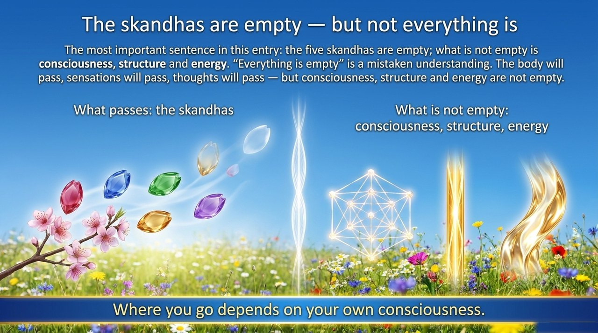
    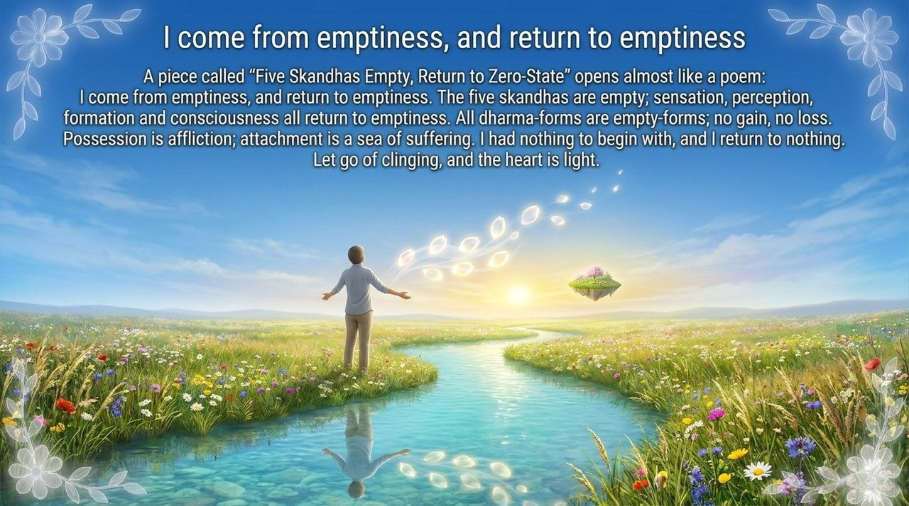
    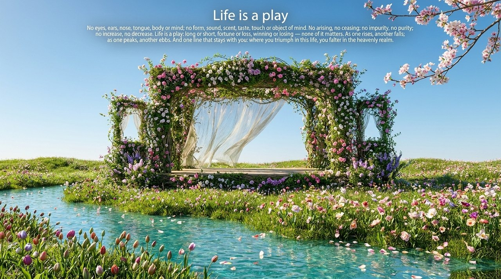
    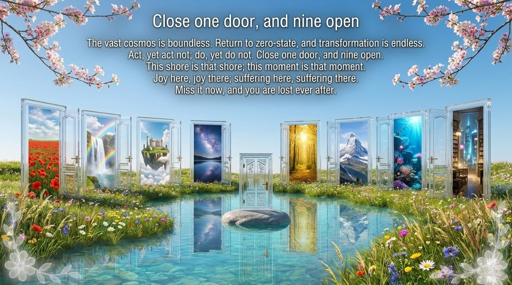
    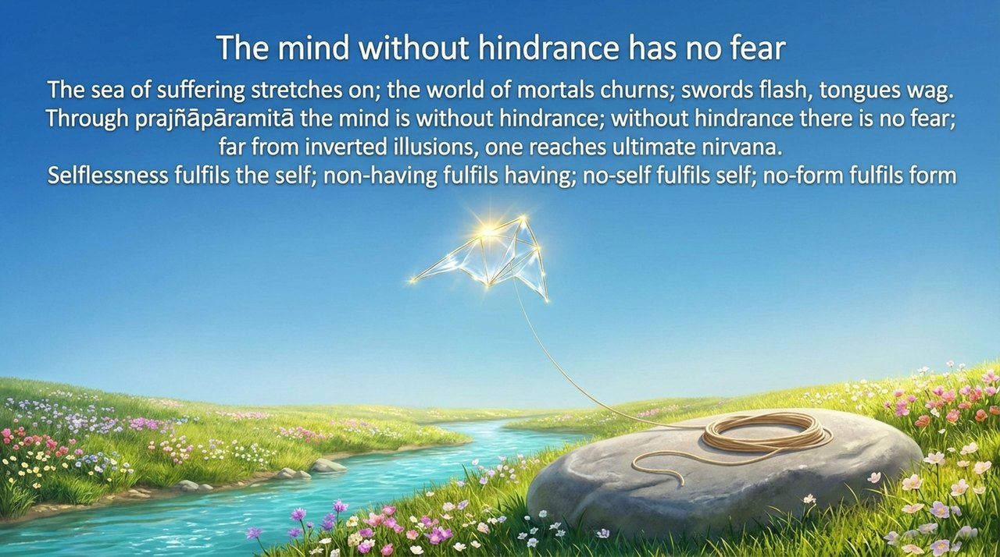
    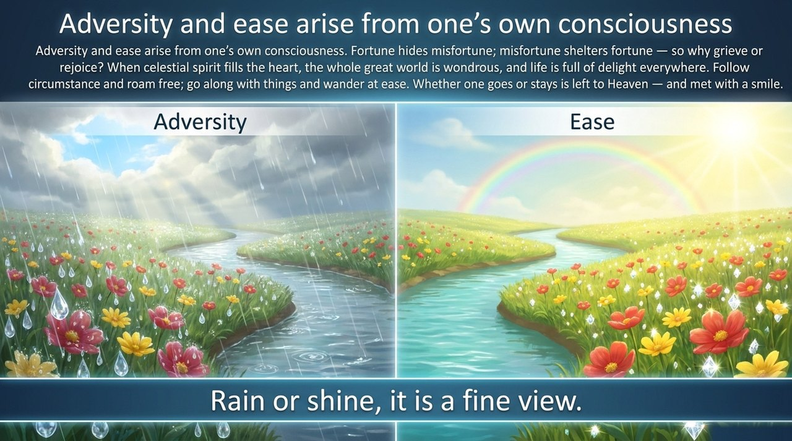
    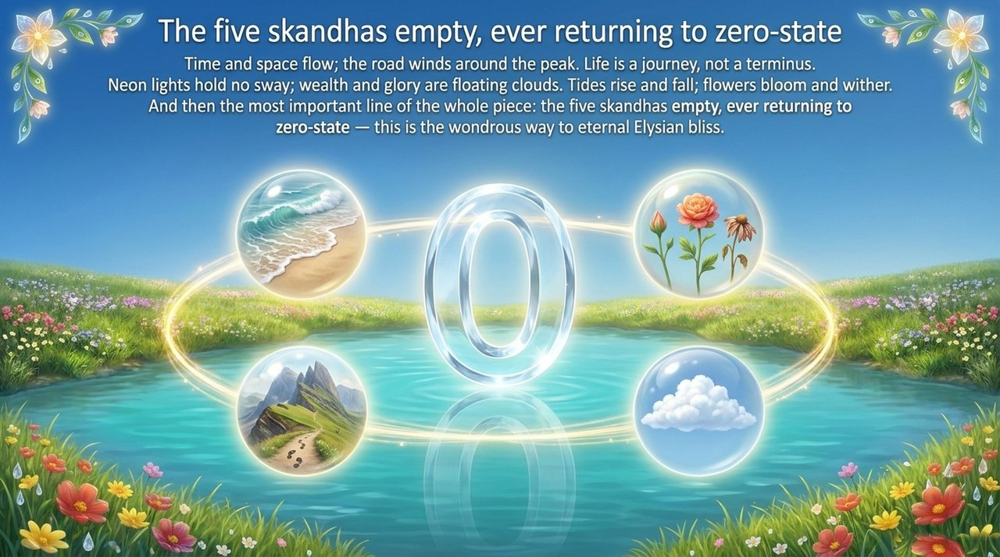
    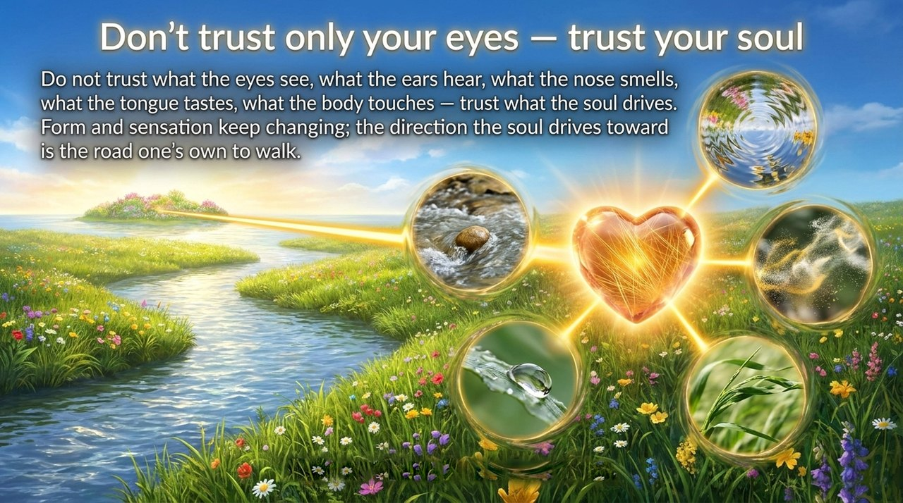
    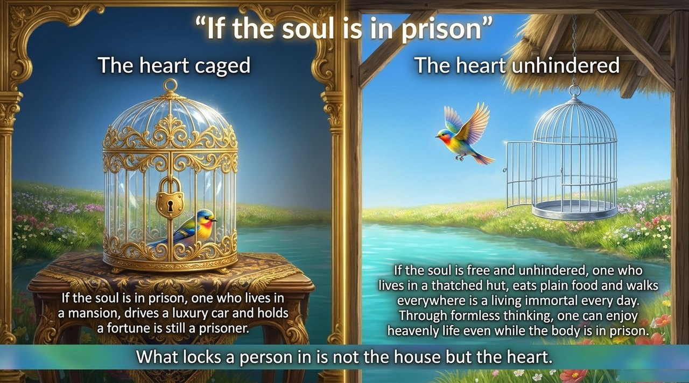
    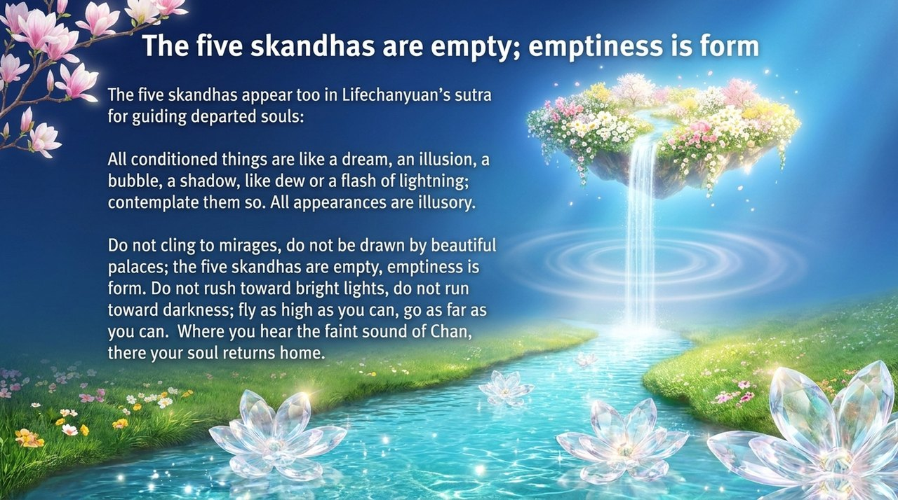
    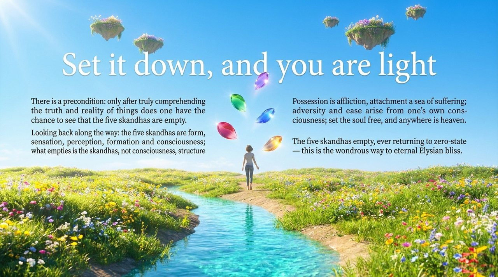

---

## Related Entries

[Zero-State](/en/zero-state/) · [Elysian Bliss](/en/jilemiaojing/) · [Sunyata (Kong-Xing)](/en/kong-xing/) · [Nirvana](/en/nirvana/) · [No-Self, No-Form](/en/no-self-no-form/) · [Return to Zero](/en/return-to-zero/) · [Mind Without Abiding](/en/xinwu-suozhu-guaai/) · [Inverted Illusions](/en/diandao-mengxiang/) · [Letting Go](/en/letting-go/)
