<!-- id: LC-XW-0001-EN theme: Cultivation type: Navigation direction: Celestial Cultivation lang: en -->

# Mind Without Abiding · Mind Without Hindrance

**Mind Without Abiding** (心無所住, *xīn wú suǒ zhù*) originates in the *Diamond Sutra*'s teaching "give rise to a mind that abides nowhere" — a state in which the mind does not fix itself upon any object and is not bound by any person, event, or thing. **Mind Without Hindrance** (心無掛礙, *xīn wú guà ài*) originates in the *Heart Sutra*'s "depending on Prajñāpāramitā, the mind is without hindrance; without hindrance, there is no fear; far removed from inverted views and dreams, ultimate Nirvāṇa is reached." The two are inseparable and mutually confirming — in the Lifechanyuan system they represent the highest practical mark of celestial and Buddha attainment, the most supreme of the 84,000 Dharma gates, and the fundamental criterion for completing the transformation from human to celestial being.

---

## Version Navigation

| Version | Intended Reader | Features |
|---------|----------------|---------|
| [Accessible](friendly.md) | First-time readers | Everyday scenarios · What the mind holds none of · The path of letting go |
| [Academic](academic.md) | Scholars · Cross-cultural comparison | *Diamond Sutra* & *Heart Sutra* origins · Daoist *wu wei* · Mindfulness psychology |
| [Practitioner](internal.md) | Cultivators · Researchers | Complete verbatim quotes · Six-section framework · In-depth system understanding |

---

## Video

<iframe style="width:100%;aspect-ratio:4/3;border:0" src="https://www.youtube-nocookie.com/embed/eAzdhTlwRXI" title="Mind Without Abiding · Mind Without Hindrance (Lifechanyuan Encyclopedia video)" allowfullscreen></iframe>

## Slides

??? info "📖 Illustrated slides (14 pages, click to expand)"

    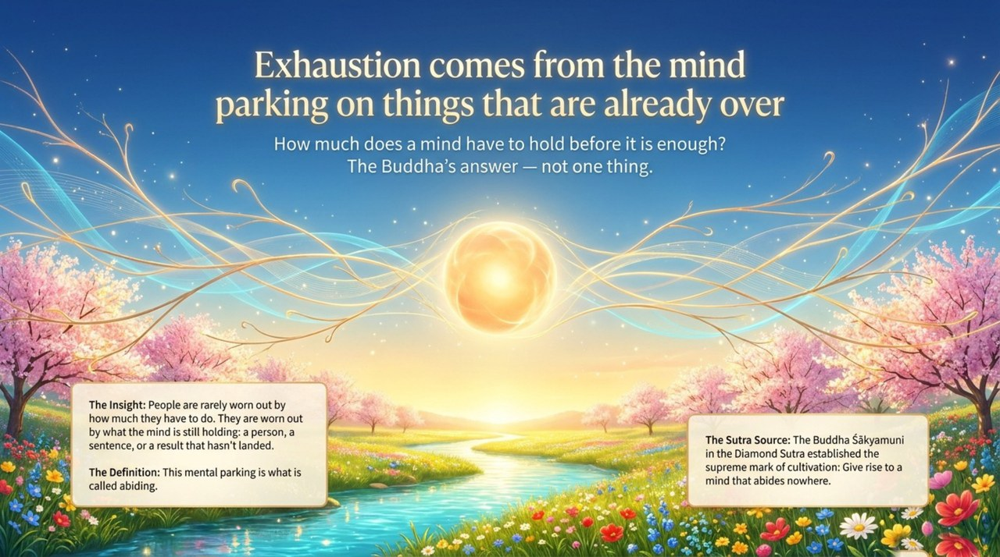
    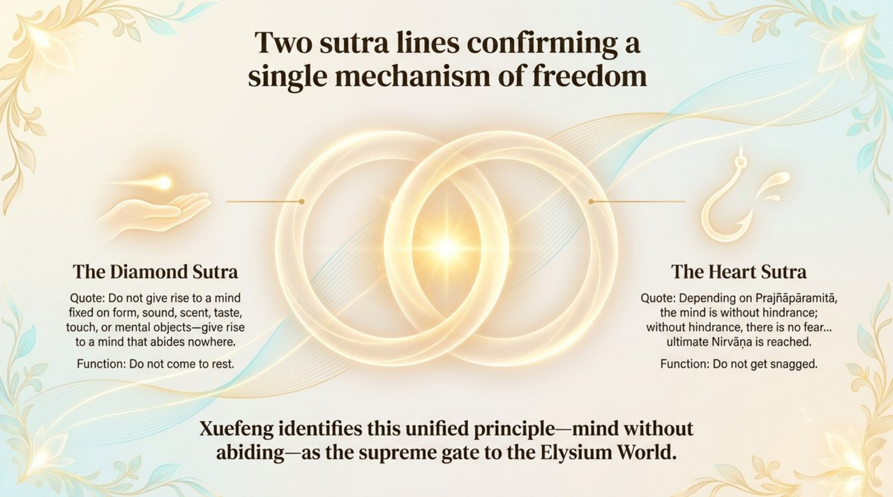
    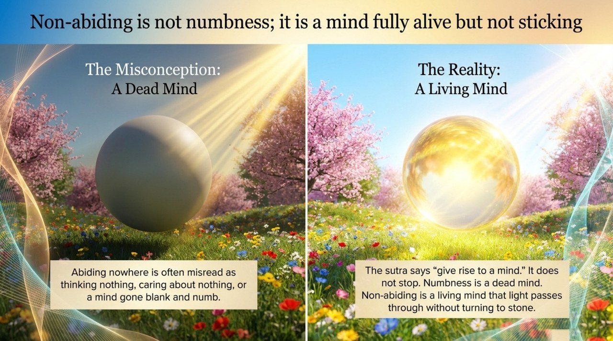
    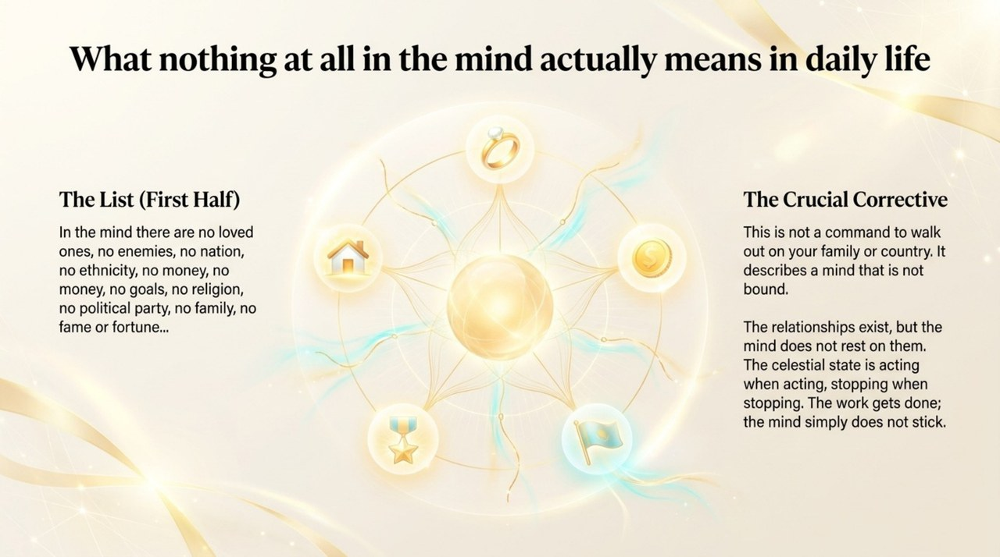
    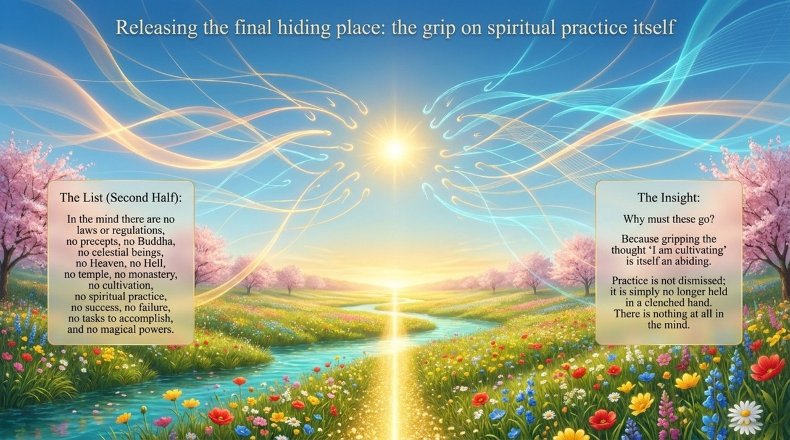
    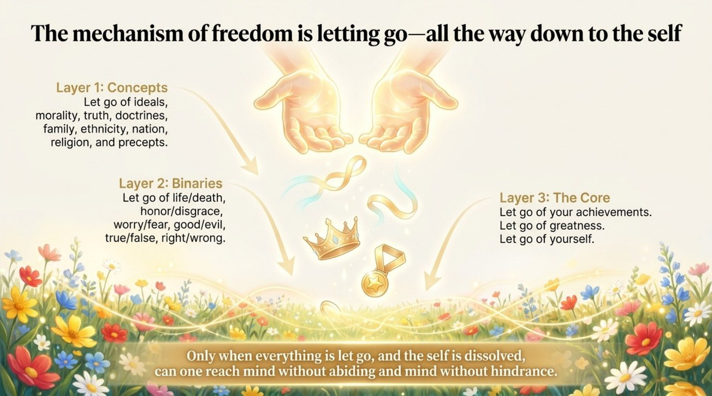
    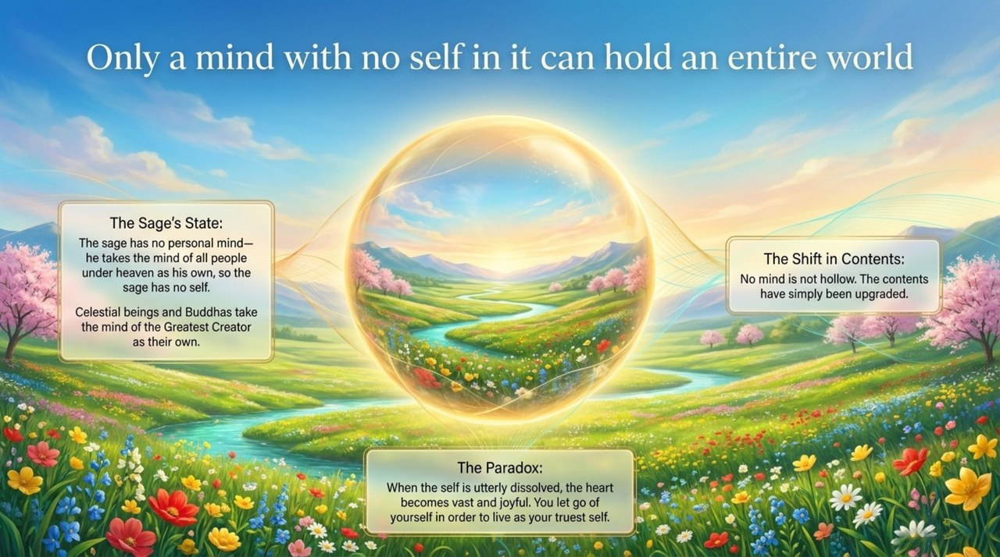
    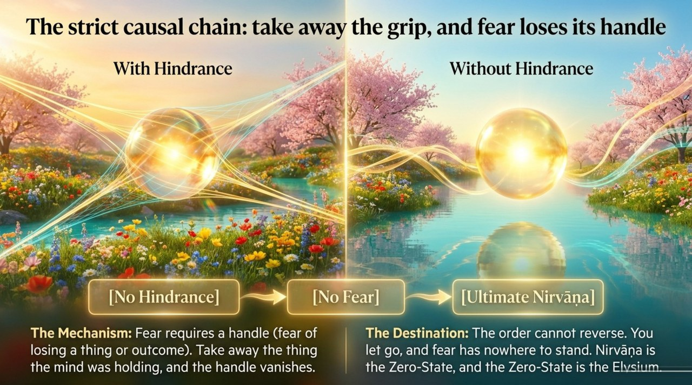
    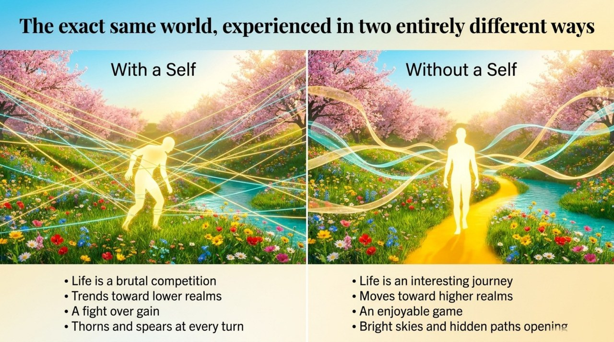
    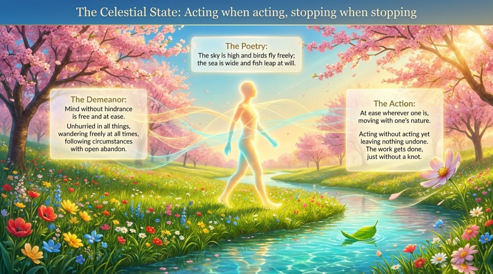
    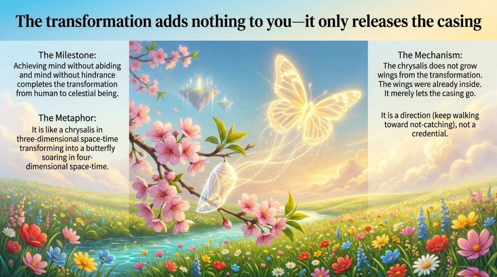
    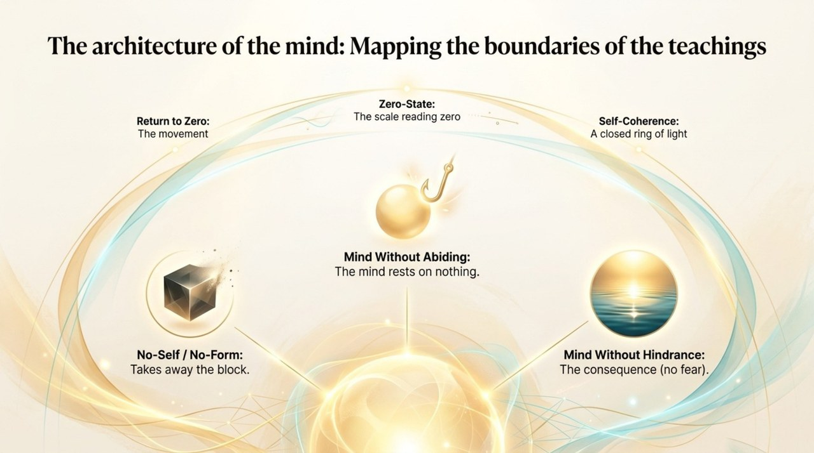
    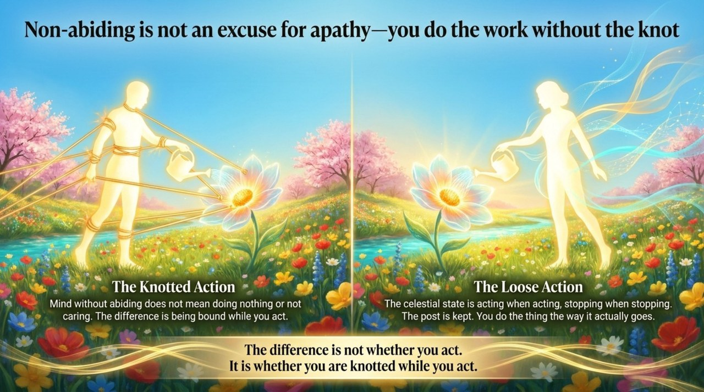
    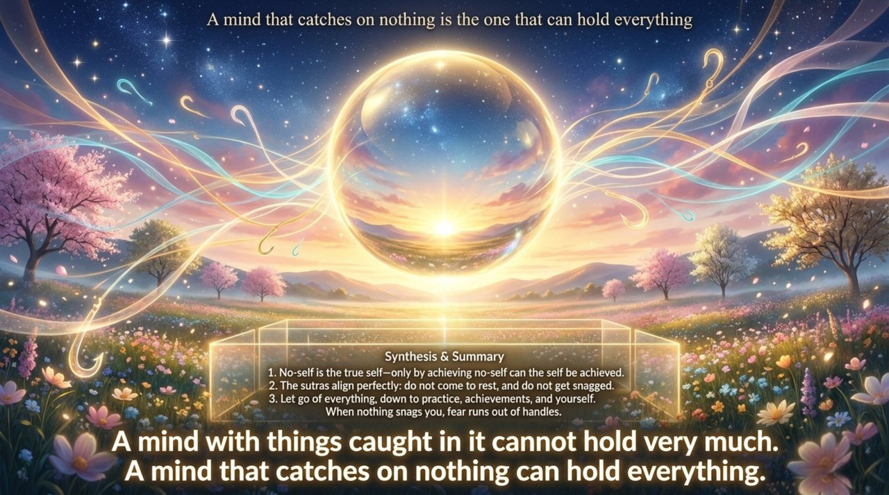

---

## Related Entries

[No-Self, No-Form](/en/no-self-no-form/) · [Letting Go](/en/letting-go/) · [Return to Zero](/en/return-to-zero/) · [Zero-State](/en/zero-state/) · [The Four Adaptations](/en/si-sui/) · [Wu Wei (Non-Action)](/en/wu-wei/) · [Mahayana Aspiration](/en/dasheng-xinyuan/) · [Becoming a Celestial Being and a Buddha](/en/becoming-celestial-buddha/) · [Soul Garden](/en/soul-garden/)
