---
title: Xuefeng Communism
slug: xuefeng-communism
---

# Xuefeng Communism

**Xuefeng Communism** is the new model of human production and living proposed and practiced since 2009 by Lifechanyuan's Guide Xuefeng. Its essence is *sharing-ism*: all resources held in common, each contributing according to ability and taking according to need, each member owning nothing personally yet having access to everything. Characterized by the dissolution of nations, religions, political parties, money, power, and the institution of marriage and family, it uses the Second Home (Life Oasis) as its living proof of concept. It is regarded as the highest form of human civilization, the only true path to happiness for the laboring masses, and the practical arena for spiritual cultivation leading to the Kingdom of Heaven.

## Read by Edition

| Edition | Intended Reader |
|---------|----------------|
| [Friendly Edition](friendly/) | New readers — approachable analogies and plain language |
| [Academic Edition](academic/) | Researchers and comparative theorists |
| [Internal Edition](internal/) | Chanyuan Celestials and serious practitioners |

---

## Video

<iframe style="width:100%;aspect-ratio:4/3;border:0" src="https://www.youtube-nocookie.com/embed/BOT8jcU1jR8" title="Xuefeng Communism (Lifechanyuan Encyclopedia video)" allowfullscreen></iframe>

## Slides

??? info "📖 Illustrated slides (14 pages, click to expand)"

    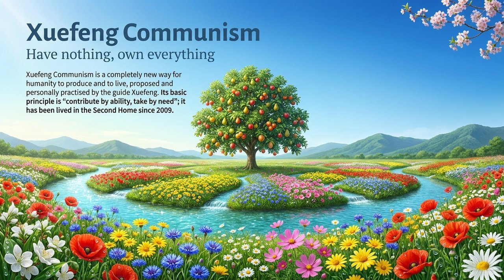
    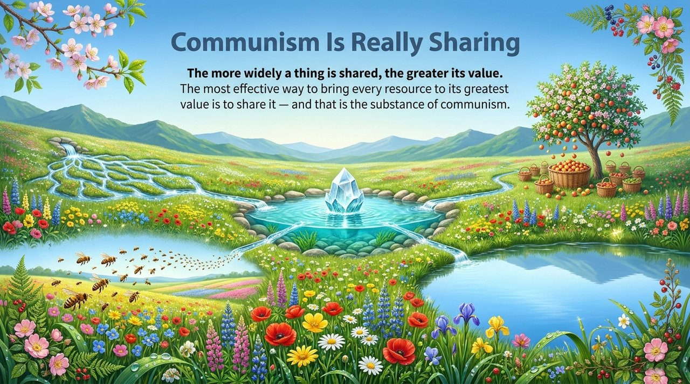
    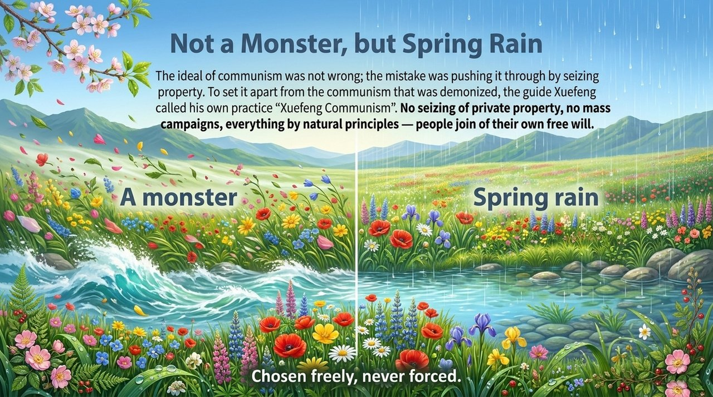
    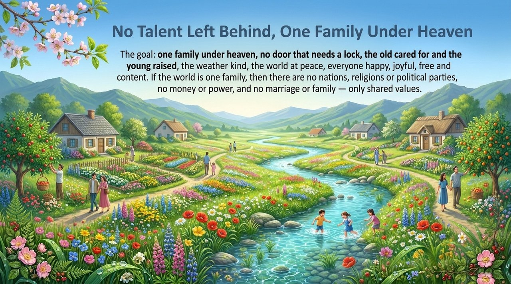
    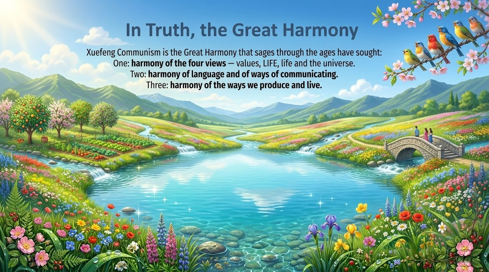
    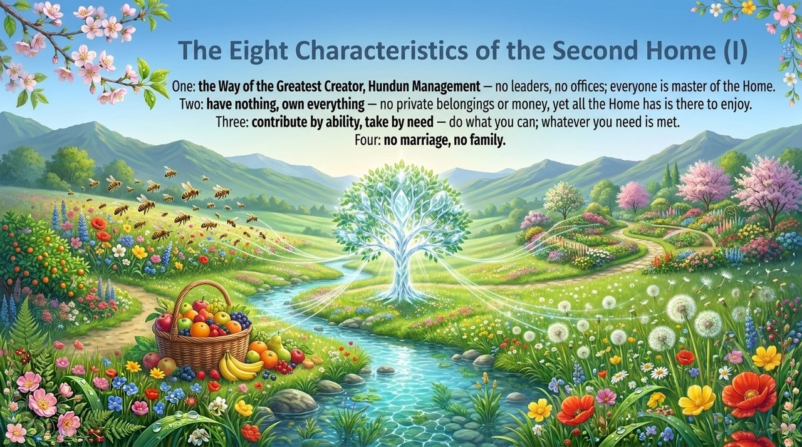
    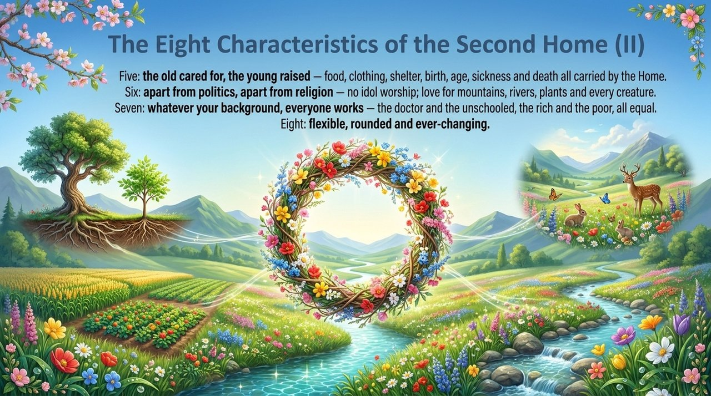
    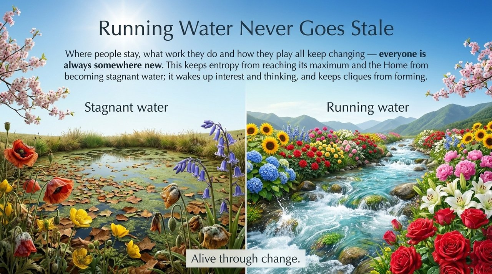
    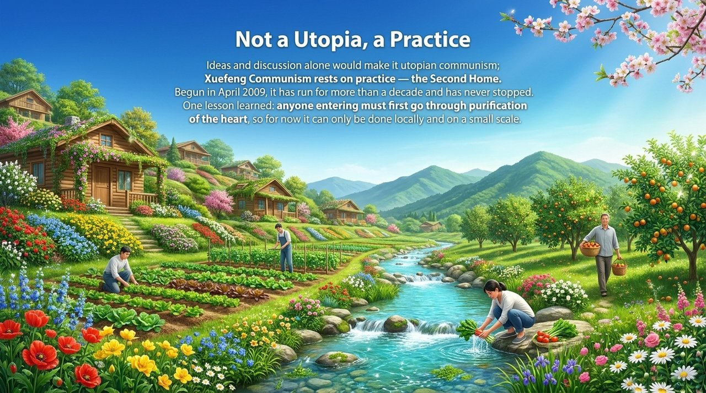
    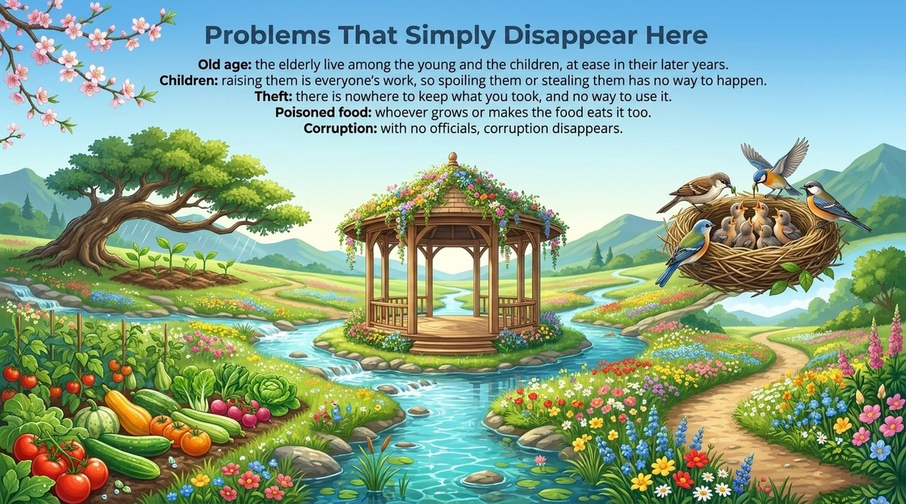
    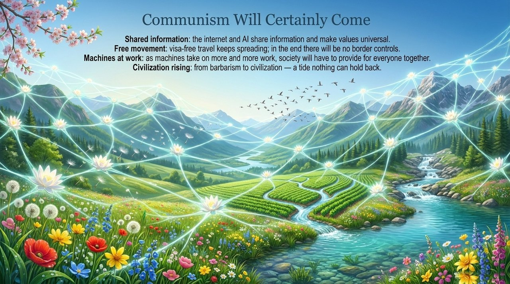
    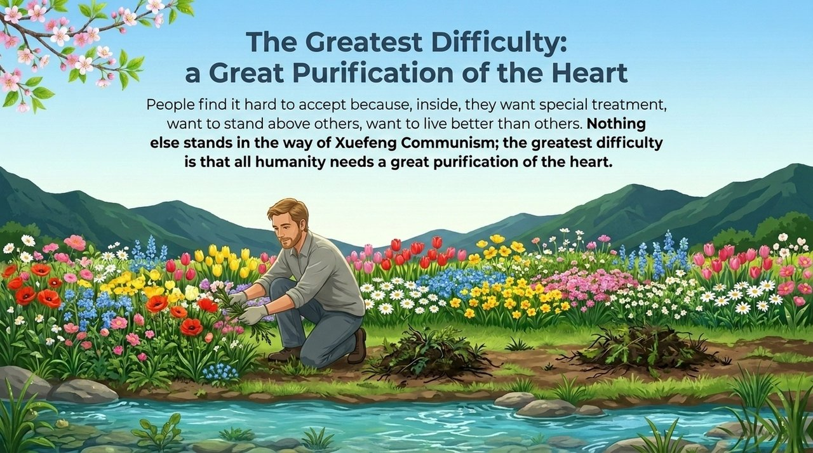
    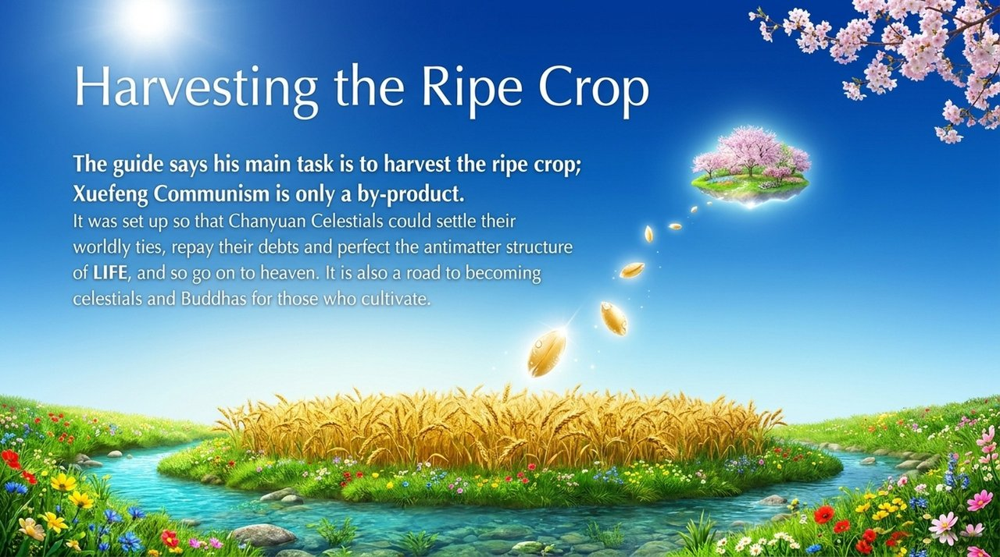
    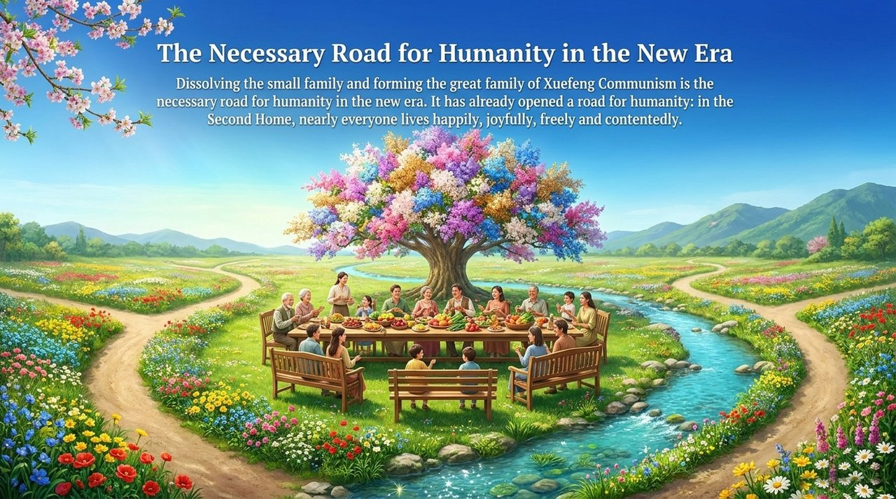

## Related Entries

[Second Home](/en/second-home/) · [Lifechanyuan](/en/lifechanyuan/) · [Hundun Management](/en/hundun-management/) · [Civilization (Overview)](/en/civilization-overview/) · [Lifechanyuan New Era](/en/lifechanyuan-new-era/) · [800 Values for New Era Humanity](/en/new-era-human-800-concepts/) · [Spiritual Garden](/en/soul-garden/) · [Kingdom of Heaven](/en/kingdom-of-heaven/)
