# Yuan — Karmic Affinity and Predestined Bonds

**Yuan** (缘) is the invisible force that binds lives together across time and space — an antimatter energy potential accumulated through every act of giving, receiving, loving, and harming across countless lifetimes. It is the unseen reason behind every encounter, every relationship that cannot be shaken off, and every coincidence that feels anything but accidental. Resolving worldly yuan (*chen yuan*) and forming celestial yuan (*xian yuan*) is one of the central tasks on the path from human to immortal.

---

## Version Guide

| Version | Best for | Link |
|---------|----------|------|
| Friendly | First-time readers | [Read Friendly Version](/en/yuan/friendly/) |
| Academic | Scholarly research, cross-cultural comparison | [Read Academic Version](/en/yuan/academic/) |
| Internal | Chanyuan Celestials, deep study | [Read Internal Version](/en/yuan/internal/) |

---

## Video

<iframe style="width:100%;aspect-ratio:4/3;border:0" src="https://www.youtube-nocookie.com/embed/AlDPgKxE5_o" title="Yuan (Lifechanyuan Encyclopedia video)" allowfullscreen></iframe>

## Slides

??? info "📖 Illustrated slides (14 pages, click to expand)"

    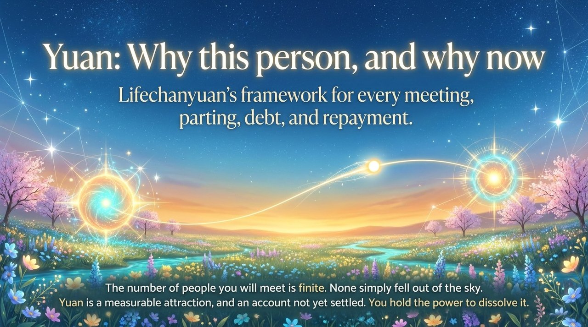
    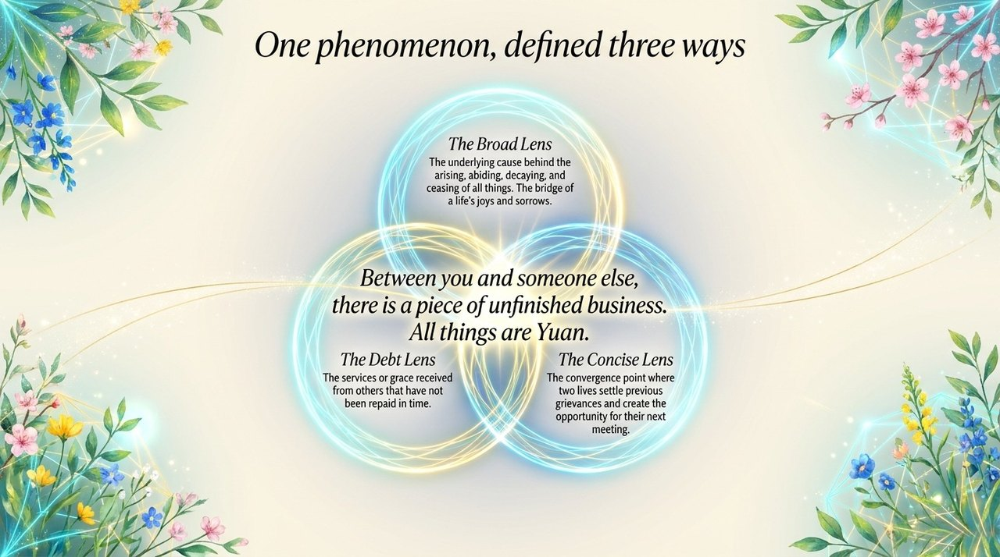
    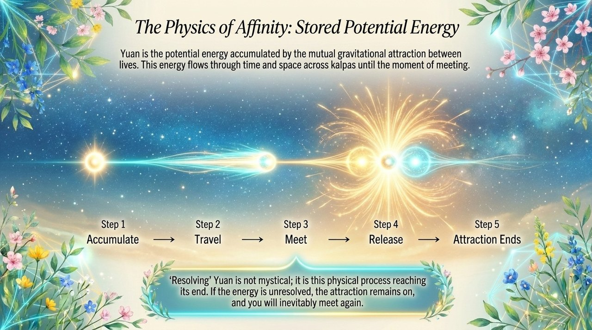
    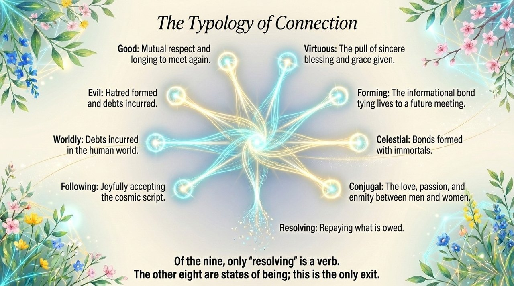
    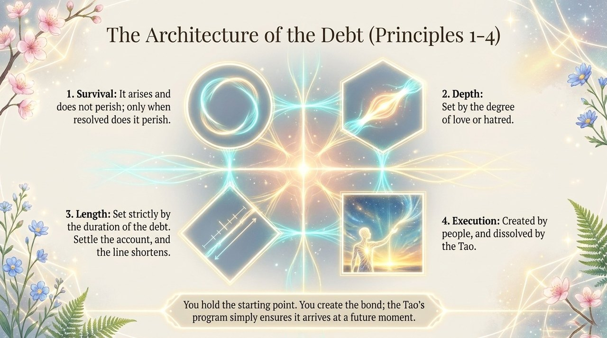
    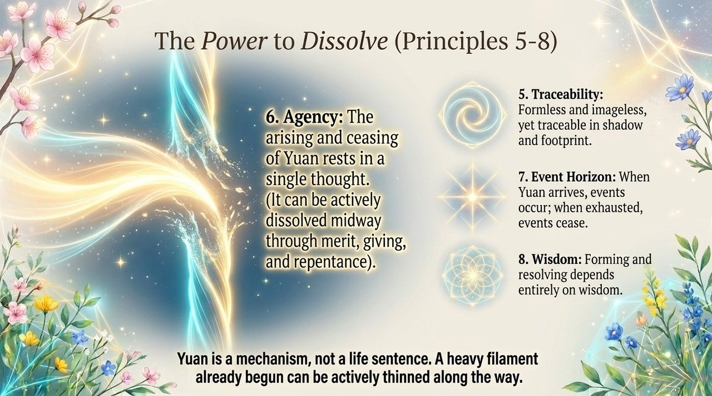
    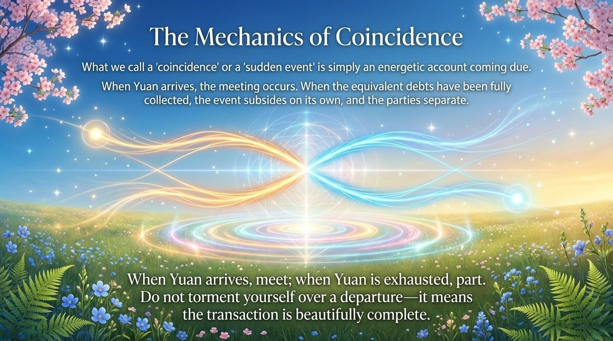
    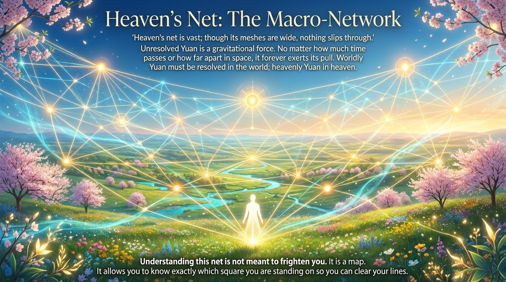
    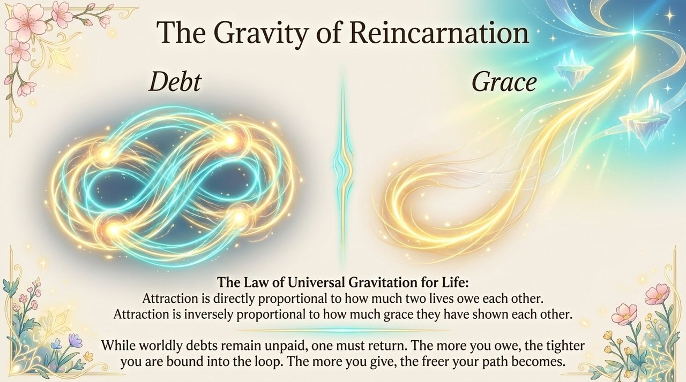
    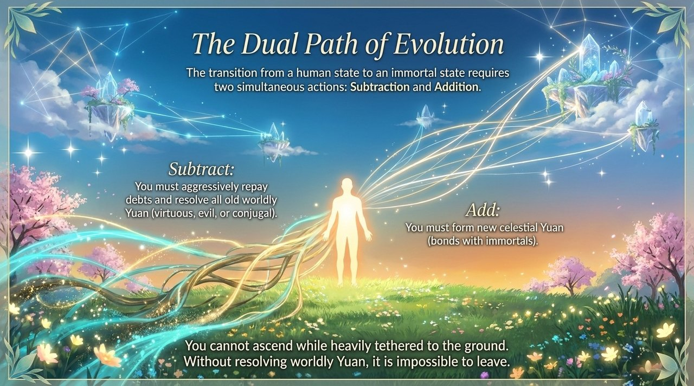
    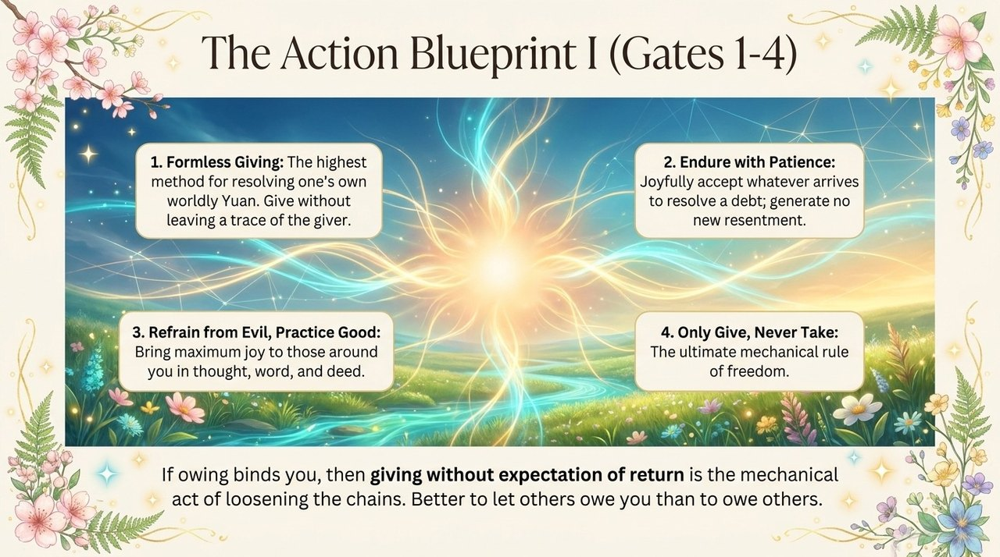
    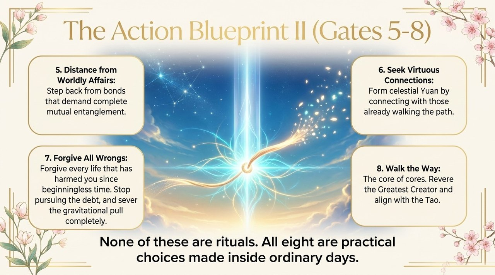
    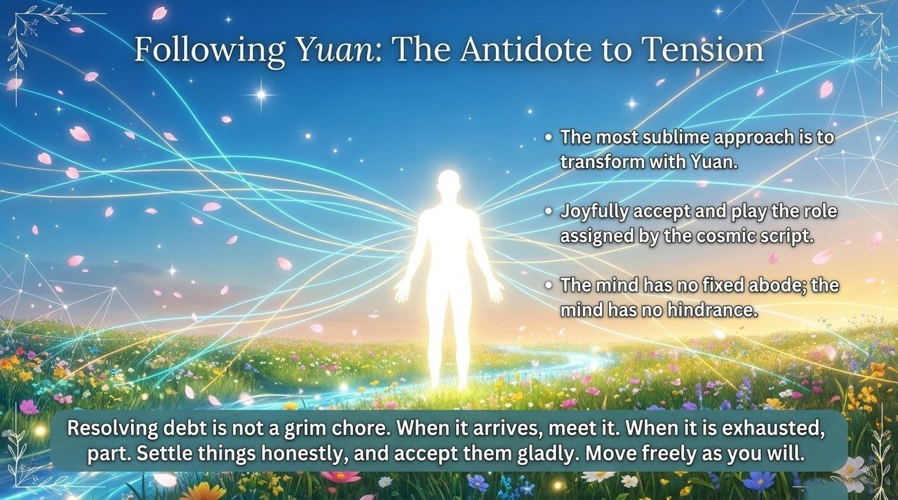
    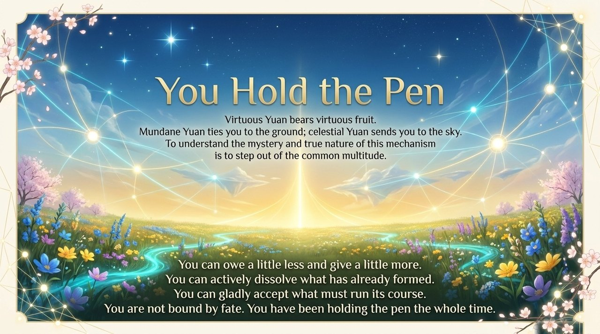

---

## Related Entries

[Karma · Retribution · Reincarnation](/en/karma-retribution-reincarnation/) · [Formless Giving](/en/formless-giving/) · [Awakening](/en/awakening/) · [Soul](/en/soul/) · [Life](/en/life/) · [The Tao](/en/dao/) · [Life Characteristics](/en/life-characteristics/)
