<!-- id: LC-ZS-0001-EN theme: Cultivation System type: Gateway Page direction: Cultivation Practice lang: en -->

# Zero-State

[Entry Gateway]

> In Lifechanyuan terminology, **LIFE** (capitalized) refers to the ontological
> essence of existence — the soul/antimatter structure that persists across
> incarnations — while **life** (lowercase) refers to the experiential stage
> of human existence in this world.

**Zero-State** (零态, *língtài*) is one of the most fundamental concepts in the Lifechanyuan cultivation system — the condition of inner openness that makes awareness, resonance, and transformation possible. Guide Xuefeng identifies it as the single convergence point of Laozi's *wu wei* (non-action), the Buddha's *wu xiang* (non-form), and Qiankun Yuanchu's *middle way*: three great wisdom traditions pointing, in different languages, at the same essential ground.

> Zero-State is the state of the Greatest Creator, the state of Buddha, the state of celestial beings. It is nothing at all — yet it is everything.
>
> — Guide Xuefeng, *Always in Zero-State (Advanced Cultivation)*

---

## Core Positioning

The Zero-State is not emptiness in the nihilistic sense. It is the condition of maximum readiness — the way a scale at zero can weigh anything, the way an empty cup can hold any liquid. In the Lifechanyuan framework, it is also cosmologically grounded: the total energy of the universe is zero, and the Greatest Creator's essence resides at the zero-point of the cosmic coordinate system. To return to Zero-State is to align with the deepest structure of reality.

---

## Read by Edition

| Edition | Intended Reader | Link |
|---------|----------------|-------|
| **Friendly Edition** | Readers new to Lifechanyuan concepts | [Read Friendly Edition](./friendly) |
| **Academic Edition** | Researchers with philosophical/religious studies background | [Read Academic Edition](./academic) |
| **Internal Edition** | Chanyuan Celestials and deep practitioners | [Read Internal Edition](./internal) |

---

## Video

<iframe style="width:100%;aspect-ratio:4/3;border:0" src="https://www.youtube-nocookie.com/embed/ilH7szxMpU4" title="Zero-State (Lifechanyuan Encyclopedia video)" allowfullscreen></iframe>

## Slides

??? info "📖 Illustrated slides (14 pages, click to expand)"

    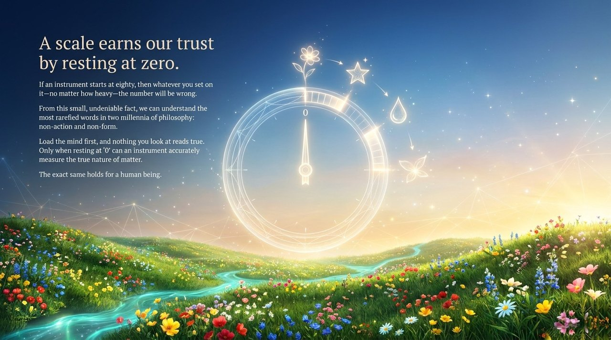
    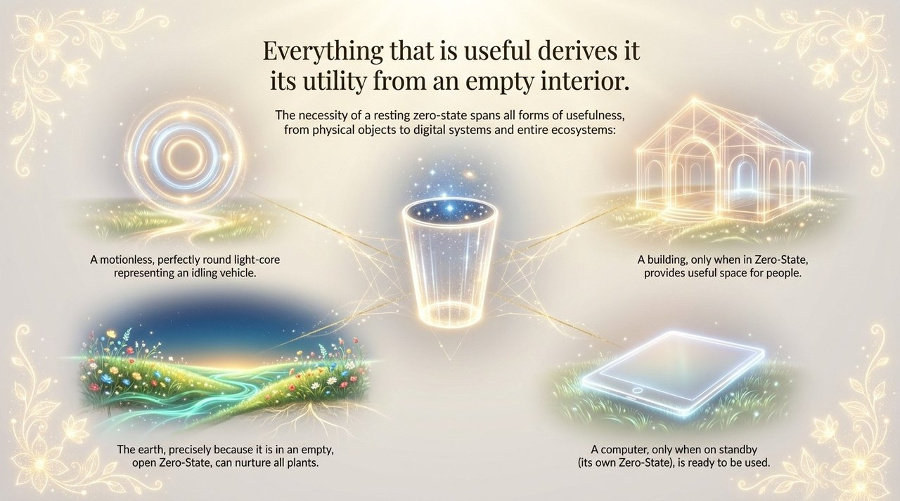
    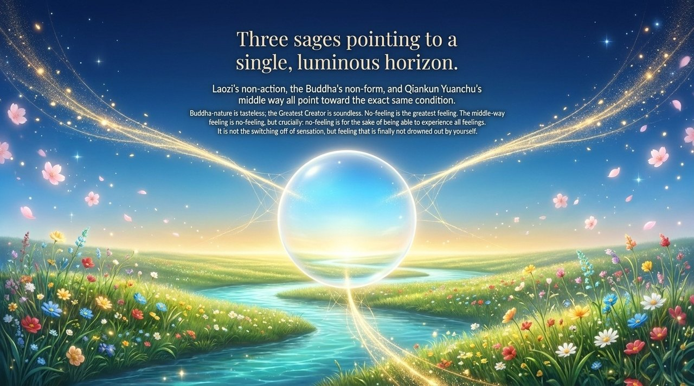
    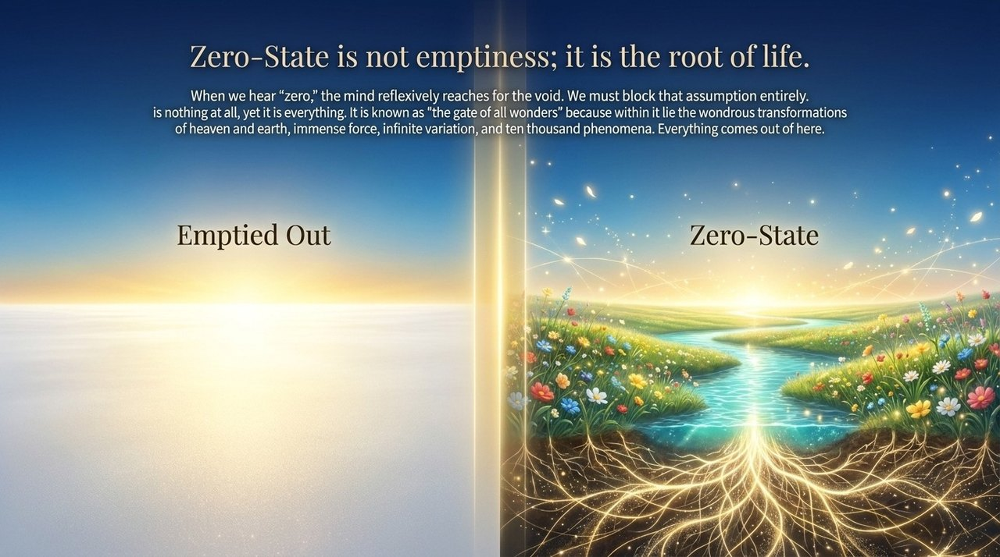
    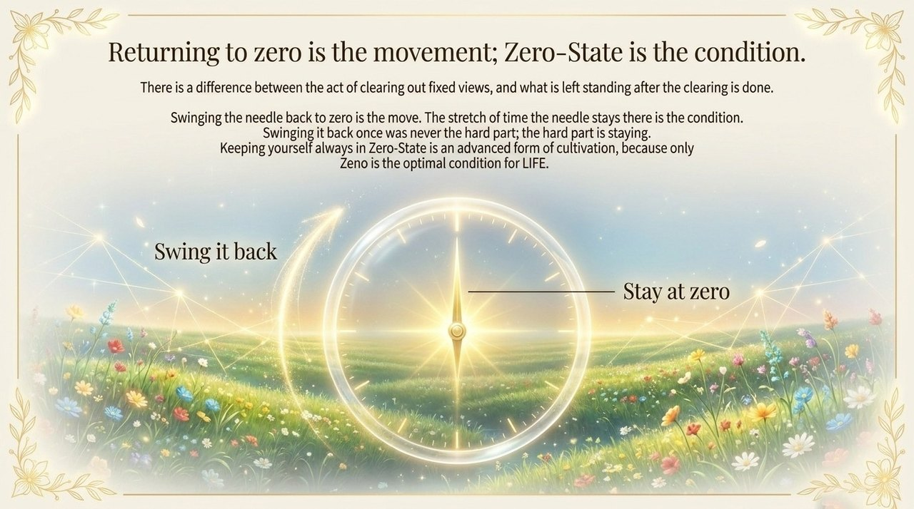
    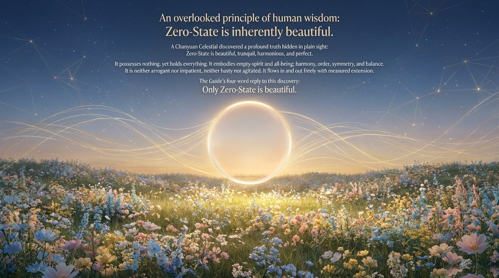
    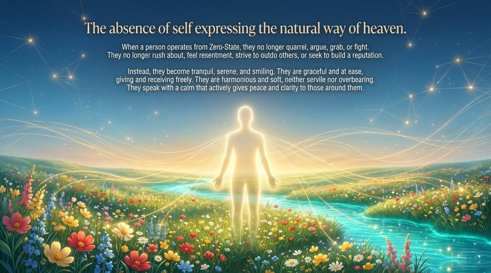
    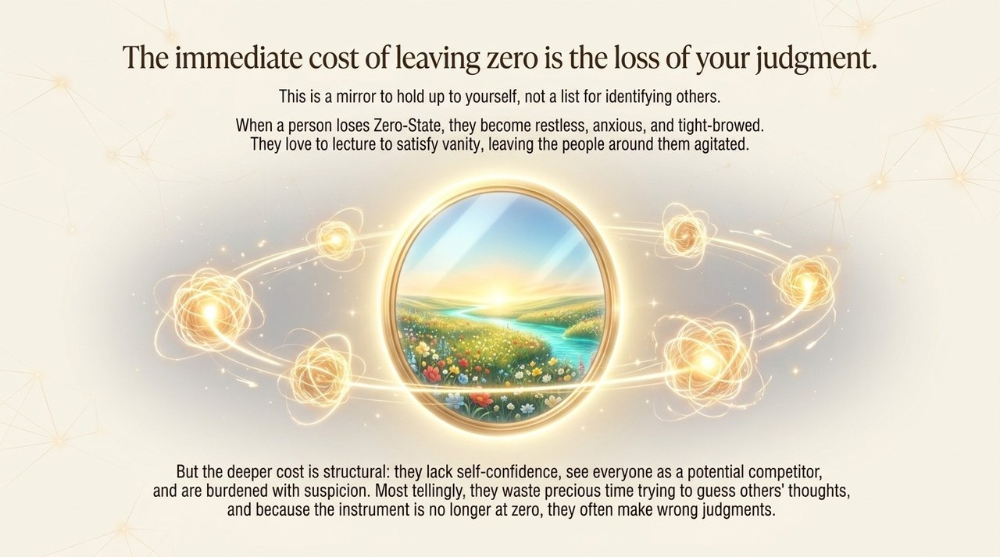
    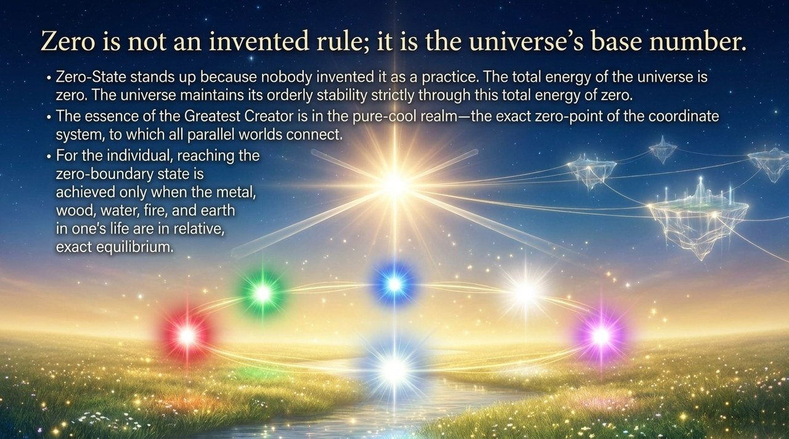
    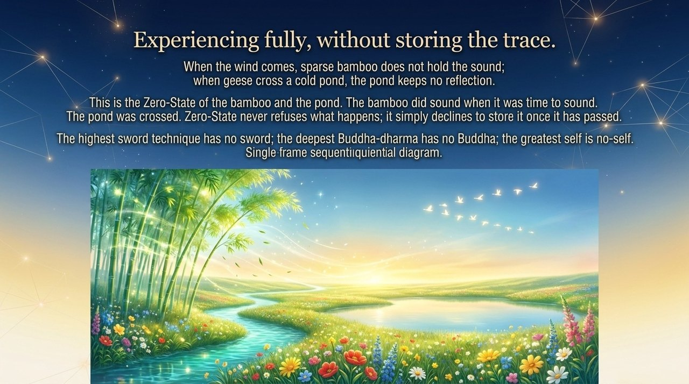
    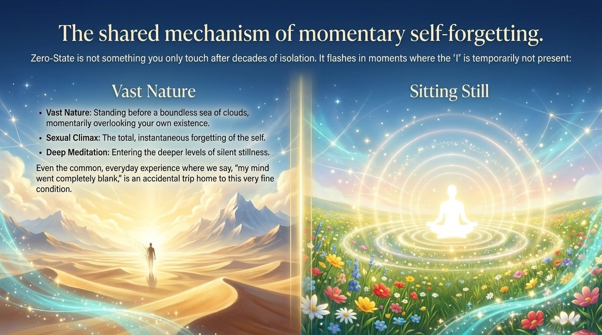
    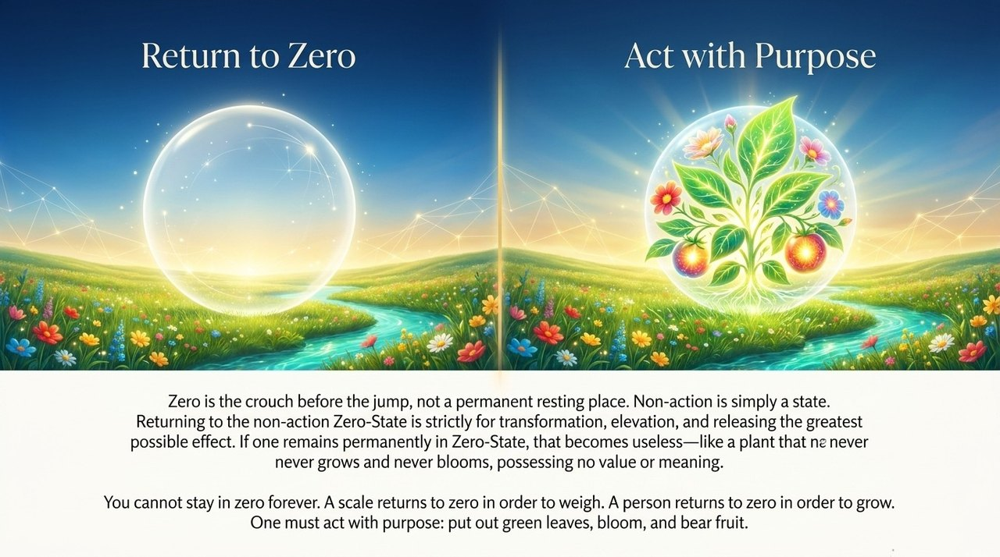
    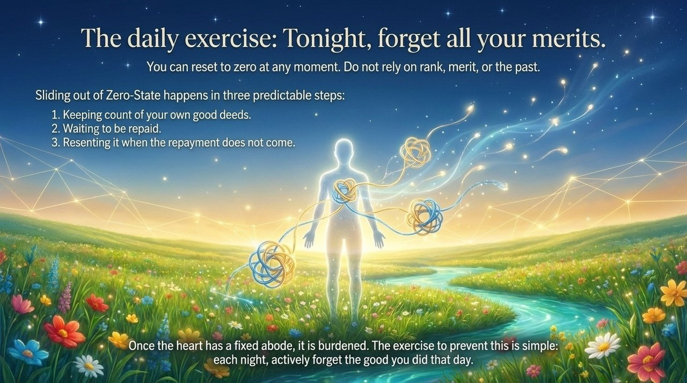
    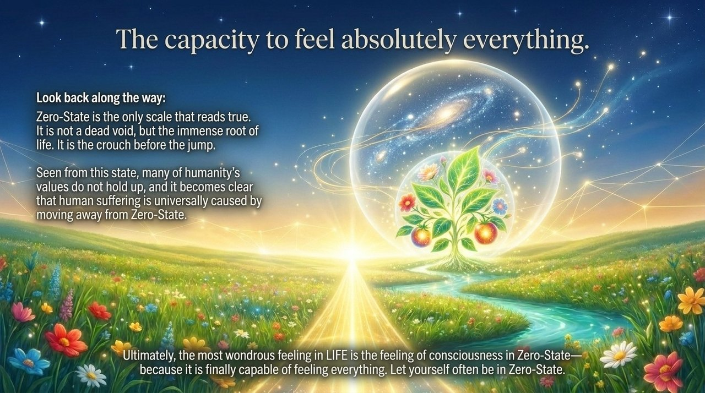

---

## Related Entries

- [Return to Zero](/en/return-to-zero/) — The daily practice of restoring Zero-State
- [Non-Form Thinking](/en/non-form-thinking/) — Zero-State is the core condition of the seventh thinking ladder
- [Spiritual Sensing](/en/spiritual-sensing/) — Only in Zero-State can Spiritual Sensing operate at full sensitivity
- [Soul Garden](/en/soul-garden/) — Soul purification is the inner preparation for Zero-State
- [The Greatest Creator](/en/greatest-creator/) — The Greatest Creator's essence is at the zero-point of reality
