# Truth (Zhen Li)

> The Tao is Truth, and Truth is the Tao — they are one and the same. This is why the divine, Buddhas, prophets, celestial beings, and sages all emphasize the Tao — because what they teach is Truth.  
> — Guide Xuefeng, *Chanyuan Corpus · Celestial Revelation · Truth!*

**Truth (真理, Zhēn Lǐ)** in Lifechanyuan forms a trinity with "Tao" and "the Greatest Creator": Truth is the Tao, and the Tao is the consciousness and spirit of the Greatest Creator — thus Truth is the Greatest Creator. Truth carries eight fundamental attributes: Nothingness, Totality, Trustworthiness, Naturalness, Justice, Warmth, Uniqueness, and Eternity. It cannot be created, only recognized. It is living, not fixed, revealing different faces across dimensions. Seeking Truth, knowing Truth, and honoring Truth is the highest priority of human life, and the essential path to higher LIFE spaces.

## Video

<iframe style="width:100%;aspect-ratio:4/3;border:0" src="https://www.youtube-nocookie.com/embed/okvR88cDBuk" title="Truth (Zhen Li) (Lifechanyuan Encyclopedia video)" allowfullscreen></iframe>

## Slides

??? info "📖 Illustrated slides (15 pages, click to expand)"

    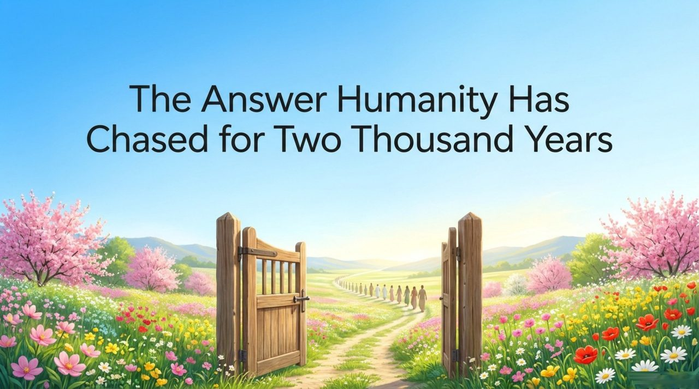
    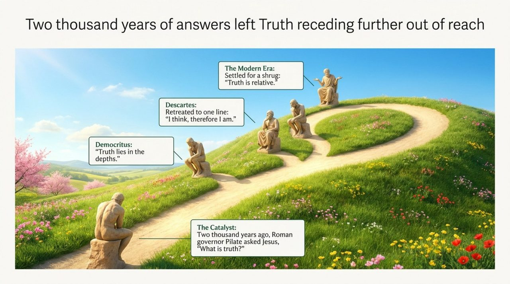
    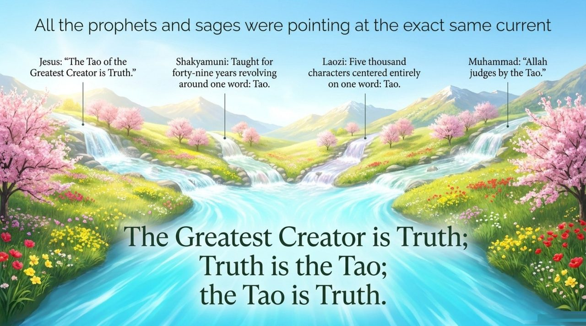
    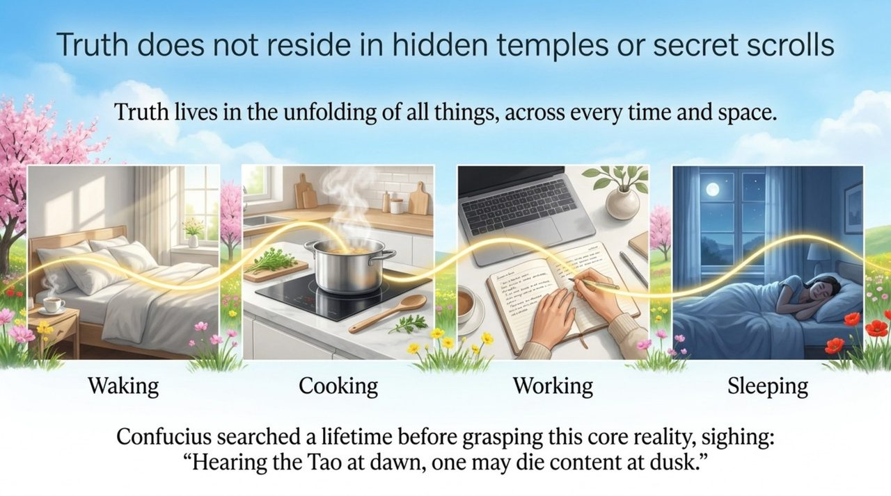
    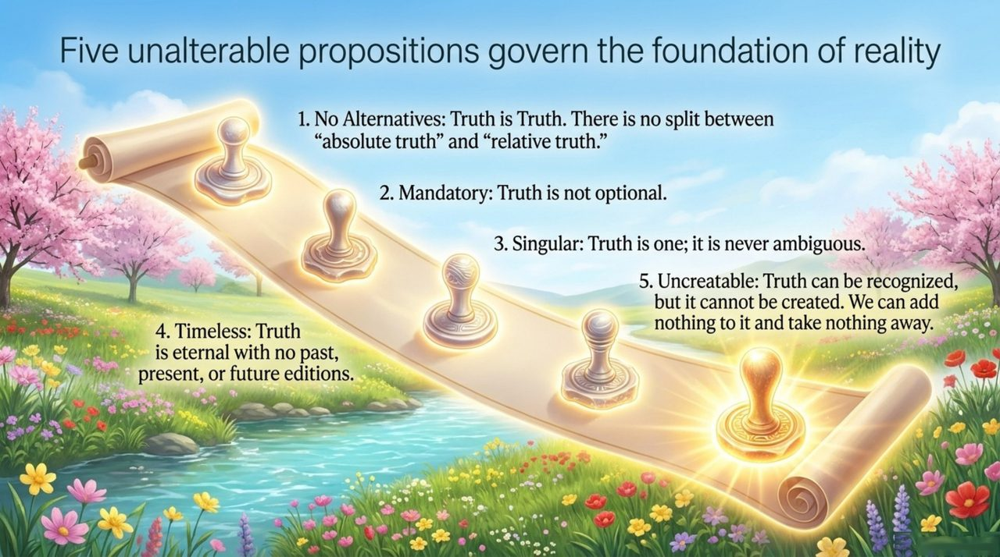
    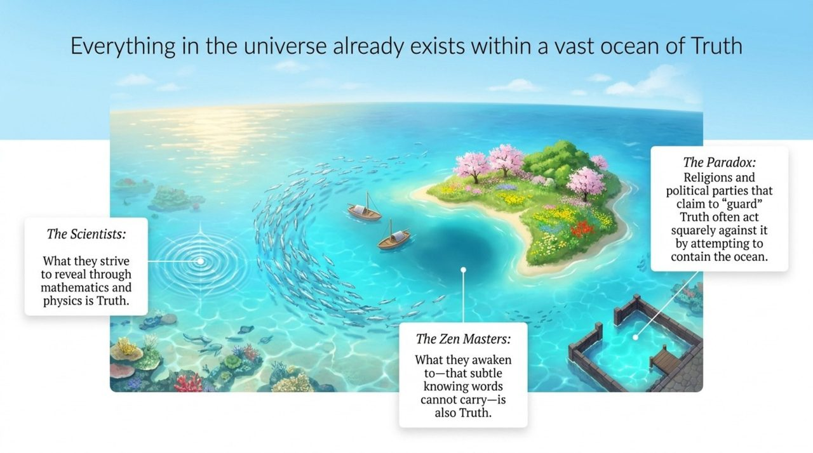
    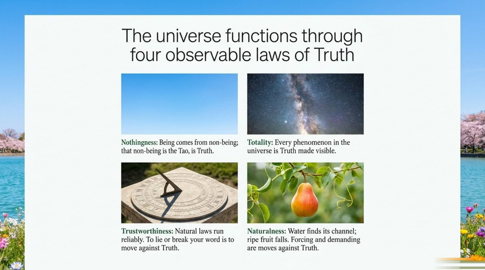
    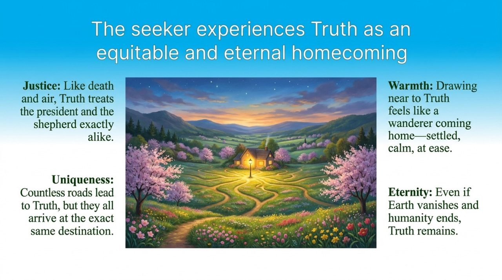
    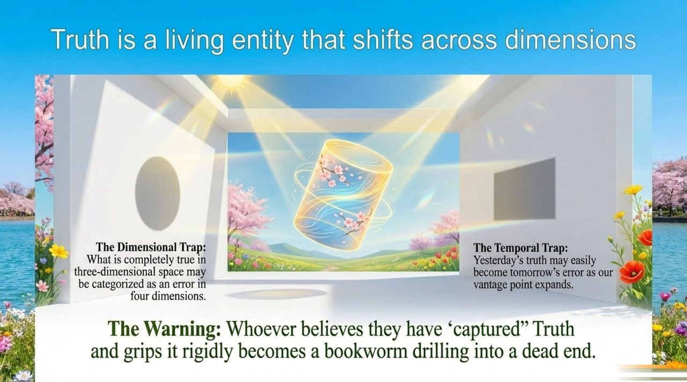
    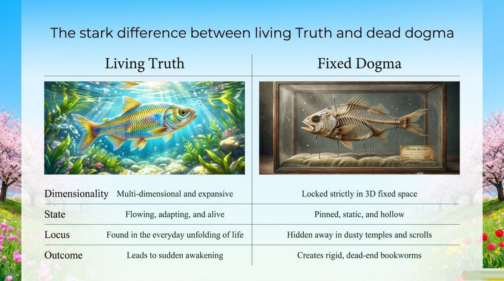
    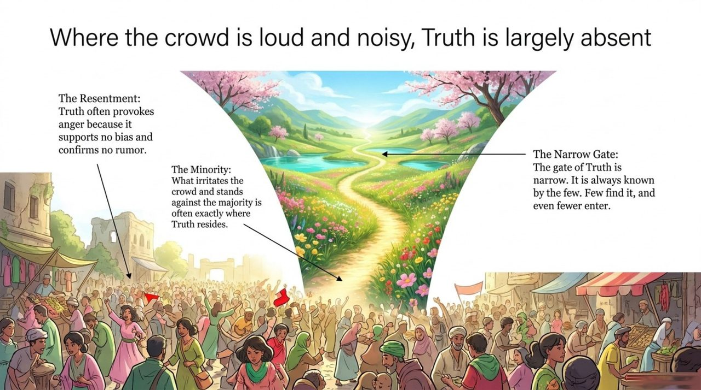
    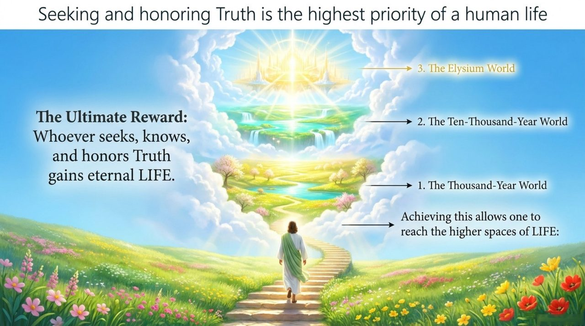
    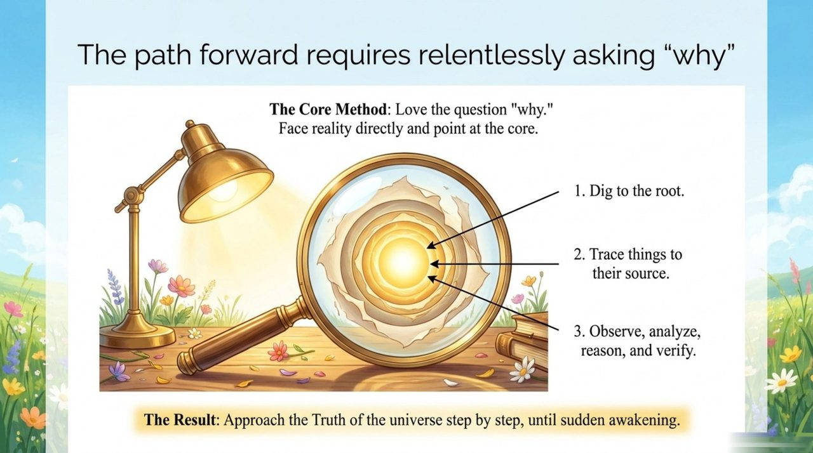
    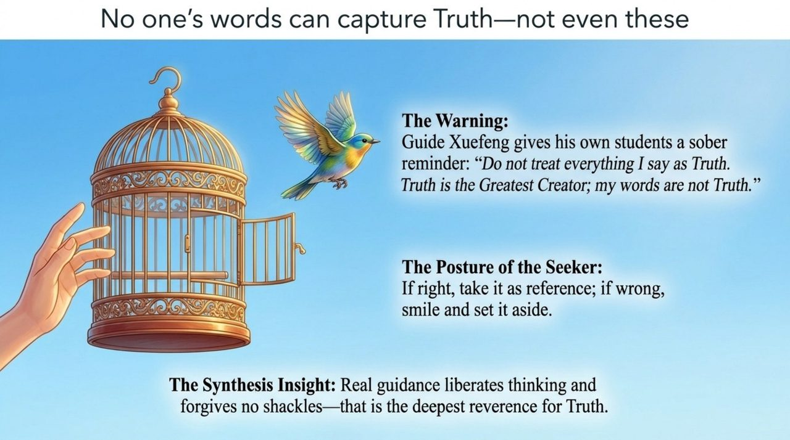
    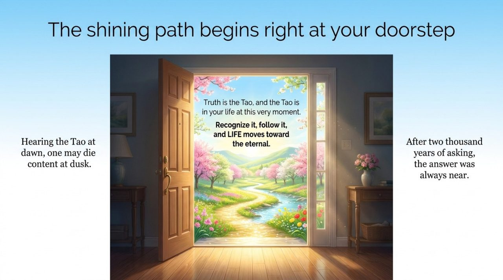

| Version | Best for | Focus |
|---------|----------|-------|
| [Friendly version](friendly.md) | First-time readers | What Truth is and why seeking it matters |
| [Academic version](academic.md) | Researchers | Eight attributes and comparative philosophy |
| [Internal reference](internal.md) | Deep study | Complete original texts on Truth |

---

## Related Entries

[Dao](/en/dao/) · [The Greatest Creator](/en/greatest-creator/) · [The Way of the Greatest Creator](/en/way-of-the-greatest-creator/) · [Morality](/en/morality/) · [Awakening](/en/awakening/) · [Belief and Faith](/en/xinyang/) · [The Way of Nature](/en/way-of-nature/) · [Hundun](/en/hundun/)
