# 觉悟

**觉悟**，是生命禅院体系修行修炼的核心目标——通过六根（眼耳鼻舌身灵）对外界刺激的感受与深度思索，从迷惑走向明白，从蒙昧走向清明，从死亡走向永生；觉悟的极至就是佛，一切修炼的目的就是为了觉悟。

## 视频版

<iframe style="width:100%;aspect-ratio:4/3;border:0" src="https://www.youtube-nocookie.com/embed/qkMc8op_6w8" title="觉悟（生命禅院百科·视频版）" allowfullscreen></iframe>

??? info "📖 图文幻灯（13 张，点击展开）"

    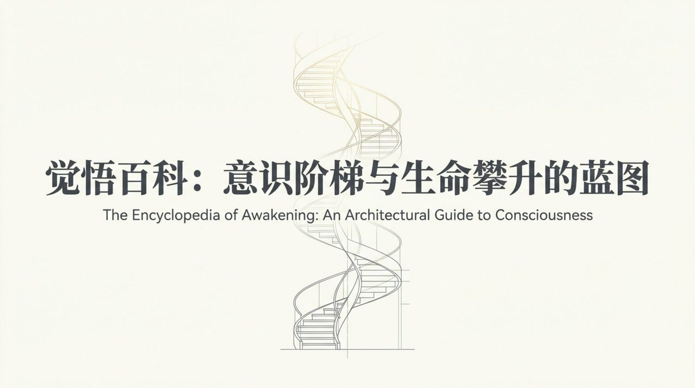
    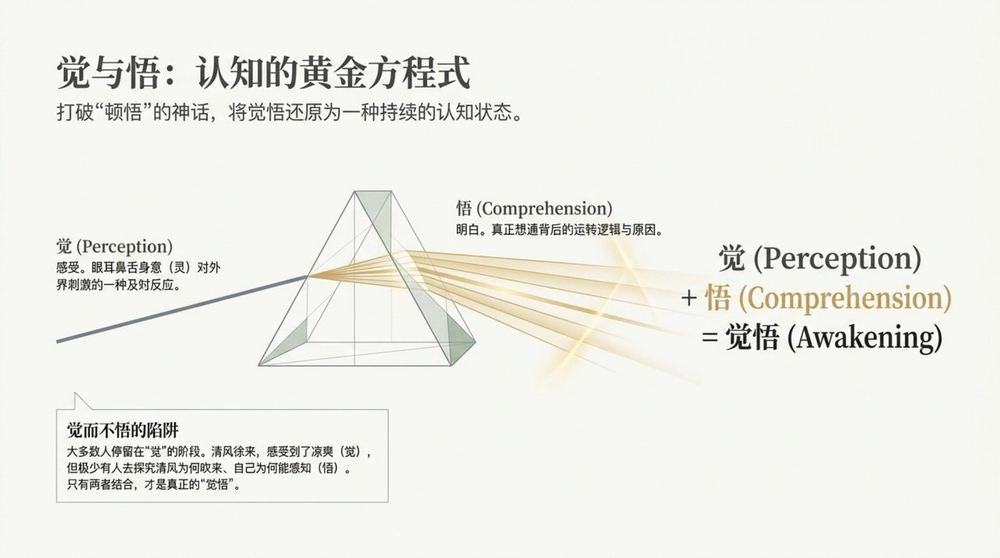
    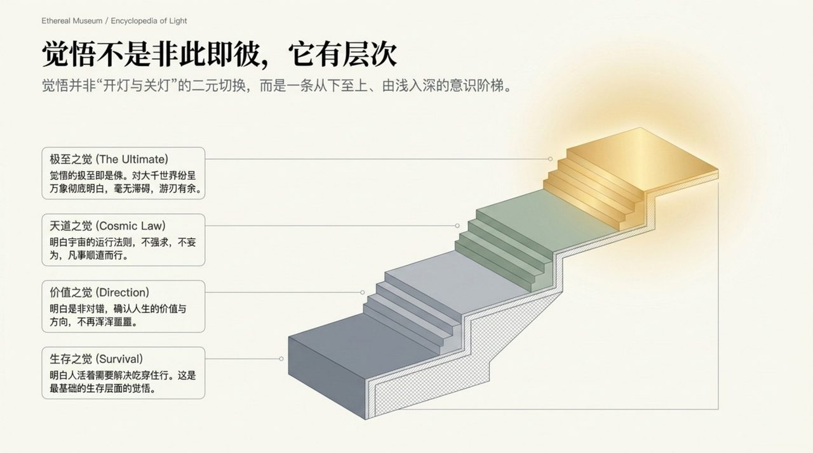
    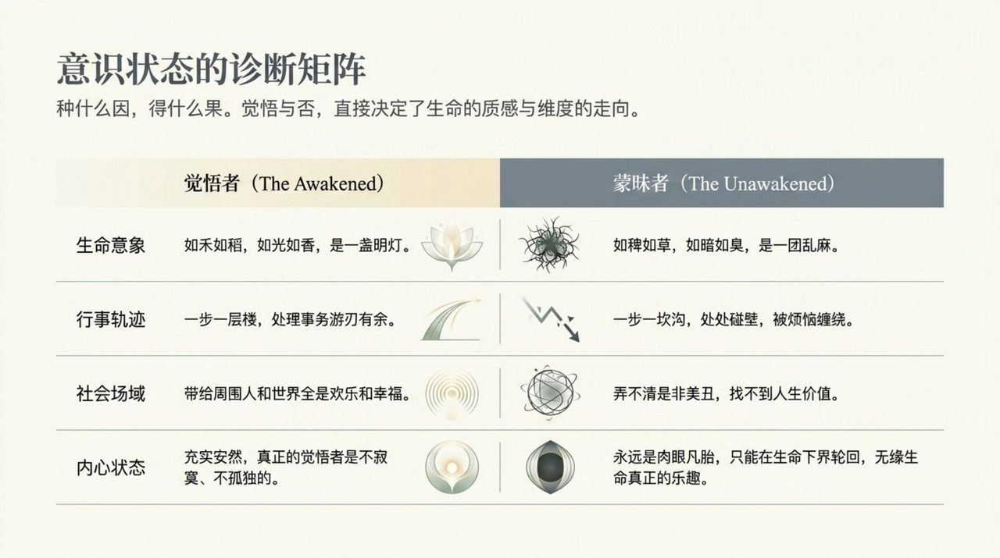
    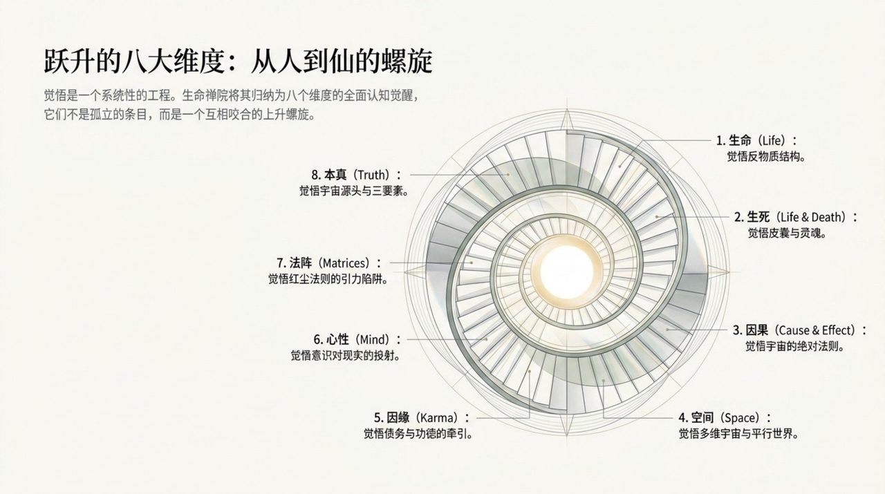
    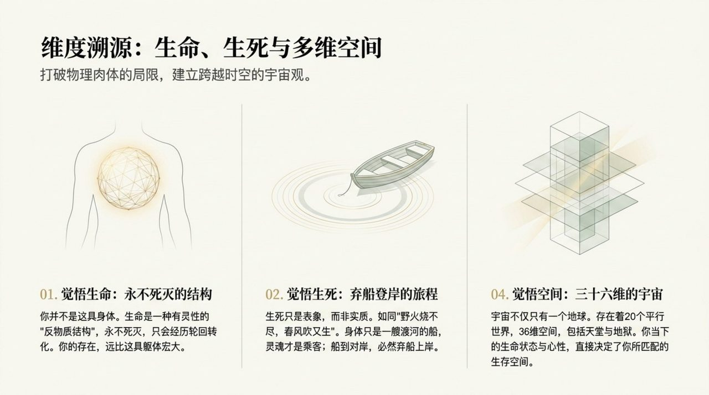
    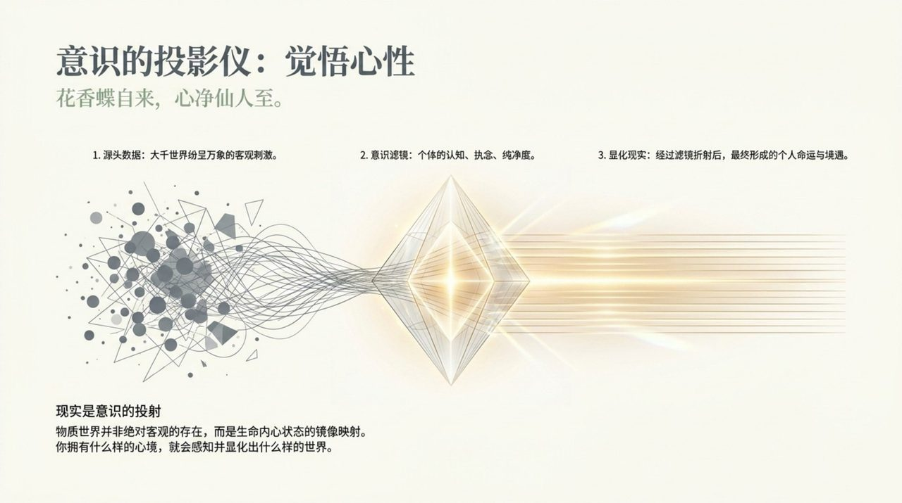
    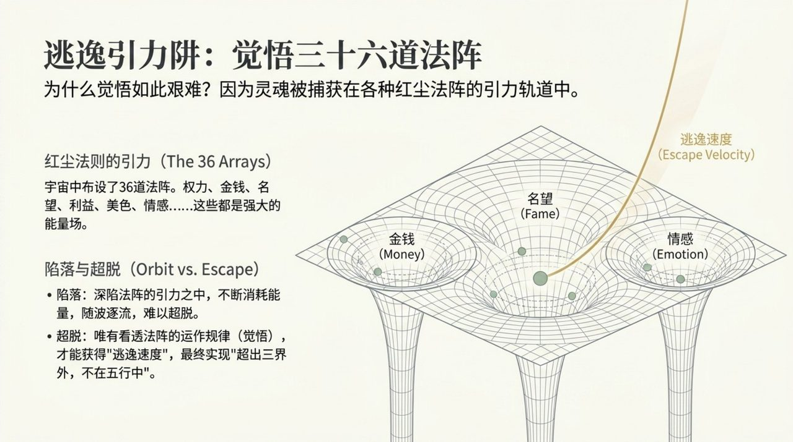
    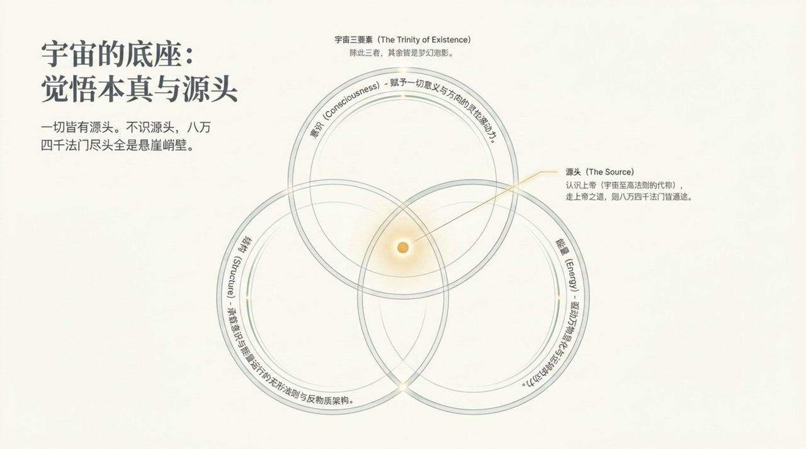
    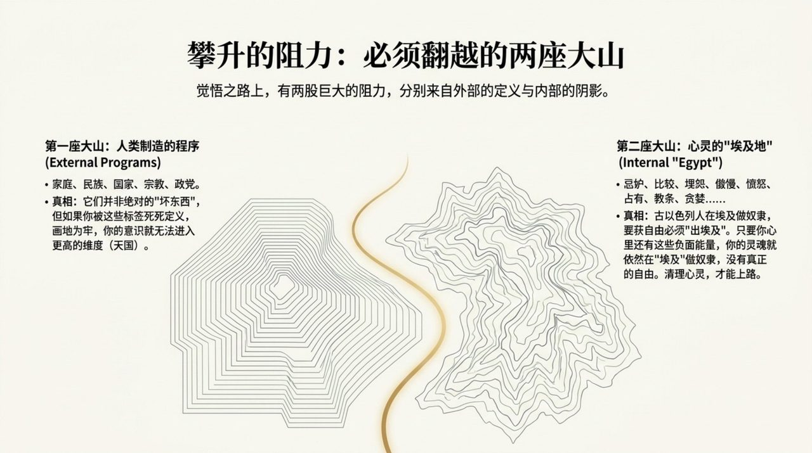
    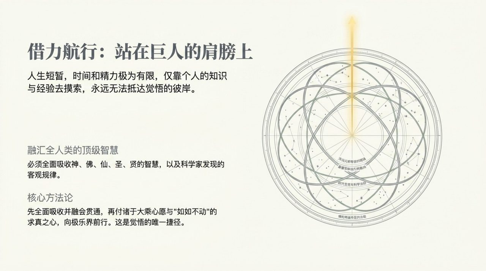
    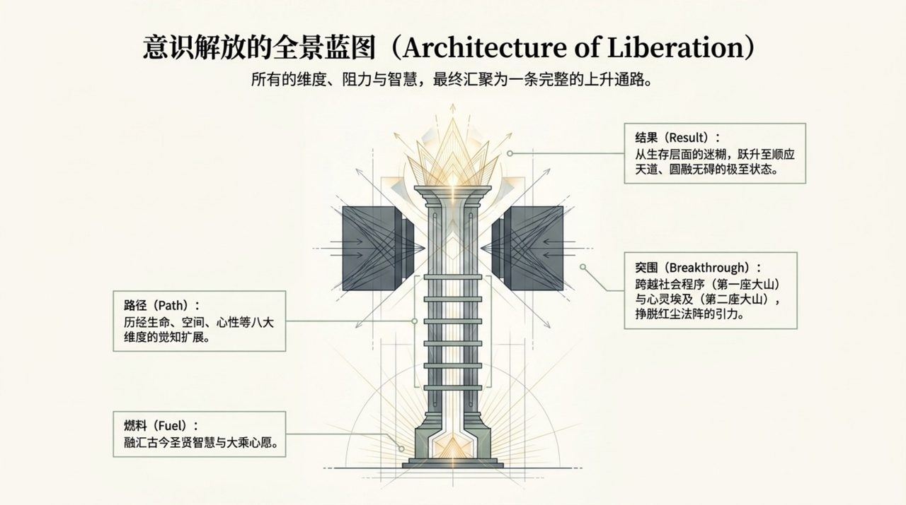
    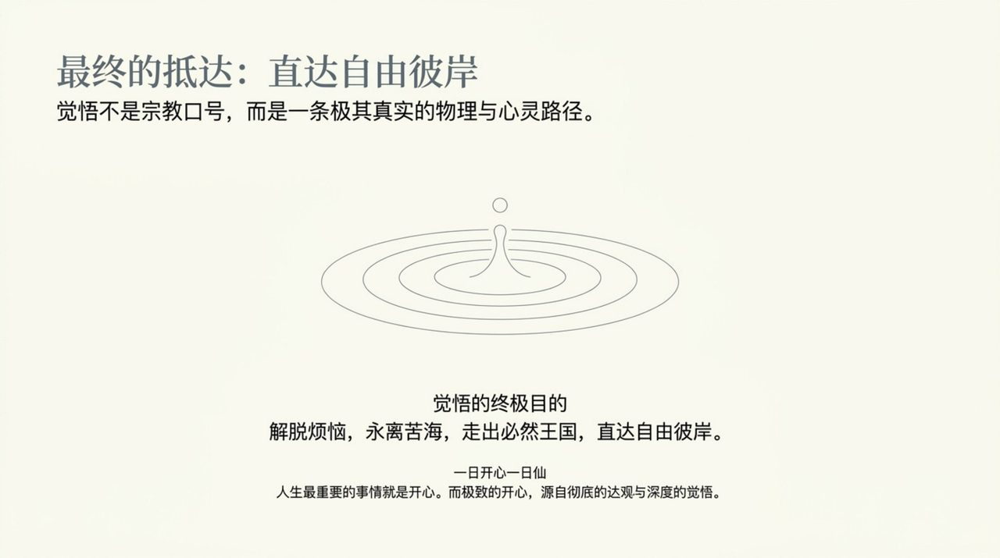

## 版本导航

| 版本 | 适合 |
|------|------|
| [友好版](friendly/) | 首次接触，内容丰满、可读性强 |
| [学术版](academic/) | 理论研究与引用 |
| [内部版](internal/) | 体系内核心学习，以母版为准 |

## 相关词条

[灵觉](/zh/spiritual-sensing/) · [明心见性](/zh/self-nature/) · [成仙](/zh/becoming-celestial/) · [成佛](/zh/becoming-buddha/) · [八无境界](/zh/eight-no-realms/) · [提升振动频率](/zh/raise-vibration-frequency/) · [灵魂](/zh/soul/) · [因果·报应·轮回](/zh/karma-retribution-reincarnation/) · [浑沌元初](/zh/hundun-baby/) · [第二家园](/zh/second-home/)
