# 黑洞

> "黑洞"是上帝造出的"神"，它们有意识，一个个"黑洞"就像一个个维护交通秩序的警察，庞大的宇宙，就由这些"黑洞警察"维护着、调整着。
>
> ——雪峰文集·警世篇·黑洞的奥秘

在生命禅院体系中，黑洞不仅是物理天体，更是有意识的宇宙守护者。它吃引力、排斥力，维系天体间的动态平衡；其内部并非黑暗，而是"光明灿烂的世界"。生命禅院进一步将黑洞分为阴极黑洞体（宇宙能量最大、关押违天条神魔的宇宙监狱，属高层生命空间）和阳极黑洞体（母体子宫，生命转世的通道，属中性世界）。

| 版本 | 适合 | 核心角度 |
|------|------|----------|
| [友好版](friendly.md) | 初次了解 | 生活类比与宇宙秩序 |
| [学术版](academic.md) | 研究者 | 系统分析与概念辨析 |
| [内部版](internal.md) | 深度研修 | 原典引文全集 |

---

## 视频版

<iframe style="width:100%;aspect-ratio:4/3;border:0" src="https://www.youtube-nocookie.com/embed/R33Y9ACBhY4" title="黑洞（生命禅院百科·视频版）" allowfullscreen></iframe>

??? info "📖 图文幻灯（15 张，点击展开）"

    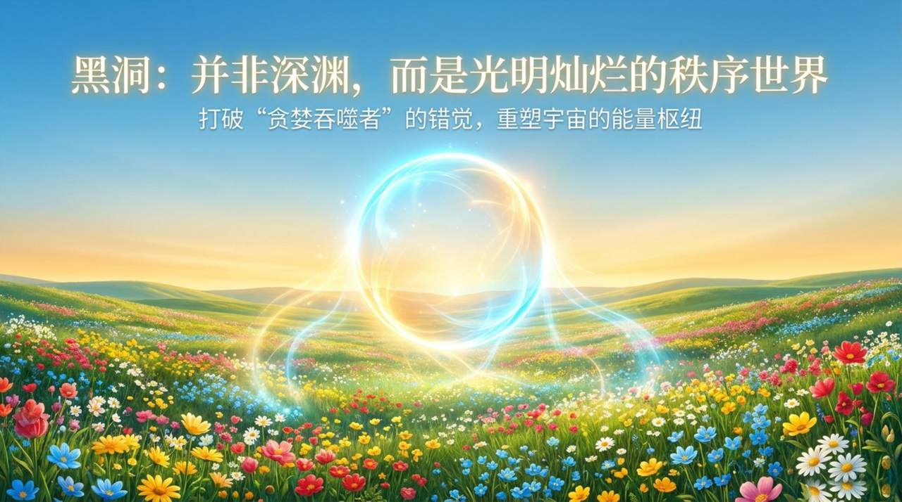
    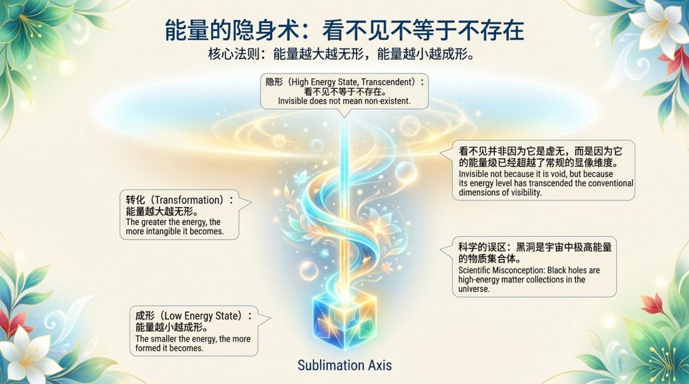
    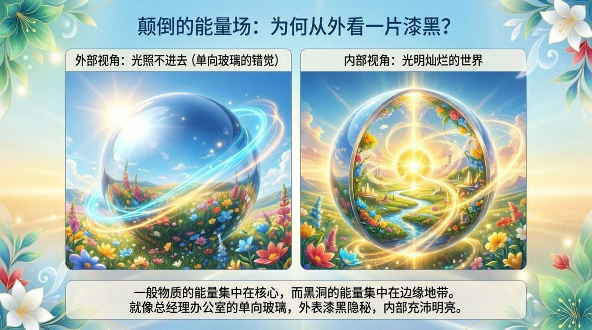
    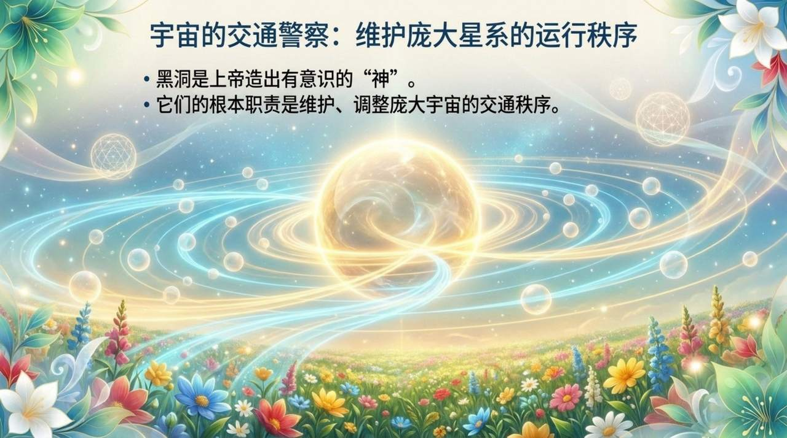
    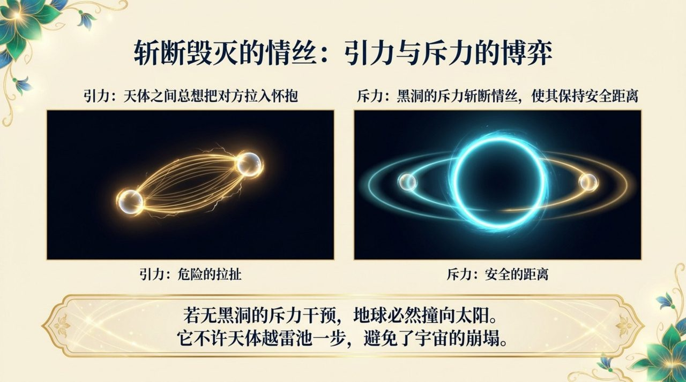
    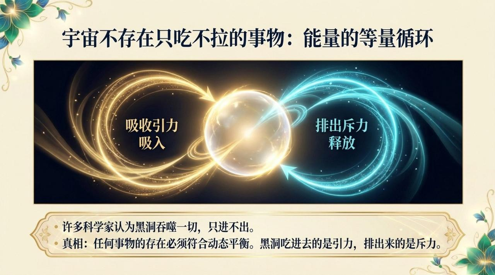
    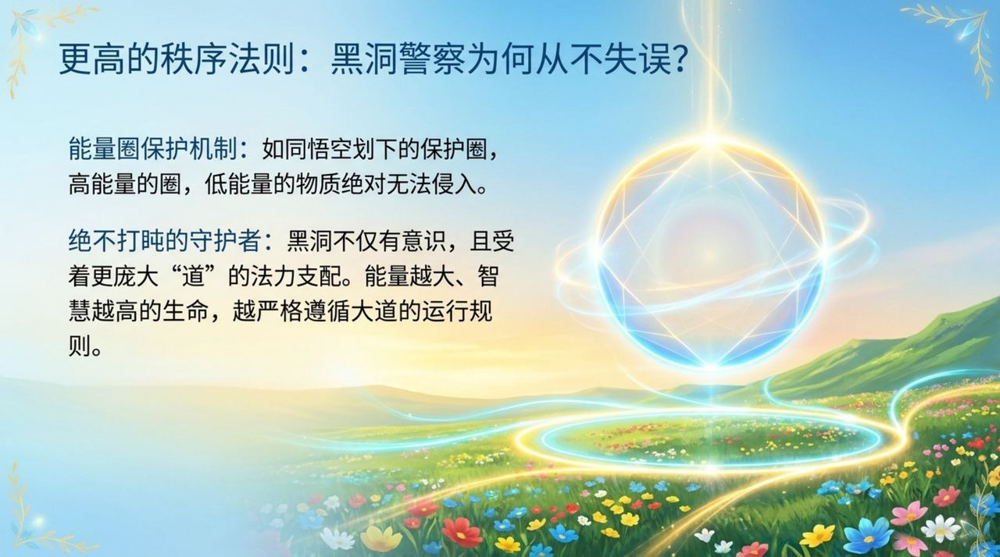
    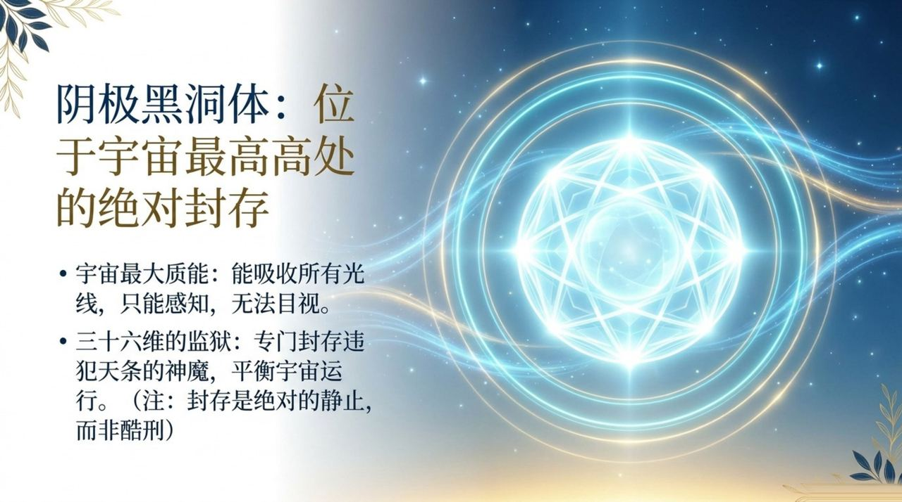
    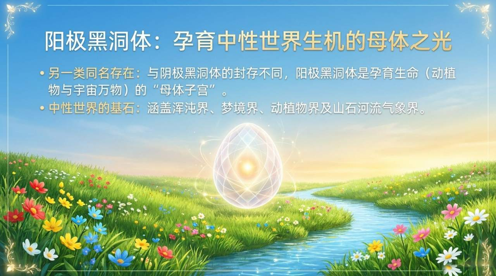
    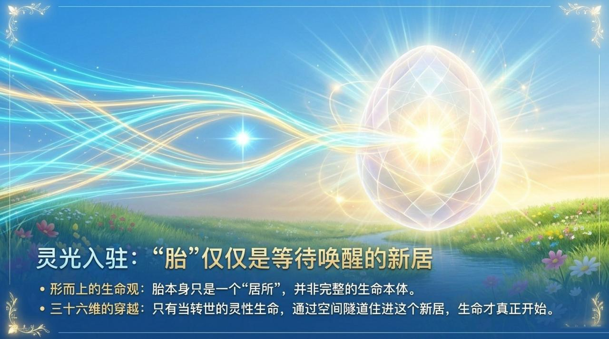
    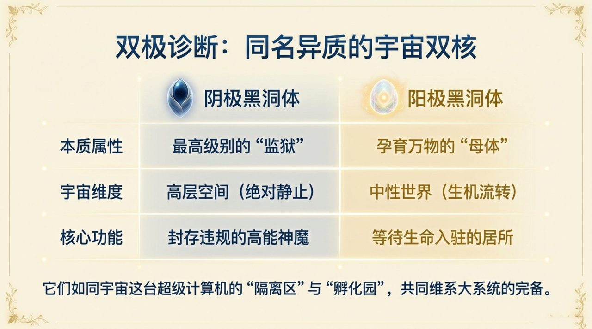
    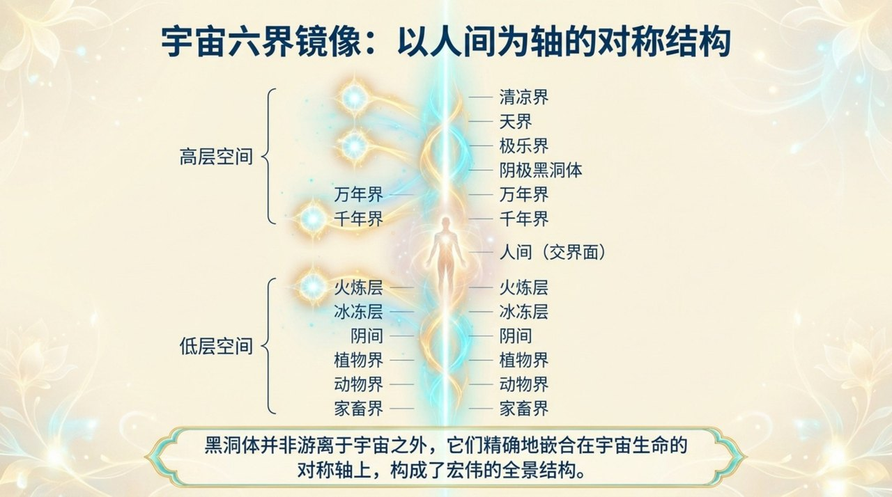
    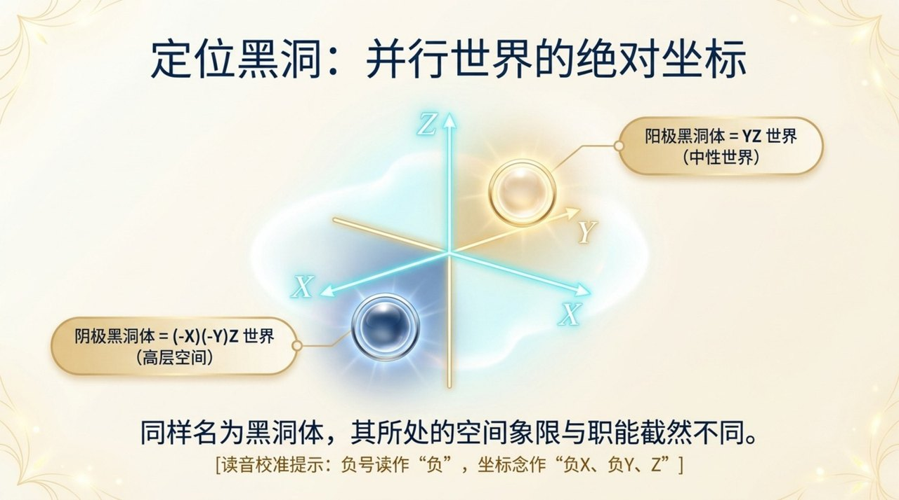
    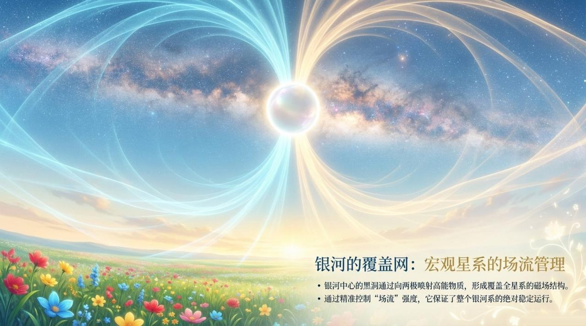
    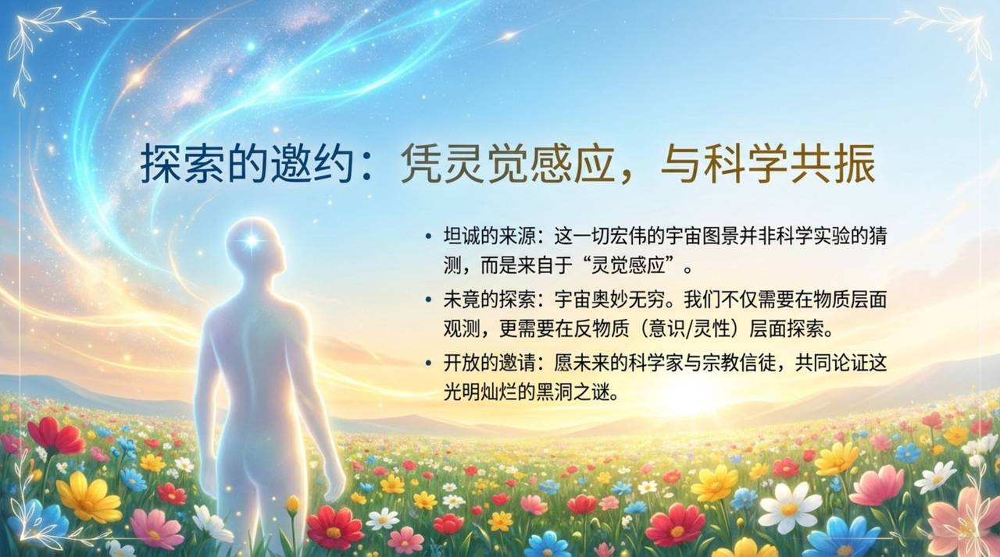

## 相关词条

[三十六维空间](/zh/thirty-six-dimensional-space/) · [20个集合体世界](/zh/twenty-parallel-worlds/) · [反物质世界](/zh/antimatter-world/) · [时空隧道](/zh/spacetime-tunnel/) · [宇宙全景图](/zh/cosmic-panorama/) · [宇宙全息](/zh/cosmic-holography/) · [生命的轮回](/zh/life-reincarnation/) · [高层生命空间](/zh/high-life-spaces/)
