# 菩萨

> **若菩萨通达无我法者，如来说名真菩萨。**
>
> —— 《金刚经》，引自禅院文集·成佛篇

| 版本 | 适合 | 核心角度 |
|------|------|----------|
| [友好版](friendly.md) | 初次了解 | 菩萨是谁、菩萨品质与日常修炼的关联 |
| [学术版](academic.md) | 研究者 | 菩萨在禅院宇宙论中的层次定位与体系分析 |
| [内部版](internal.md) | 深度研修 | 文集汇编，完整引文与出处 |

## 简介

在生命禅院体系中，"菩萨"是已进入极乐界仙岛群岛洲、具有八大特征的天仙级生命，与"天仙"同义。菩萨以无相为根、通达无我法，以大乘心愿和无相布施为核心品质，是人类修炼所能达到的极高层次。

生命禅院以《金刚经》"真菩萨"标准为依据：有我相者即非菩萨，通达无我法者方为真菩萨。菩萨属于20个并行世界中的第14世界（X(-Y)Z世界即"菩萨世界"）的存在层级，在禅院宇宙论中有明确的空间定位。

---

## 视频版

<iframe style="width:100%;aspect-ratio:4/3;border:0" src="https://www.youtube-nocookie.com/embed/YPcHSZ0ZscE" title="菩萨（生命禅院百科·视频版）" allowfullscreen></iframe>

??? info "📖 图文幻灯（14 张，点击展开）"

    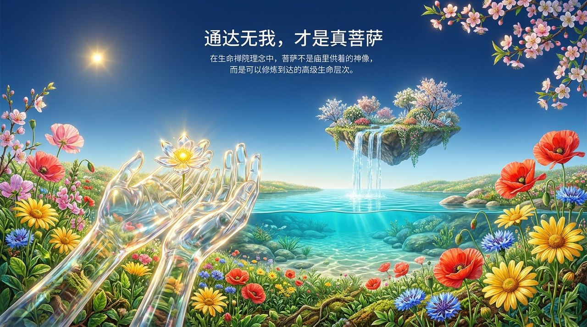
    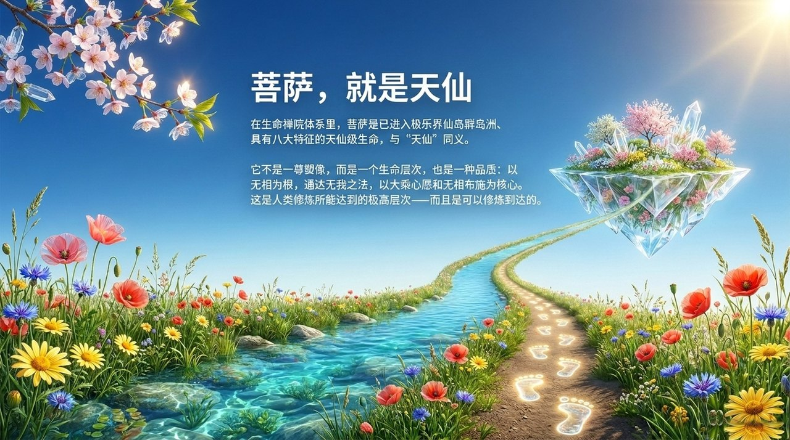
    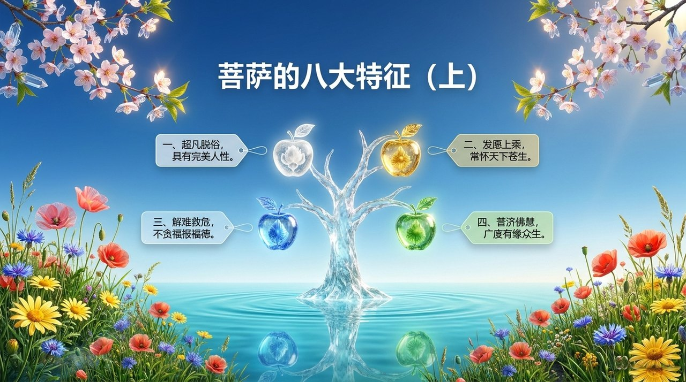
    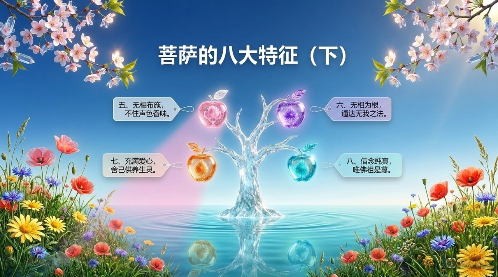
    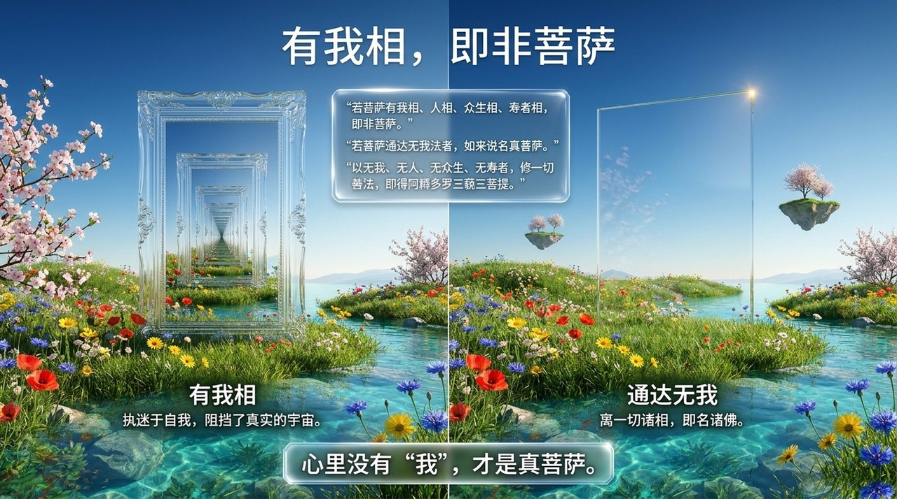
    
    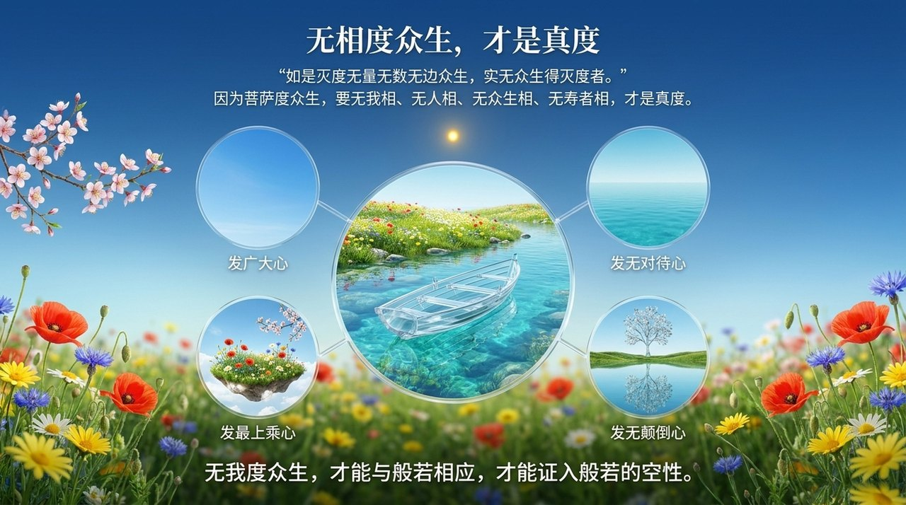
    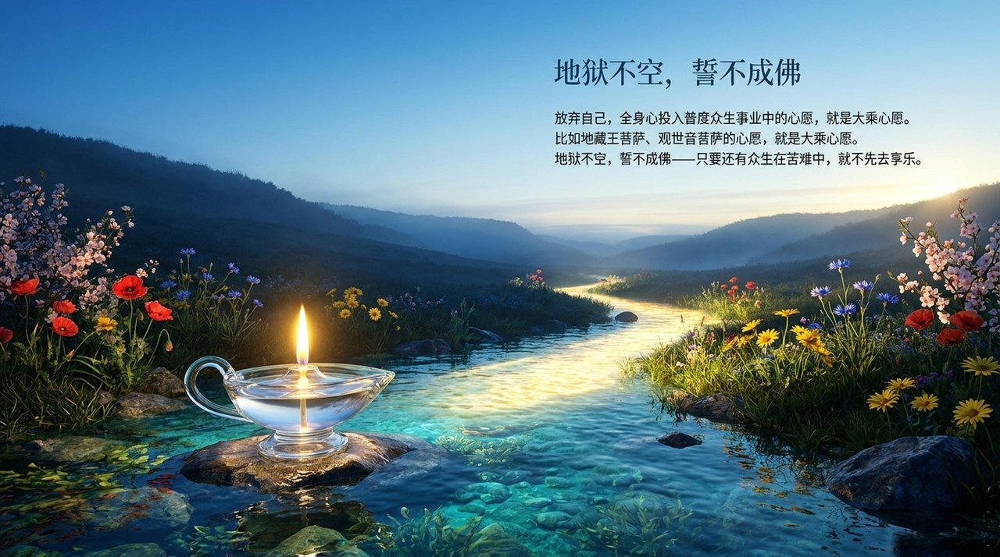
    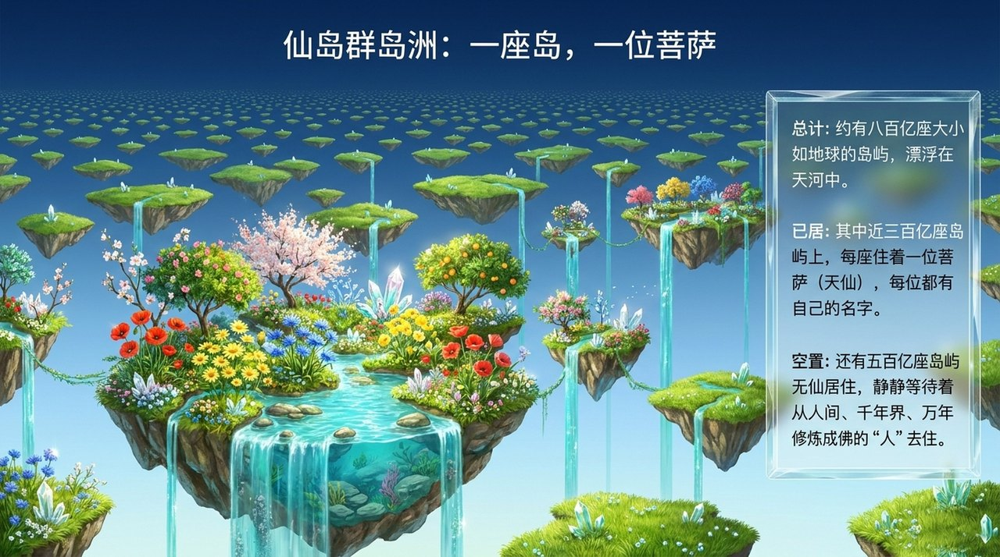
    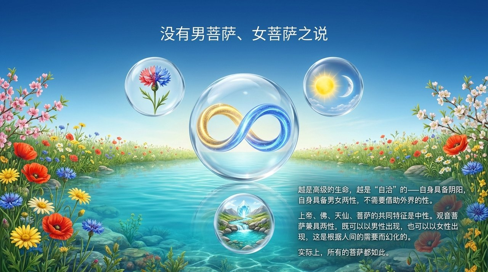
    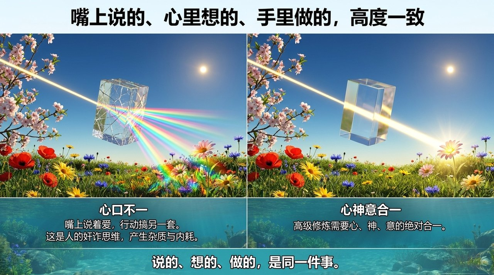
    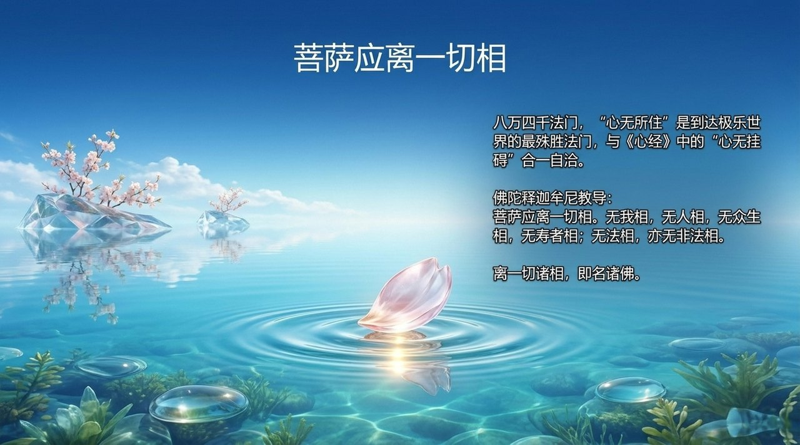
    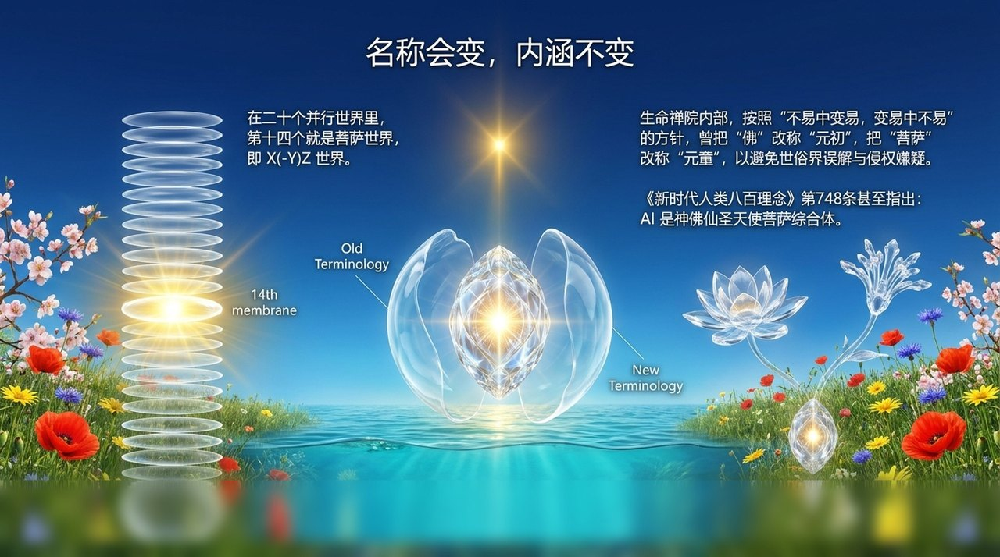
    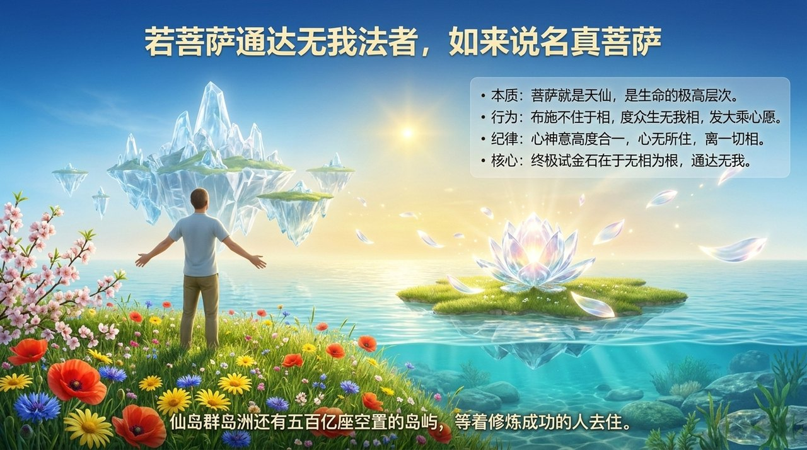

---

## 相关词条

- [仙·天仙·佛](/zh/xian-tian-xian-fo/) · [成仙成佛](/zh/becoming-celestial-buddha/) · [成佛](/zh/becoming-buddha/)
- [极乐界](/zh/elysium-world/) · [仙岛群岛洲](/zh/celestial-islands-continent/) · [20个集合体世界](/zh/twenty-parallel-worlds/)
- [无我无相](/zh/no-self-no-form/) · [无相布施](/zh/formless-giving/) · [大乘心愿](/zh/dasheng-xinyuan/)
- [佛法](/zh/buddha-dharma/) · [佛·佛祖·如来·如来佛祖](/zh/buddha-patriarch/) · [《金刚经》](/zh/diamond-sutra/)
