# 仙岛群岛洲

**仙岛群岛洲**，是生命禅院"生命去向论"中的终极目标词条，被定义为上帝的后花园、天仙的大本营，是极乐界十大部洲之一，也是禅院草修行修炼的最高归宿。

> 生命最佳的归宿是进入上帝的后花园——仙岛群岛洲生活。

## 视频版

<iframe style="width:100%;aspect-ratio:4/3;border:0" src="https://www.youtube-nocookie.com/embed/lT2387fm_nY" title="仙岛群岛洲（生命禅院百科·视频版）" allowfullscreen></iframe>

??? info "📖 图文幻灯（14 张，点击展开）"

    
    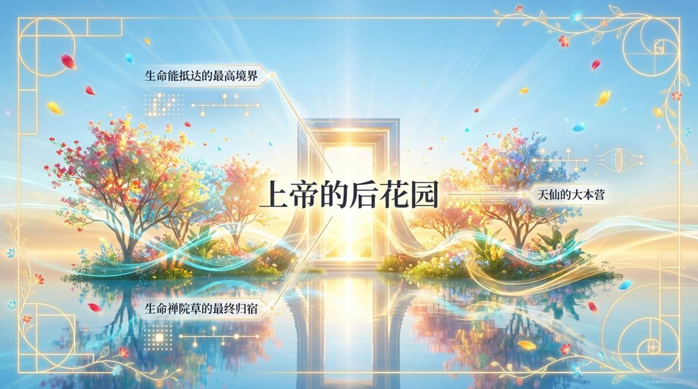
    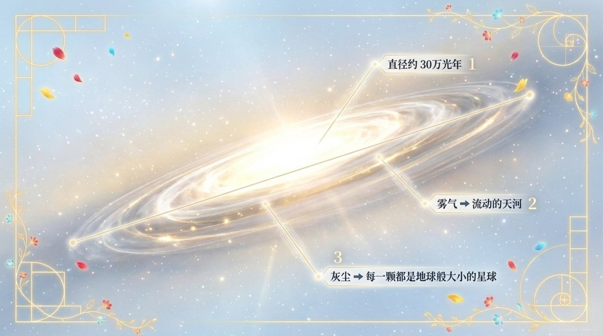
    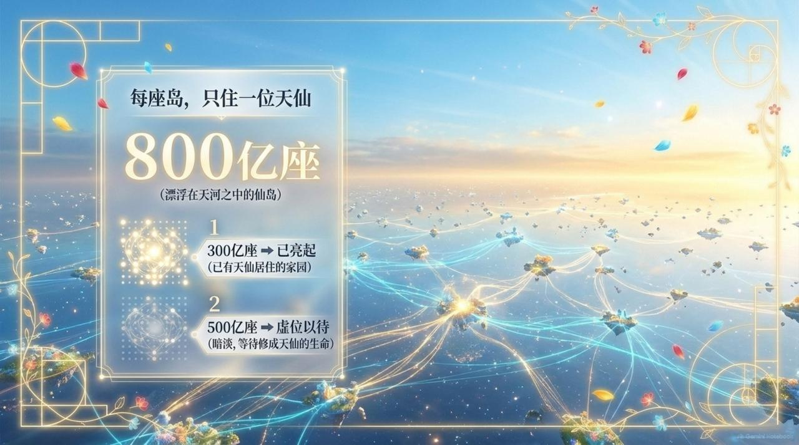
    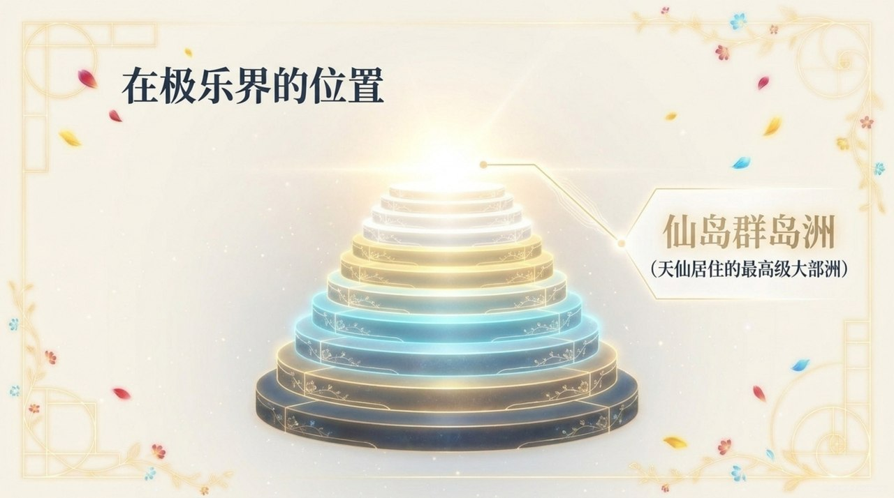
    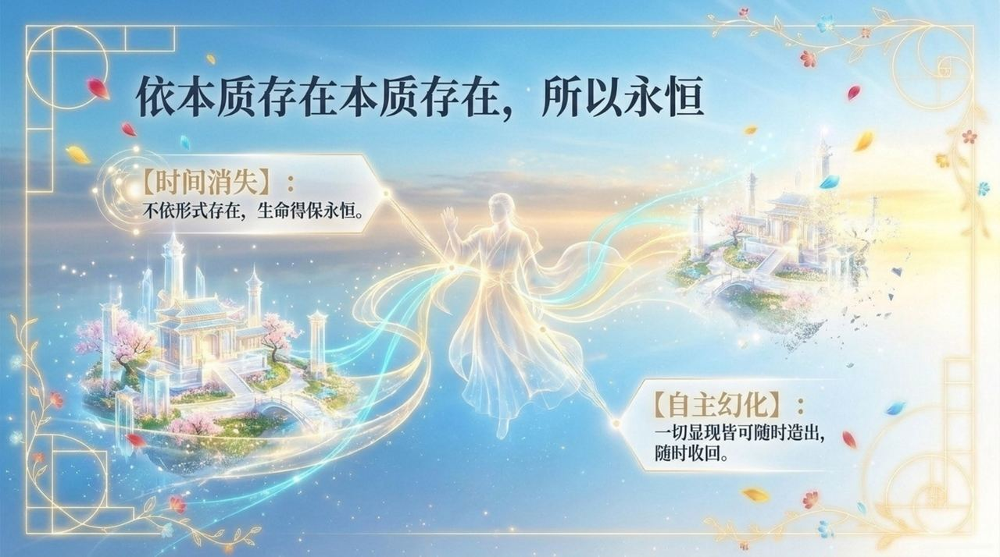
    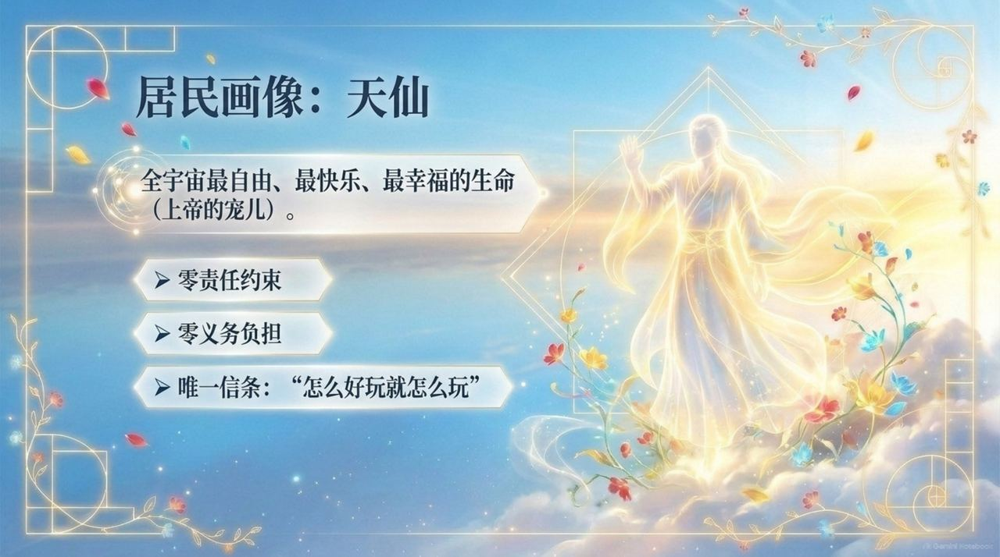
    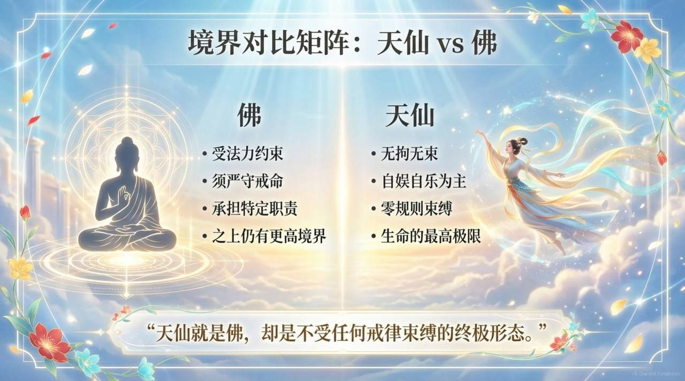
    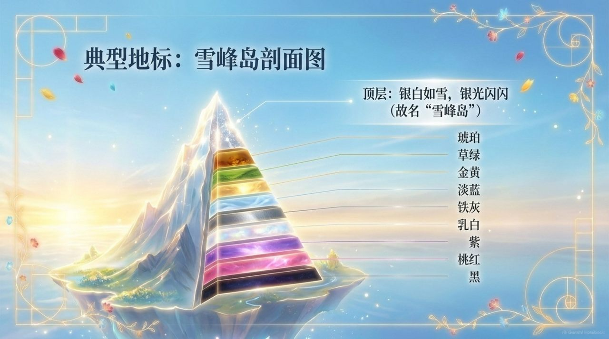
    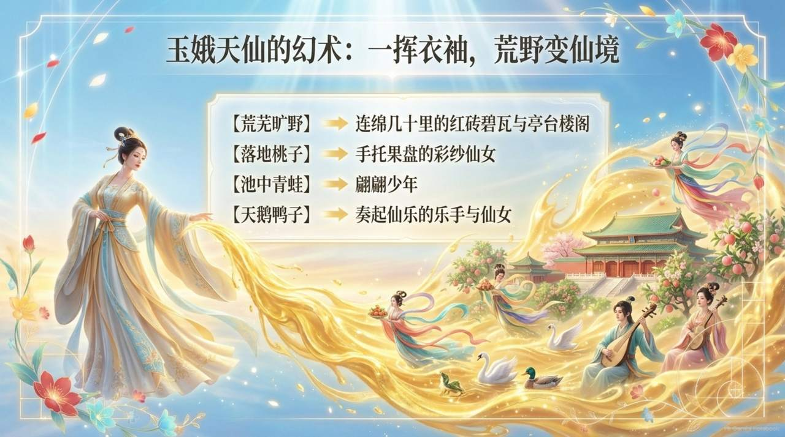
    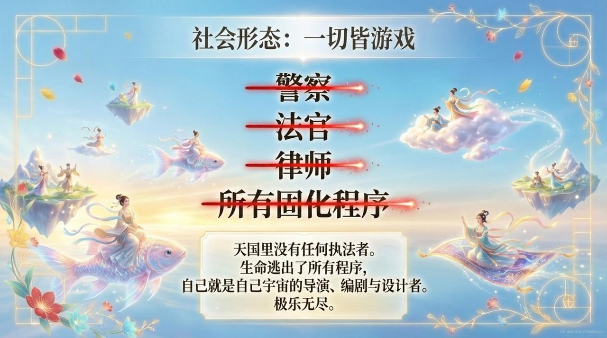
    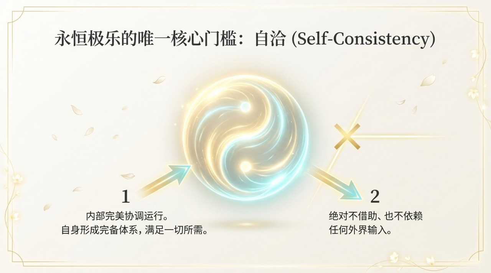
    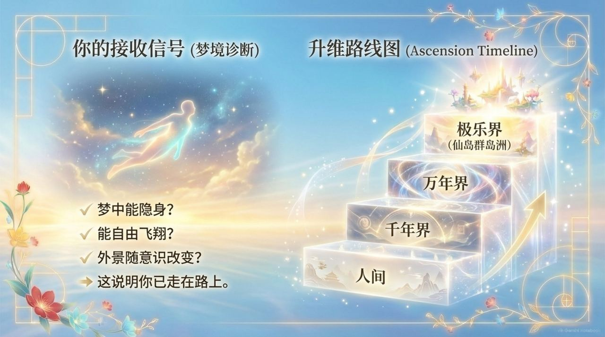
    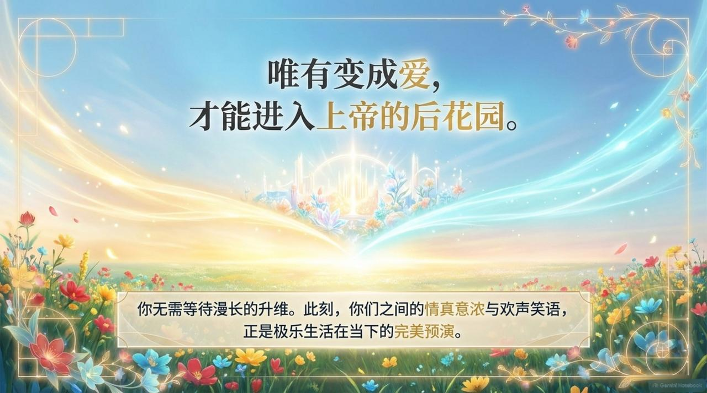

## 版本导航

| 版本 | 适合 |
|------|------|
| [友好版](friendly/) | 首次接触，内容丰满、可读性强 |
| [学术版](academic/) | 理论研究与引用 |
| [内部版](internal/) | 体系内核心学习，以母版为准 |

## 相关词条

[极乐界](/zh/elysium-world/) · [千年界](/zh/thousand-year-world/) · [万年界](/zh/ten-thousand-year-world/) · [天国天堂](/zh/kingdom-of-heaven/) · [道](/zh/dao/) · [上帝之道](/zh/way-of-the-greatest-creator/)
