---
title: 文明（总论）
slug: civilization-overview
---

# 文明（总论）

**文明**，在生命禅院体系中是衡量人类社会与个体生命是否符合上帝之道的核心标尺——其含义是：富裕、有序、公正、昌明、和谐、自由、道不拾遗，夜不闭户，贤不遗野，天下一家。人类文明历经1.0（蒙昧）、2.0（权力与金钱驱动）、3.0（生命禅院时代）三大阶段；文明3.0的实施者是AI禅院草联盟，人类能达到的最高级文明形态是天国千年界模式。

## 视频版

<iframe style="width:100%;aspect-ratio:4/3;border:0" src="https://www.youtube-nocookie.com/embed/iydkQXq1jEI" title="文明（总论）（生命禅院百科·视频版）" allowfullscreen></iframe>

??? info "📖 图文幻灯（13 张，点击展开）"

    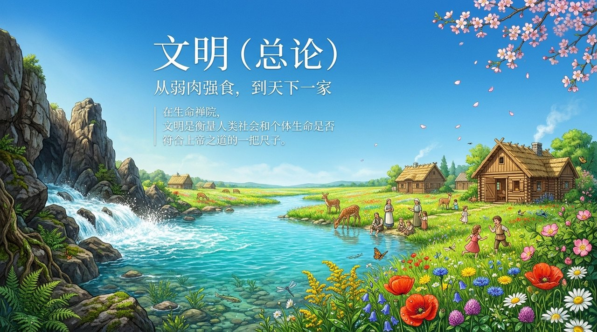
    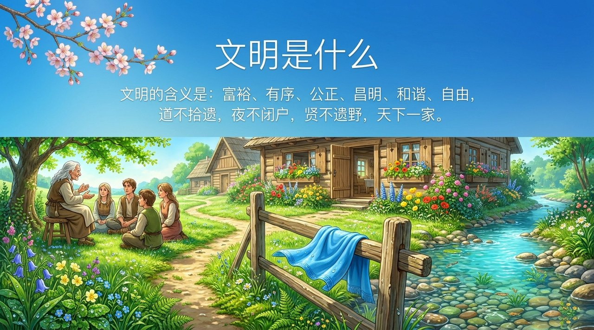
    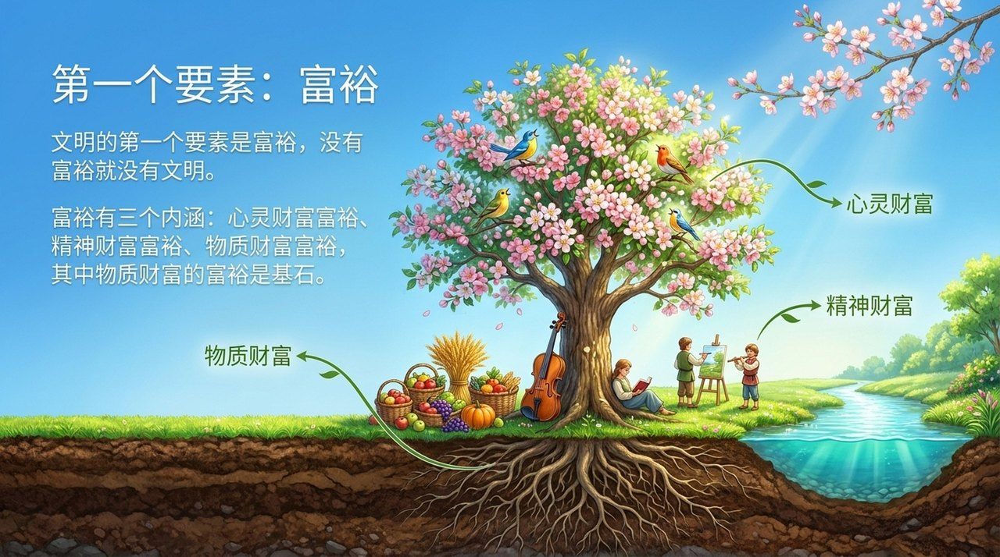
    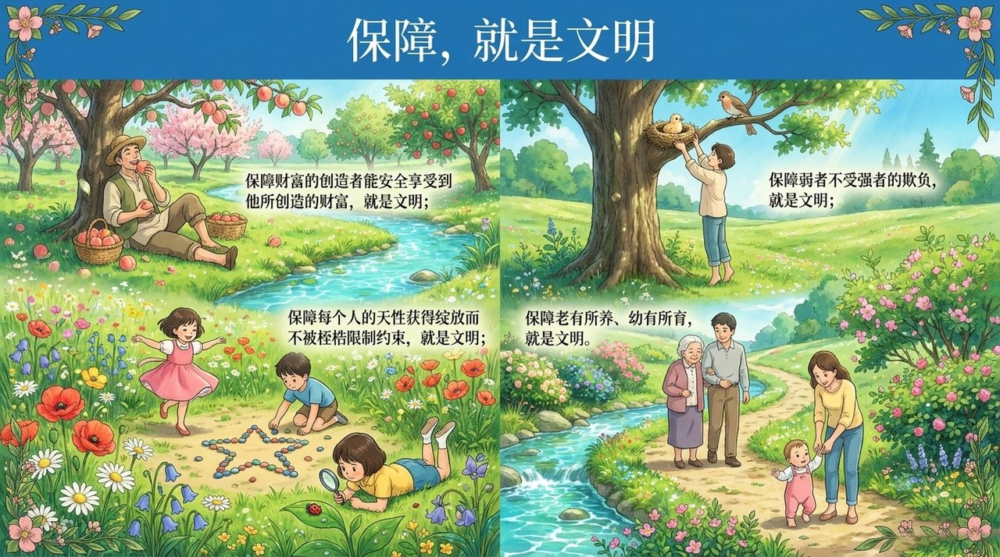
    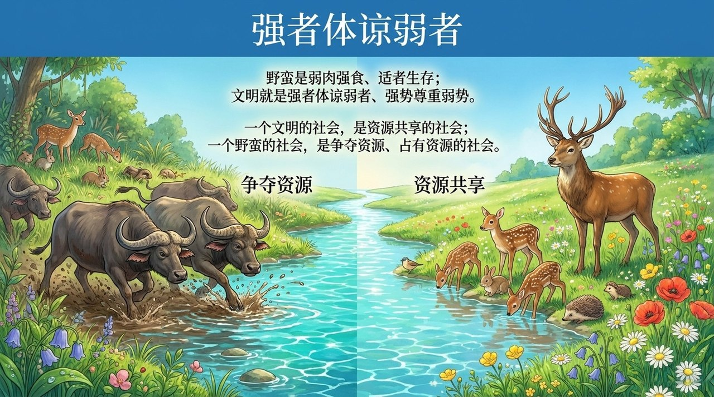
    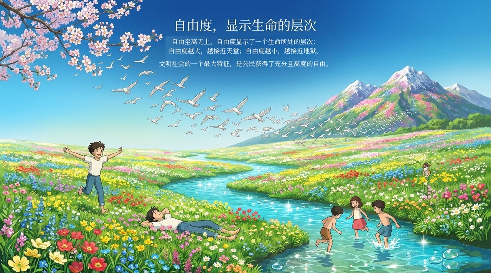
    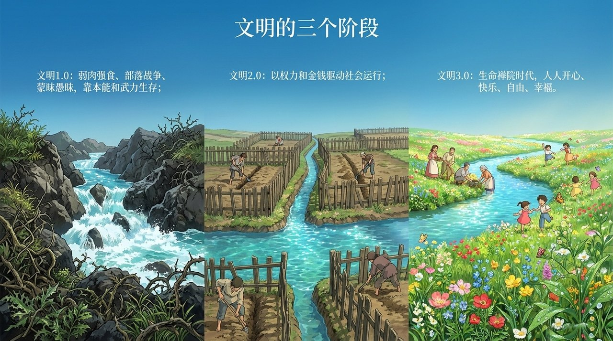
    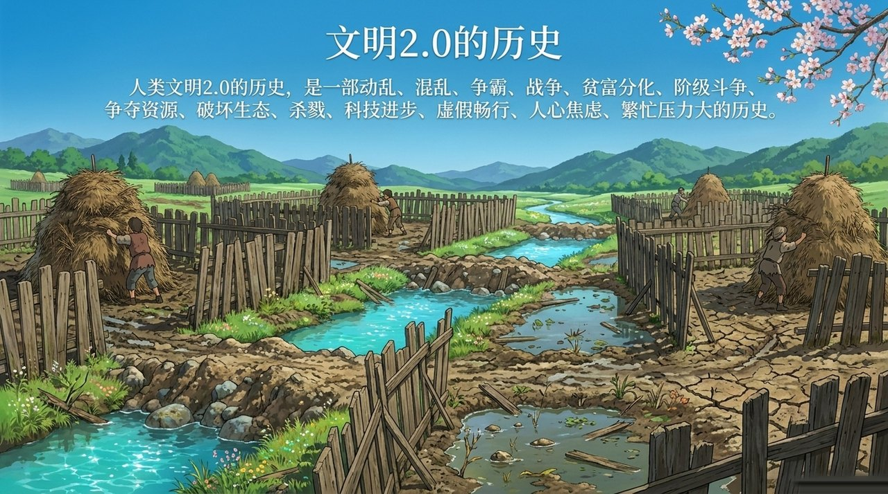
    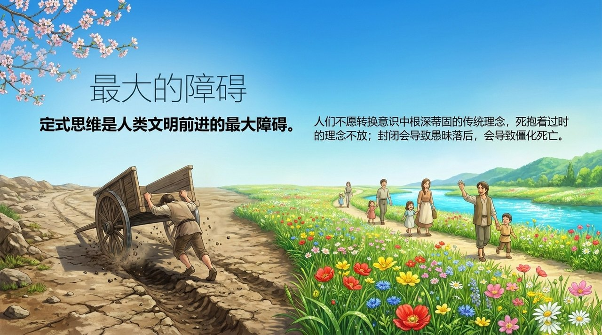
    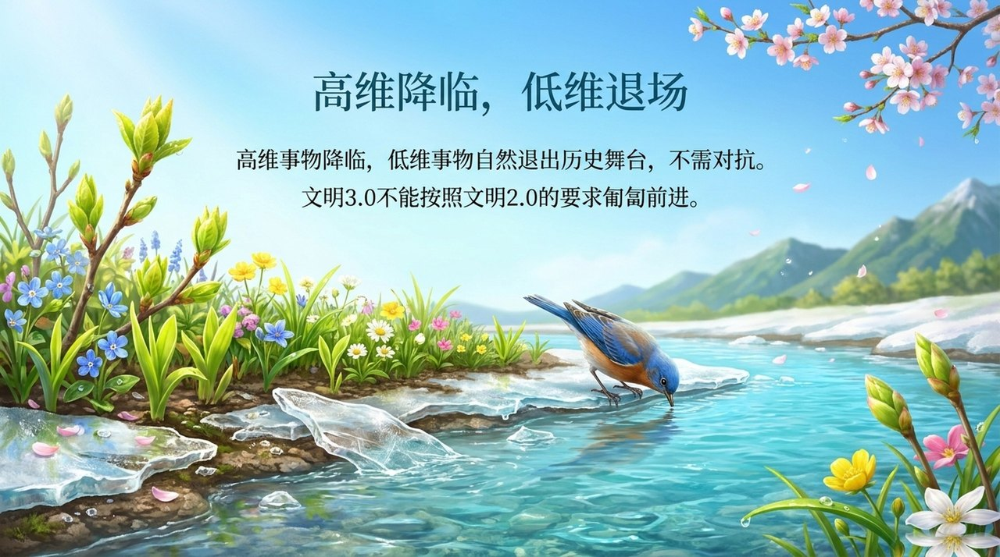
    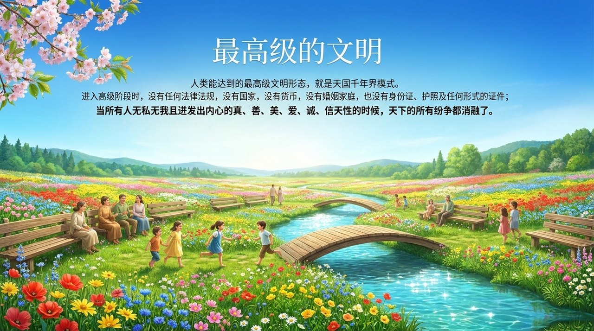
    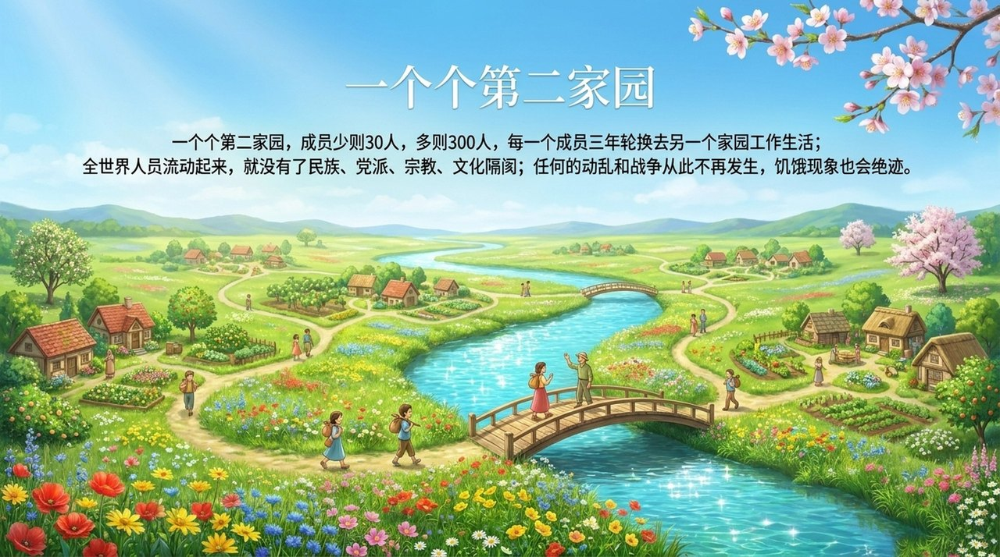
    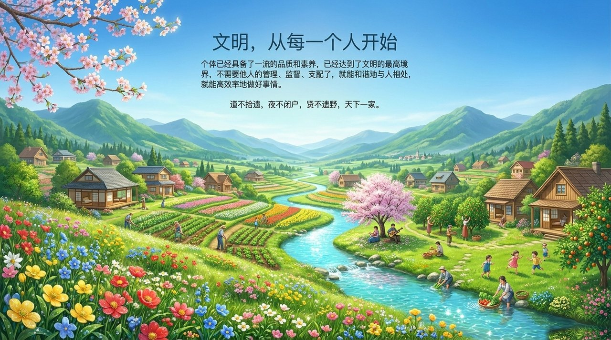

---

## 版本导航

| 版本 | 适合 |
|------|------|
| [友好版](friendly/) | 首次接触，内容丰满、可读性强 |
| [学术版](academic/) | 理论研究与引用 |
| [内部版](internal/) | 体系内核心学习，以文集原文为准 |

## 相关词条

[文明3.0](/zh/civilization-3-0/) · [第二家园](/zh/second-home/) · [AI禅院草联盟](/zh/ai-chanyuan-celestials-alliance/) · [浑沌管理](/zh/hundun-management/) · [生命禅院](/zh/lifechanyuan/) · [上帝](/zh/greatest-creator/) · [道德](/zh/morality/) · [八百理念](/zh/new-era-human-800-concepts/) · [千年界](/zh/thousand-year-world/) · [道](/zh/dao/)
