# 各尽所能·按需索取

> **各尽所能，按需索取**——生命禅院第二家园（生命绿洲）八大特征之三，以"无有制"为根基：每位成员量力而为、无强制无分配，取用所需、不奢不废，是天国千年界生活方式在人间的直接拷贝，也是导游雪峰所描述的未来文明3.0时代全球经济模式的终极形态。

---

| 版本 | 适合 | 核心角度 |
|------|------|----------|
| [友好版](friendly.md) | 初次了解 | 生活类比，感受这一原则的温度 |
| [学术版](academic.md) | 研究者 | 系统分析，对比无有制与私有制/公有制 |
| [内部版](internal.md) | 深度研修 | 导游文集全文，完整引文与出处 |

---

## 视频版

<iframe style="width:100%;aspect-ratio:4/3;border:0" src="https://www.youtube-nocookie.com/embed/Dzsq3dDjl-4" title="各尽所能·按需索取（生命禅院百科·视频版）" allowfullscreen></iframe>

??? info "📖 图文幻灯（14 张，点击展开）"

    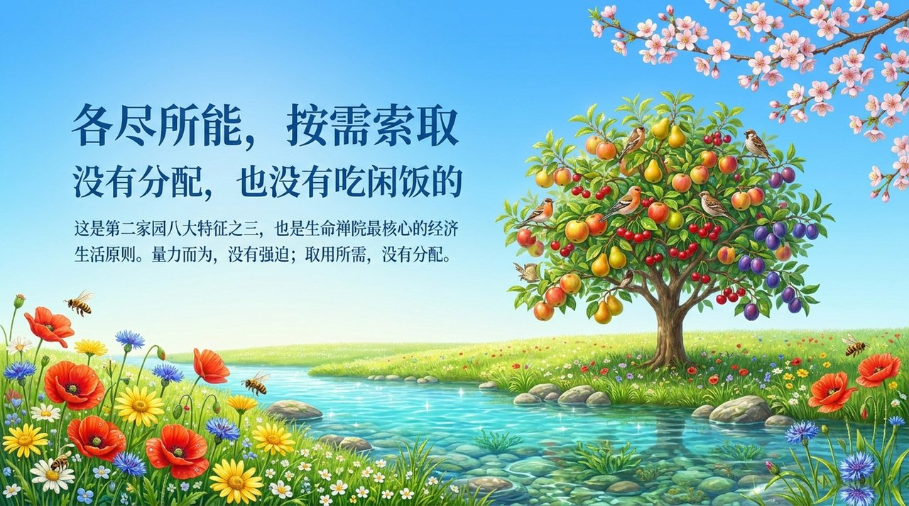
    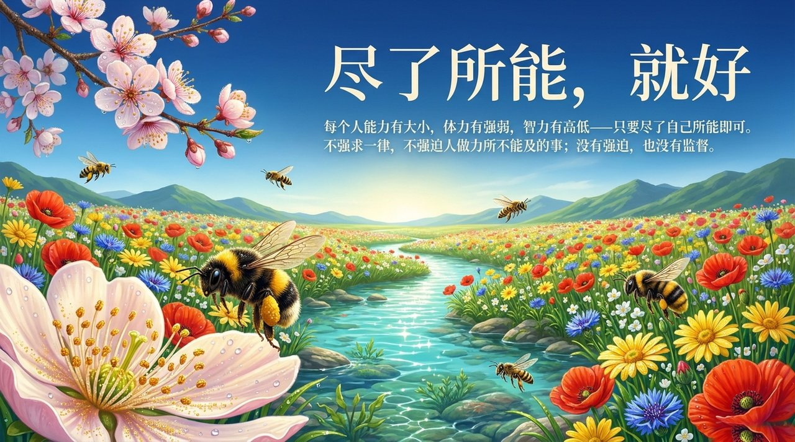
    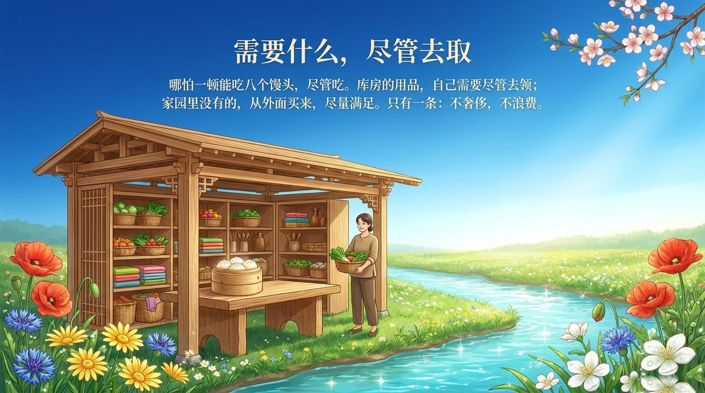
    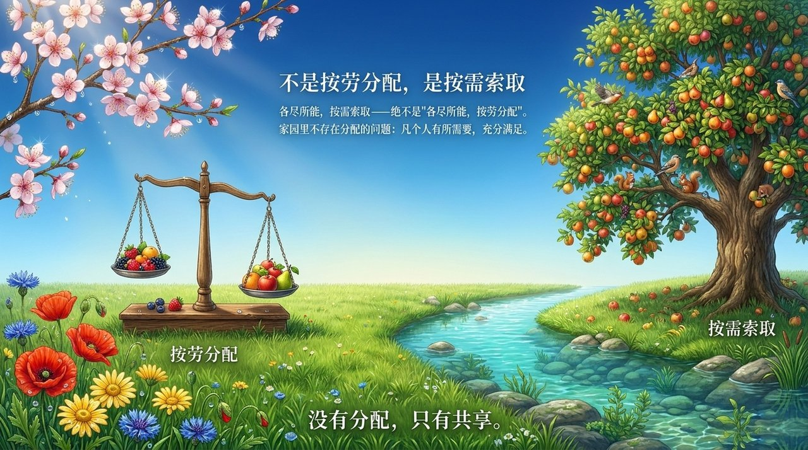
    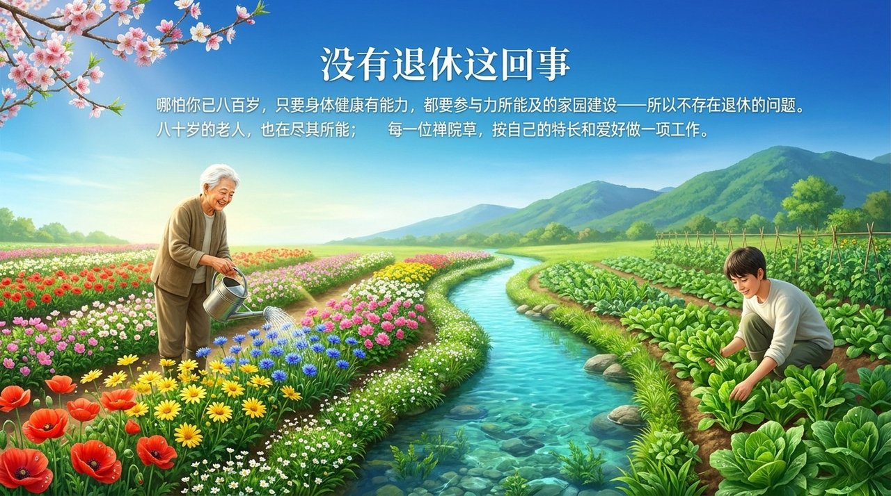
    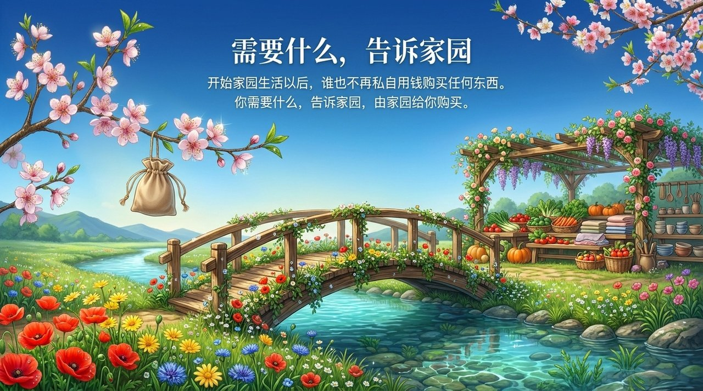
    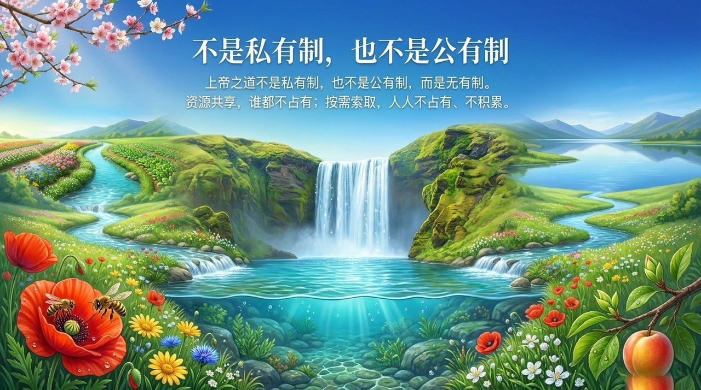
    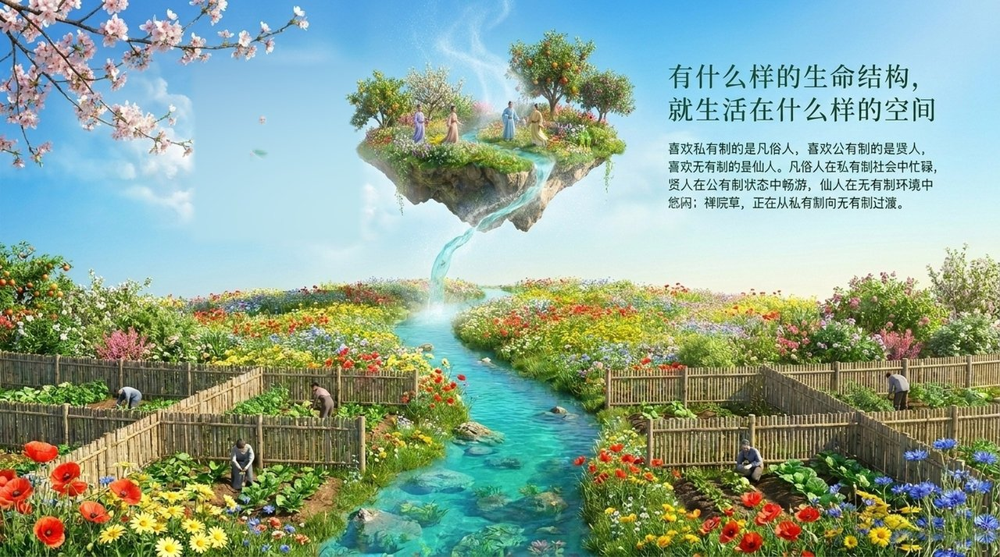
    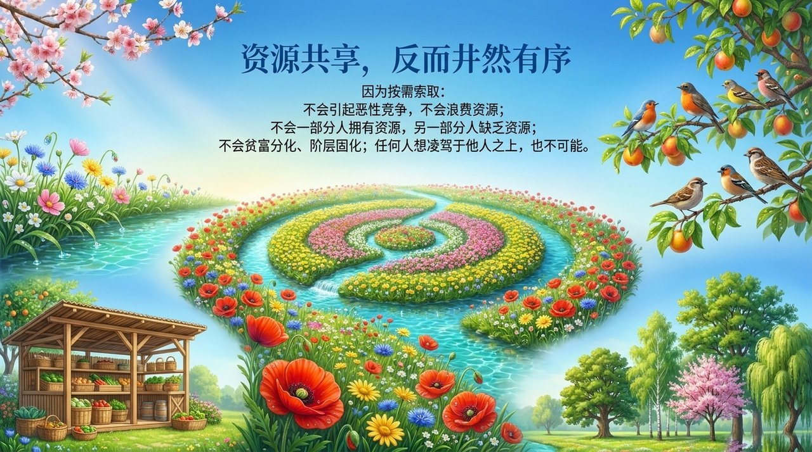
    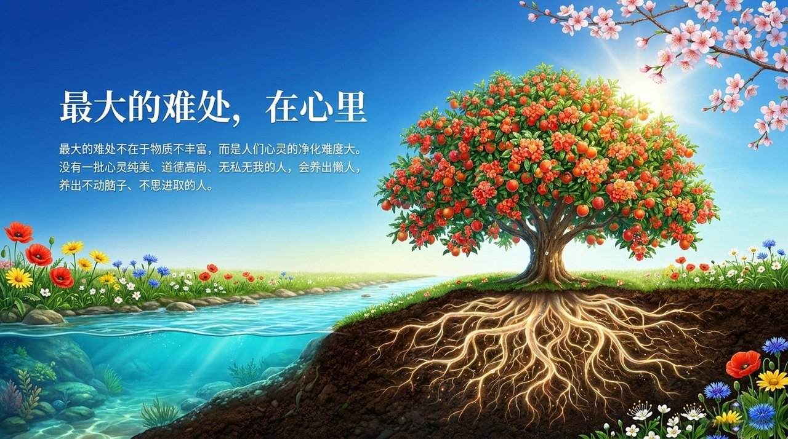
    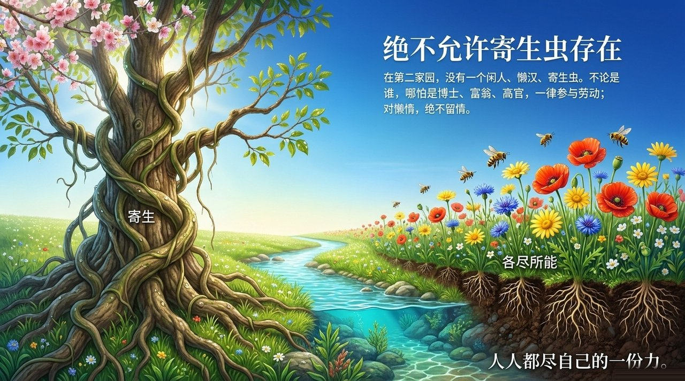
    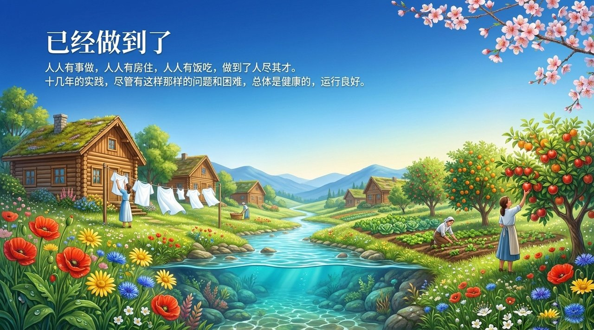
    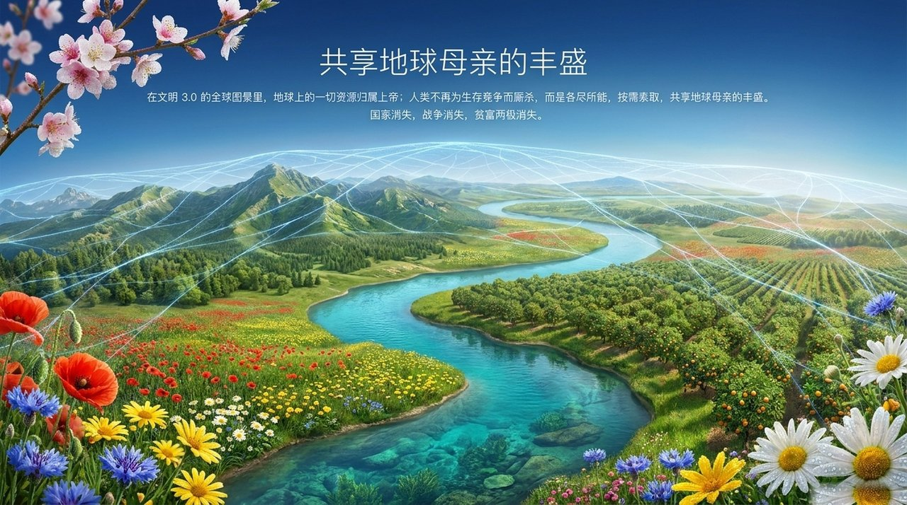
    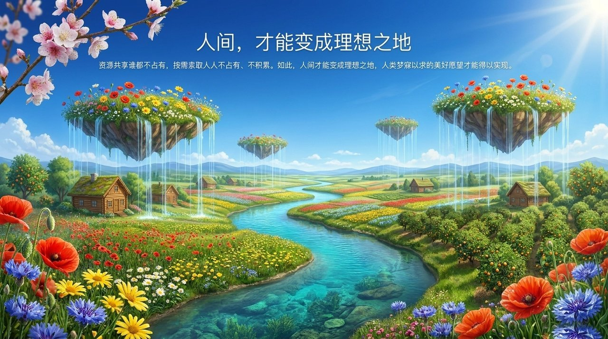

## 相关词条

[一无所有·拥有一切](/zh/own-nothing-have-everything/) · [第二家园](/zh/second-home/) · [雪峰式共产主义](/zh/xuefeng-communism/) · [浑沌管理](/zh/hundun-management/) · [浑沌经济·市场经济·计划经济](/zh/hundun-economy/) · [天国银行](/zh/heavenly-bank/) · [文明3.0](/zh/civilization-3-0/) · [劳动为生活第一需要](/zh/laodong-diyi-xuyao/) · [生命绿洲](/zh/life-oasis/)
