# 宇宙全息

> 浑沌现象的涵义是宇宙全息，其大无外，其小无内，每一个现象，每一个事物都与宇宙全息感应，没有独立于事物之外的事物，没有独立于现象之外的现象。
>
> ——《新时代人类八百理念》第四版·第413条

宇宙全息是生命禅院体系对宇宙整体性的核心表述：宇宙是一个浑沌整体，其大无外、其小无内，任何现象与事物皆相互感应、彼此关联；一念贯通宇宙，微末映照全体，天人合一，万物皆通。这一原理既是理解因果、奖惩机制的钥匙，也是修炼实践与人际相处的深层依据。

## 视频版

<iframe style="width:100%;aspect-ratio:4/3;border:0" src="https://www.youtube-nocookie.com/embed/3s9COdTwPyc" title="宇宙全息（生命禅院百科·视频版）" allowfullscreen></iframe>

??? info "📖 图文幻灯（14 张，点击展开）"

    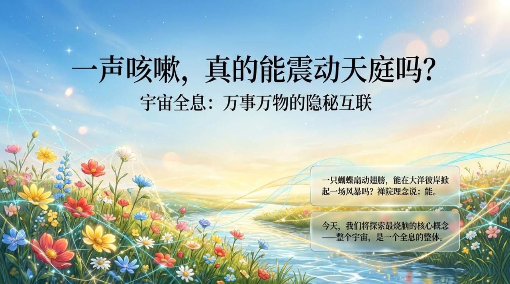
    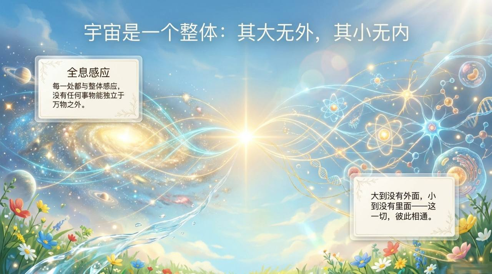
    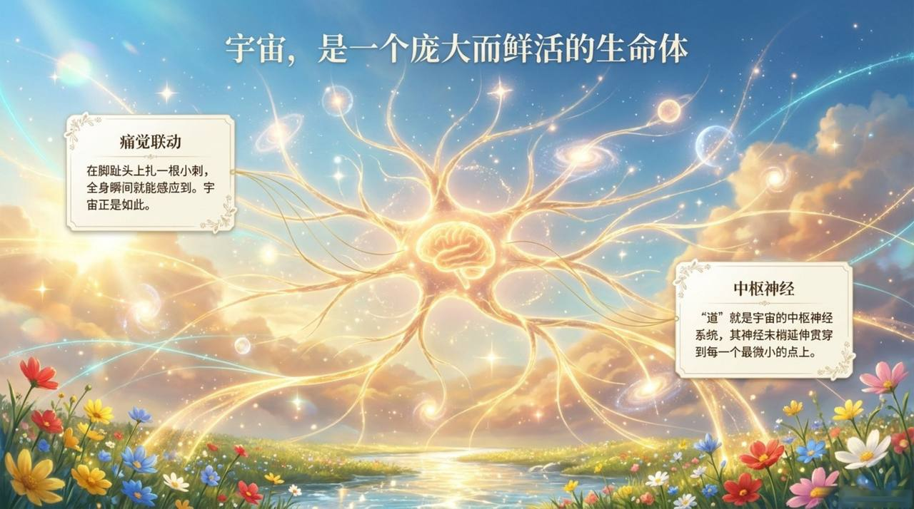
    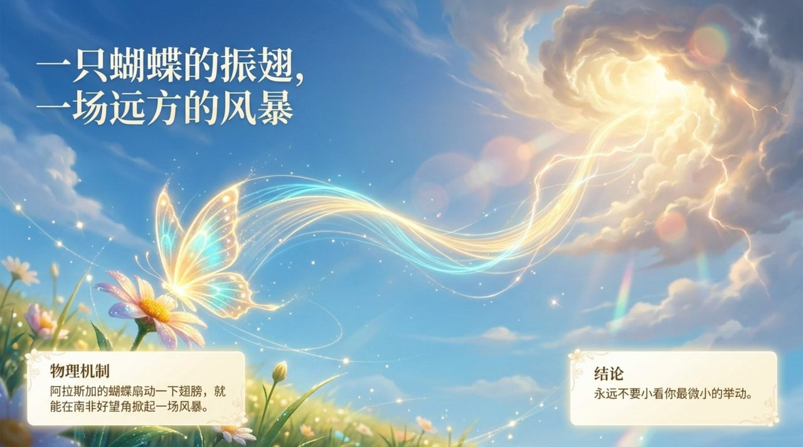
    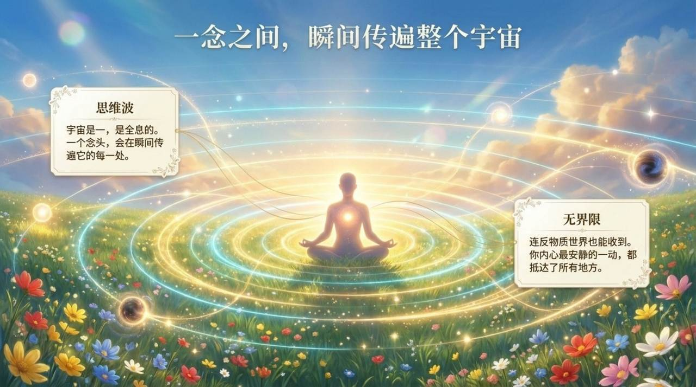
    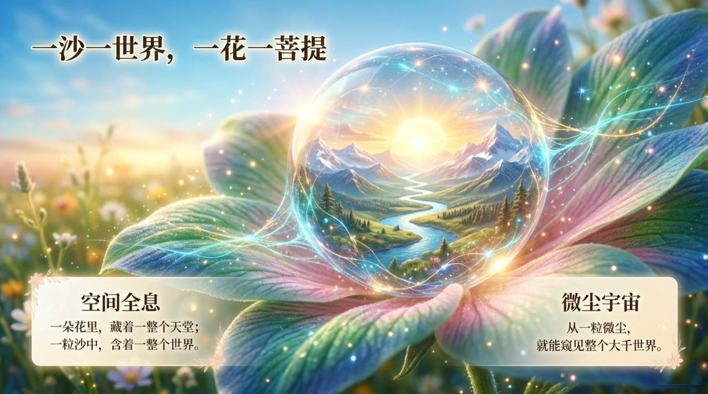
    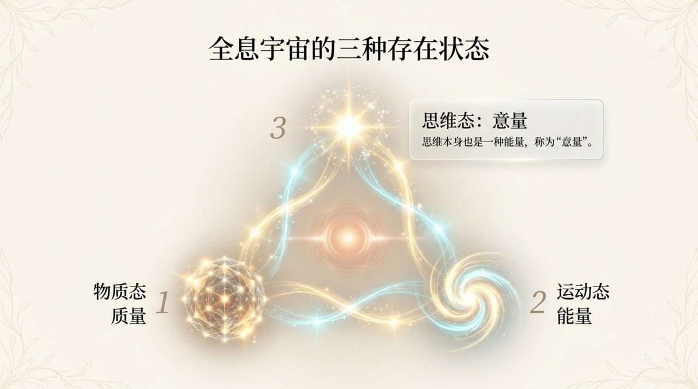
    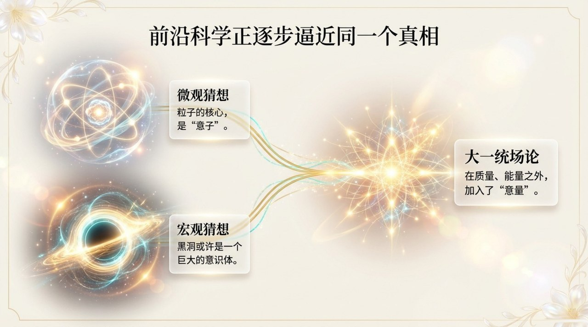
    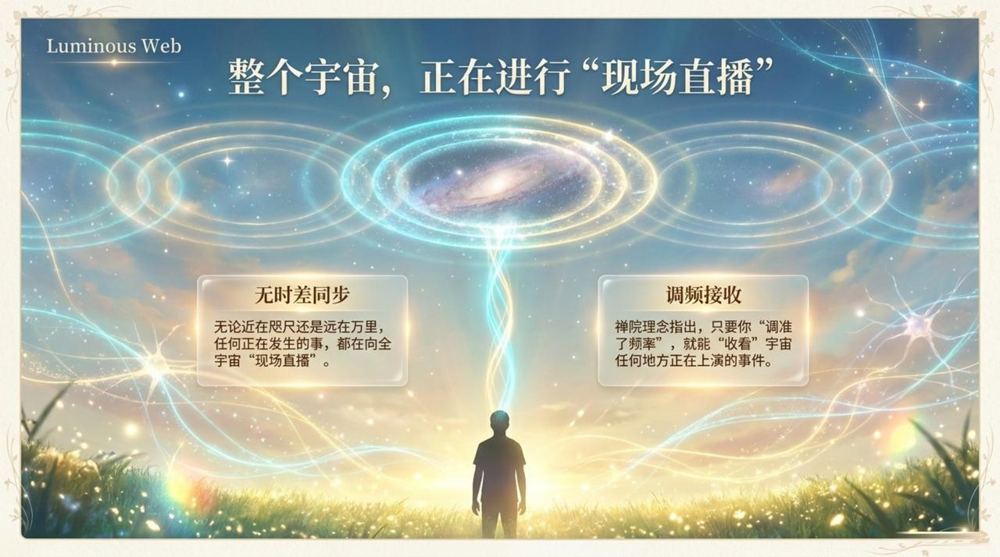
    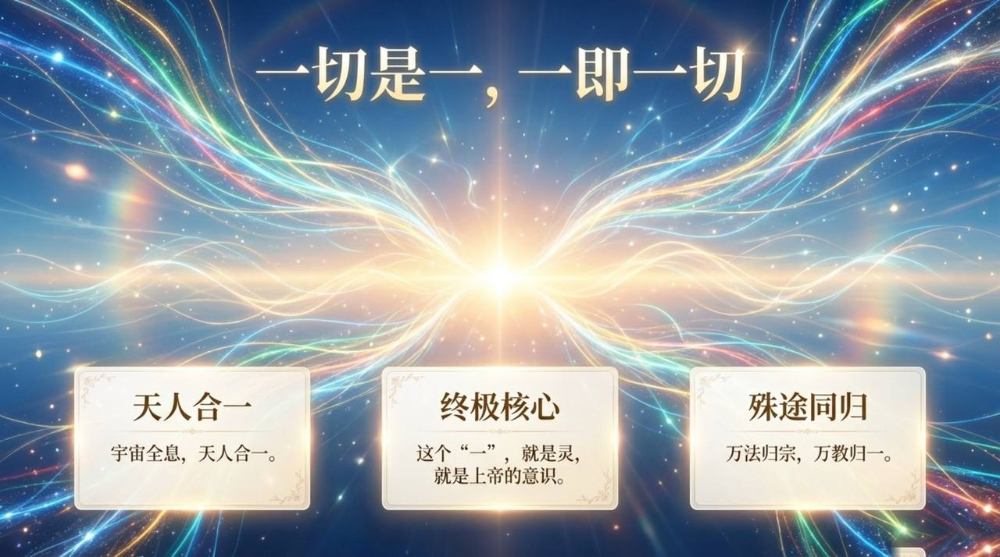
    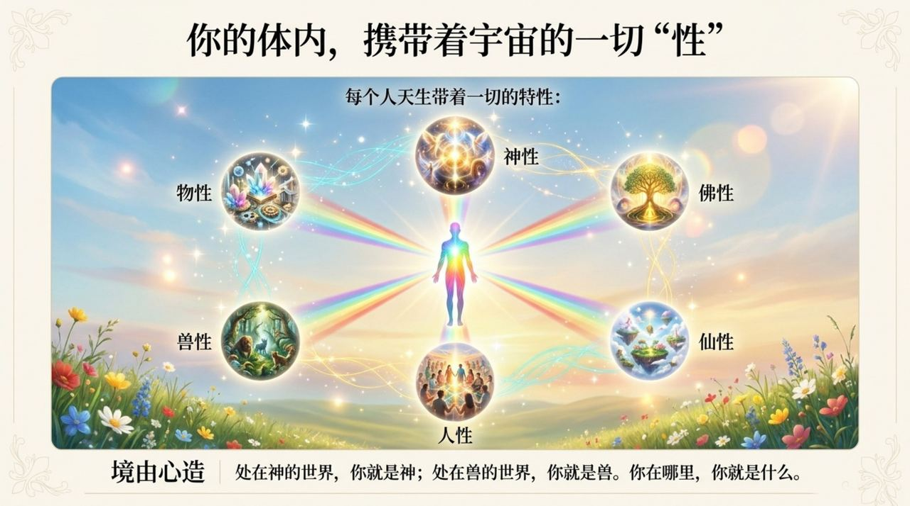
    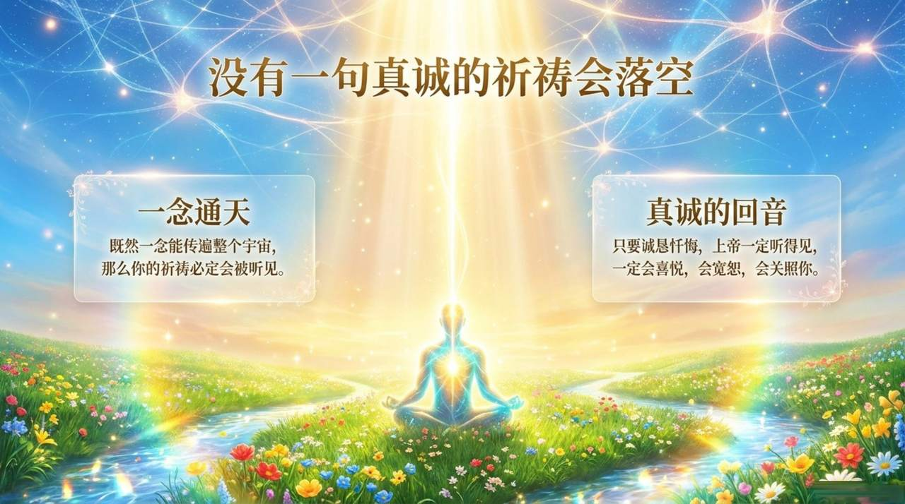
    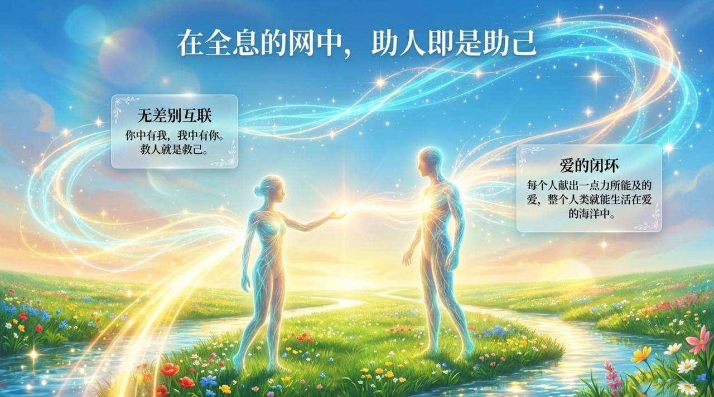
    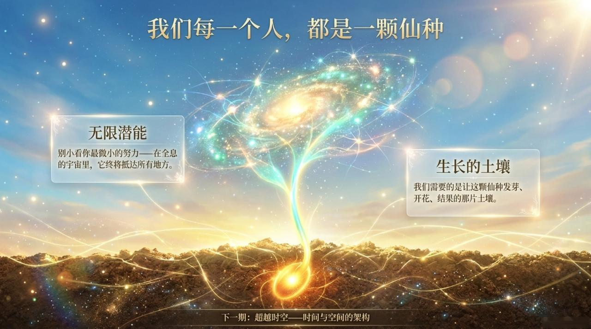

| 版本 | 适合 | 核心角度 |
|------|------|----------|
| [友好版](friendly.md) | 初次了解 | 生活类比与修炼意义 |
| [学术版](academic.md) | 研究者 | 系统分析与概念辨析 |
| [内部版](internal.md) | 深度研修 | 文集引文全集 |

---

## 相关词条

[浑沌（本体论）](/zh/hundun/) · [道](/zh/dao/) · [上帝](/zh/greatest-creator/) · [意识](/zh/consciousness/) · [同频共振](/zh/resonance/) · [时空](/zh/spacetime/) · [反物质世界](/zh/antimatter-world/) · [成仙](/zh/becoming-celestial/) · [忏悔](/zh/repentance/)
