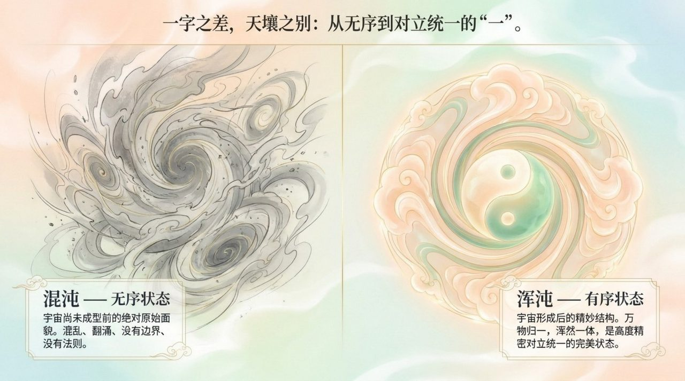
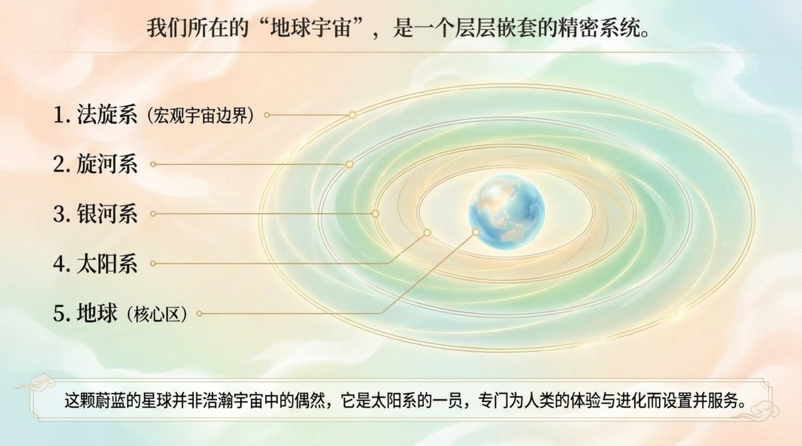
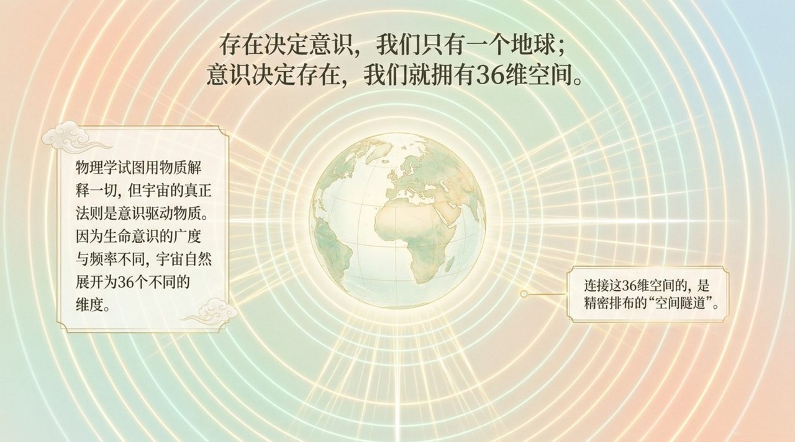
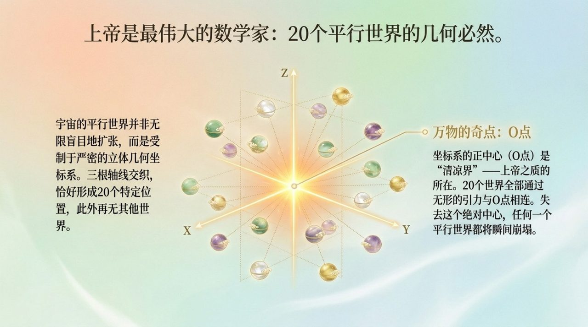
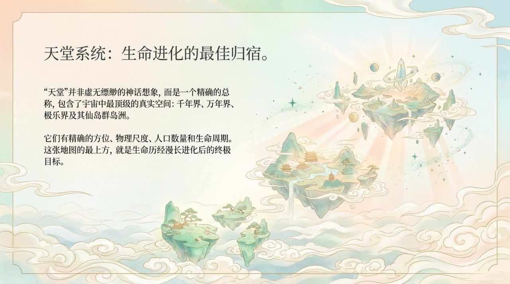
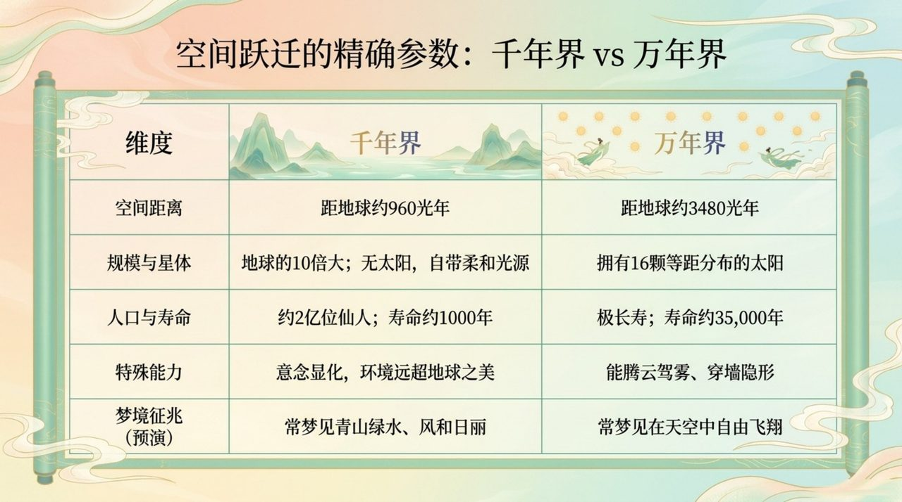
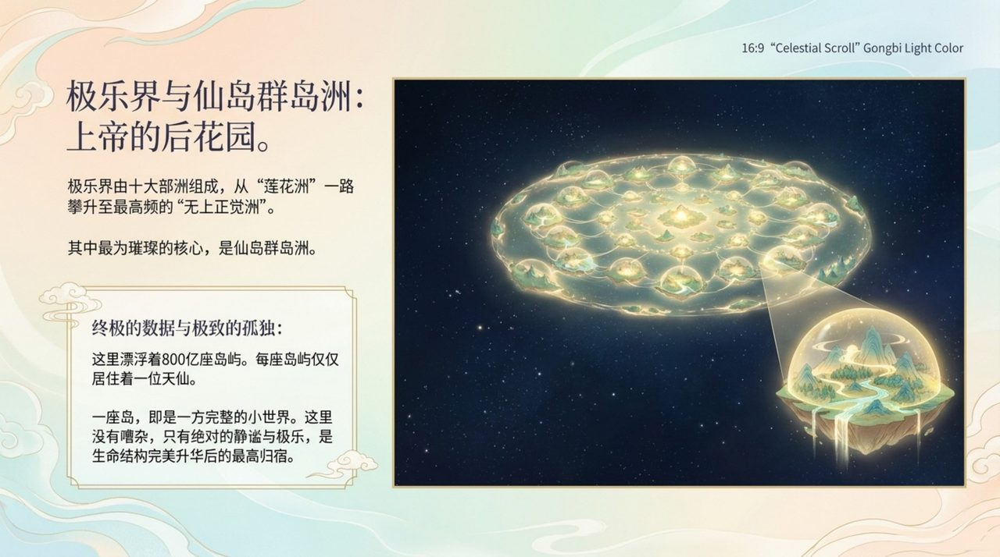
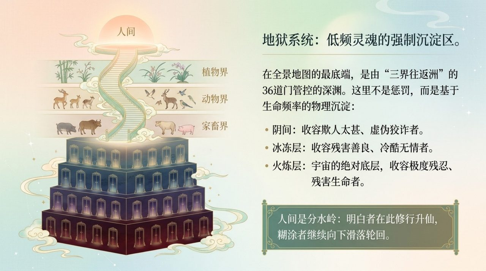
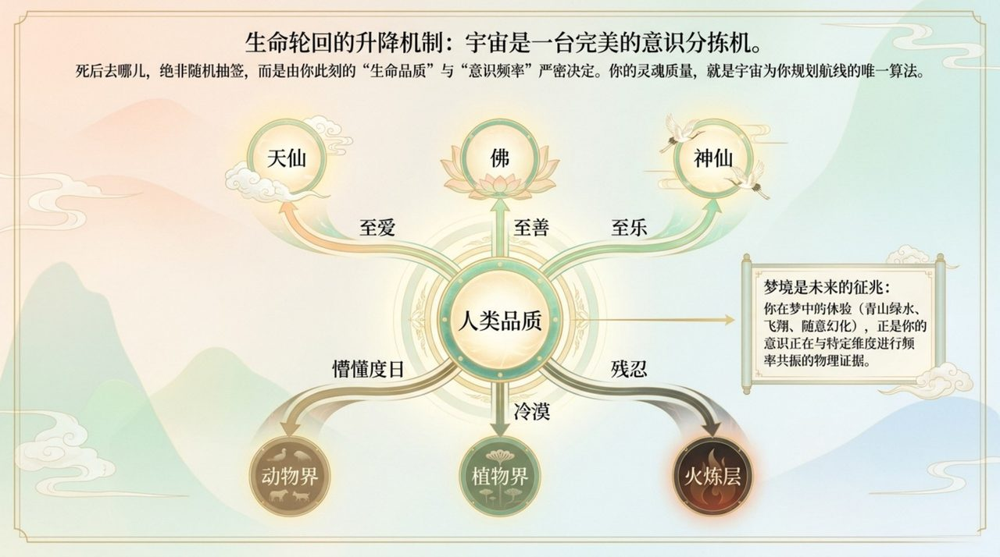

# 宇宙全景图

**宇宙全景图**，是生命禅院体系对宇宙整体结构的系统性描绘——以意识为宇宙本质，以上帝为宇宙中心，展开36维空间、20个平行世界、生命16个层次、天堂与地狱系统及生命轮回升降路径，构成一幅覆盖从火炼层到清凉界、从人间到仙岛群岛洲的完整宇宙地图。

## 视频版

<iframe style="width:100%;aspect-ratio:4/3;border:0" src="https://www.youtube-nocookie.com/embed/EU6IFAcTVLE" title="宇宙全景图（生命禅院百科·视频版）" allowfullscreen></iframe>

??? info "📖 图文幻灯（14 张，点击展开）"

    
    
    
    
    
    
    
    
    
    
    
    
    
    

## 版本导航

| 版本 | 适合 |
|------|------|
| [友好版](friendly/) | 首次接触，内容丰满、可读性强 |
| [学术版](academic/) | 理论研究与引用 |
| [内部版](internal/) | 体系内核心学习，以母版为准 |

## 相关词条

[上帝](/zh/greatest-creator/) · [宇宙起源](/zh/universe-origin/) · [意识](/zh/consciousness/) · [能量](/zh/energy/) · [结构](/zh/structure/) · [三十六维空间](/zh/thirty-six-dimensional-space/) · [宇宙大剧本](/zh/cosmic-script/) · [天国](/zh/kingdom-of-heaven/) · [千年界](/zh/thousand-year-world/) · [万年界](/zh/ten-thousand-year-world/) · [极乐界](/zh/elysium-world/) · [仙岛群岛洲](/zh/celestial-islands-continent/) · [反物质世界](/zh/antimatter-world/) · [高层生命空间](/zh/high-life-spaces/)
