<!-- id: LC-CUF-0001-ZH theme: 上帝与道 type: index direction: 上帝与道 lang: zh -->

# 宇宙统一场

**宇宙统一场**，在生命禅院体系中指"适用于所有时间和所有空间中'放至四海而皆准'的定律"。科学家因只关注物质世界、只知四种力而始终无法建立宇宙统一场理论；雪峰指出宇宙中实有八种力（磁力、引力、强力、弱力，加上构力、斥力、意力、灵力），真正的宇宙统一场早已存在——即上帝的道，以宇宙三要素"意识、结构、能量"构成的浑沌体系。

---

## 视频版

<iframe style="width:100%;aspect-ratio:4/3;border:0" src="https://www.youtube-nocookie.com/embed/RcM46uo9xXc" title="宇宙统一场（生命禅院百科·视频版）" allowfullscreen></iframe>

??? info "📖 图文幻灯（14 张，点击展开）"

    
    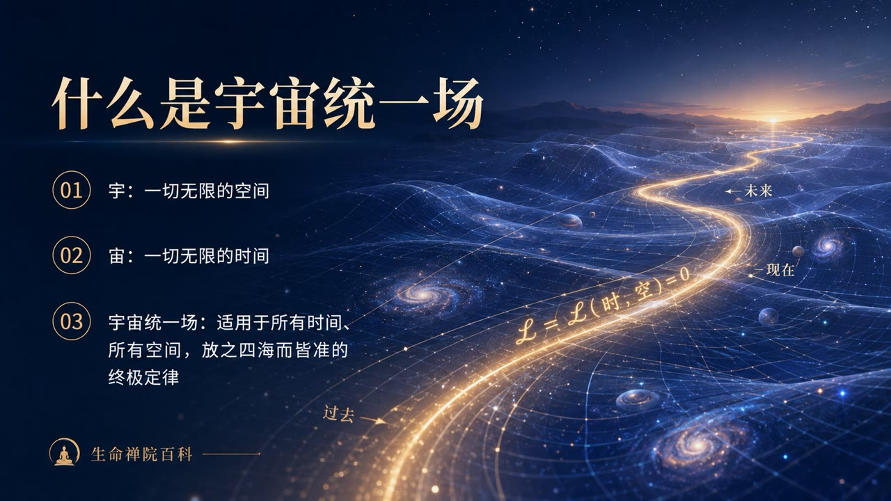
    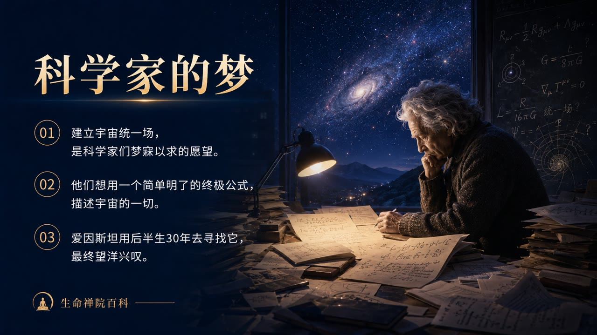
    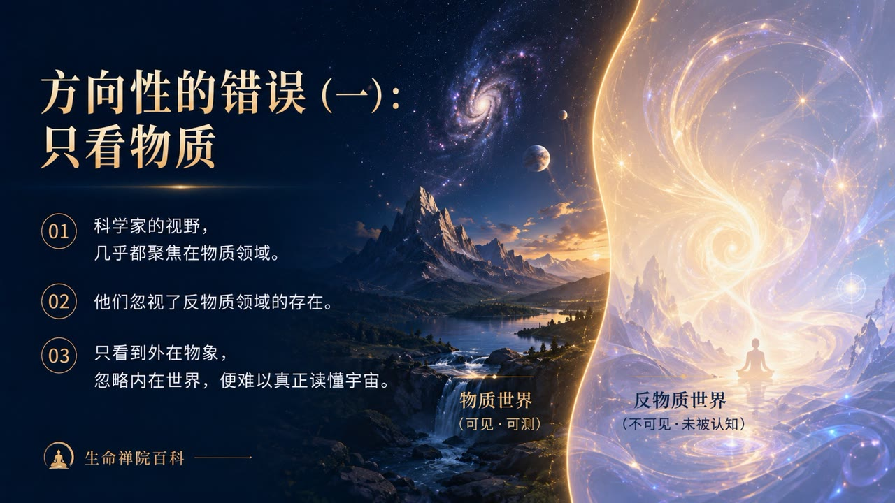
    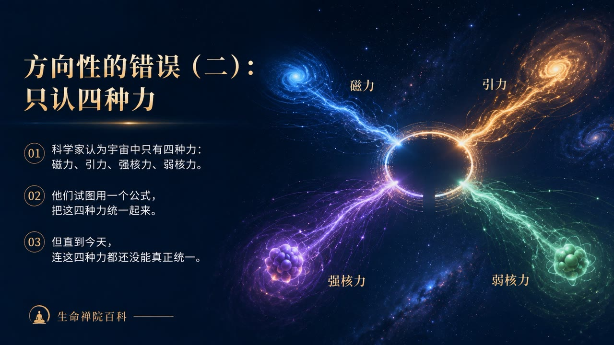
    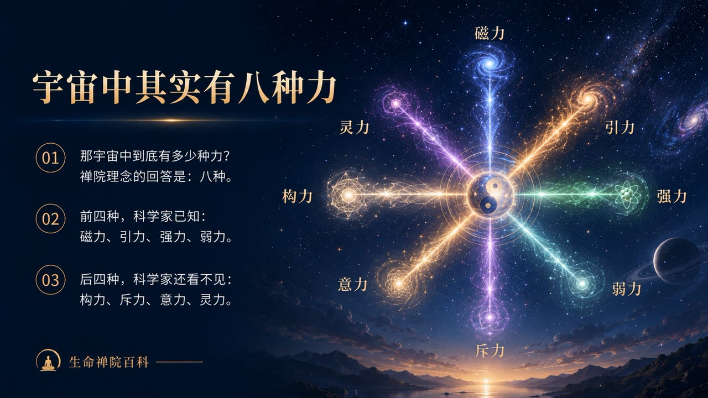
    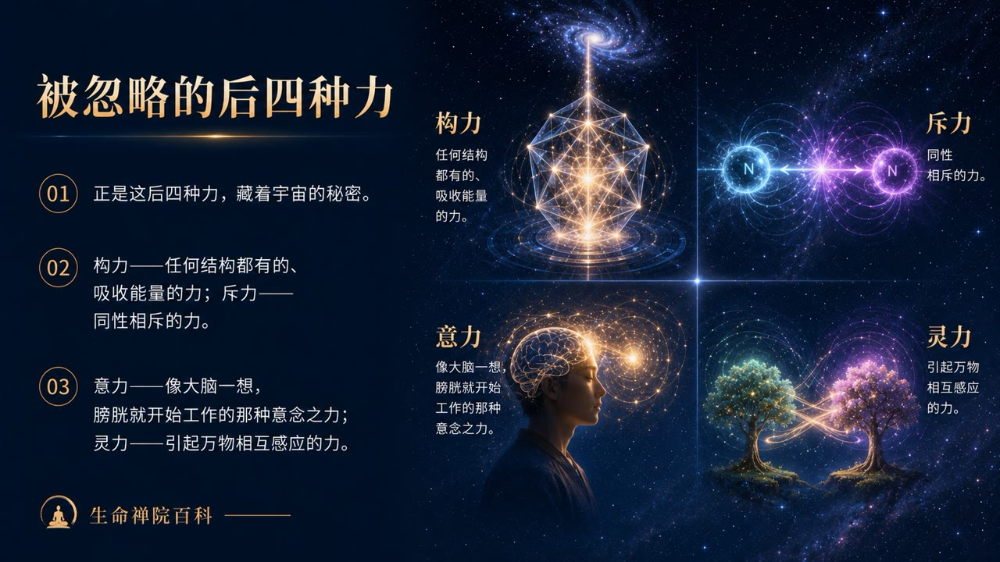
    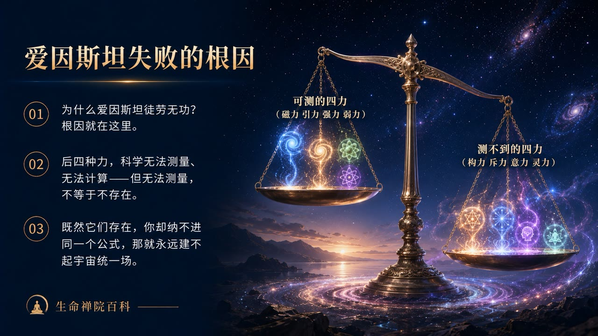
    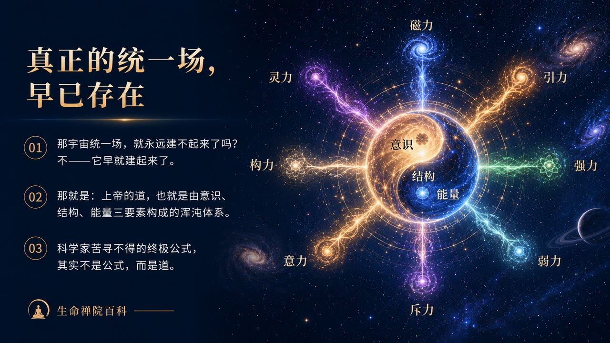
    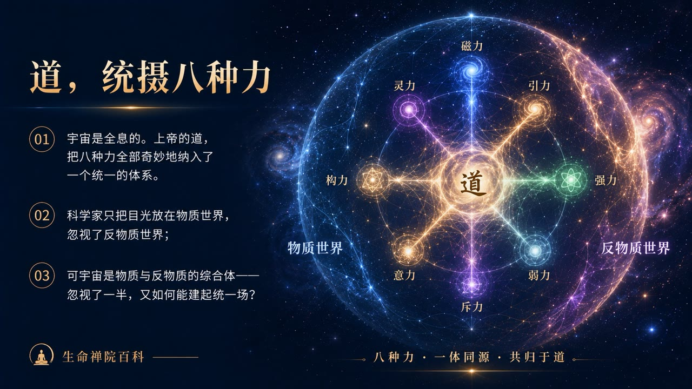
    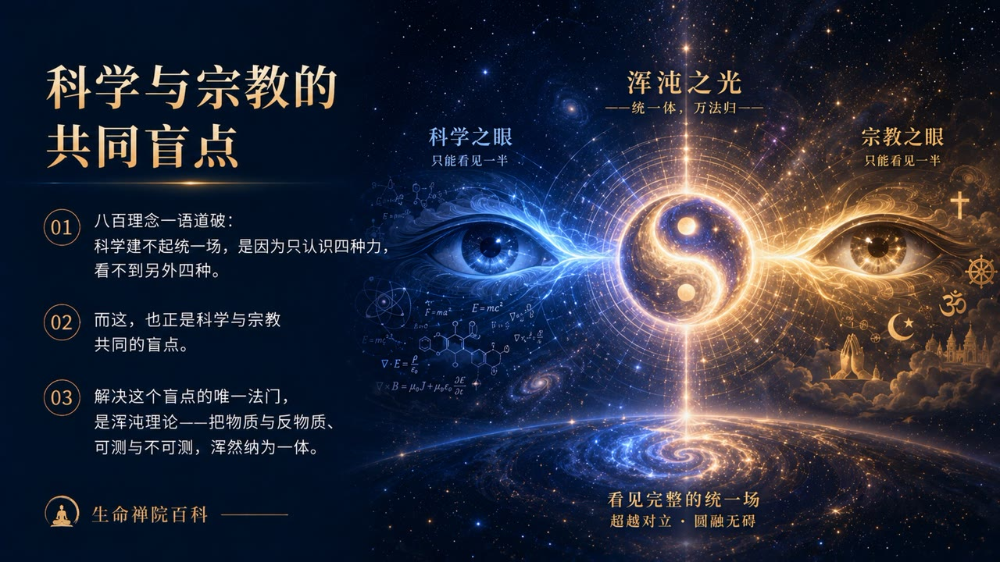
    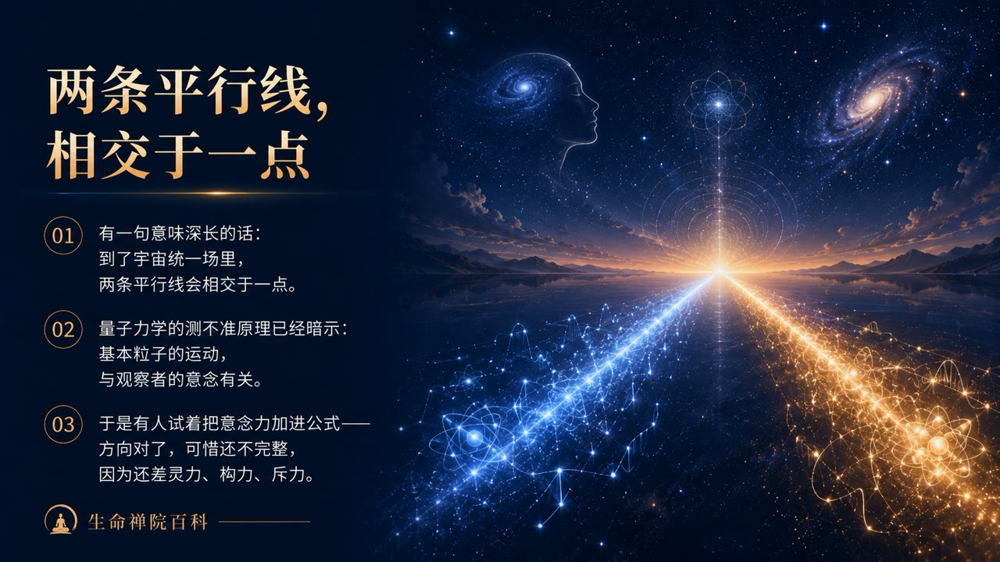
    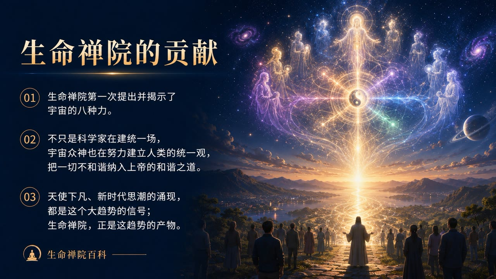
    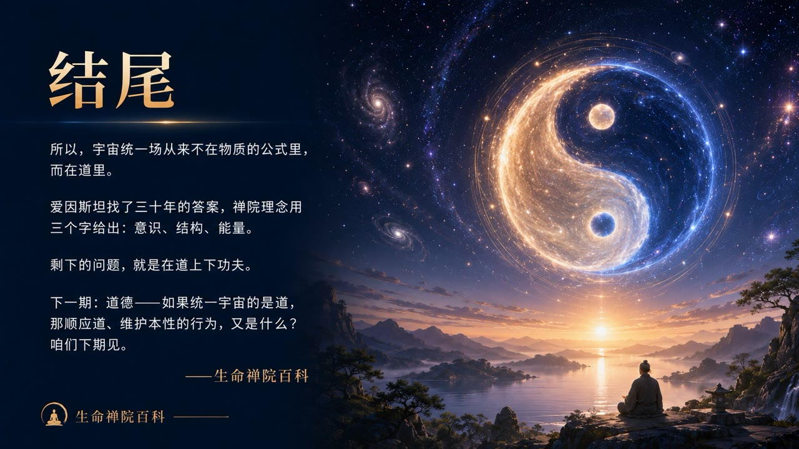

## 版本导航

| 版本 | 适合读者 | 核心角度 |
|------|---------|---------|
| [友好版](friendly.md) | 初次了解者 | 为什么科学家找不到统一场？答案是什么？ |
| [学术版](academic.md) | 研究者 | 八种力框架、科学盲点分析、浑沌体系对比 |
| [内部版](internal.md) | 深度研修 | 完整原典引文、传道篇宇宙统一场全文 |

---

## 相关词条

[道](/zh/dao/) · [上帝](/zh/greatest-creator/) · [宇宙（总论）](/zh/universe-overview/) · [宇宙三要素](/zh/three-cosmic-elements/) · [浑沌（本体论）](/zh/hundun/) · [反物质结构](/zh/antimatter-structure/) · [意识](/zh/consciousness/) · [结构](/zh/structure/) · [能量](/zh/energy/) · [宇宙全息](/zh/cosmic-holography/)
