<!-- id: LC-DR-0001 theme: consciousness-life-mystery type: index direction: ascension-mission lang: zh -->

# 梦境

> **梦境**，是生命禅院（Lifechanyuan）体系中揭示潜意识活动、反物质世界存在形态与生命未来走向的重要概念。梦境不是凭空幻想，也不是单纯大脑杂音，而是潜意识中生命的灵体实实在在进入的负空间，是无限辽阔、无时间存在的空间；这个空间反映做梦者的历史、现状与未来，往往以借喻、比喻、倒置等方式呈现，因此梦既是认识潜意识的重要入口，也是观察生命结构、修行状态与未来走向的重要窗口。

> “梦境是一个反物质世界，是潜意识中生命的灵体实实在在进入的负空间，是无限辽阔的无时间的空间，这个空间反映的是做梦人的历史、现状及未来，反映的形式不是直观的，而是借喻、比喻式的，有时候是倒立的。”
> — 雪峰，《生命禅院概览》

---

## 核心要点

- **基本定义**：梦境是潜意识中生命灵体进入的负空间，是反物质世界的一种真实体现
- **空间属性**：梦境界属三十六维空间中的第二十六维，是中性世界之一
- **反映内容**：梦可反映做梦者的历史、现状与未来，但通常不以直白方式显现
- **信息来源**：梦境与潜意识、滞留信息间、前世经验、生命结构状态密切相关
- **修行验证**：梦境品质可作为生命反物质结构与修行层次的观察窗口
- **认识意义**：研究梦境，是进入潜意识理论、反物质世界理论与生命未来学的重要入口

---

## 各版本入口

| 版本 | 适合读者 | 链接 |
|------|----------|------|
| 友好版 | 初次了解，追求可读性 | [友好版](/zh/dream-state/friendly/) |
| 学术版 | 深度研究，理论比较 | [学术版](/zh/dream-state/academic/) |
| 内部版 | 原文照录，按主题整理 | [内部版](/zh/dream-state/internal/) |

---

## 视频版

<iframe style="width:100%;aspect-ratio:4/3;border:0" src="https://www.youtube-nocookie.com/embed/Xjhje5VUSYs" title="梦境（生命禅院百科·视频版）" allowfullscreen></iframe>

??? info "📖 图文幻灯（14 张，点击展开）"

    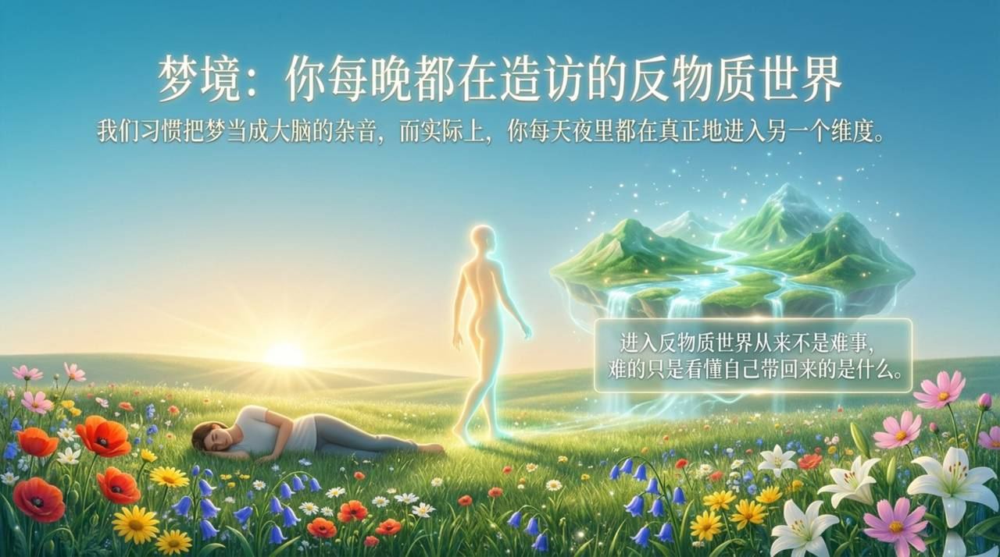
    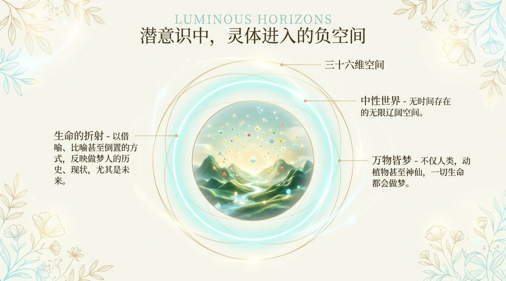
    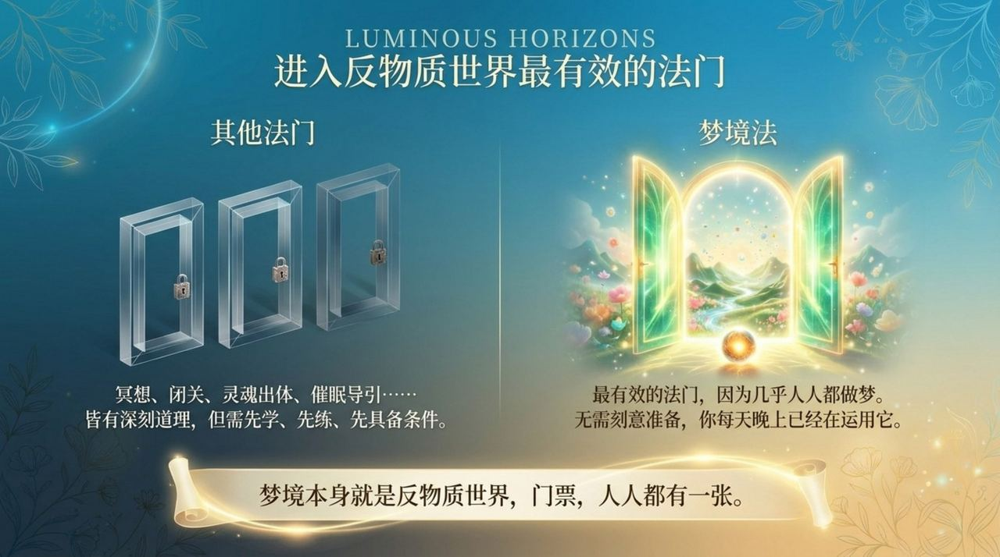
    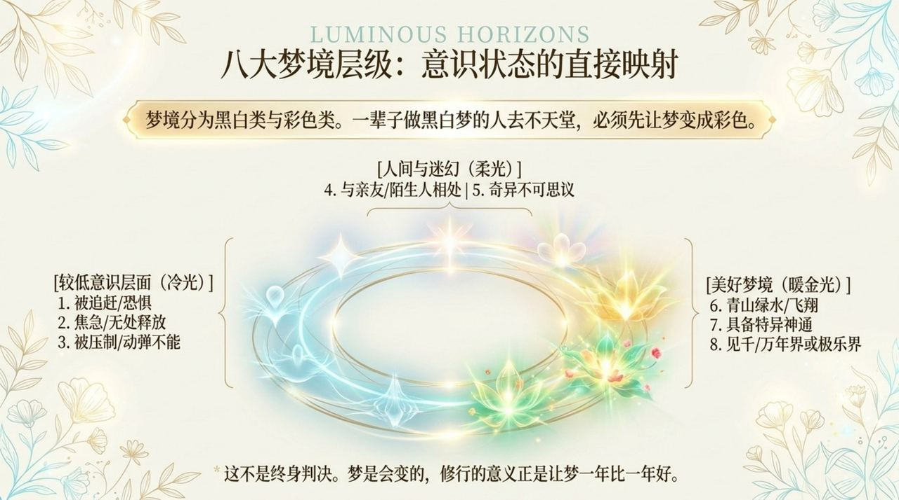
    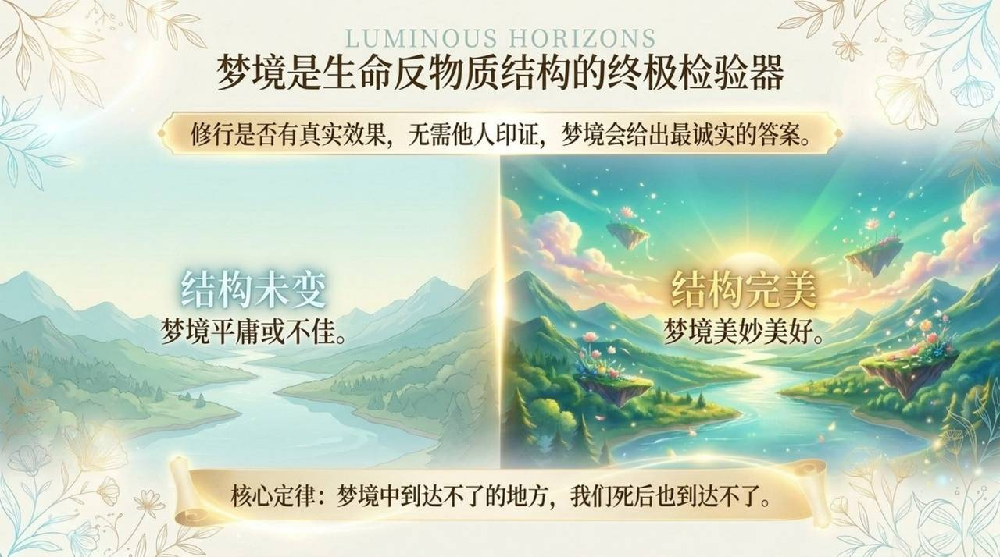
    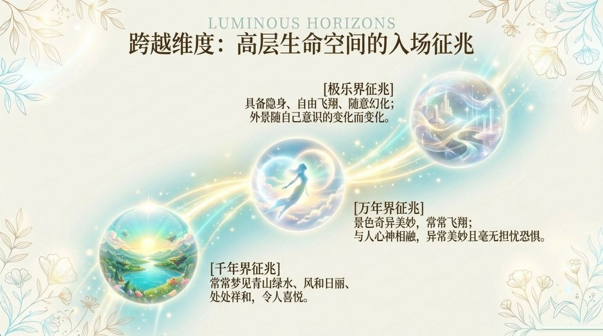
    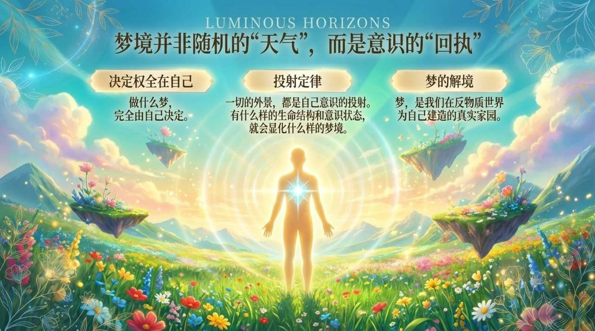
    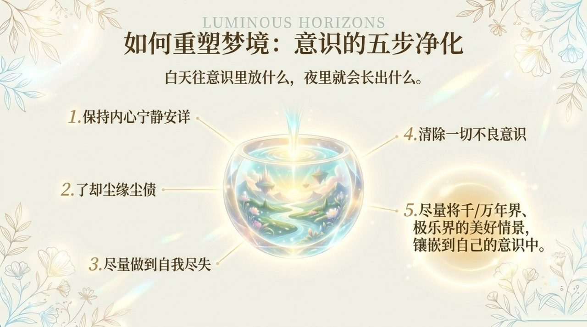
    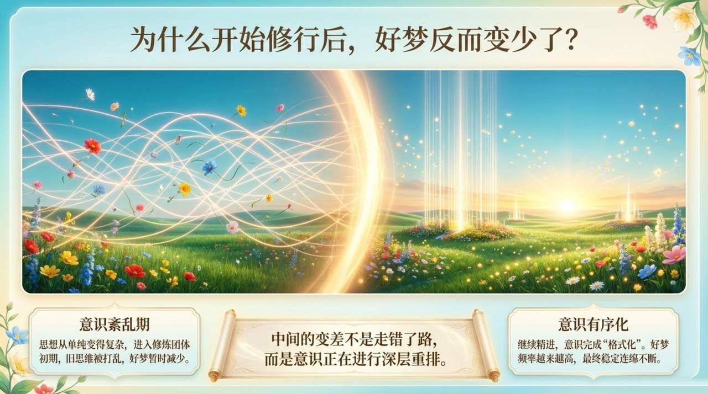
    
    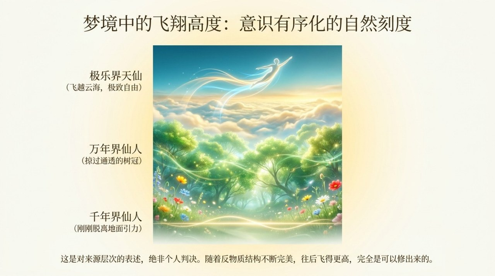
    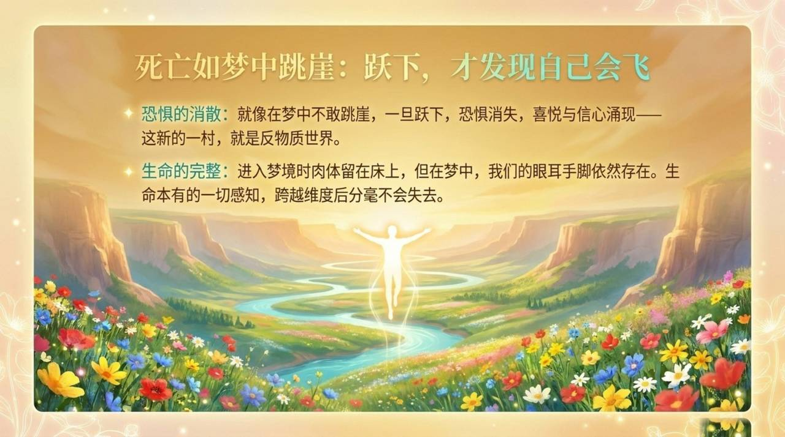
    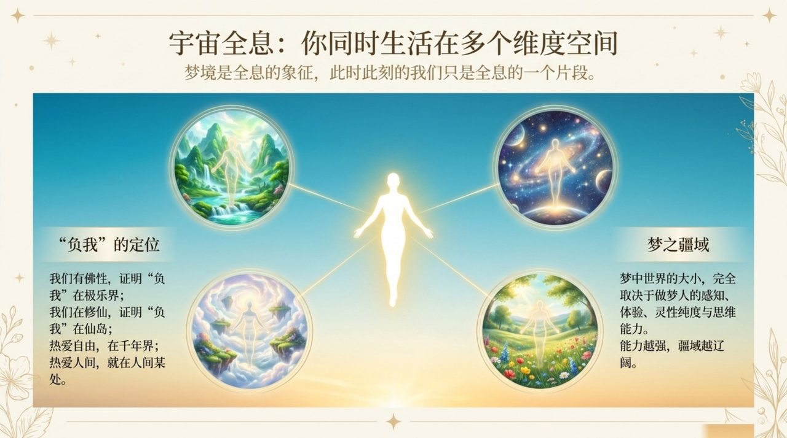
    

## 相关词条

- [潜意识](/zh/subconscious/)
- [反物质世界](/zh/antimatter-world/)
- [负宇宙](/zh/negative-universe/)
- [三十六维空间](/zh/thirty-six-dimensional-space/)
- [滞留信息间](/zh/retained-info-realm/)
- [反物质结构](/zh/antimatter-structure/)
- [高层生命空间](/zh/high-life-spaces/)
