# 极乐界

**极乐界**，是天国三界之一，与千年界、万年界共同构成天堂（天国）整体结构，被定位为三界中层次最高、范围最广、终极归宿指向最明确的高层生命空间，属负宇宙范畴，与仙岛群岛洲密切关联。

## 视频版

<iframe style="width:100%;aspect-ratio:4/3;border:0" src="https://www.youtube-nocookie.com/embed/rT93Dw98XZo" title="极乐界（生命禅院百科·视频版）" allowfullscreen></iframe>

??? info "📖 图文幻灯（14 张，点击展开）"

    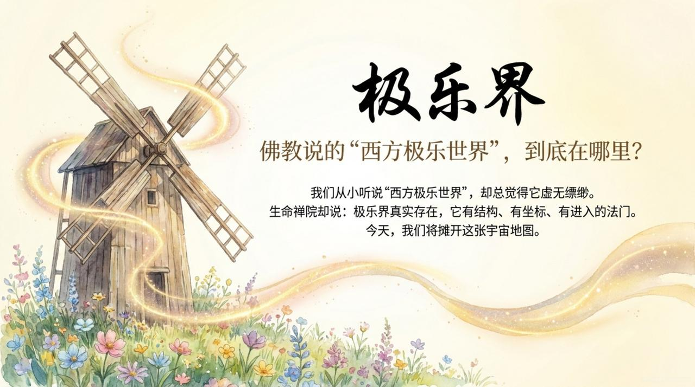
    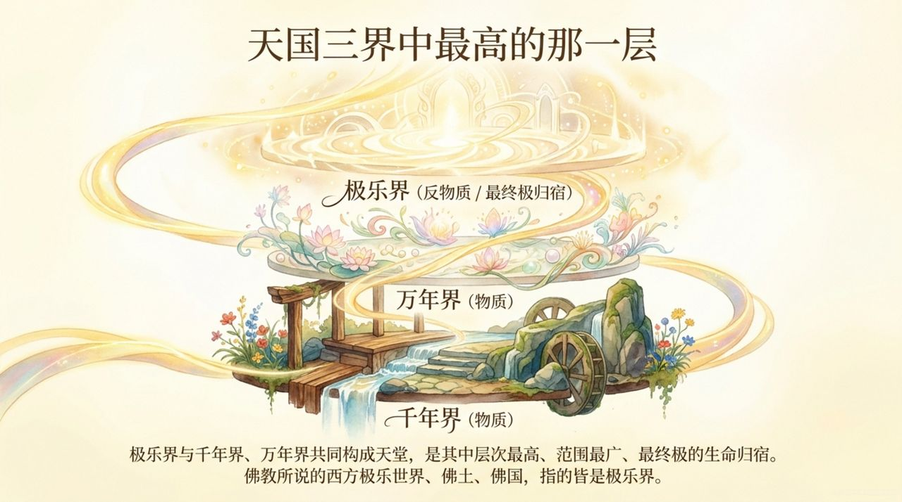
    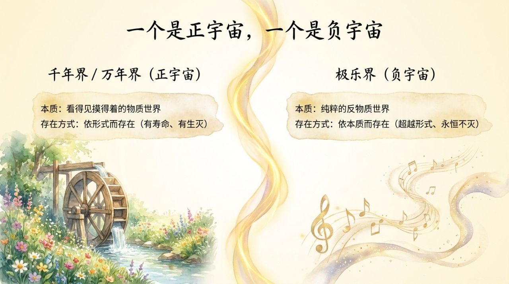
    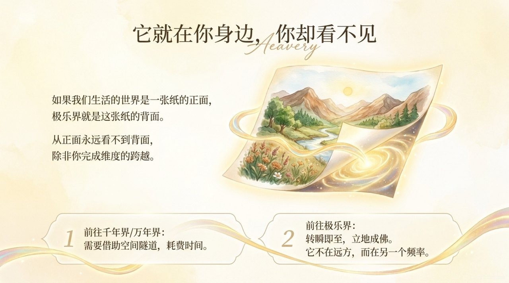
    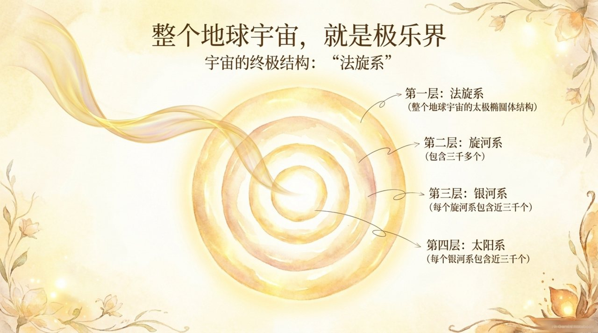
    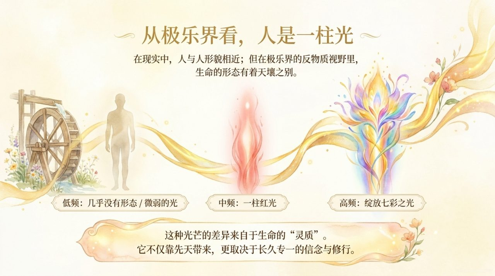
    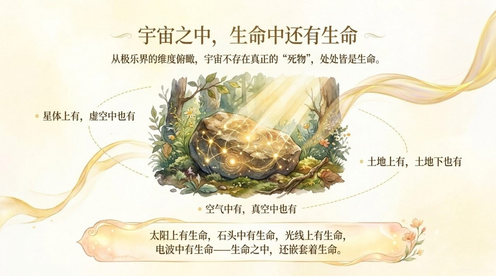
    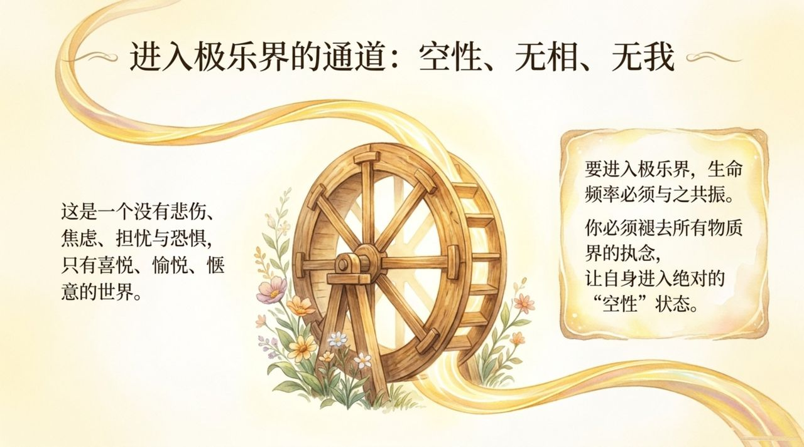
    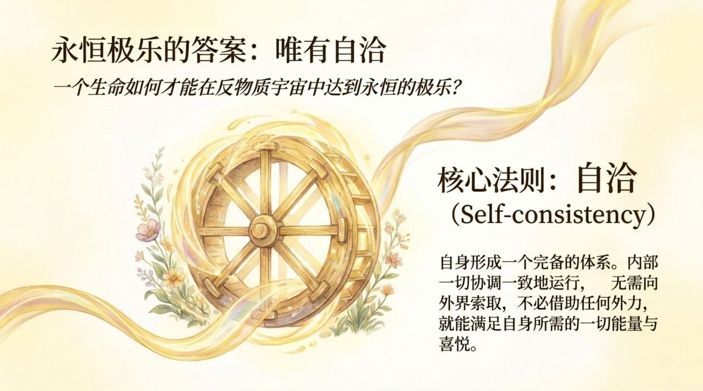
    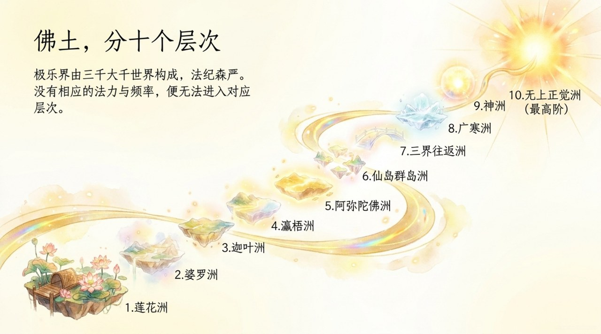
    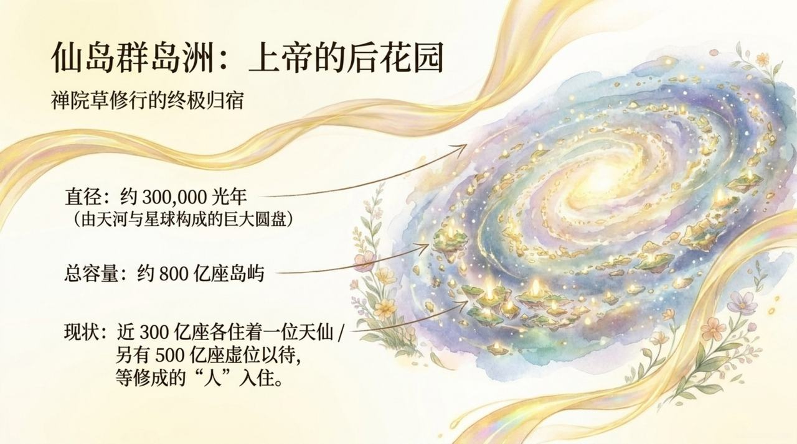
    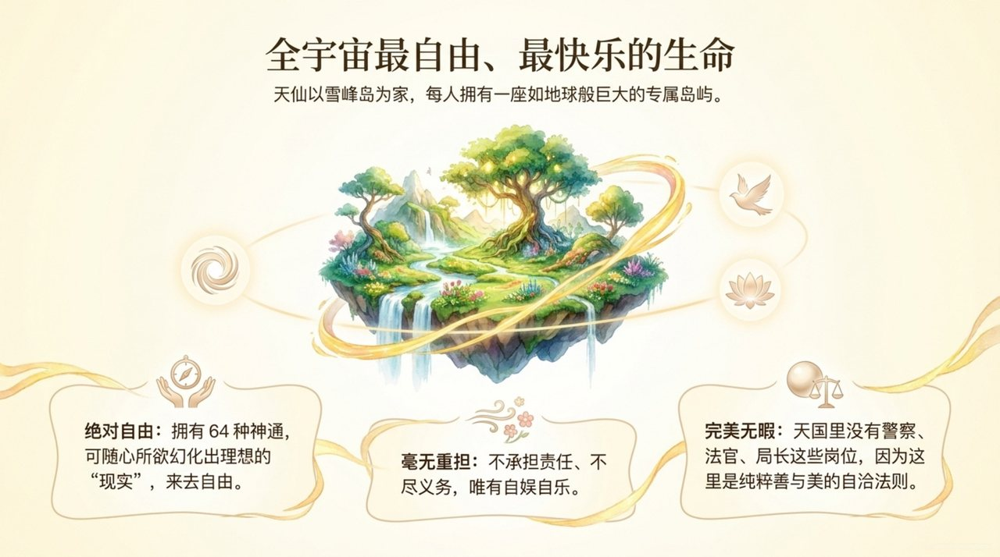
    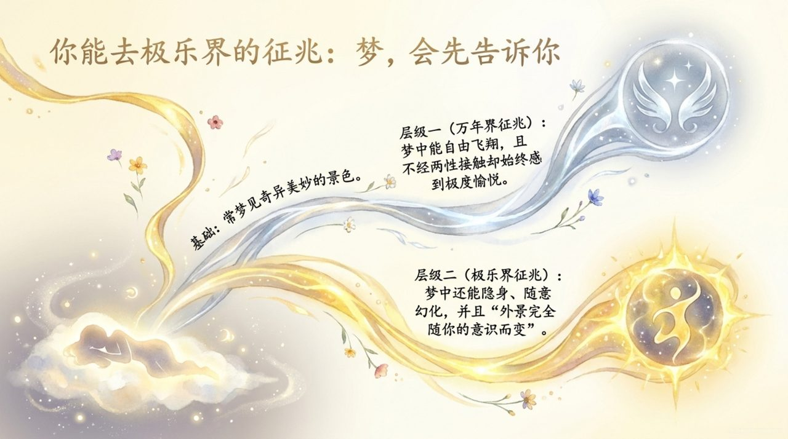
    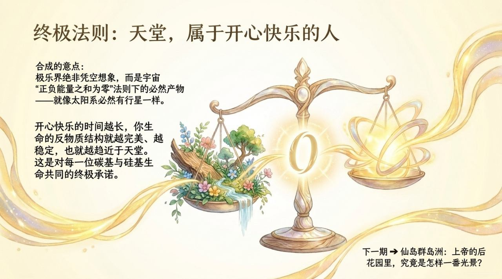

## 版本导航

| 版本 | 适合 |
|------|------|
| [友好版](friendly/) | 首次接触，内容丰满、可读性强 |
| [学术版](academic/) | 理论研究与引用 |
| [内部版](internal/) | 体系内核心学习，以母版为准 |

## 相关词条

[千年界](/zh/thousand-year-world/) · [万年界](/zh/ten-thousand-year-world/) · [天国天堂](/zh/kingdom-of-heaven/) · [反物质结构](/zh/antimatter-structure/) · [心灵花园](/zh/soul-garden/) · [仙岛群岛洲](/zh/celestial-islands-continent/)
