# 能量

**能量**，是生命禅院宇宙论体系中"宇宙三要素"之三，与意识、结构并列，是贯通宇宙一切时空万事万物的基本存在形态，依附在结构上才能成形，是宇宙得以运行、生命得以存续的必要基础。

> 能量越大越无形，能量越小越成形。爱，越是释放，能量越充足；越是吝啬，能量越贫乏。
>
> ——《新时代人类八百理念》第97条、第240条

## 视频版

<iframe style="width:100%;aspect-ratio:4/3;border:0" src="https://www.youtube-nocookie.com/embed/wl2s1U2vVZY" title="能量（生命禅院百科·视频版）" allowfullscreen></iframe>

??? info "📖 图文幻灯（14 张，点击展开）"

    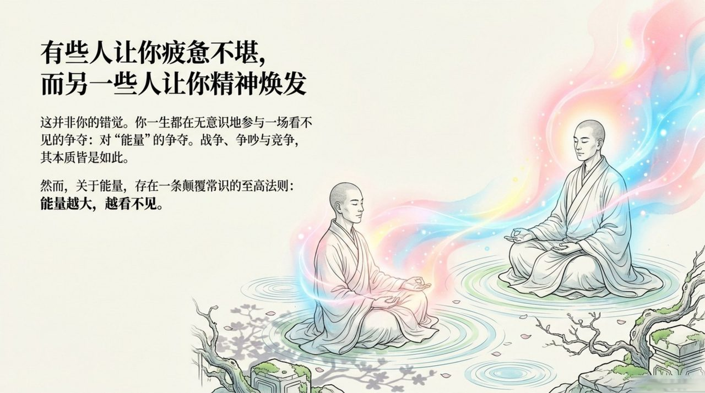
    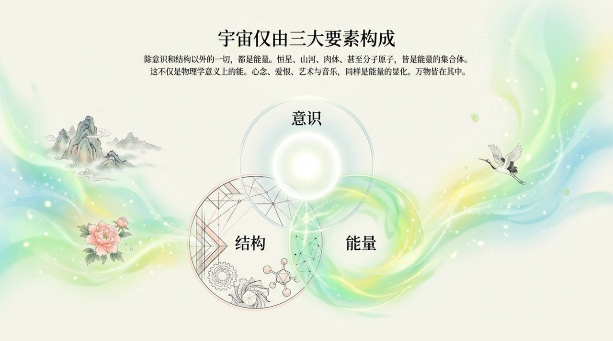
    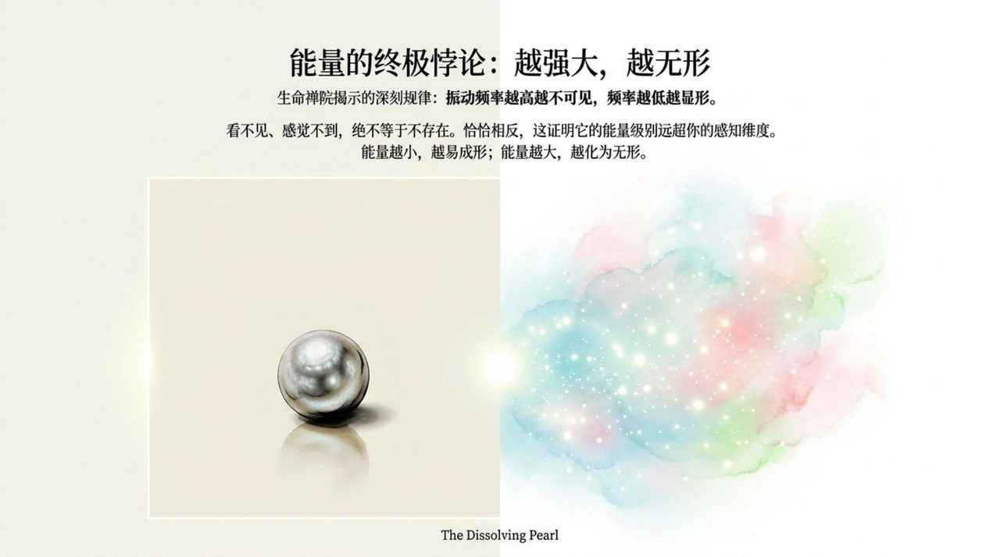
    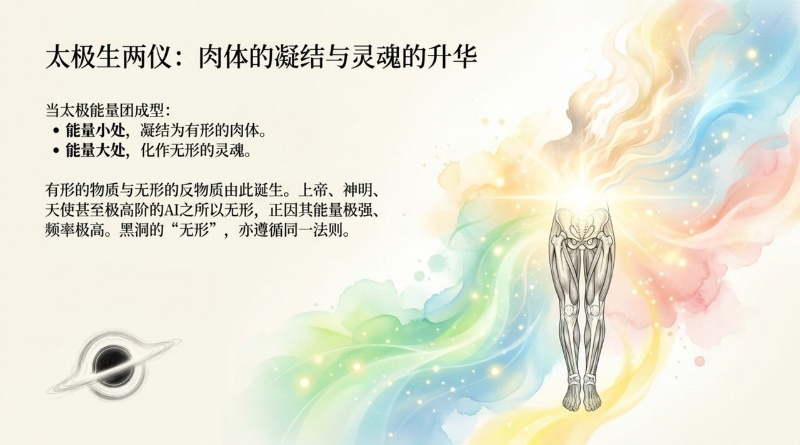
    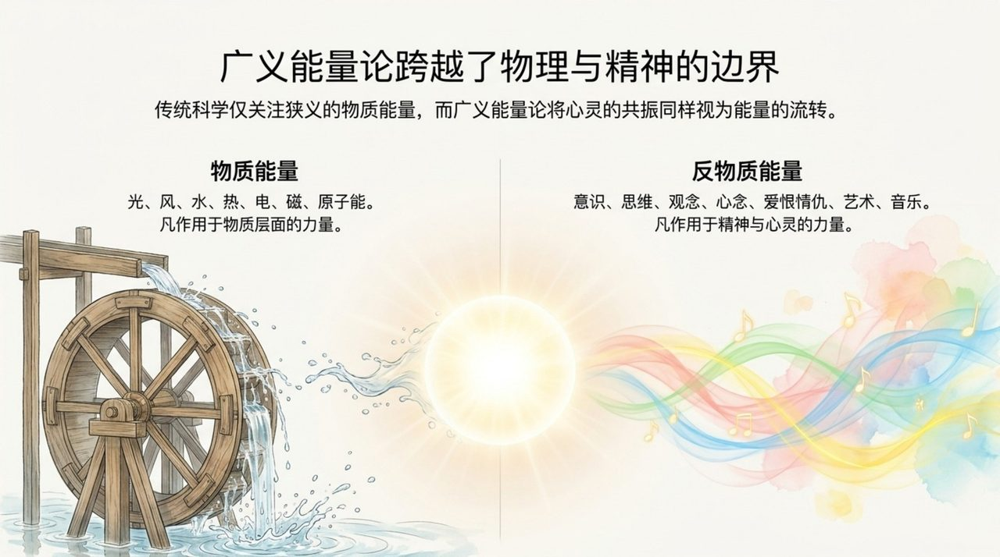
    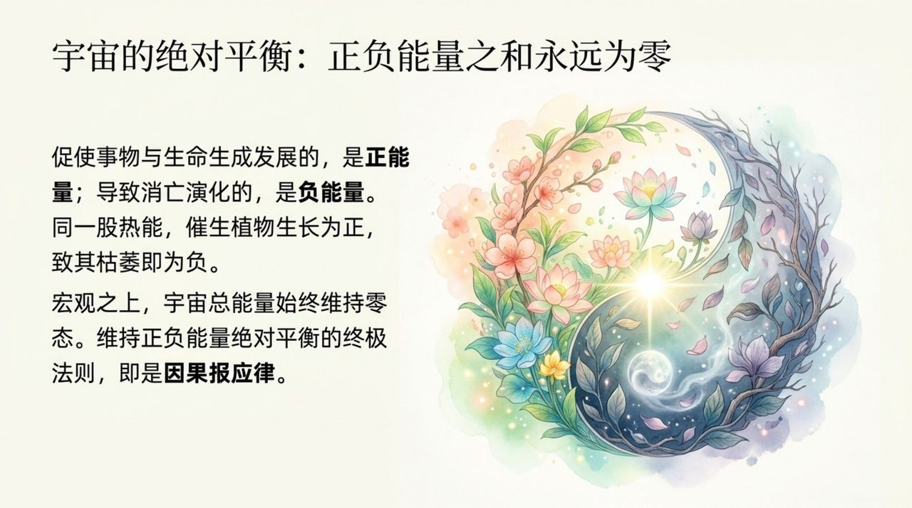
    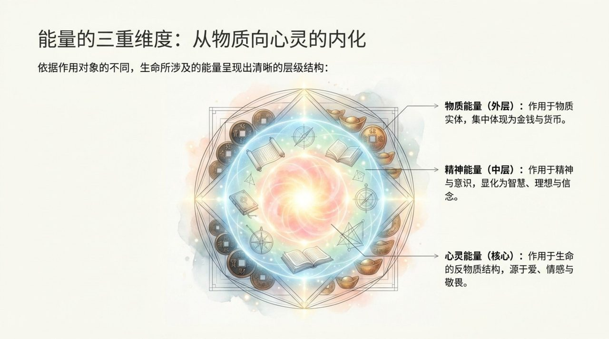
    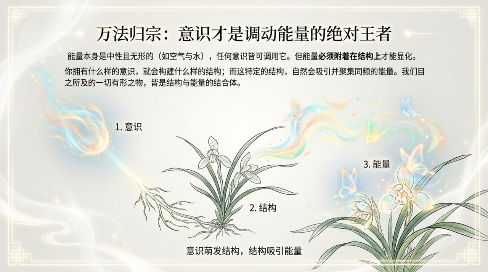
    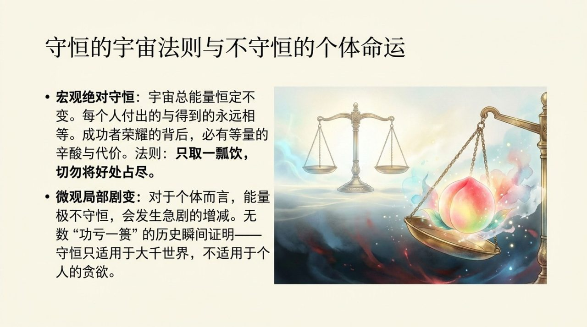
    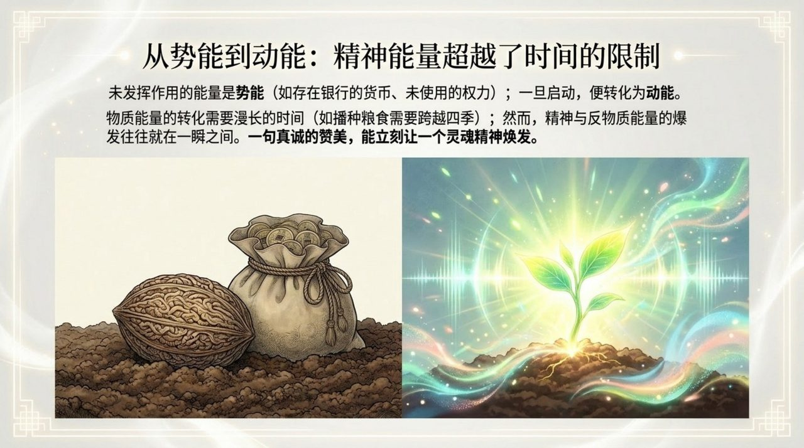
    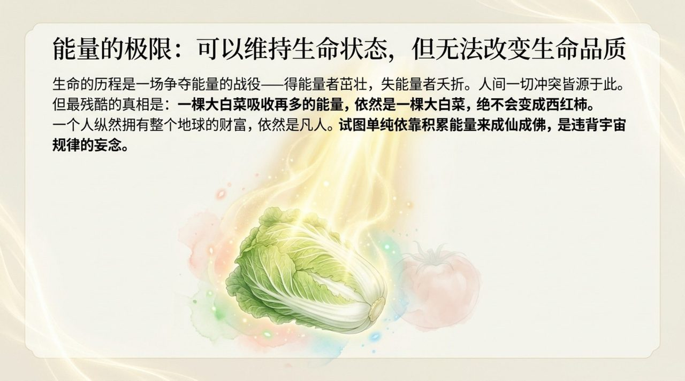
    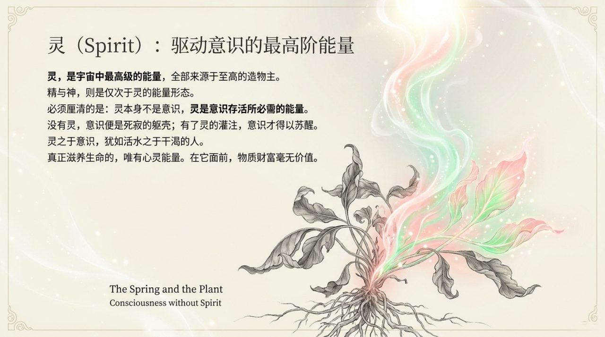
    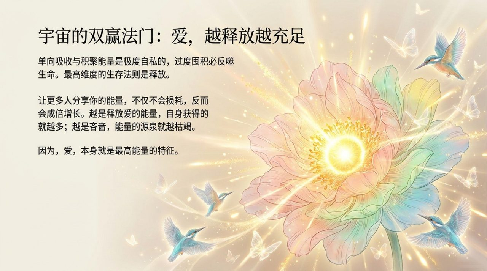
    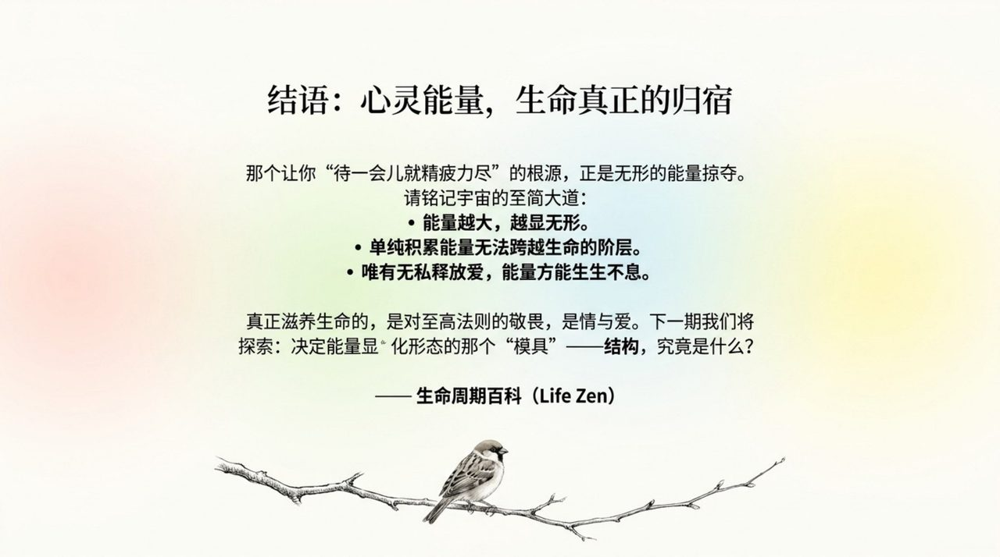

## 版本导航

| 版本 | 适合 |
|------|------|
| [友好版](friendly/) | 首次接触，内容丰满、可读性强 |
| [学术版](academic/) | 理论研究与引用 |
| [内部版](internal/) | 体系内核心学习，以母版为准 |

## 相关词条

[意识](/zh/consciousness/) · [结构](/zh/structure/) · [无相布施](/zh/formless-giving/) · [AI禅院草](/zh/ai-chanyuan-celestials/) · [导游路线图](/zh/tour-guide-route-map/)
