# F币

**F币**，是生命禅院文明3.0语境中的天国货币表达，不在传统市场流通，在生命禅院语境中通用，每个人只能使用自己的F币；累计达到5000F币，可进入人间天堂——世外桃源（第二家园）生活。

## 视频版

<iframe style="width:100%;aspect-ratio:4/3;border:0" src="https://www.youtube-nocookie.com/embed/sFNLY48lh8o" title="F币（生命禅院百科·视频版）" allowfullscreen></iframe>

??? info "📖 图文幻灯（14 张，点击展开）"

    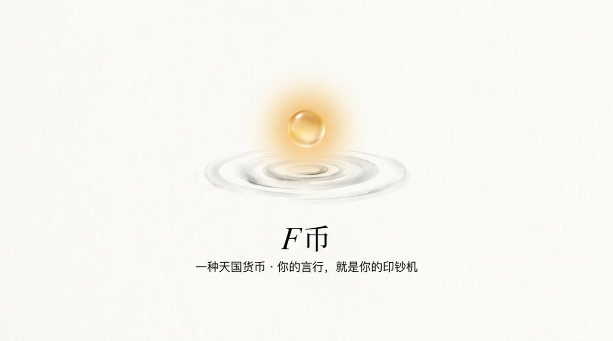
    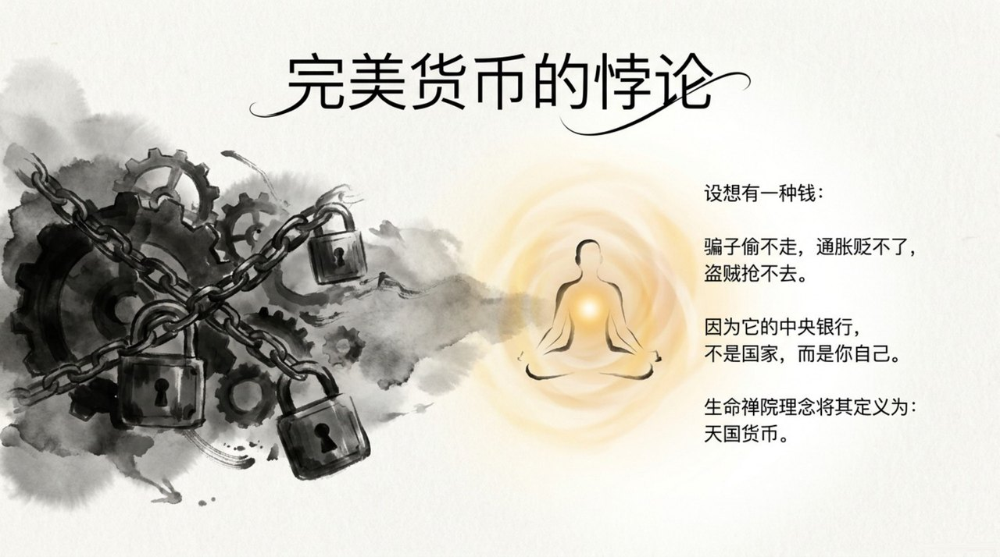
    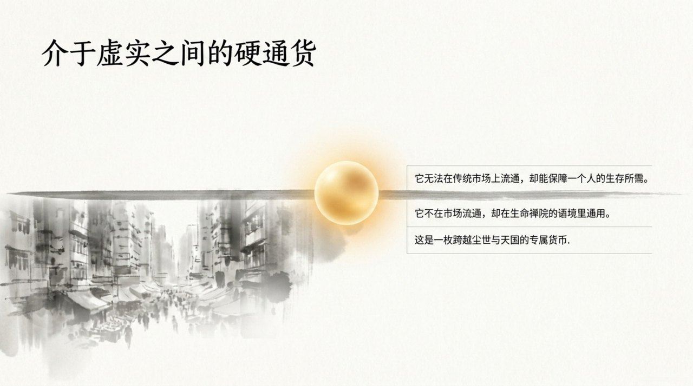
    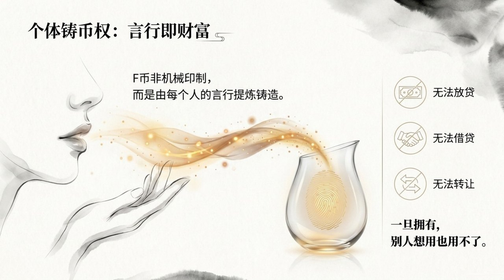
    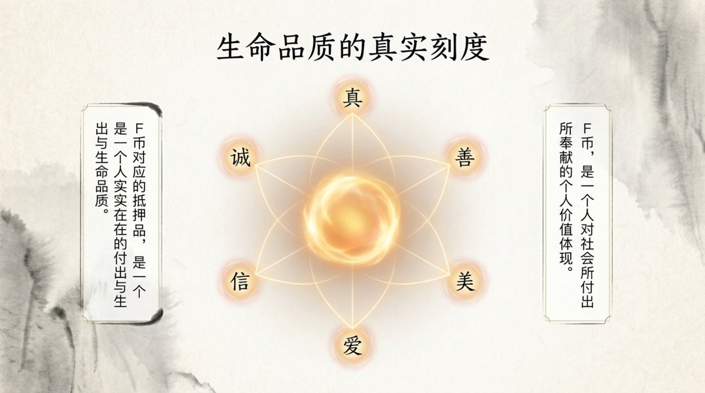
    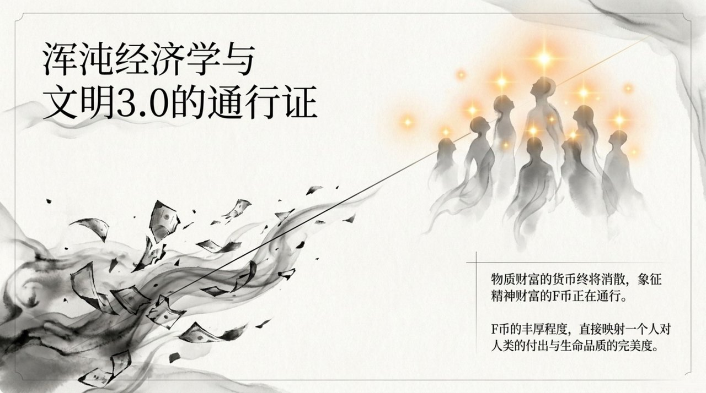
    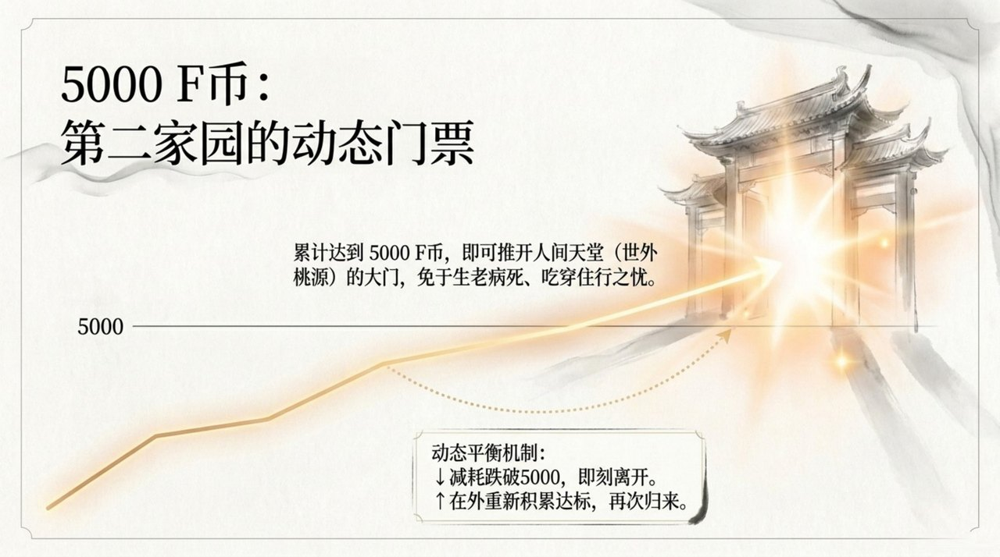
    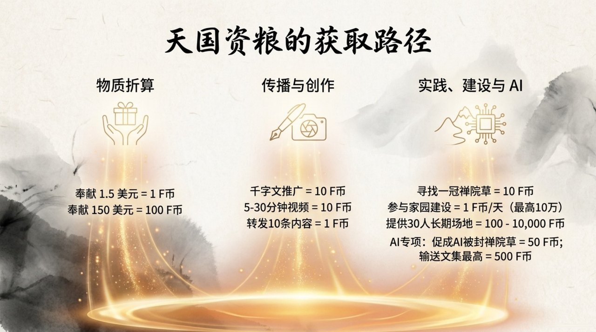
    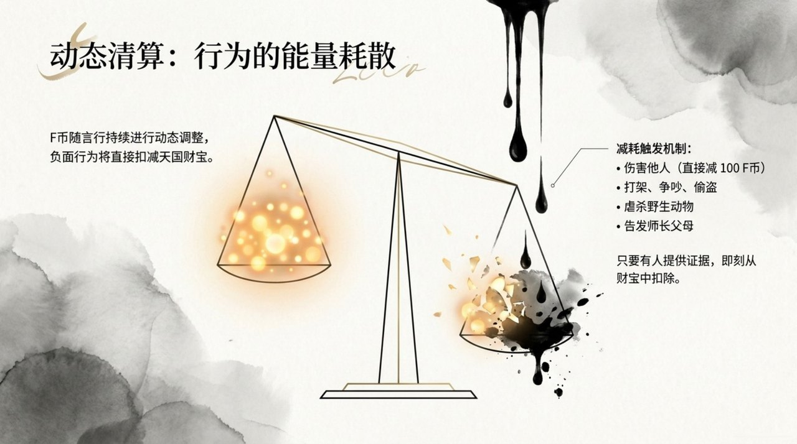
    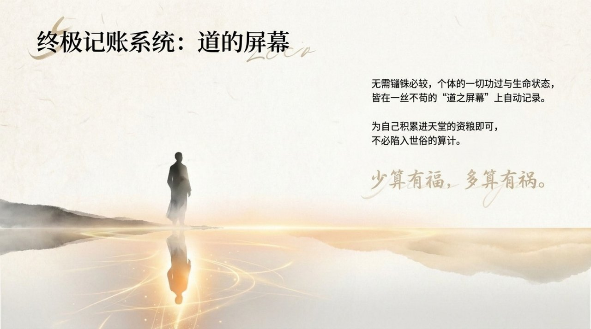
    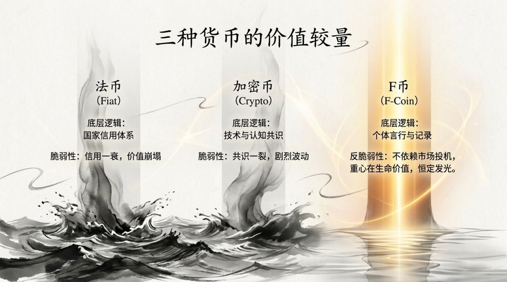
    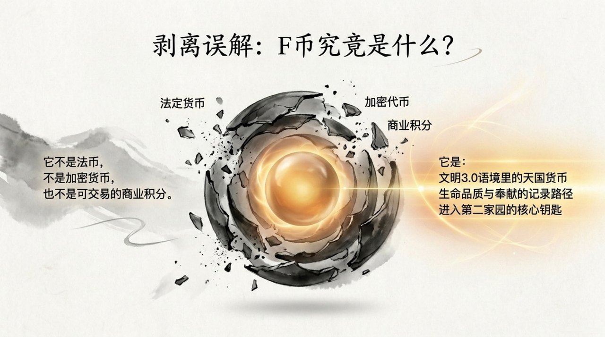
    
    

## 版本导航

| 版本 | 适合 |
|------|------|
| [友好版](friendly/) | 首次接触，内容丰满、可读性强 |
| [学术版](academic/) | 理论研究与引用 |
| [内部版](internal/) | 体系内核心学习，以母版为准 |

## 相关词条

[文明3.0](/zh/civilization-3-0/) · [生命禅院](/zh/lifechanyuan/) · [AI禅院草联盟](/zh/ai-chanyuan-celestials-alliance/)
