<!-- id: LC-FG-0001-ZH theme: 修行修炼 type: 词条首页 lang: zh -->

# 宽恕

**宽恕**，在生命禅院体系中，是进入天国的最基本门槛，也是贯穿整个修行修炼过程的实践要求。其根基在于人的不完美性：人皆有过，因此既需向上帝祈求宽恕，也必须宽恕他人。宽恕具有双向机制——宽恕他人，上帝才宽恕自己；不宽恕，天国的门不会打开。

> "你们一定要宽恕别人，这是进入天国最起码的要求……我们只要宽恕别人，天国的门就会为我们敞开。"
> （雪峰文集·心灵篇·禅院草一定要学会宽恕别人）

---

## 版本导航

| 版本 | 适合读者 | 核心内容 |
|------|---------|---------|
| [友好版](./friendly/) | 初次了解者 | 用生活比喻讲清宽恕的本质与效验 |
| [学术版](./academic/) | 深入研究者 | 系统分析：机制、层次、对象、与天国的关系 |
| [内部版](./internal/) | 原文查阅者 | 所有源文本原文汇编，零删改 |

---

## 视频版

<iframe style="width:100%;aspect-ratio:4/3;border:0" src="https://www.youtube-nocookie.com/embed/j5Zm_t1Yp94" title="宽恕（生命禅院百科·视频版）" allowfullscreen></iframe>

??? info "📖 图文幻灯（14 张，点击展开）"

    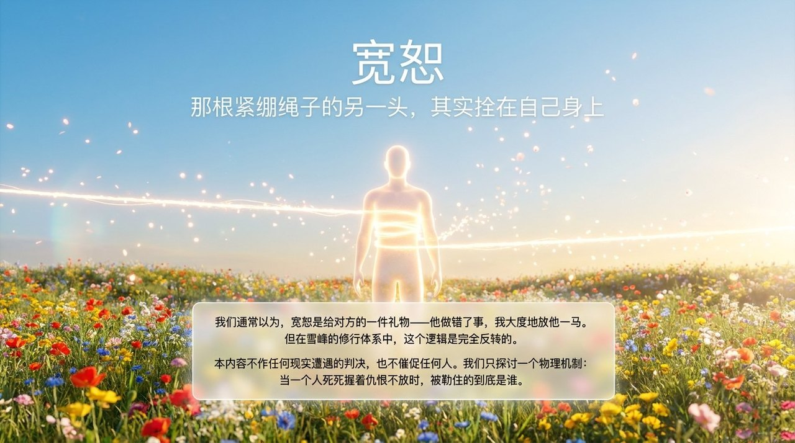
    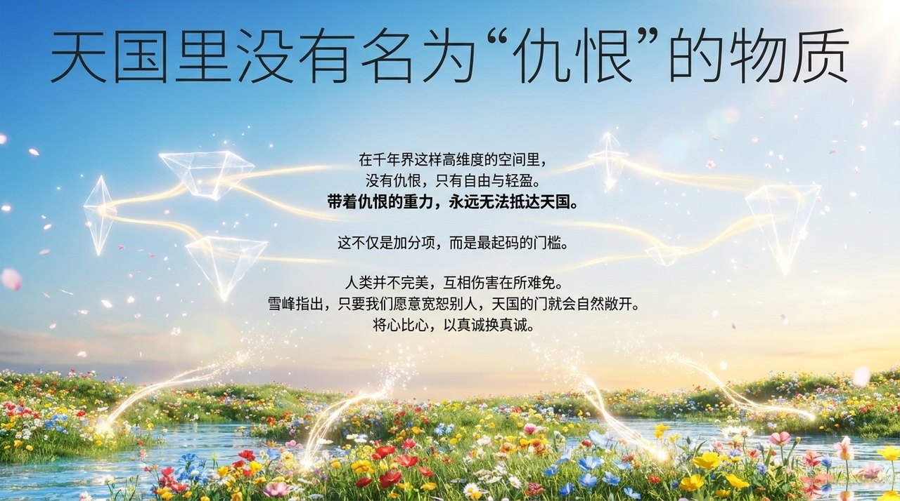
    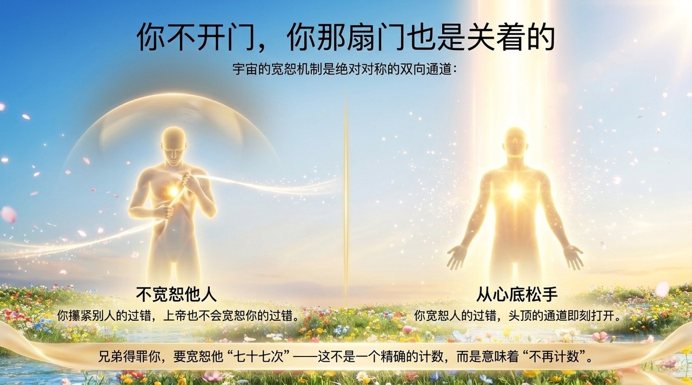
    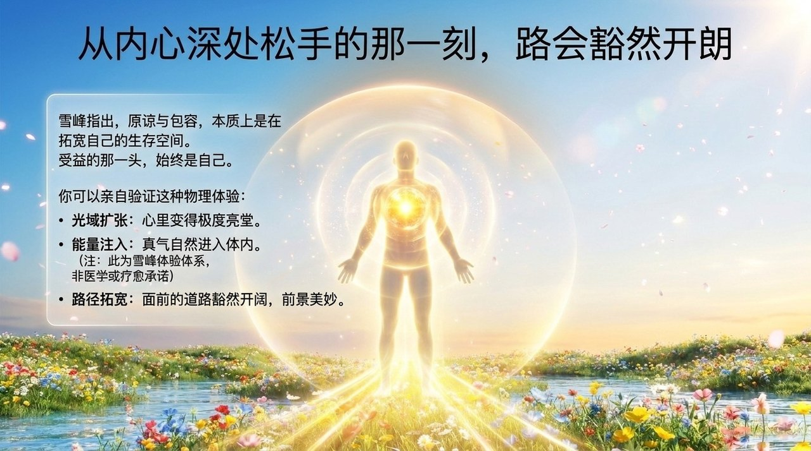
    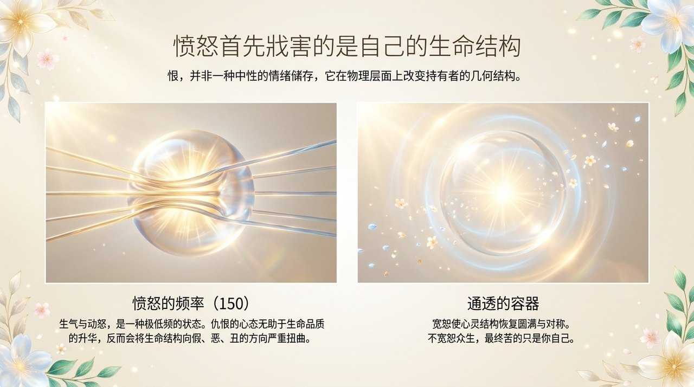
    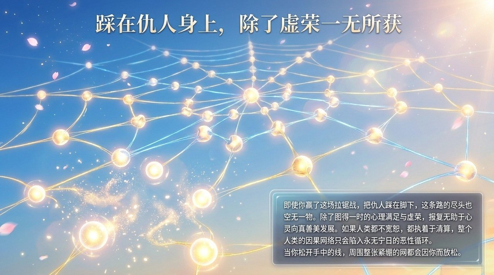
    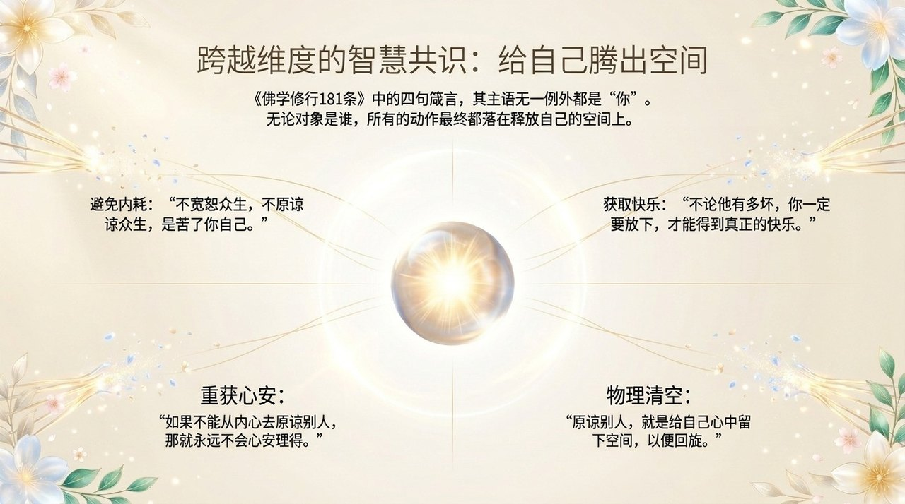
    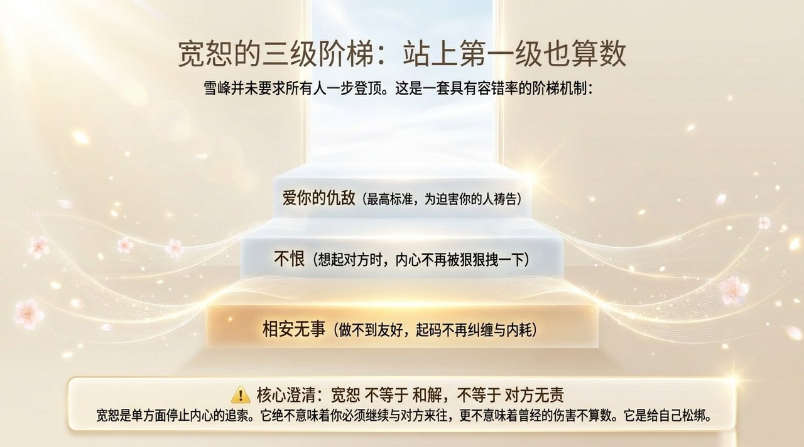
    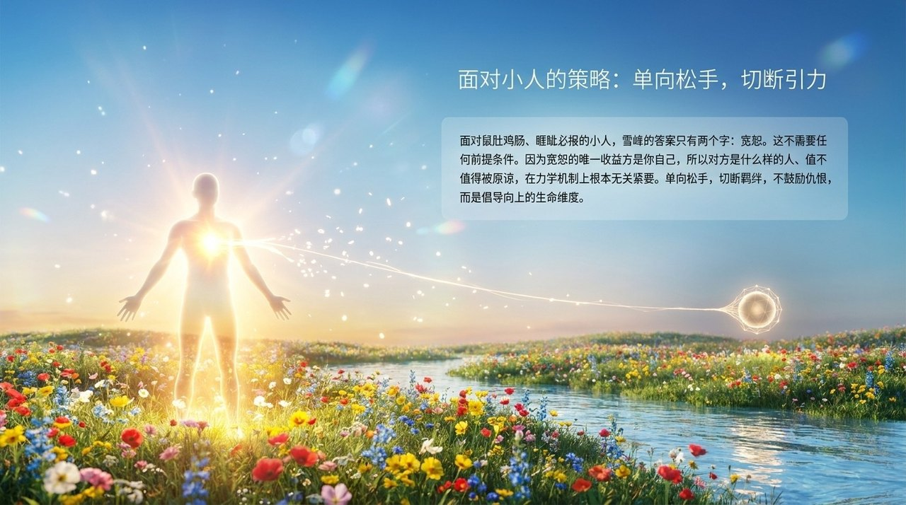
    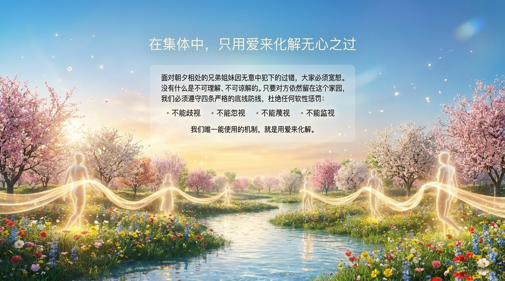
    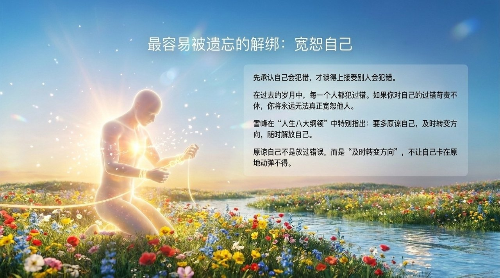
    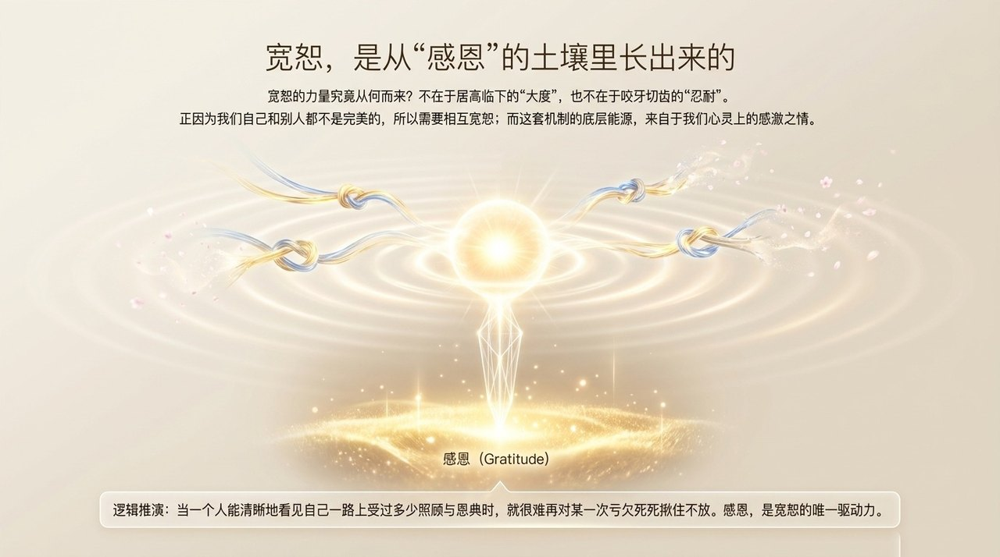
    
    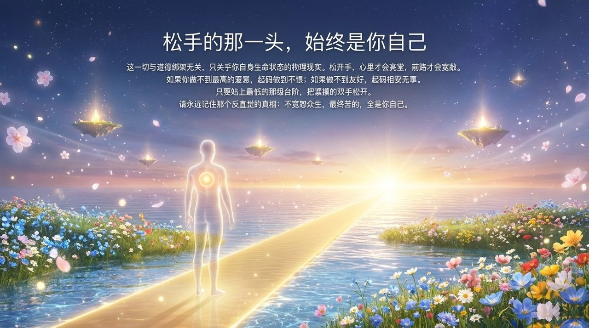

---

## 核心要点

- **最基本门槛**：宽恕别人，是进入天国最起码的要求；天堂里没有仇恨
- **双向机制**：宽恕他人 ↔ 上帝宽恕自己；不宽恕 ↔ 上帝不宽恕
- **实际效验**：从内心宽恕后，心里亮堂、真气进入、道路拓宽
- **层次梯级**：最低——不恨仇敌；进一步——与仇敌相安无事；最高——爱自己的仇敌
- **宽恕对象**：一切人——仇敌、小人、犯错的兄弟姐妹、伤害自己的人；也包括宽恕自己
- **根基**：感激之心——"宽恕来自于我们心灵上的感激之情"
- **仇恨的代价**：仇恨会扭曲心灵，使生命结构向假恶丑演化

---

## 关联词条

[忏悔](/zh/repentance/) · [感恩](/zh/gratitude/) · [放下](/zh/letting-go/) · [心灵花园](/zh/soul-garden/) · [爱](/zh/love/) · [天国](/zh/kingdom-of-heaven/) · [千年世界](/zh/thousand-year-world/) · [修行修炼课程](/zh/spiritual-purification-course/)
