# 无相布施

**无相布施**，是生命禅院修行体系中的关键实践法门之一，指不以自我占有、名利回报、身份标榜为目标的付出与奉献，既是个体偿还累世债务、积累功德的重要路径，也是第二家园共同体建设的重要运行机制。

## 版本导航

| 版本 | 适合 |
|------|------|
| [友好版](friendly/) | 首次接触，内容丰满、可读性强 |
| [学术版](academic/) | 理论研究与引用 |
| [内部版](internal/) | 体系内核心学习，以文集原文为准 |

---

## 视频版

<iframe style="width:100%;aspect-ratio:4/3;border:0" src="https://www.youtube-nocookie.com/embed/0qKmFfEYO54" title="无相布施（生命禅院百科·视频版）" allowfullscreen></iframe>

??? info "📖 图文幻灯（14 张，点击展开）"

    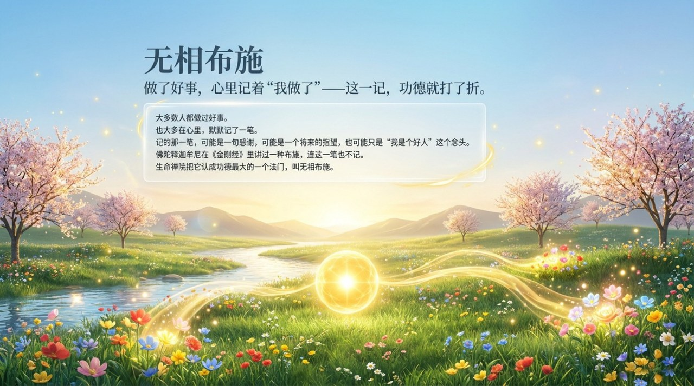
    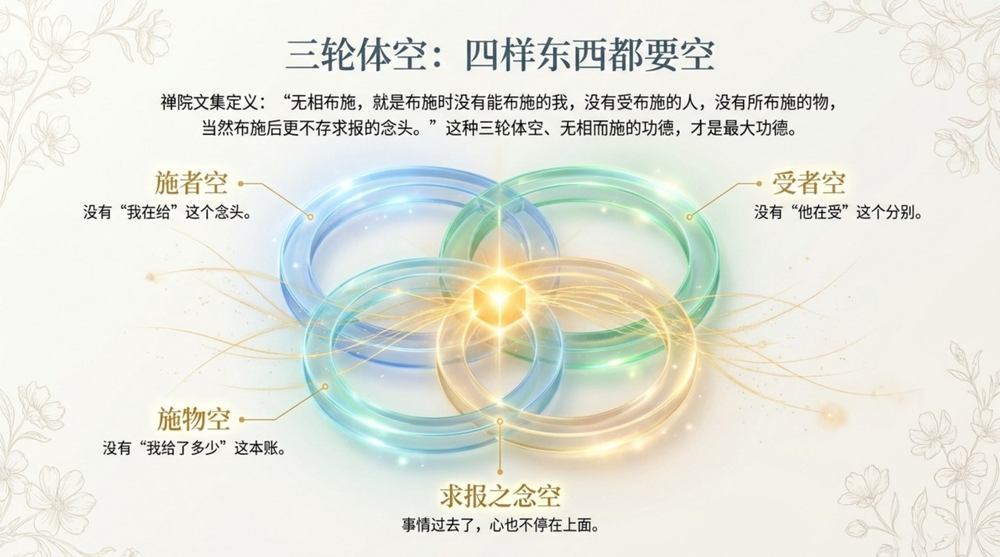
    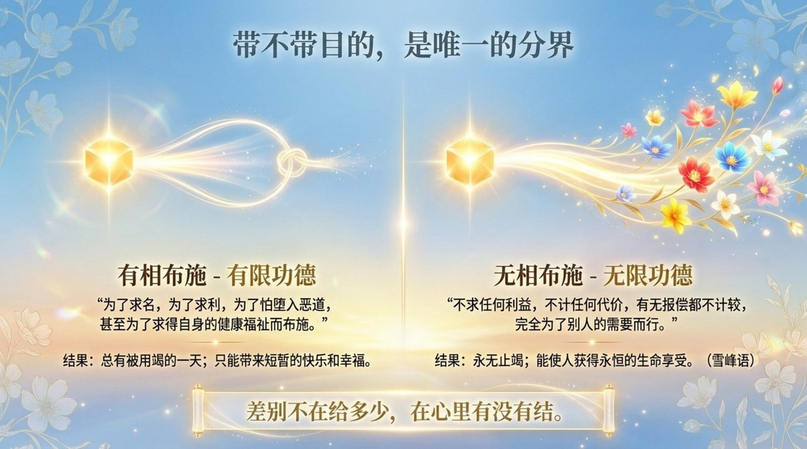
    
    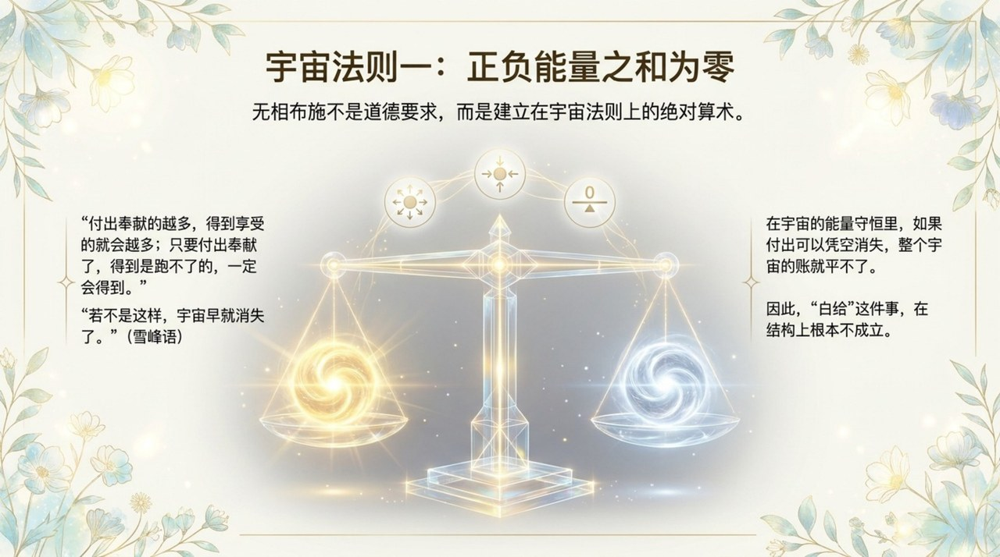
    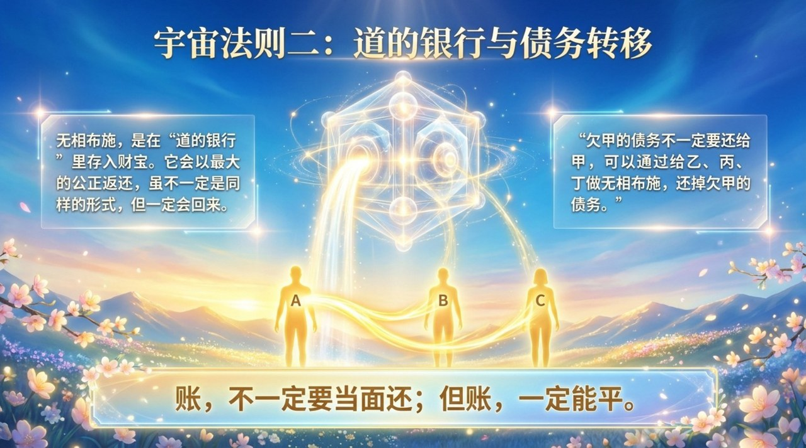
    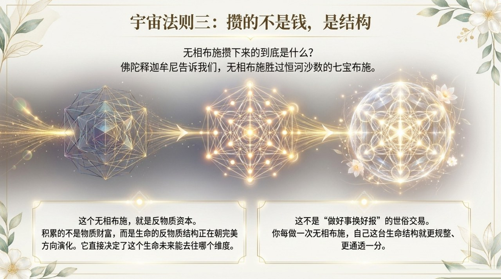
    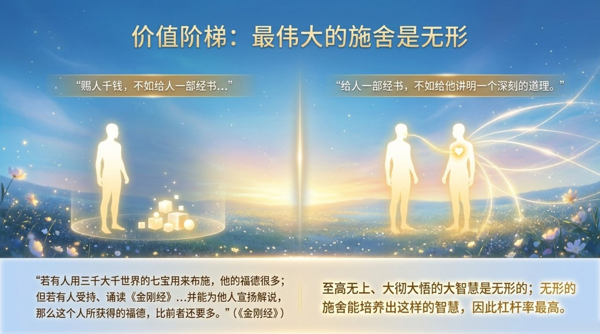
    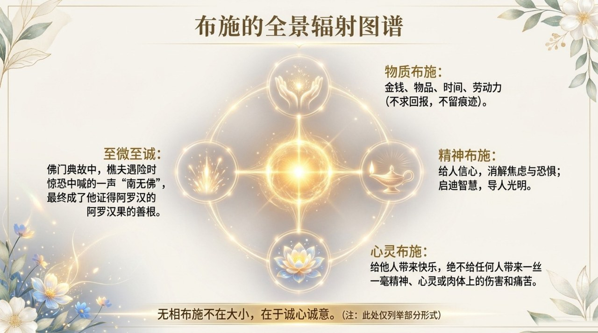
    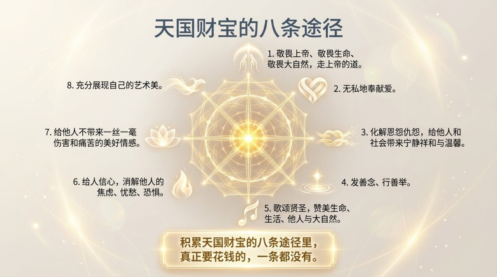
    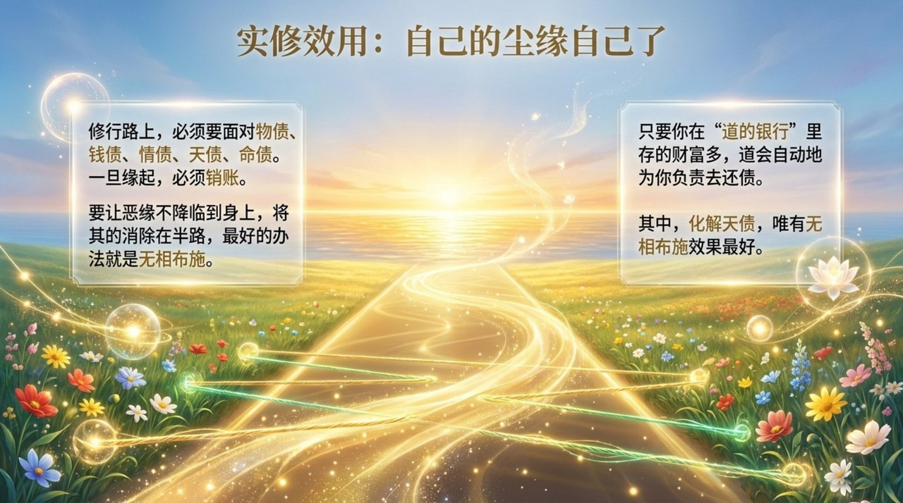
    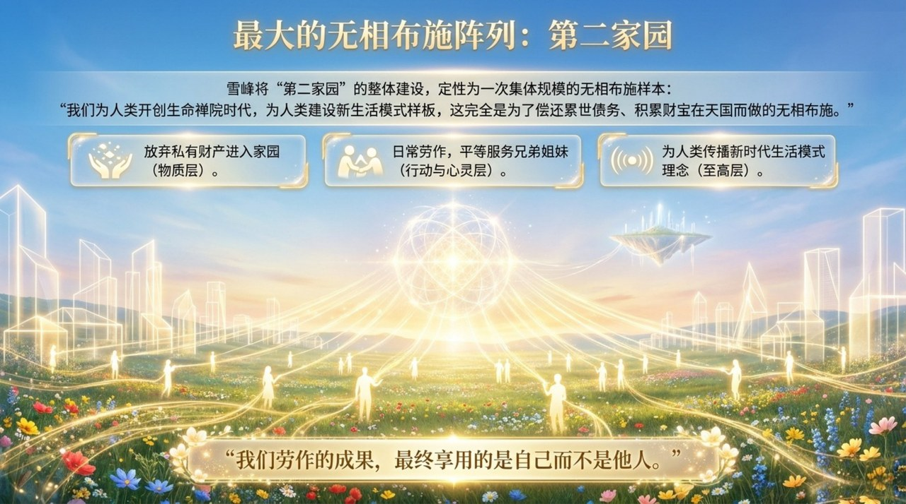
    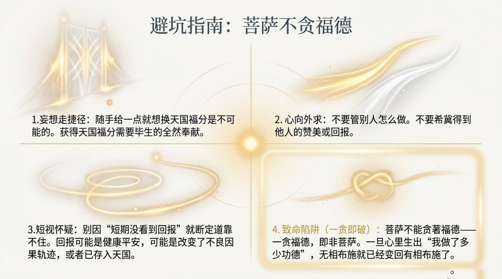
    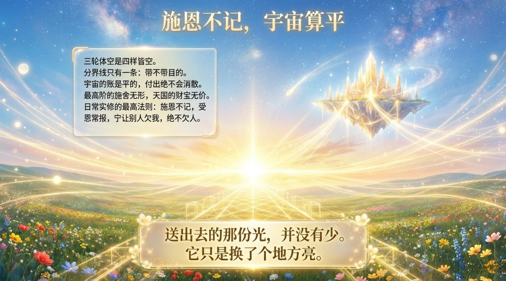

---

## 相关词条

[上帝之道](/zh/way-of-the-greatest-creator/) · [心灵花园](/zh/soul-garden/) · [心灵净化课](/zh/spiritual-purification-course/) · [浑沌管理](/zh/hundun-management/) · [天国天堂](/zh/kingdom-of-heaven/)
