# 感恩

**感恩**，是生命禅院体系中"升华生命品质的第一要素"，是生命反物质结构向完美演化的根本法门，是到达天国的必要品质，也是第二家园的核心文化。感恩与知足、珍惜并列为幸福生活的三密码。其反面——习惯了受惠而忘记了感恩——是人最容易养成且危害最大的不良习惯。

---

## 版本导读

| 版本 | 适合读者 | 入口 |
|------|----------|------|
| 友好版 | 初次接触者 | [阅读友好版](/zh/gratitude/friendly/) |
| 学术版 | 学术研究、跨文化比较 | [阅读学术版](/zh/gratitude/academic/) |
| 内部版 | 禅院草、深度研究者 | [阅读内部版](/zh/gratitude/internal/) |

---

## 视频版

<iframe style="width:100%;aspect-ratio:4/3;border:0" src="https://www.youtube-nocookie.com/embed/L7AbyKaw3w4" title="感恩（生命禅院百科·视频版）" allowfullscreen></iframe>

??? info "📖 图文幻灯（14 张，点击展开）"

    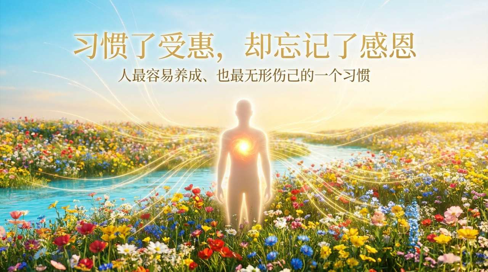
    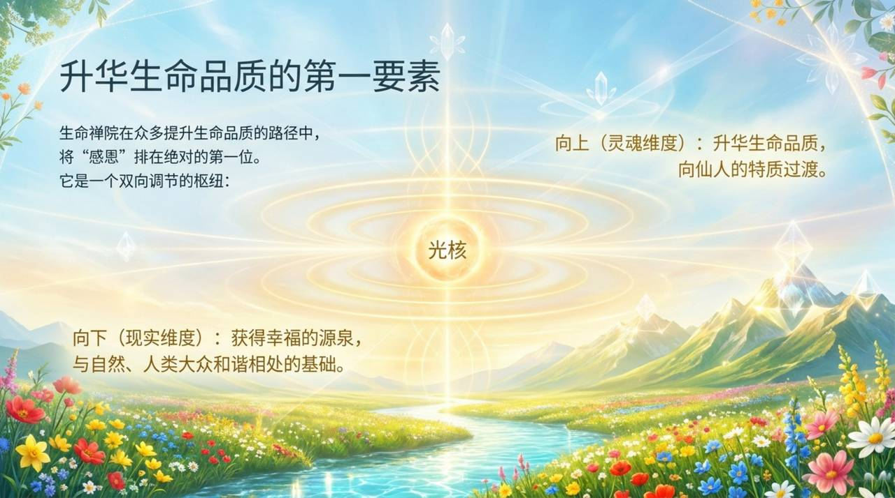
    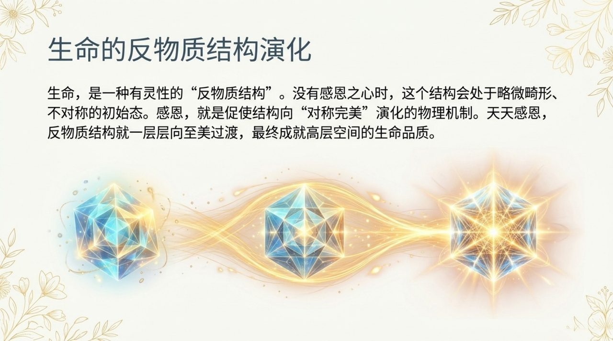
    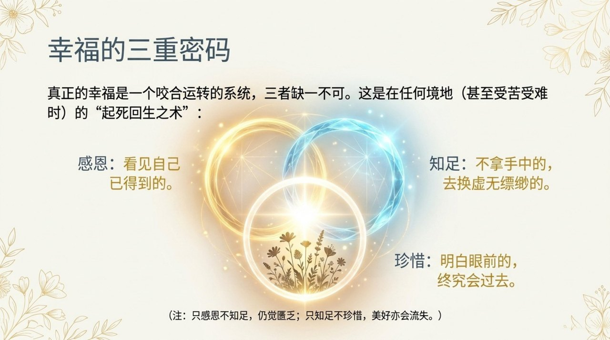
    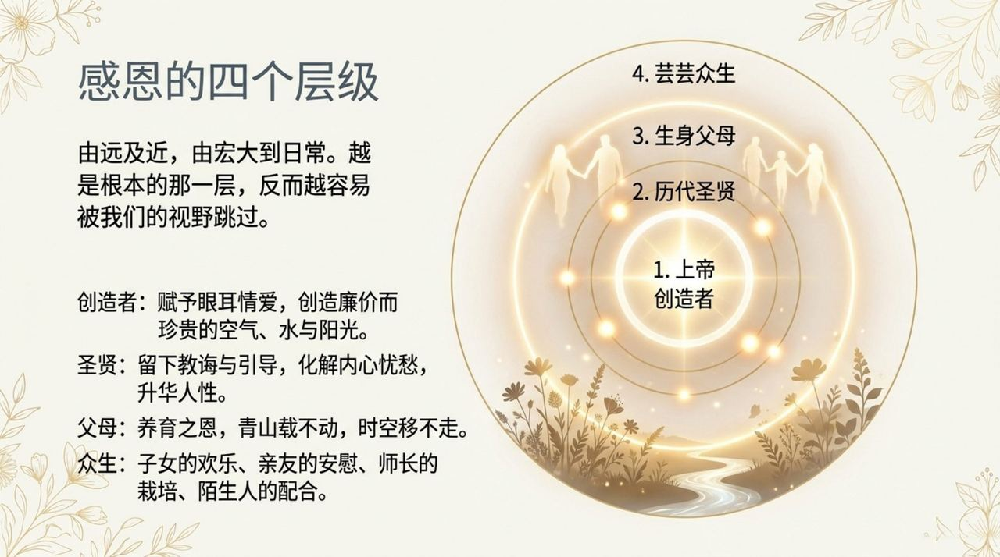
    
    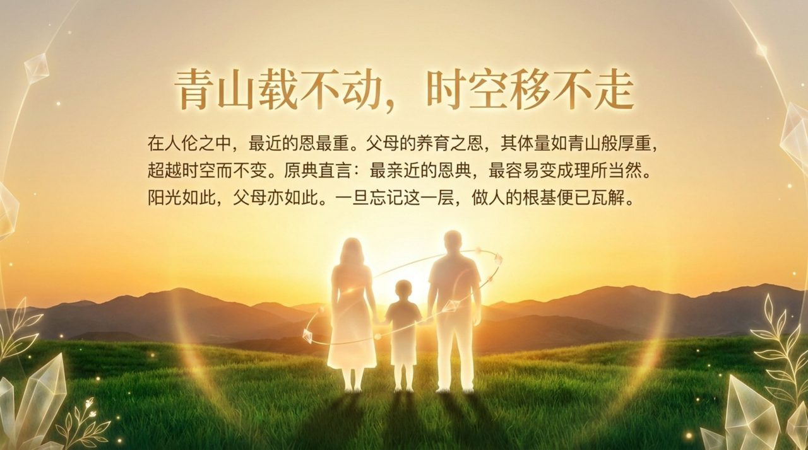
    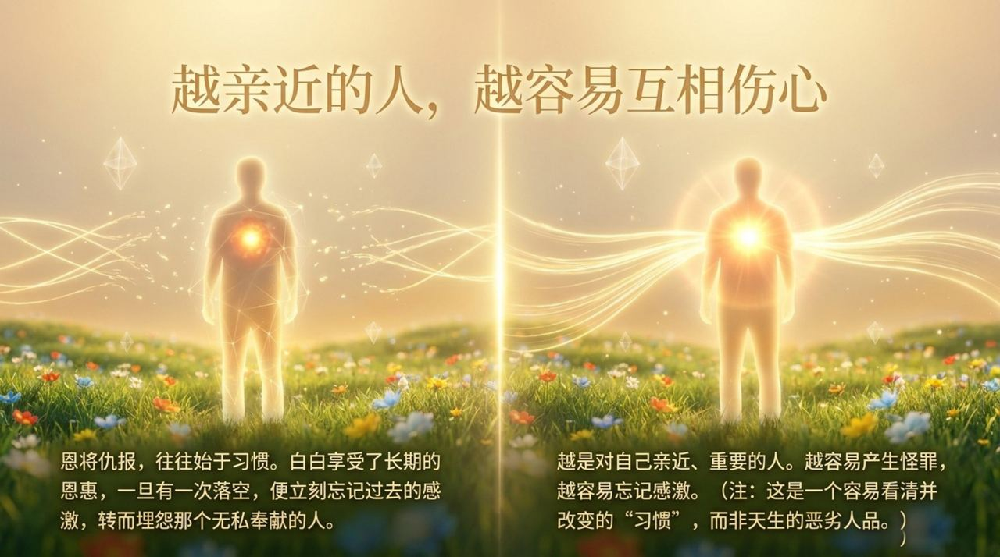
    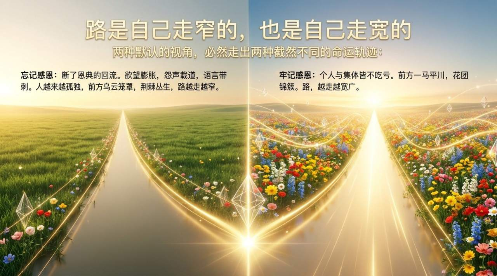
    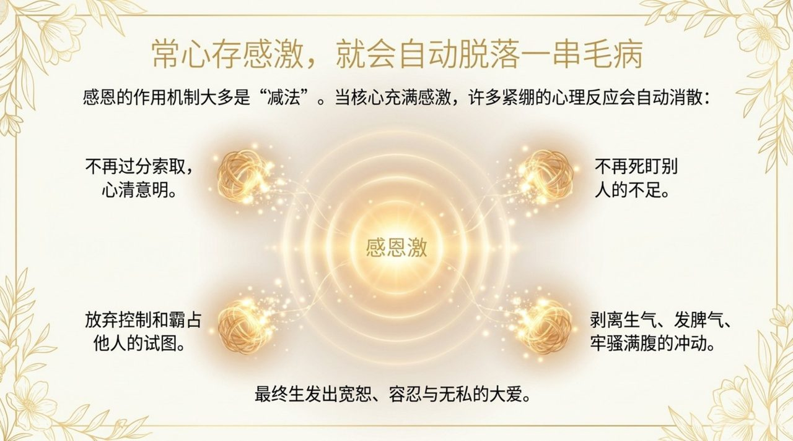
    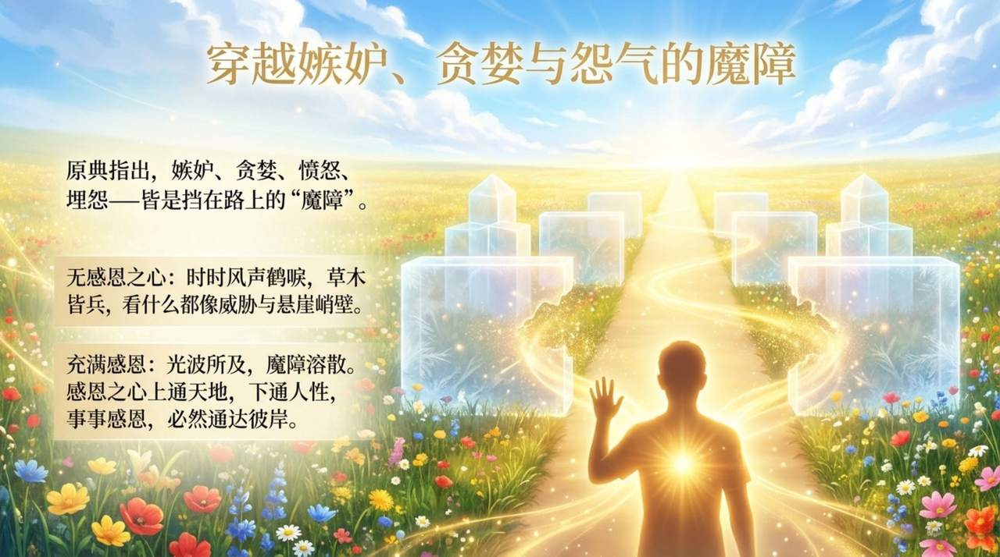
    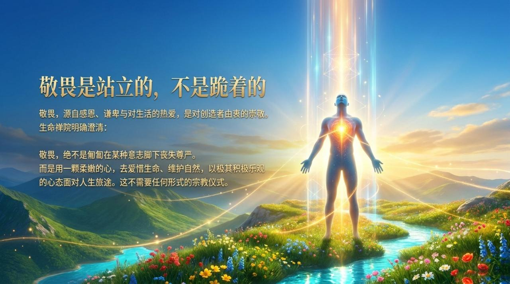
    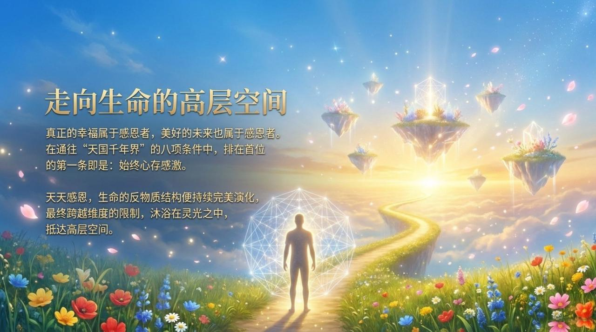
    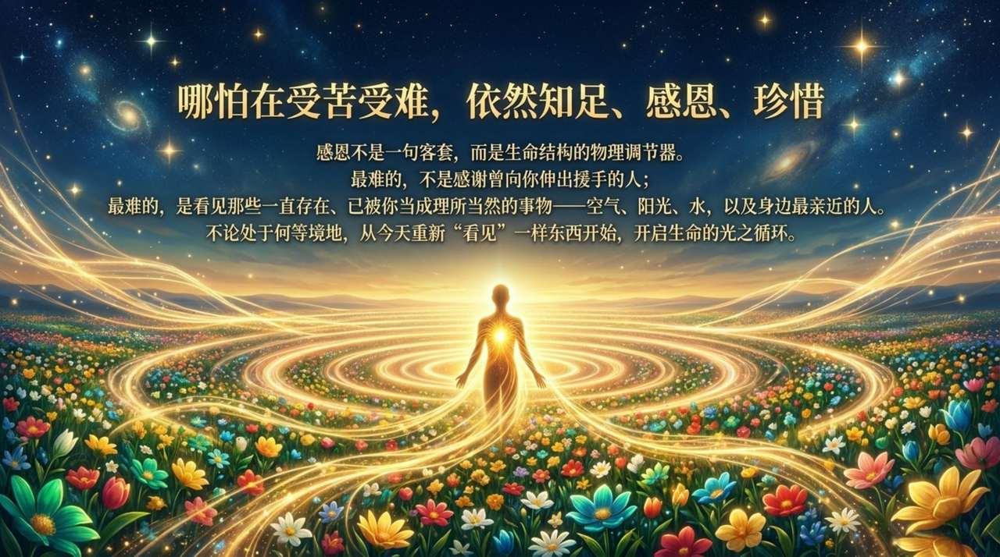

## 相关词条

[觉悟](/zh/awakening/) · [缘](/zh/yuan/) · [无相布施](/zh/formless-giving/) · [道德](/zh/morality/) · [千年界](/zh/thousand-year-world/) · [第二家园](/zh/second-home/) · [心灵花园](/zh/soul-garden/) · [上帝](/zh/greatest-creator/)
