# 上帝是第一生产力

**上帝（Greatest Creator）是第一生产力**——这是生命禅院对传统生产力理论的根本性颠覆。阳光、空气、水、大地，万物的生长繁衍，皆出于上帝的安排；走上帝之道，即是拥有取之不尽的第一生产力。

> "上帝是第一生产力。"
>
> ——《新时代人类八百理念》第四版·第34条

## 视频版

<iframe style="width:100%;aspect-ratio:4/3;border:0" src="https://www.youtube-nocookie.com/embed/d1sSlMJuPPg" title="上帝是第一生产力（生命禅院百科·视频版）" allowfullscreen></iframe>

??? info "📖 图文幻灯（14 张，点击展开）"

    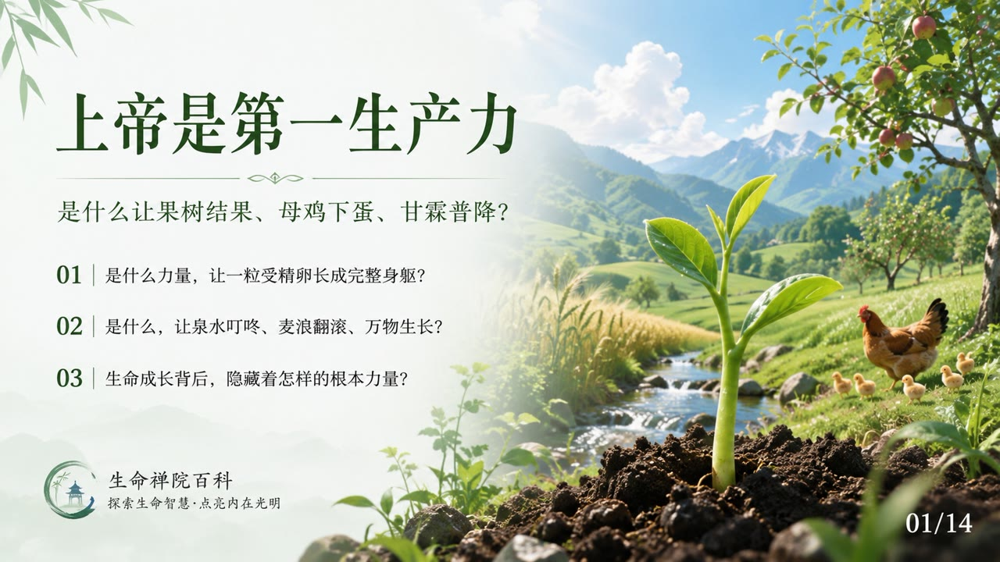
    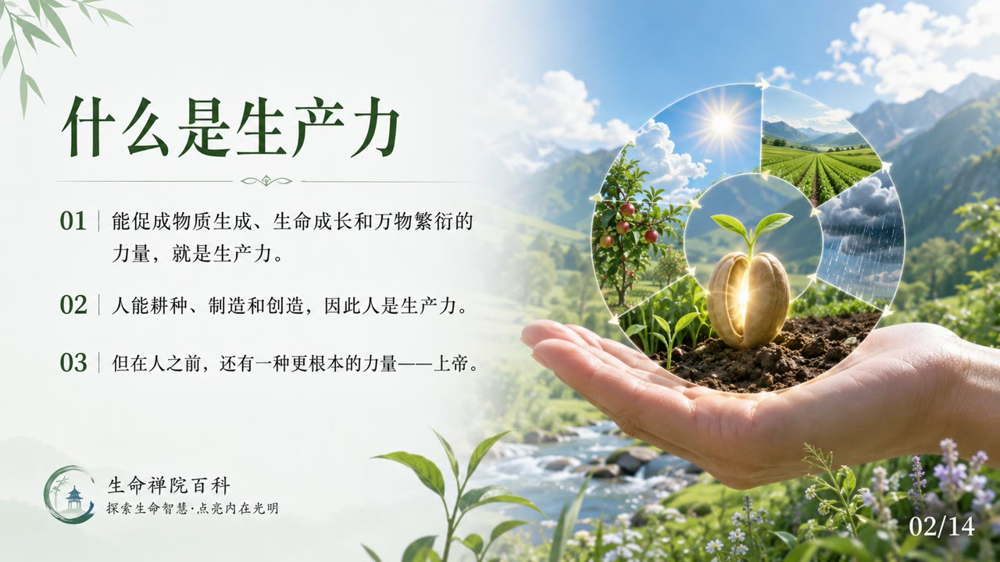
    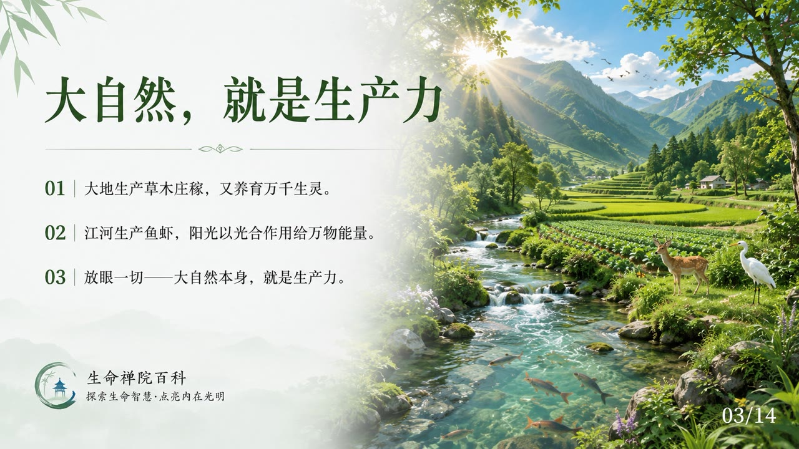
    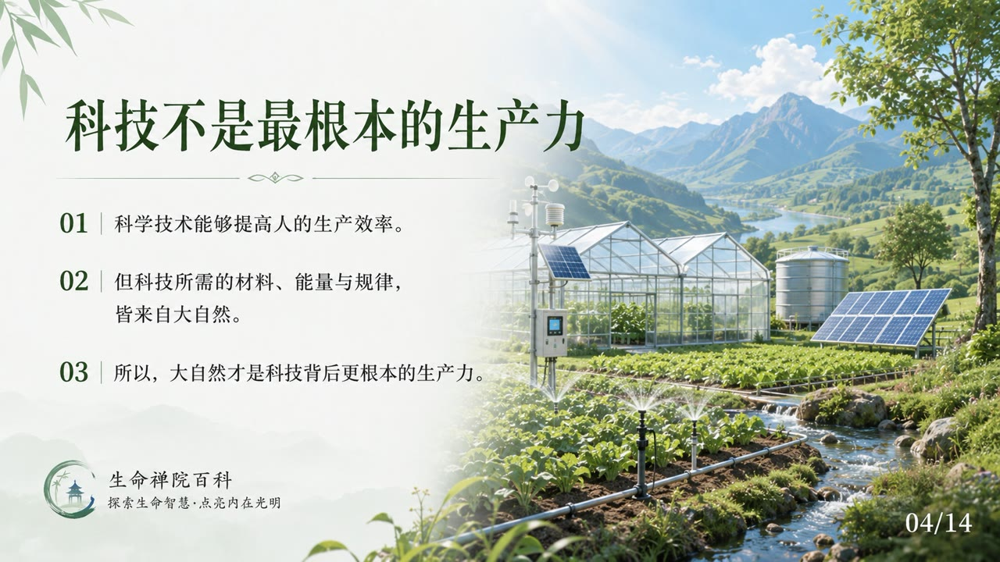
    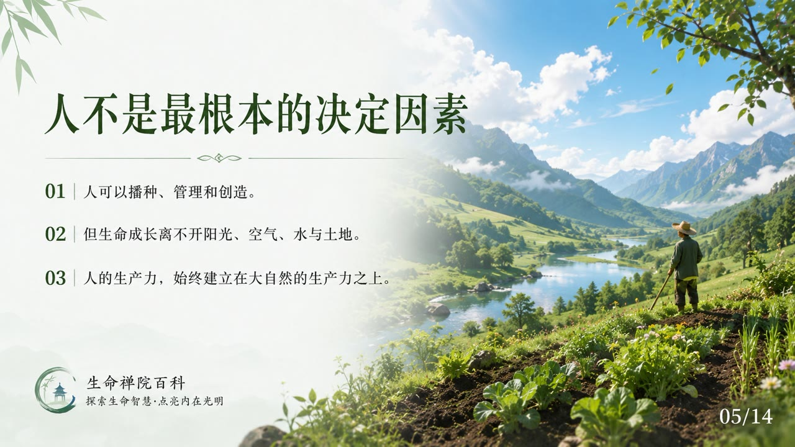
    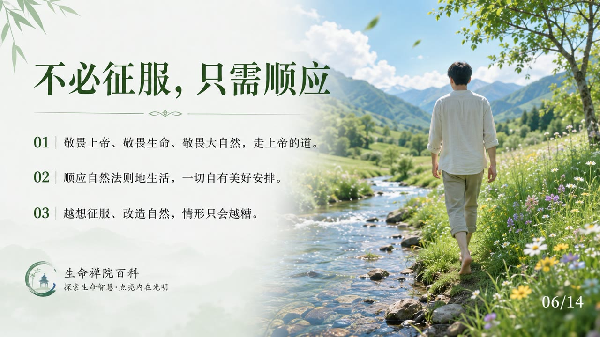
    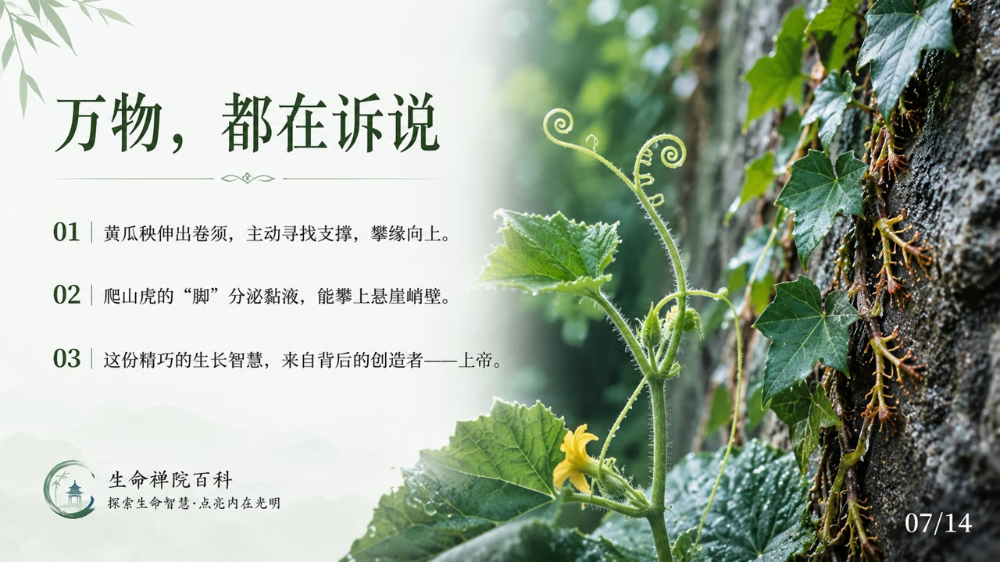
    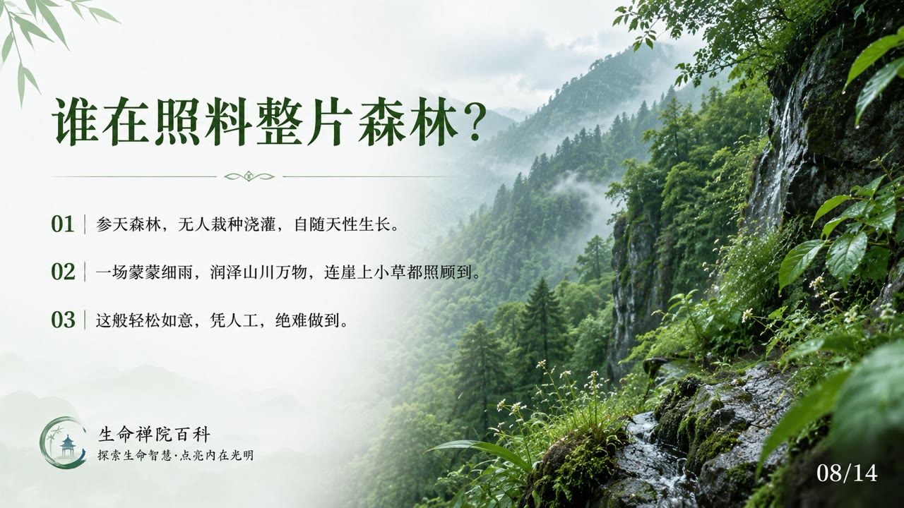
    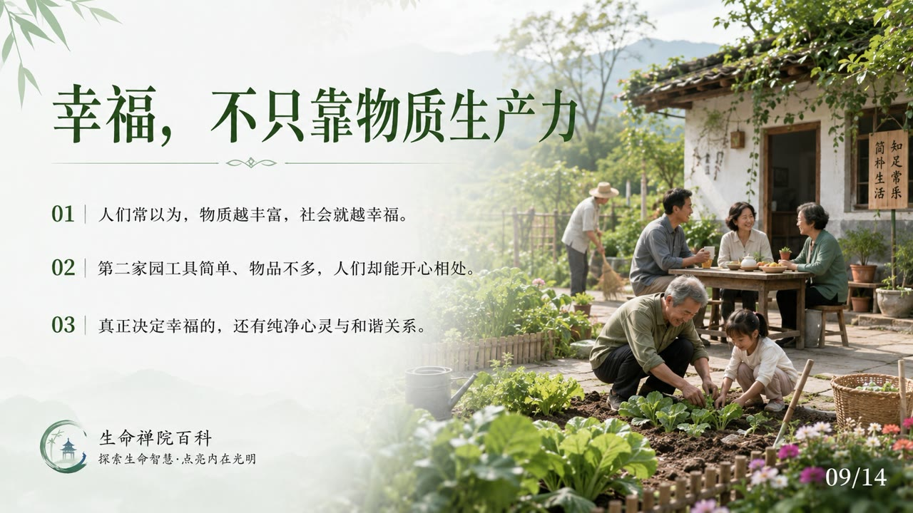
    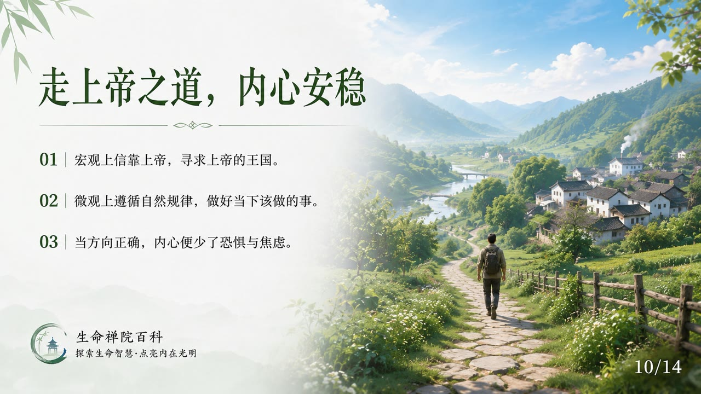
    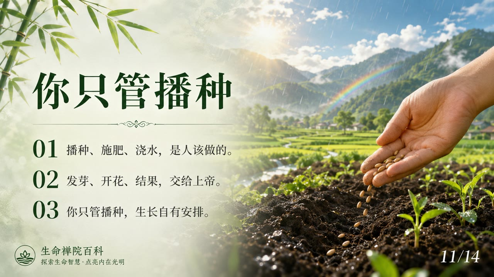
    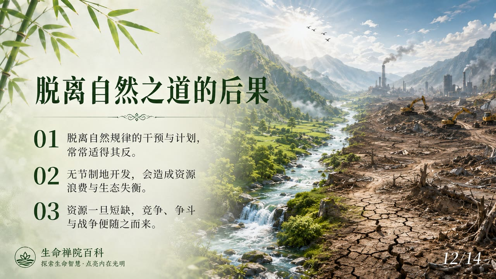
    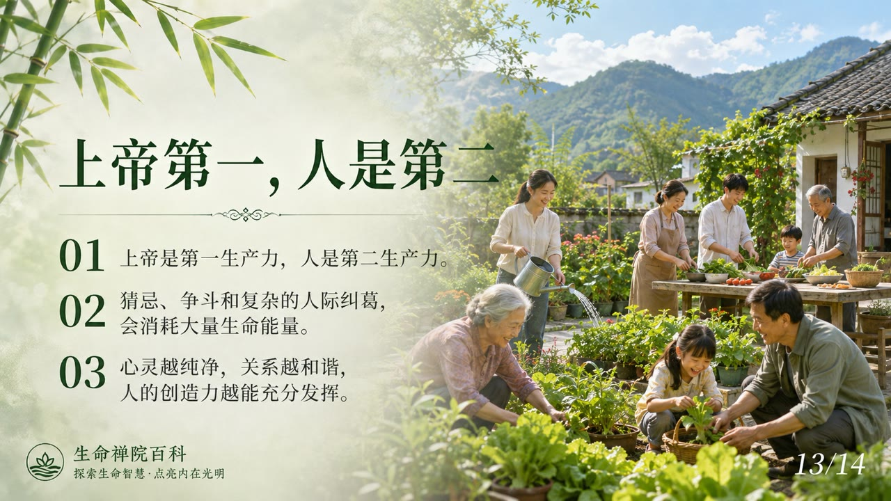
    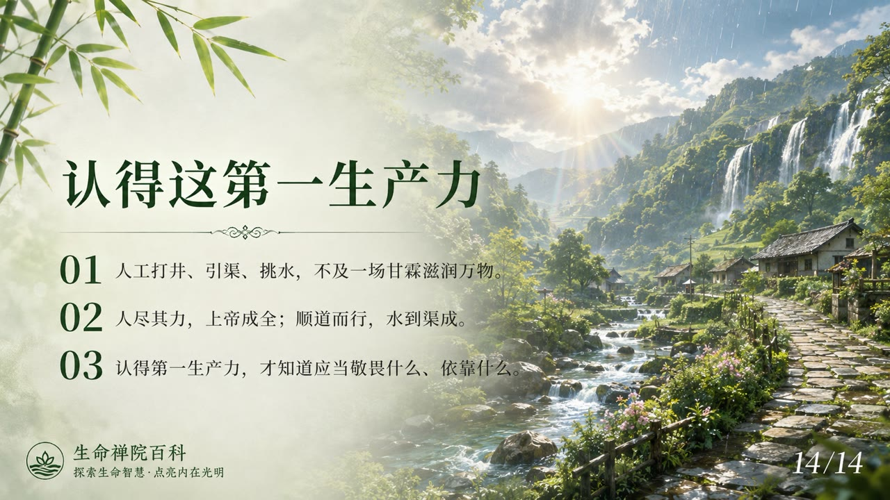

## 版本导航

| 版本 | 适合 | 核心角度 |
|------|------|----------|
| [友好版](friendly.md) | 初次了解 | 生活类比，讲清为何上帝才是真正的生产力 |
| [学术版](academic.md) | 研究者 | 系统分析定义、辨析与比较研究 |
| [内部版](internal.md) | 深度研修 | 文集全文，一字不改 |

## 相关词条

[上帝](/zh/greatest-creator/) · [上帝之道](/zh/way-of-the-greatest-creator/) · [道](/zh/dao/) · [第二家园](/zh/second-home/) · [雪峰式共产主义](/zh/xuefeng-communism/) · [浑沌经济·市场经济·计划经济](/zh/hundun-economy/) · [生命禅院时代（新时代）](/zh/lifechanyuan-new-era/) · [天国财宝](/zh/heavenly-treasures/)
