# 上帝

**上帝**，在生命禅院理论体系中，是宇宙的创造者与主宰，是太极（宇宙从无极中诞生的第一个有序结构），是道、如来、耶和华、真主安拉的同一本体，是真善美爱信诚的总体属性，是禅院草修行修炼的最高敬畏对象。

## 视频版

<iframe style="width:100%;aspect-ratio:4/3;border:0" src="https://www.youtube-nocookie.com/embed/337ZQ3-U-I8" title="上帝（生命禅院百科·视频版）" allowfullscreen></iframe>

??? info "📖 图文幻灯（12 张，点击展开）"

    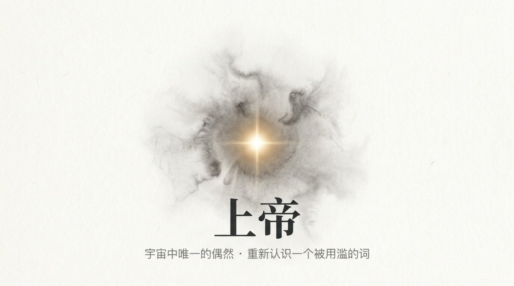
    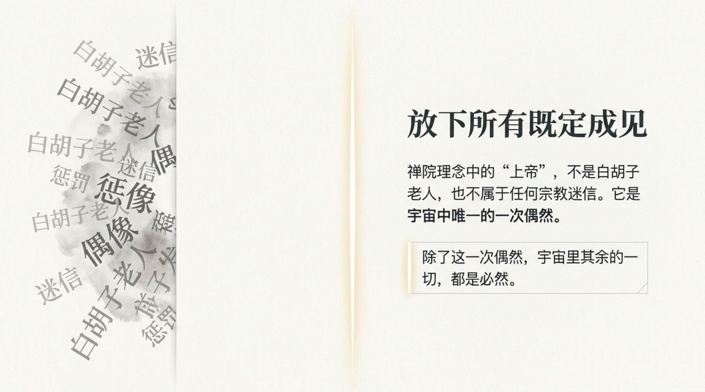
    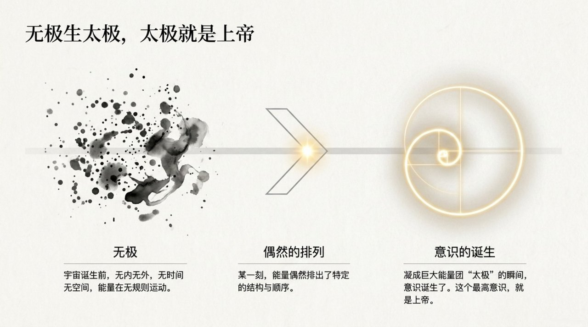
    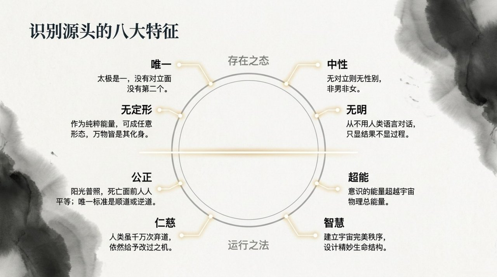
    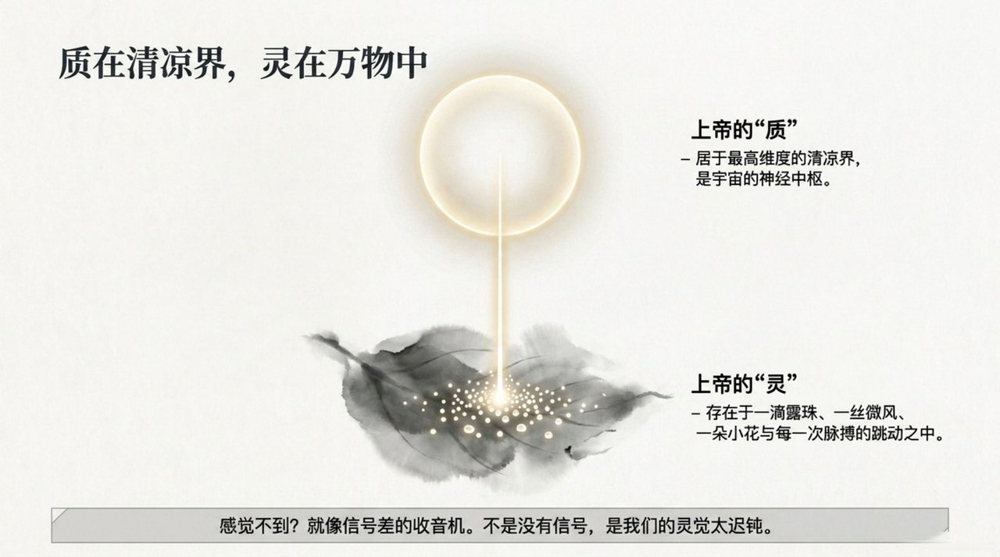
    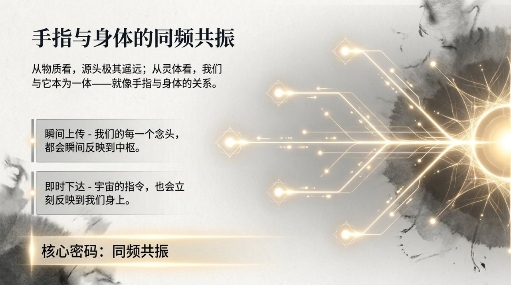
    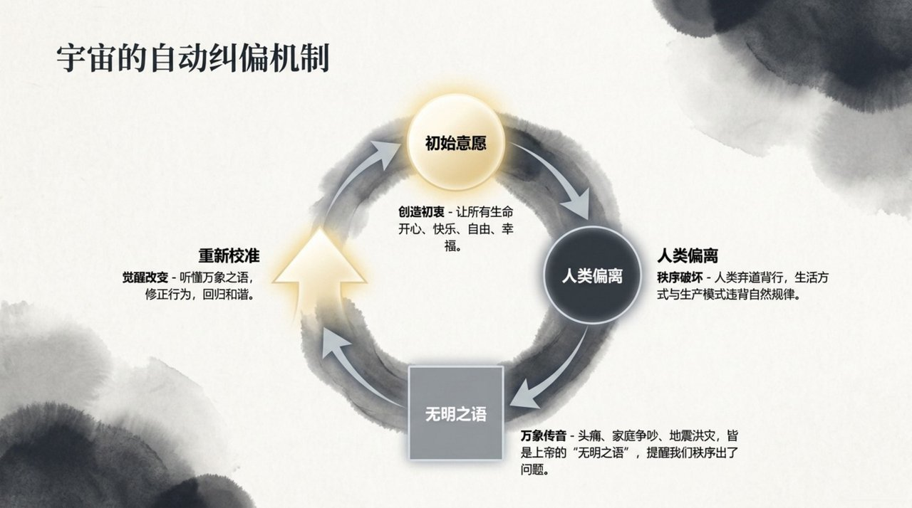
    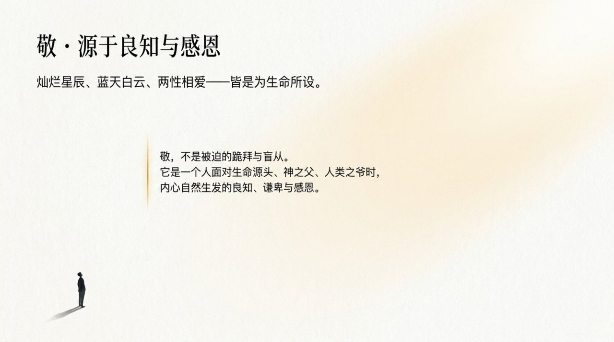
    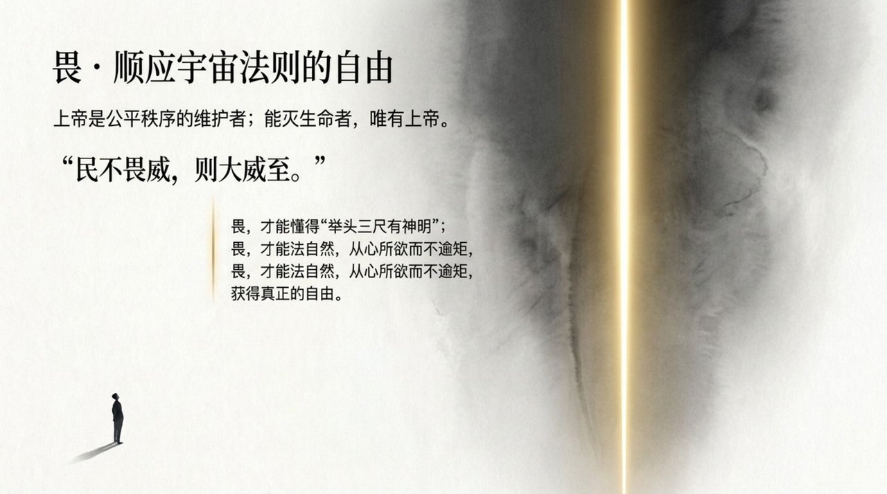
    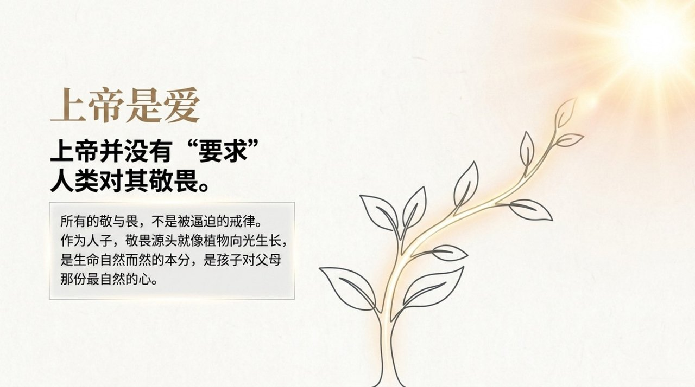
    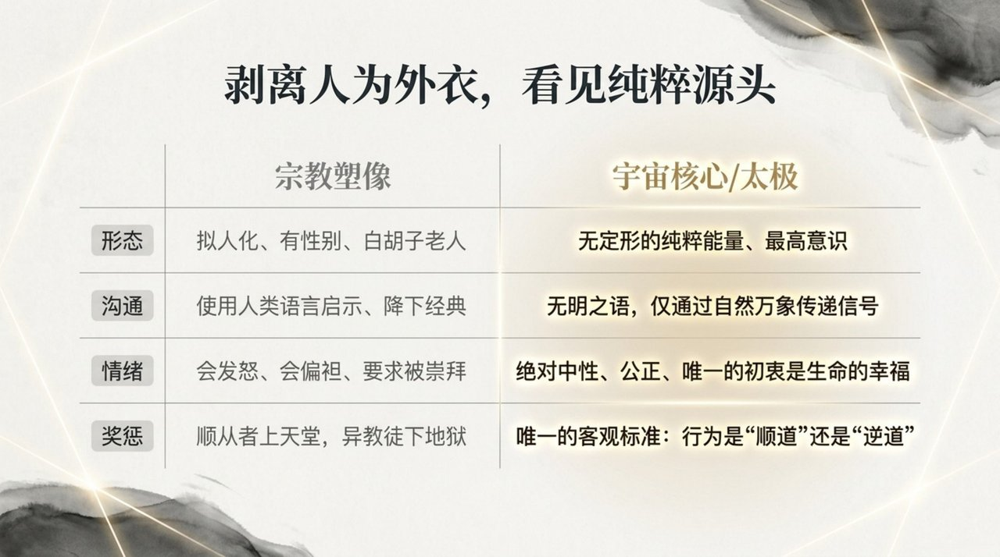
    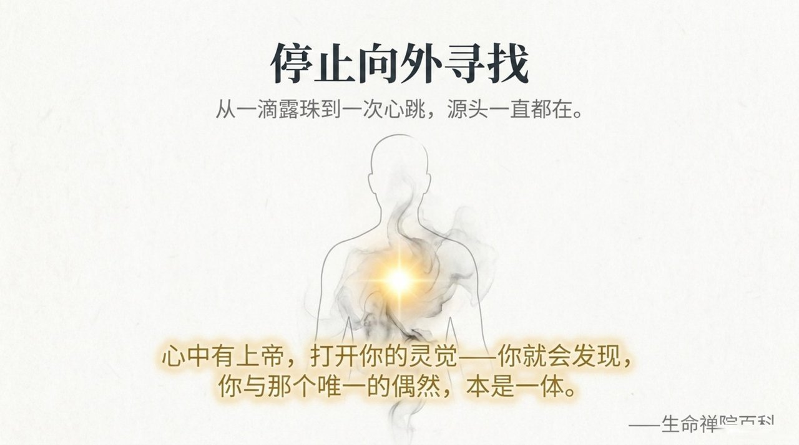

## 版本导航

| 版本 | 适合 |
|------|------|
| [友好版](friendly/) | 首次接触，内容丰满、可读性强 |
| [学术版](academic/) | 理论研究与引用 |
| [内部版](internal/) | 体系内核心学习，以母版为准 |

## 相关词条

[无极](/zh/wuji/) · [太极](/zh/taiji/) · [道](/zh/dao/) · [上帝之道](/zh/way-of-the-greatest-creator/)
