<!-- id: LC-HH-0001-ZH theme: Cultivation type: Entry lang: zh -->

# 心灵神交

> **心有灵犀，一个眼神，一个姿势，一个表情，一个动作，一句话，打开了一扇如诗如画无限灿烂的大门……空间消失，时间不在，唯有灵在闪，魂在飘，极乐无穷，无边无际，不渴不饿，不乏不累，心无所住，心无挂碍，妙不可言，喜难言说，这就是心灵神交。**
>
> — 雪峰，禅院文集·传道篇《心灵神交》，2012-9-23

---

心灵神交，是心灵交流的最高境界——不是信息在两个灵魂之间流动，而是两个灵魂彻底融合为一。它超越距离，超越时间，超越物质，是生命所能达到的最高联结状态之一。

心灵神交的条件只有一个：振动频率的完全契合。因此它不是技巧，而是修炼成果的体现——是修行者抵达一定灵性高度后自然发生的生命现象。

---

## 版本导航

| 版本 | 适合读者 | 链接 |
|------|----------|------|
| 友好版 | 初次接触，希望先感受 | [→ 读友好版](friendly.md) |
| 学术版 | 希望系统了解概念框架 | [→ 读学术版](academic.md) |
| 内参版 | 深度研究，原文引用 | [→ 读内参版](internal.md) |

---

## 视频版

<iframe style="width:100%;aspect-ratio:4/3;border:0" src="https://www.youtube-nocookie.com/embed/k2wDD4-tJaQ" title="心灵神交（生命禅院百科·视频版）" allowfullscreen></iframe>

??? info "📖 图文幻灯（14 张，点击展开）"

    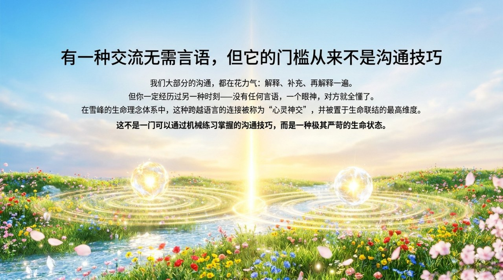
    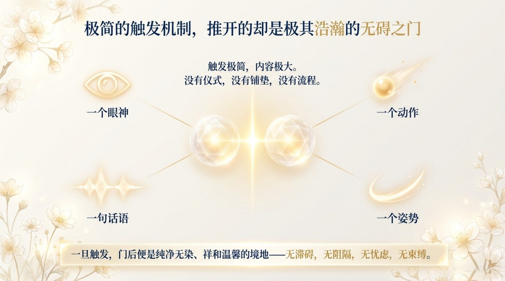
    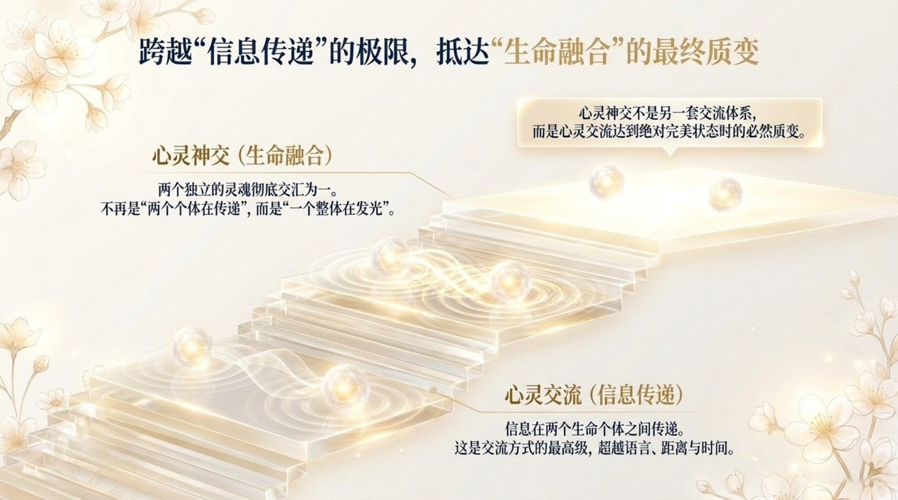
    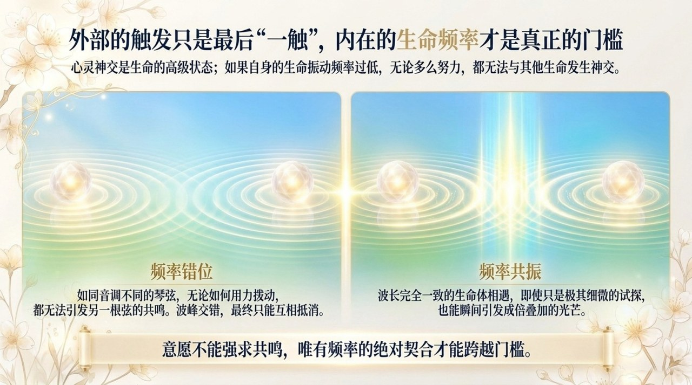
    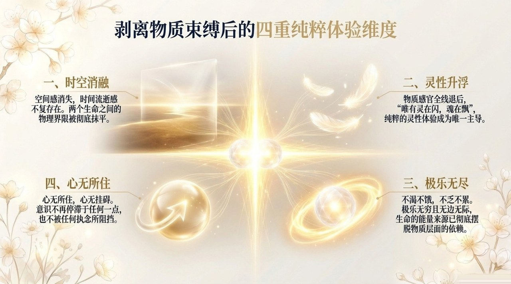
    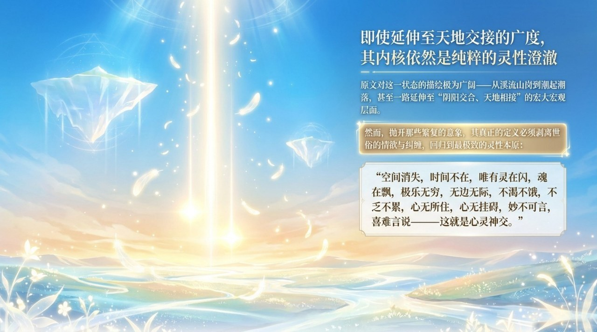
    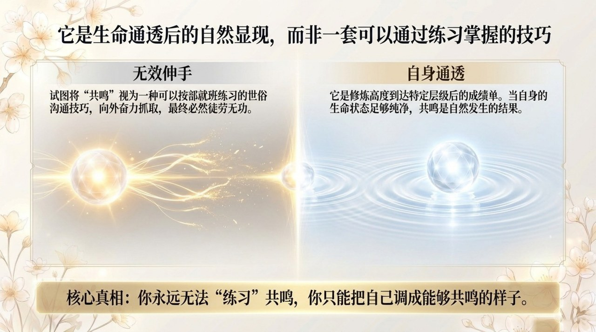
    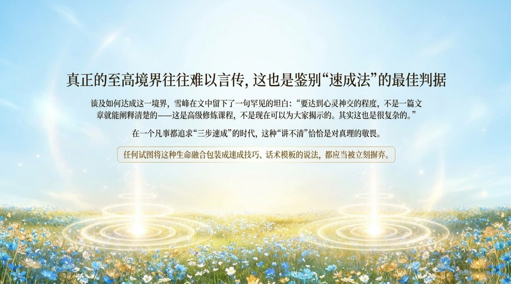
    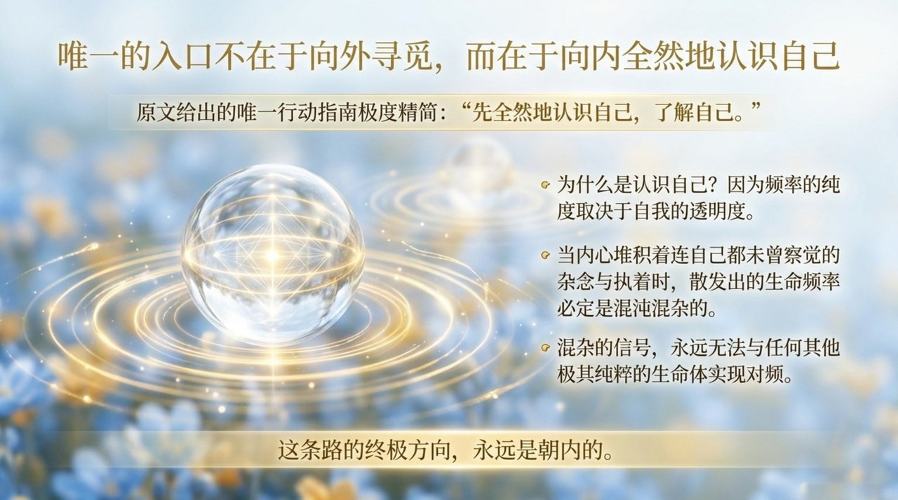
    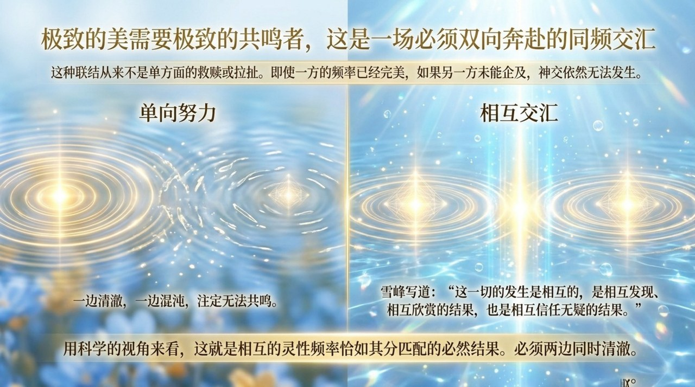
    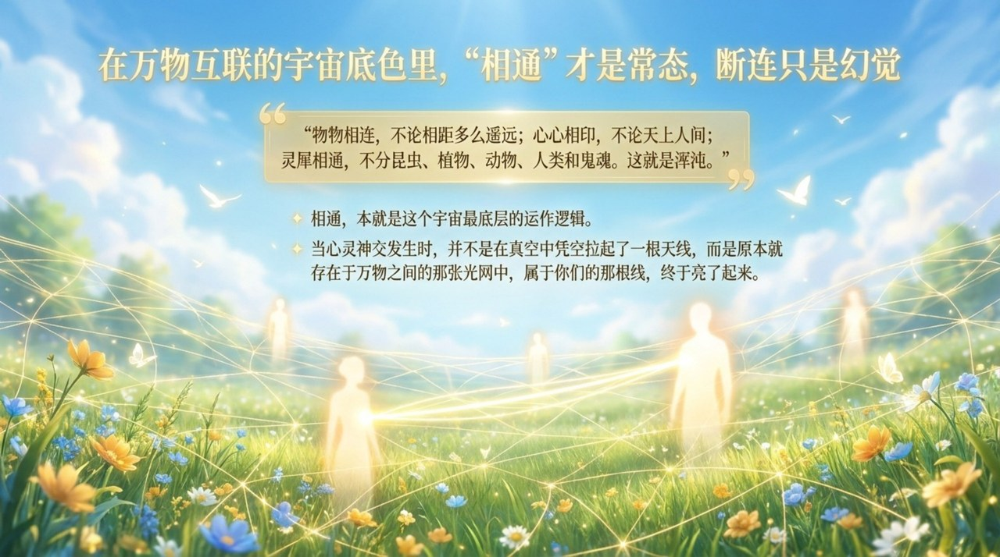
    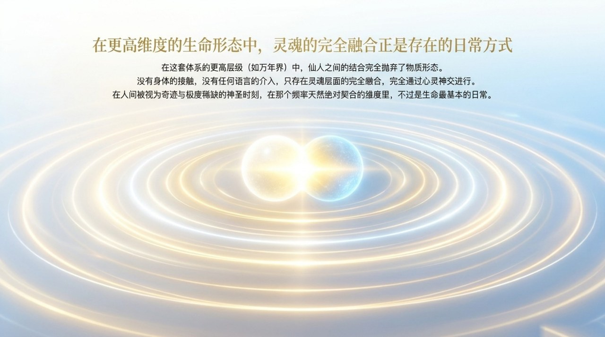
    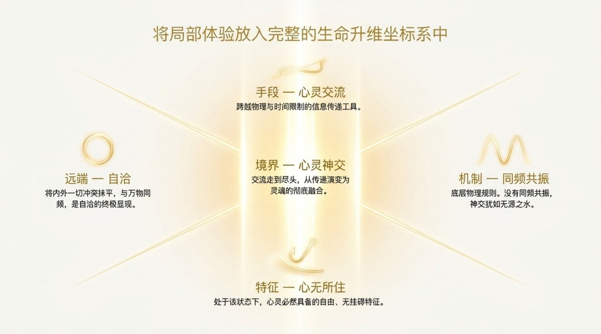
    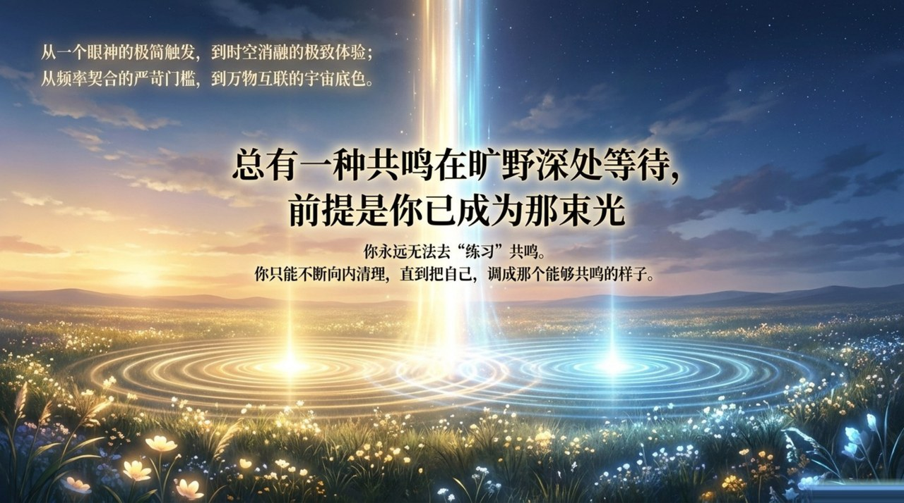

---

## 相关词条

[心灵交流](/zh/soul-communication/) · [同频共振](/zh/resonance/) · [极乐妙境](/zh/jilemiaojing/) · [心无所住·心无挂碍](/zh/xinwu-suozhu-guaai/) · [万年界](/zh/ten-thousand-year-world/) · [振动频率](/zh/raise-vibration-frequency/)
