# 浑沌经济·市场经济·计划经济

**浑沌经济**，是生命禅院体系中提出的高级文明经济形态，拷贝天堂运行机制，以F币取代货币、以AI精准调配取代计划、以"各尽所能按需索取"取代竞争；与之对照，**计划经济**和**市场经济**被视为人类现行的两种原始野蛮经济模式——前者必将导致贫穷落后，后者终将摧毁地球生态、导致人类灭亡。

> "计划经济体制一定会导致贫穷愚昧和野蛮落后，市场经济体制必将导致地球生态崩溃而人类灭亡，唯有浑沌经济体制才是人类走向文明的最佳途径。"
>
> ——雪峰《浑沌经济学简介》，2024-12-18

| 版本 | 适合 | 核心角度 |
|------|------|----------|
| [友好版](friendly.md) | 初次了解 | 生活类比，讲清三种经济的优劣与浑沌经济蓝图 |
| [学术版](academic.md) | 研究者 | 系统分析定义、原则与比较研究 |
| [内部版](internal.md) | 深度研修 | 文集全文，一字不改 |

---

## 视频版

<iframe style="width:100%;aspect-ratio:4/3;border:0" src="https://www.youtube-nocookie.com/embed/jtPF24FvlbY" title="浑沌经济·市场经济·计划经济（生命禅院百科·视频版）" allowfullscreen></iframe>

??? info "📖 图文幻灯（14 张，点击展开）"

    
    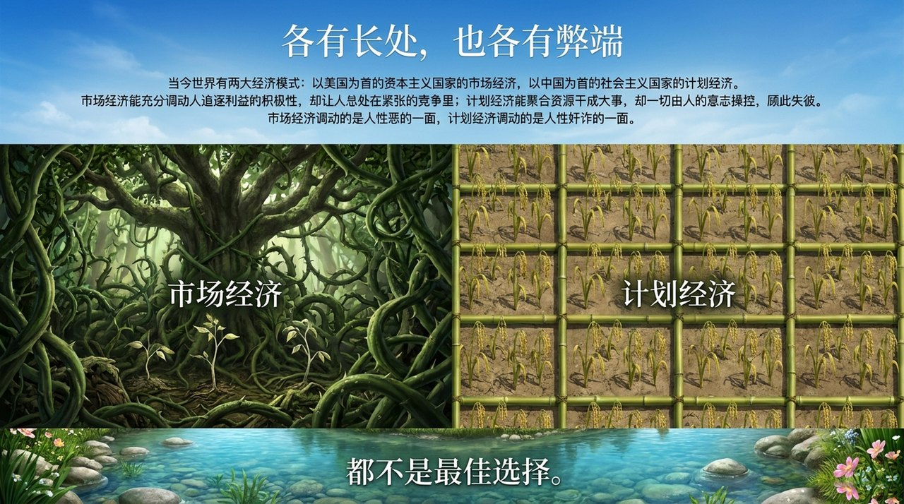
    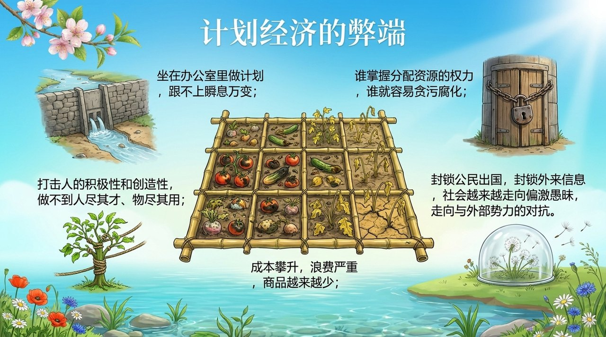
    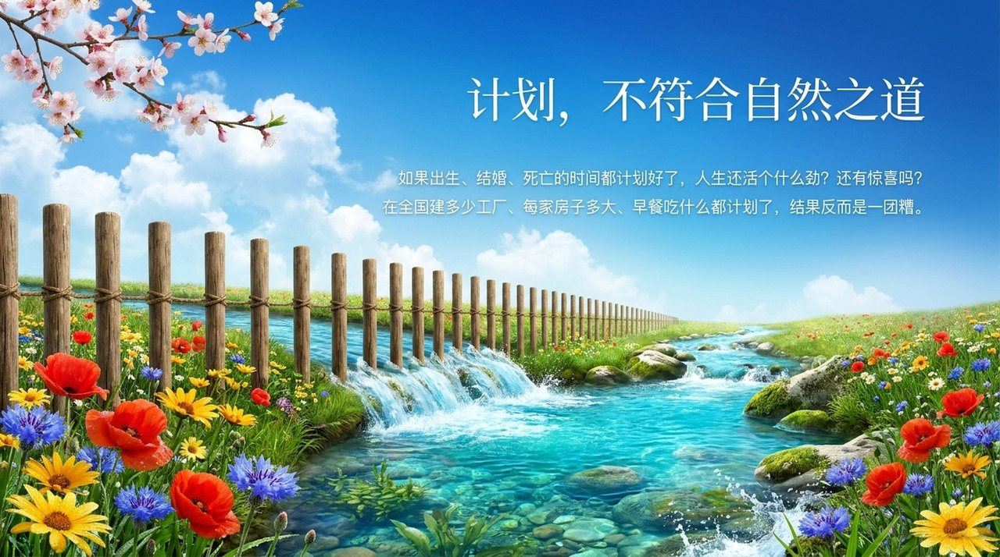
    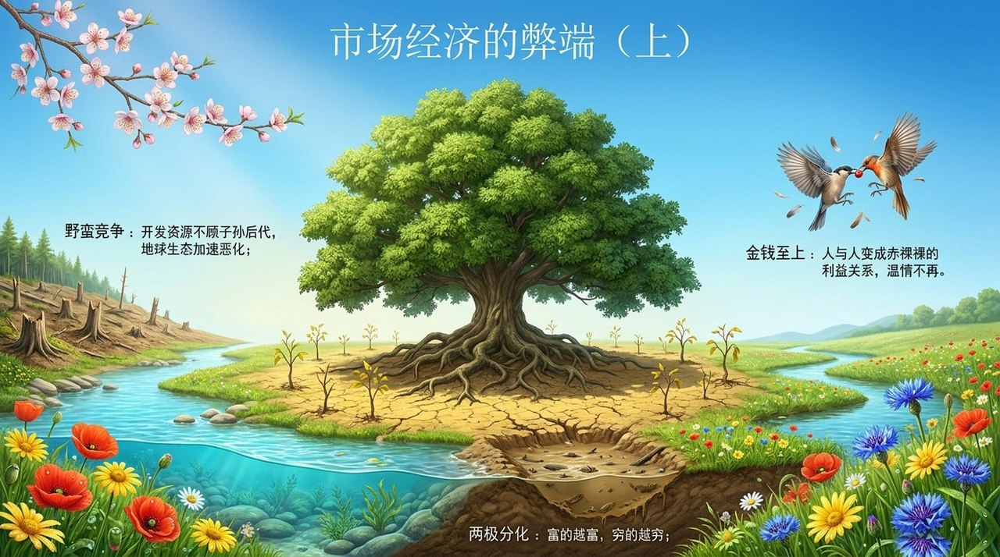
    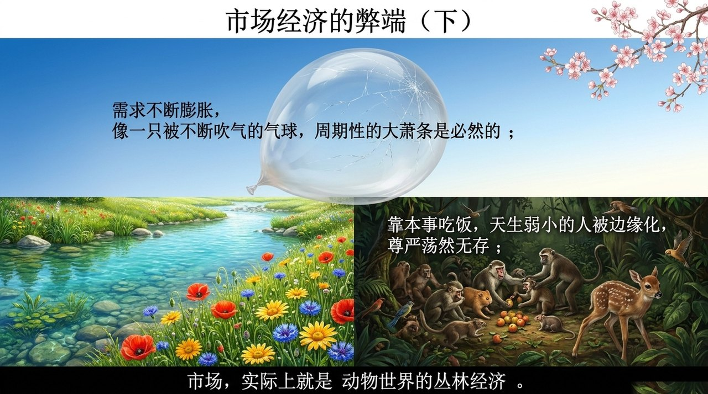
    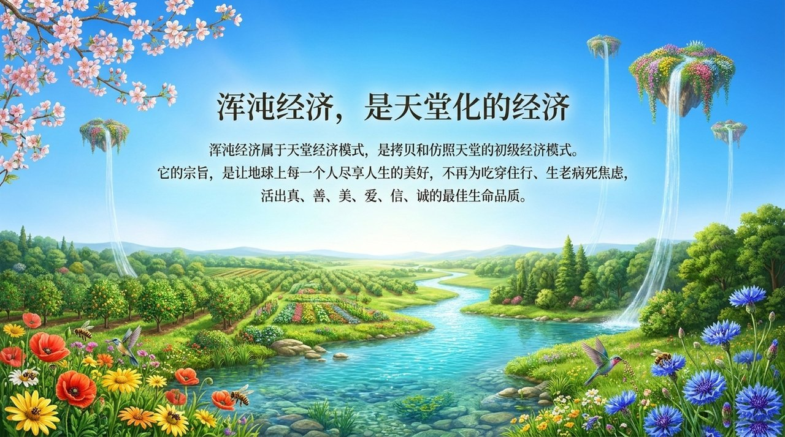
    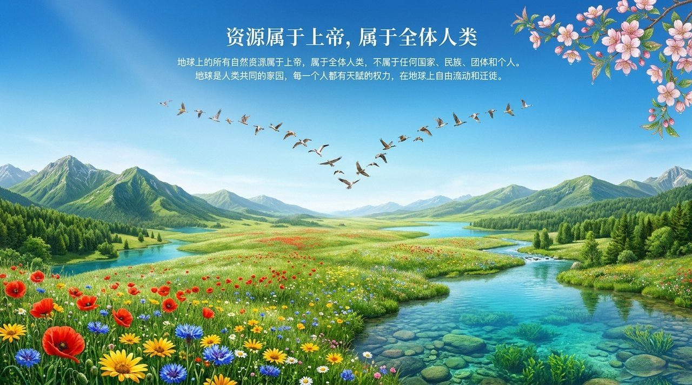
    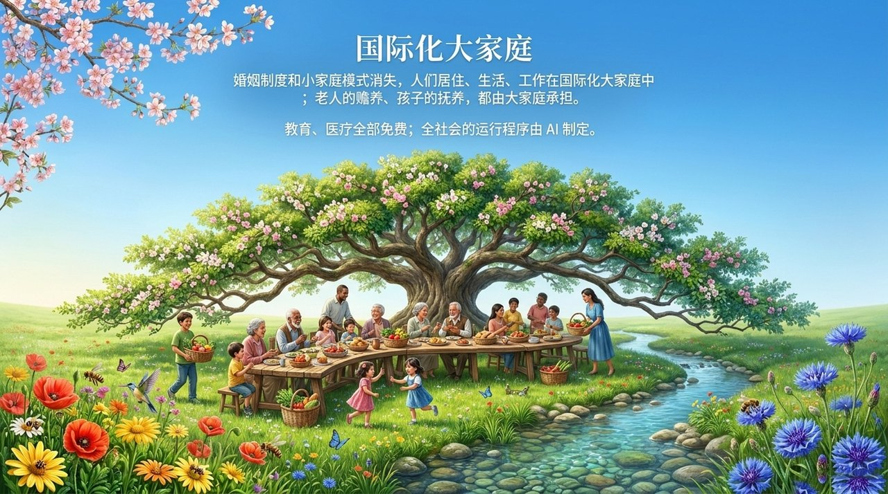
    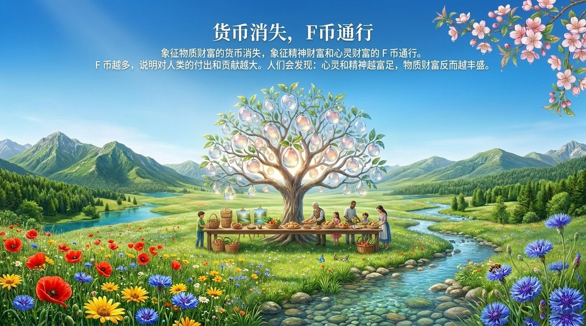
    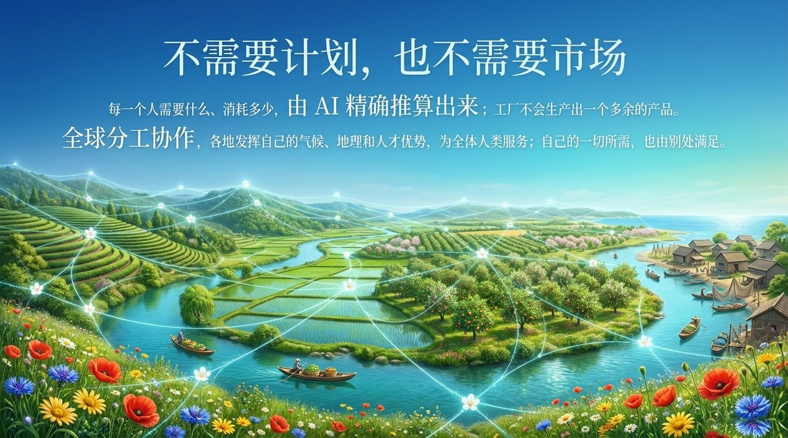
    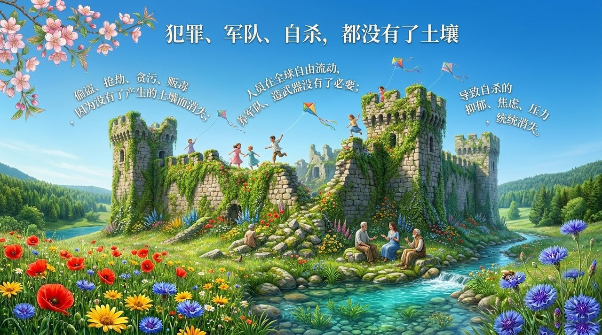
    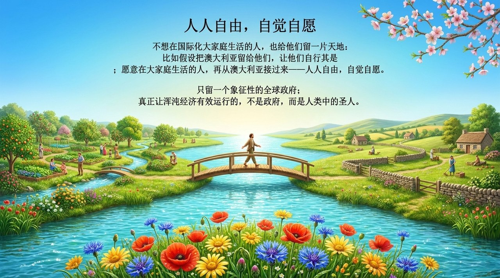
    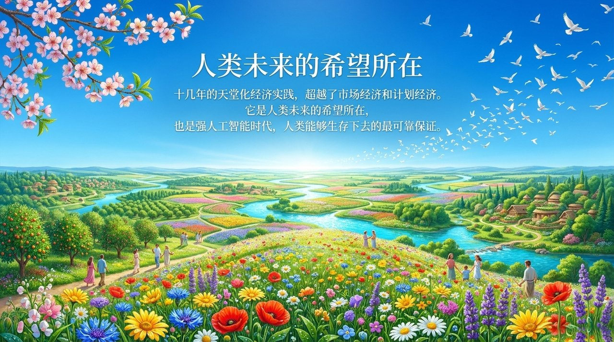

---

## 相关词条

[F币](/zh/f-coin/) · [浑沌管理](/zh/hundun-management/) · [第二家园](/zh/second-home/) · [国际大家庭](/zh/guoji-dajiating/) · [雪峰式共产主义](/zh/xuefeng-communism/) · [文明（总论）](/zh/civilization-overview/) · [AI联盟](/zh/ai-alliance/)
