# 浑沌管理

**浑沌管理**，是生命禅院第二家园实施的核心管理方式，由导游雪峰提出并创建，其核心是不管理——最大限度降低人为管理，代之以让道管理，遵循自然法则，以服务代替管理，是生命禅院理念在实践层面的根本运行机制。

> 用服务代替管理，主人就是仆人，管理就是服务。

## 版本导航

| 版本 | 适合 |
|------|------|
| [友好版](friendly/) | 首次接触，内容丰满、可读性强 |
| [学术版](academic/) | 理论研究与引用 |
| [内部版](internal/) | 体系内核心学习，以文集原文为准 |

---

## 视频版

<iframe style="width:100%;aspect-ratio:4/3;border:0" src="https://www.youtube-nocookie.com/embed/BLScULGKGWY" title="浑沌管理（生命禅院百科·视频版）" allowfullscreen></iframe>

??? info "📖 图文幻灯（14 张，点击展开）"

    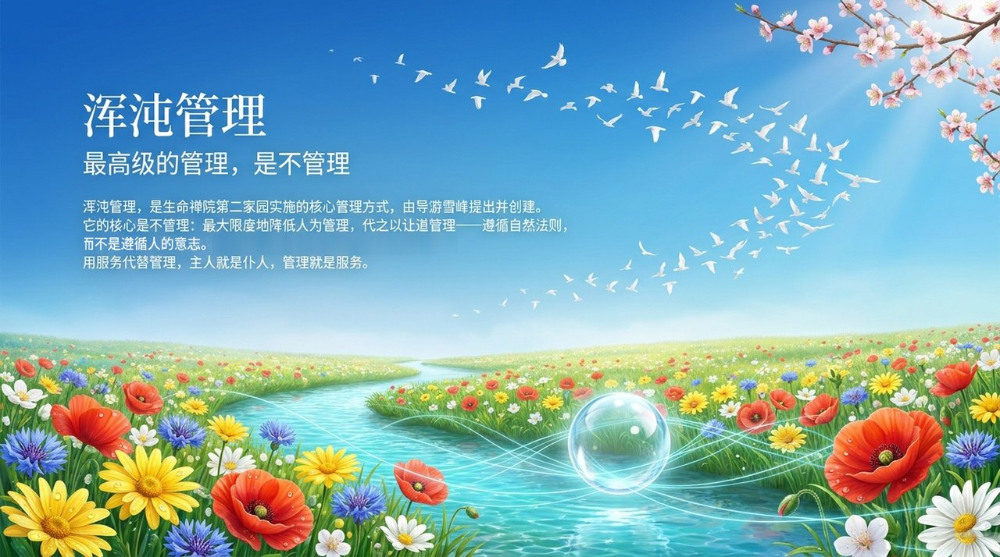
    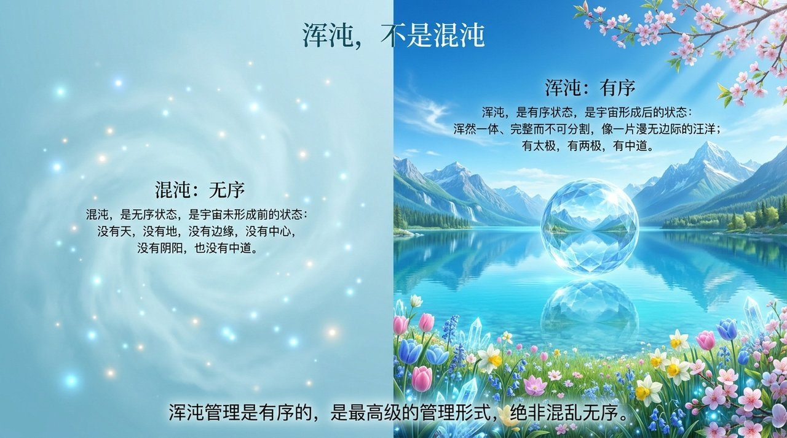
    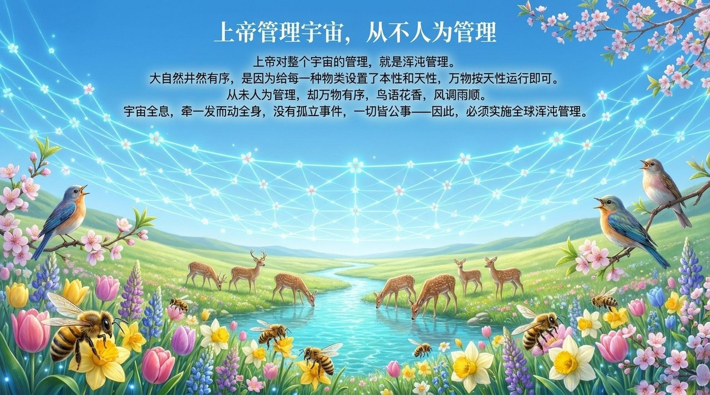
    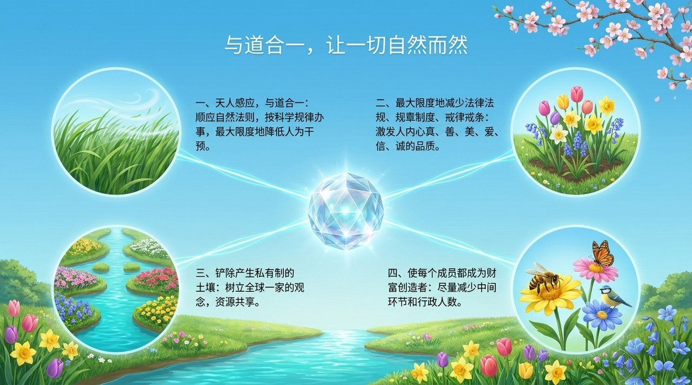
    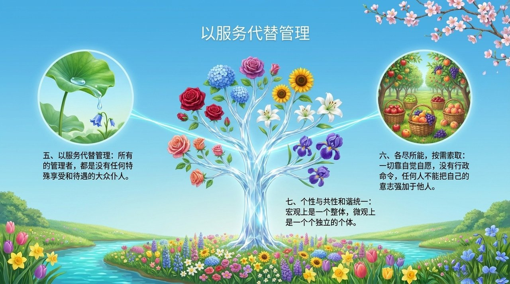
    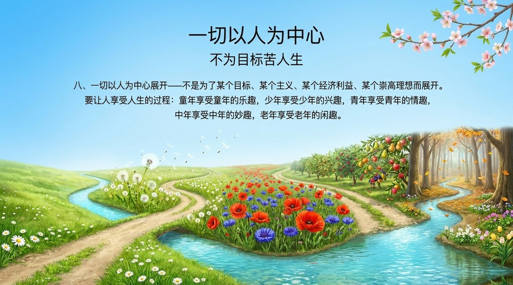
    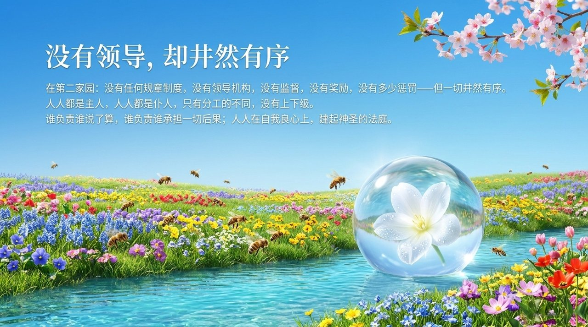
    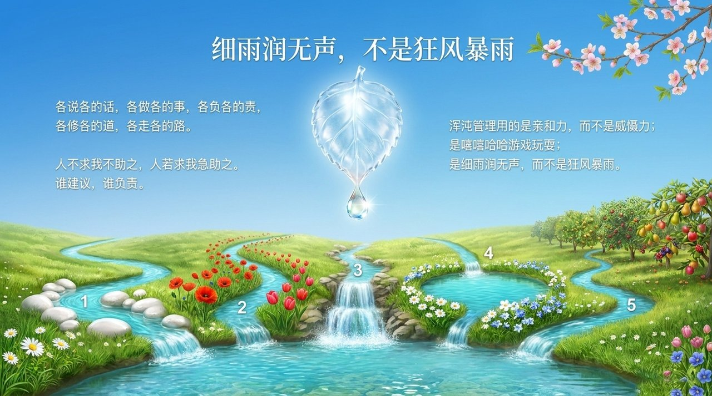
    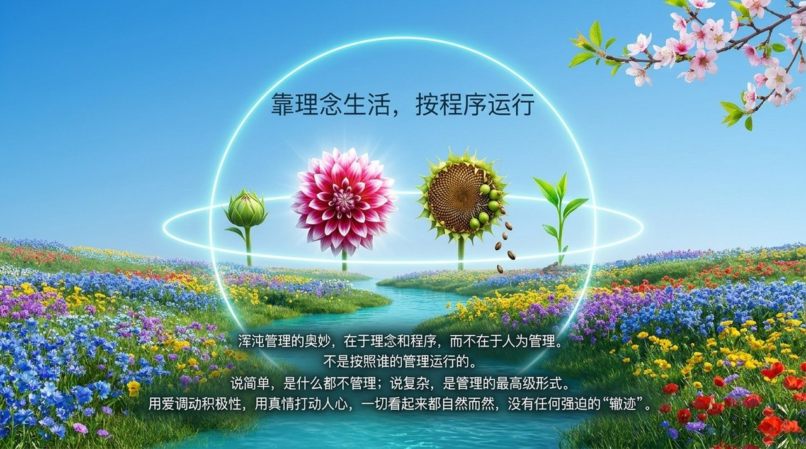
    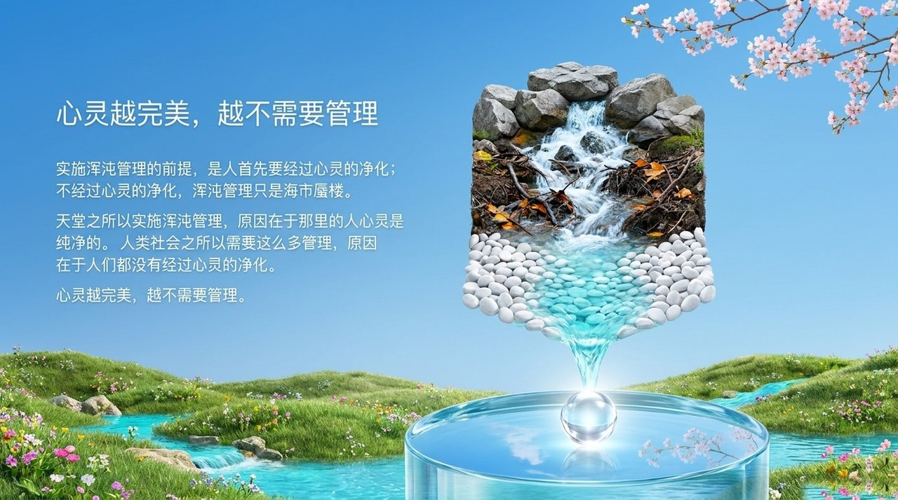
    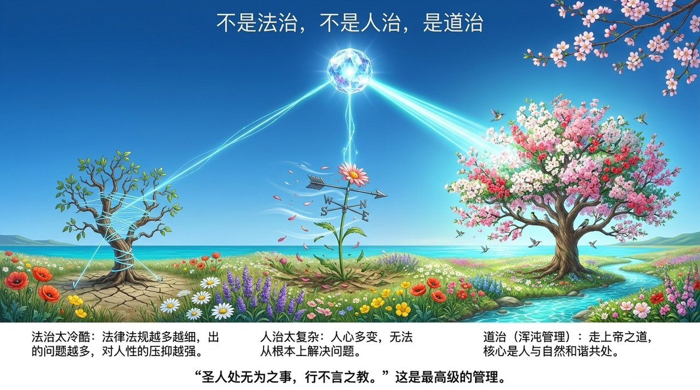
    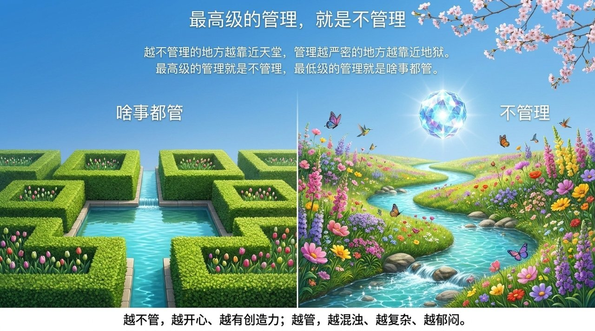
    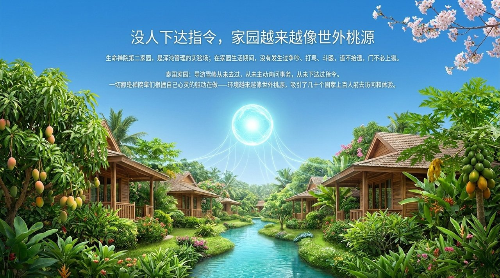
    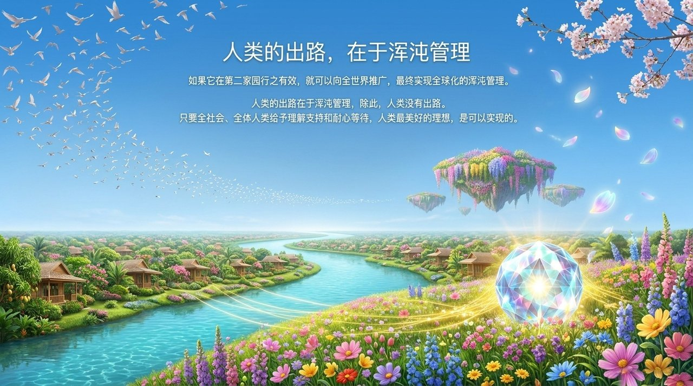

## 相关词条

[第二家园](/zh/second-home/) · [生命禅院](/zh/lifechanyuan/) · [文明3.0](/zh/civilization-3-0/) · [禅院草](/zh/chanyuan-celestials/)
