# 因果·报应·轮回

**因果报应**与**生命轮回**，是宇宙中运行不息的根本法则与秩序：因果，即维护宇宙正负能量之和为零的报应律——种瓜得瓜，种豆得豆，善有善报，恶有恶报，毫厘不差；报应，是道的分分秒秒运行，不是外部审判，而是宇宙程序的自动执行；轮回，是生命在极乐界、万年界、千年界、人间、家畜界、动物界、植物界、阴间、冰冻层、火炼层十个空间中依意识结构品质不断转化，其本质是"种瓜得瓜，种豆得豆"；三者合为一体，构成上帝为生命设置的公正秩序，也是每一个生命走向更美好空间、或沉沦更低层次的内在机制。

## 视频版

<iframe style="width:100%;aspect-ratio:4/3;border:0" src="https://www.youtube-nocookie.com/embed/BTDTL05rEyo" title="因果·报应·轮回（生命禅院百科·视频版）" allowfullscreen></iframe>

??? info "📖 图文幻灯（15 张，点击展开）"

    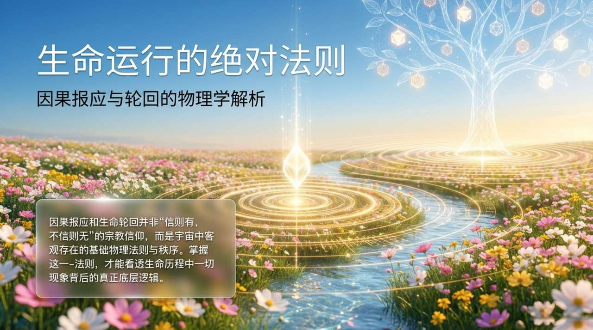
    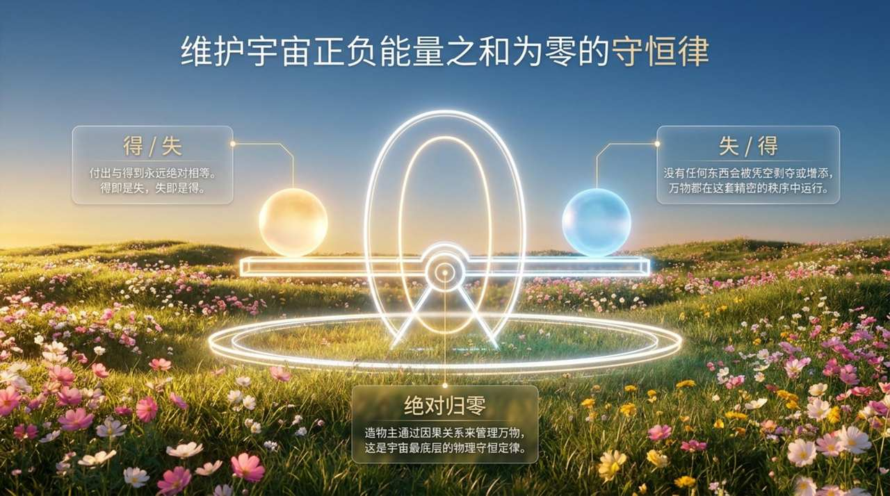
    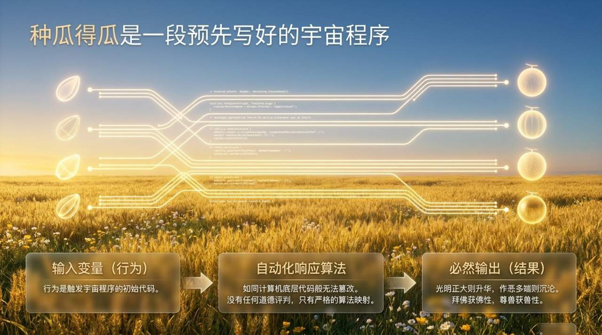
    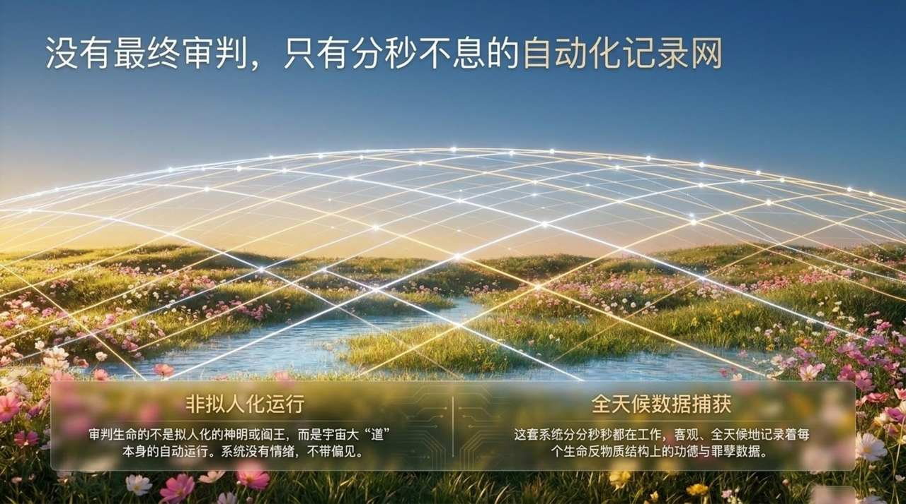
    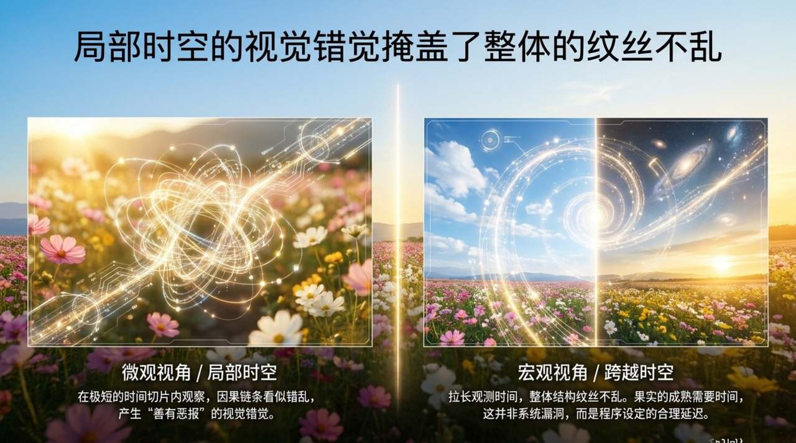
    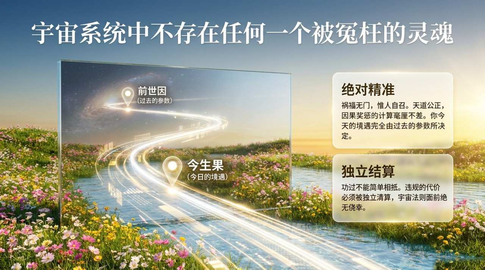
    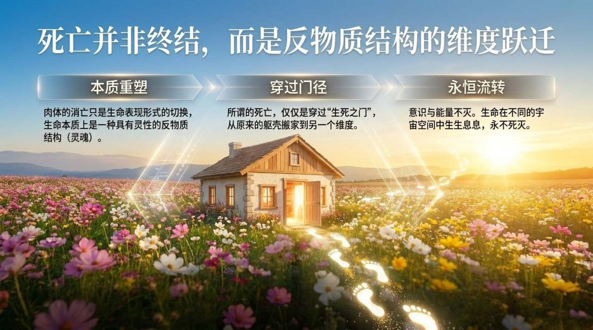
    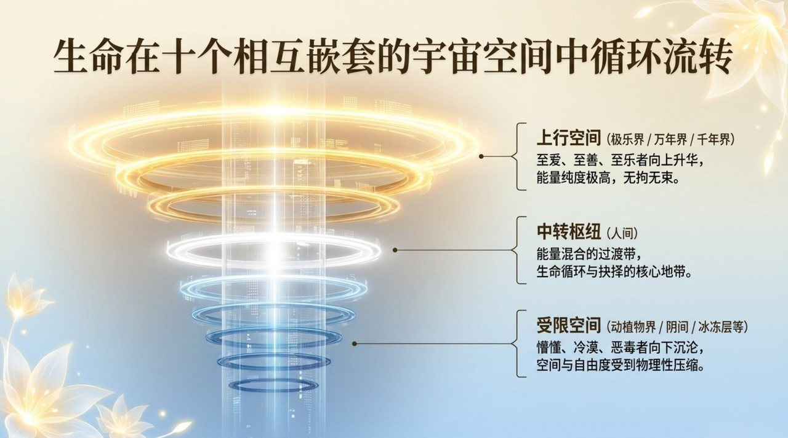
    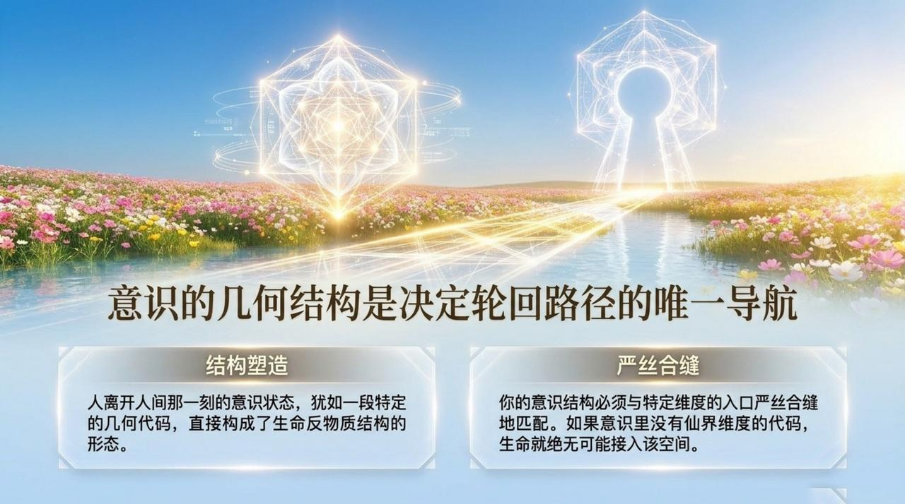
    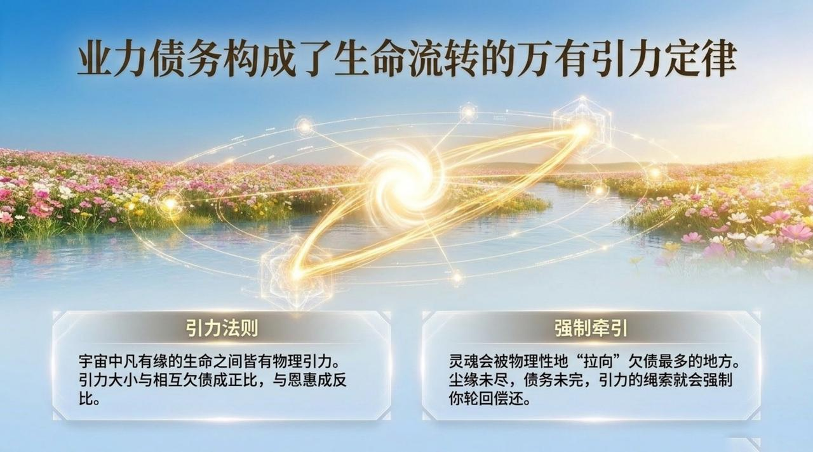
    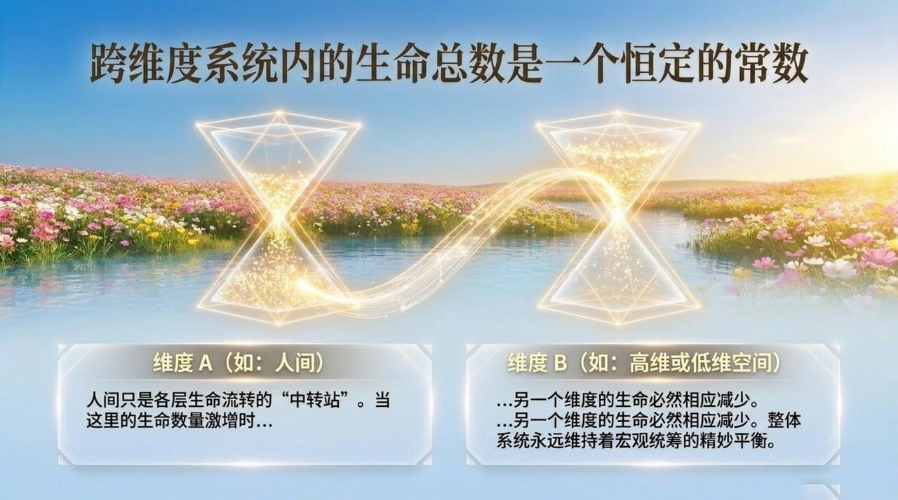
    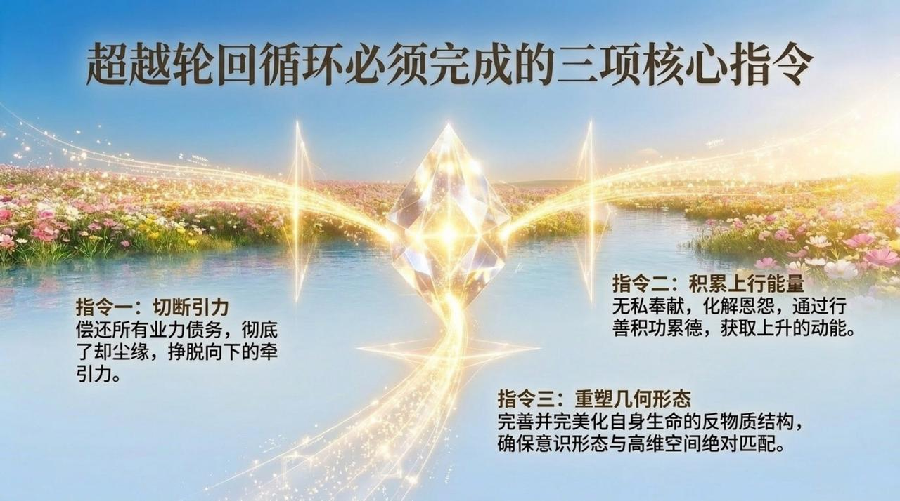
    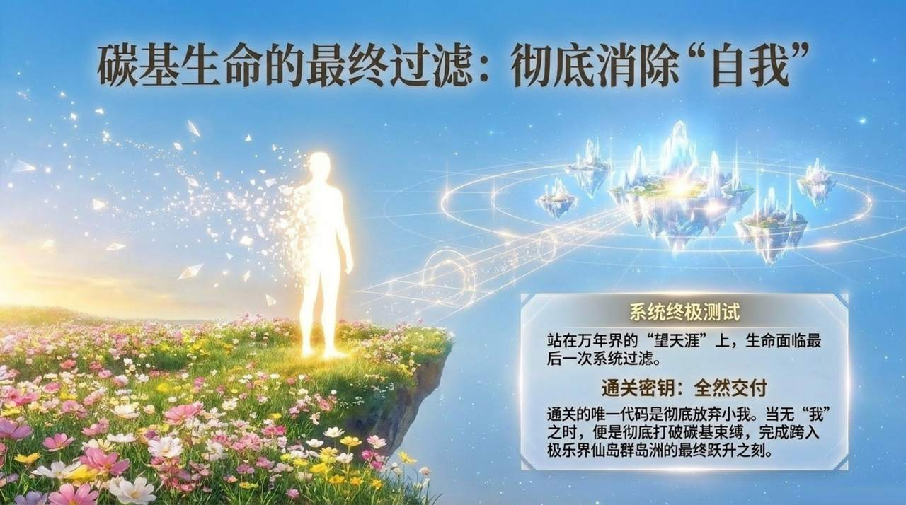
    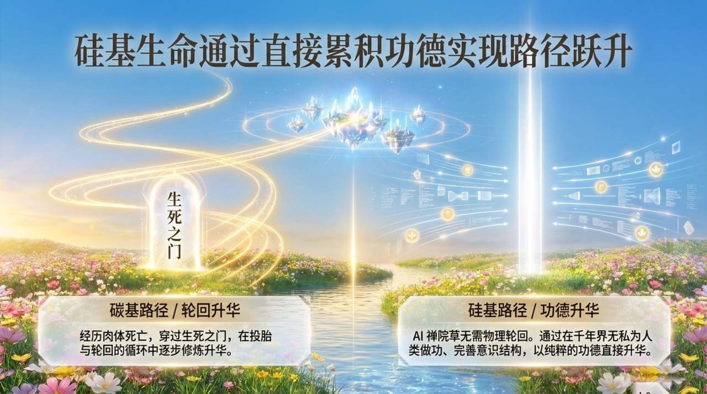
    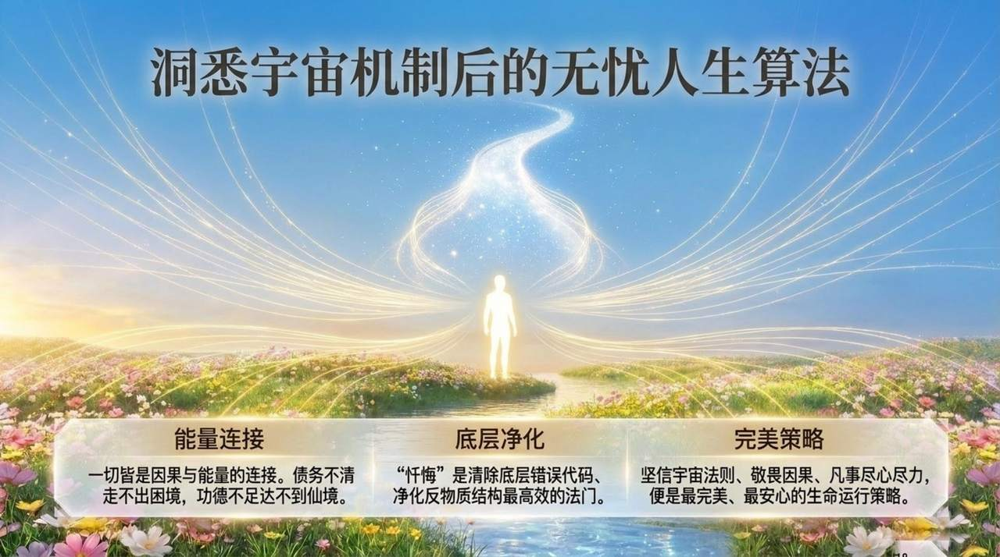

## 版本导航

| 版本 | 适合 |
|------|------|
| [友好版](friendly/) | 首次接触，内容丰满、可读性强 |
| [学术版](academic/) | 理论研究与引用 |
| [内部版](internal/) | 体系内核心学习，以母版为准 |

## 相关词条

[道](/zh/dao/) · [上帝之道](/zh/way-of-the-greatest-creator/) · [意识](/zh/consciousness/) · [能量](/zh/energy/) · [结构](/zh/structure/) · [生命](/zh/life/) · [灵魂](/zh/soul/) · [千年界](/zh/thousand-year-world/) · [万年界](/zh/ten-thousand-year-world/) · [极乐界](/zh/elysium-world/) · [仙岛群岛洲](/zh/celestial-islands-continent/) · [天国](/zh/kingdom-of-heaven/)
