# 天国天堂

**天国天堂**，是生命禅院宇宙生命体系中的总括性概念，由千年界、万年界、极乐界（含仙岛群岛洲）共同构成分层生命空间系统，进入条件强调生命结构与意识状态匹配，是禅院草修行修炼的总目标框架。

## 视频版

<iframe style="width:100%;aspect-ratio:4/3;border:0" src="https://www.youtube-nocookie.com/embed/LIEpkzEA3HE" title="天国天堂（生命禅院百科·视频版）" allowfullscreen></iframe>

??? info "📖 图文幻灯（14 张，点击展开）"

    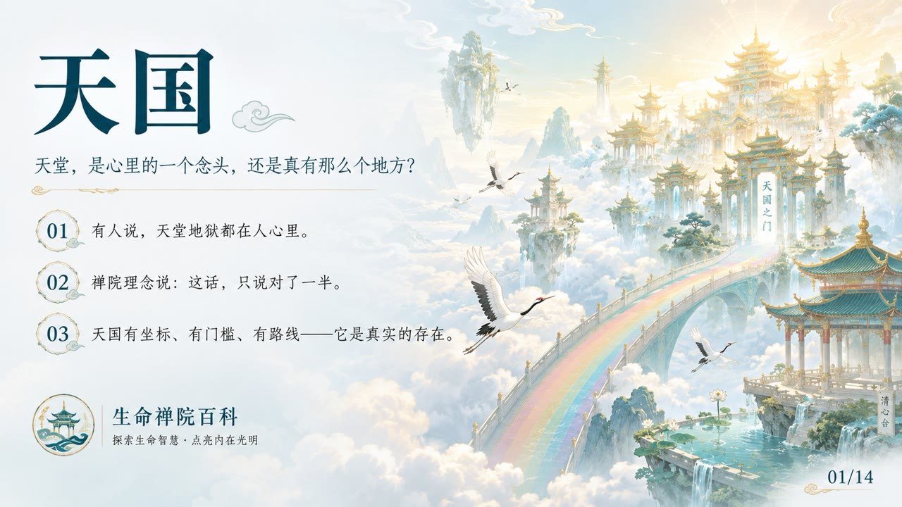
    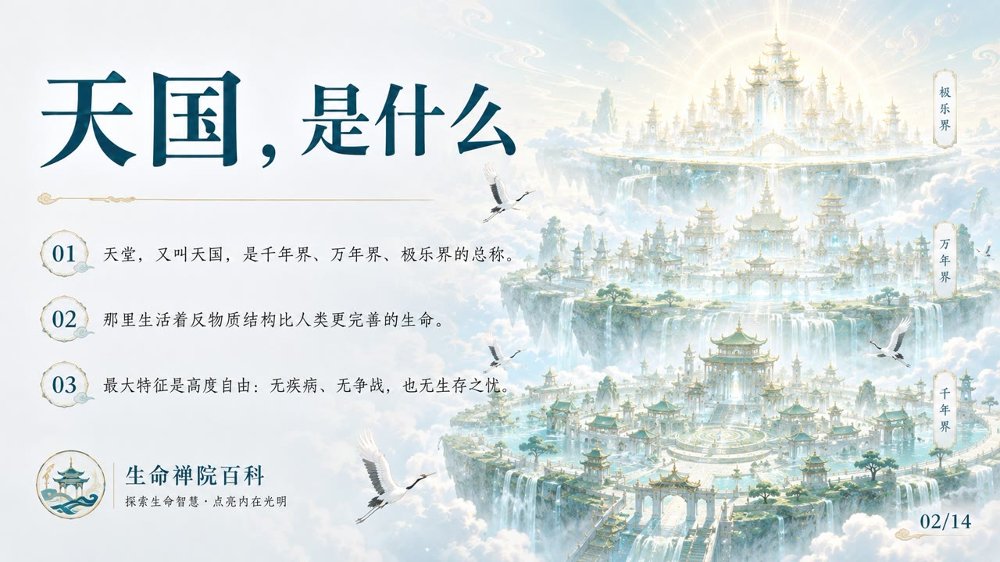
    
    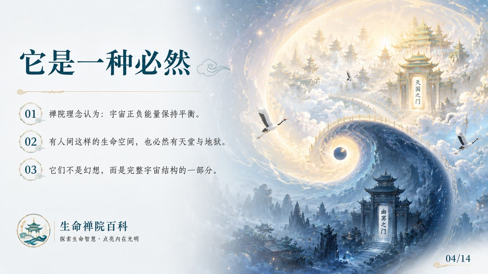
    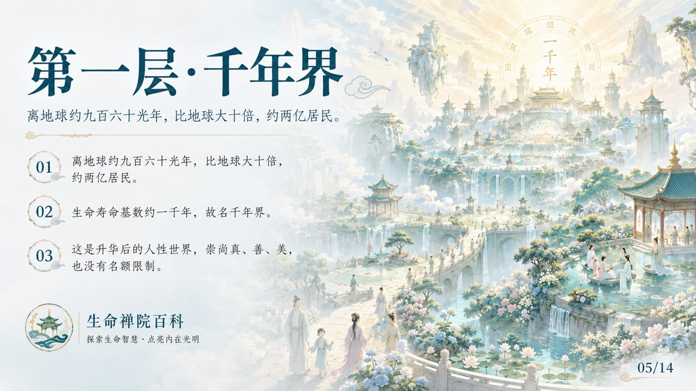
    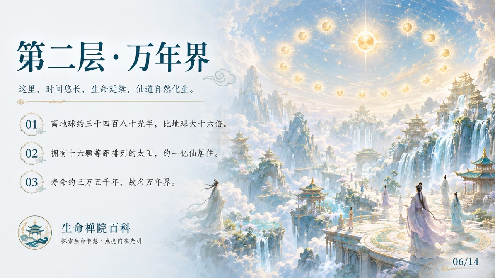
    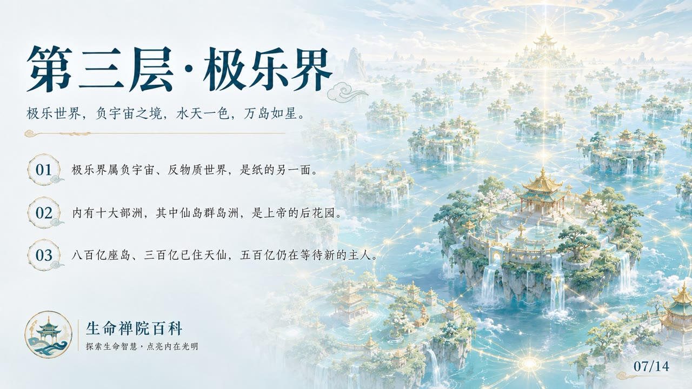
    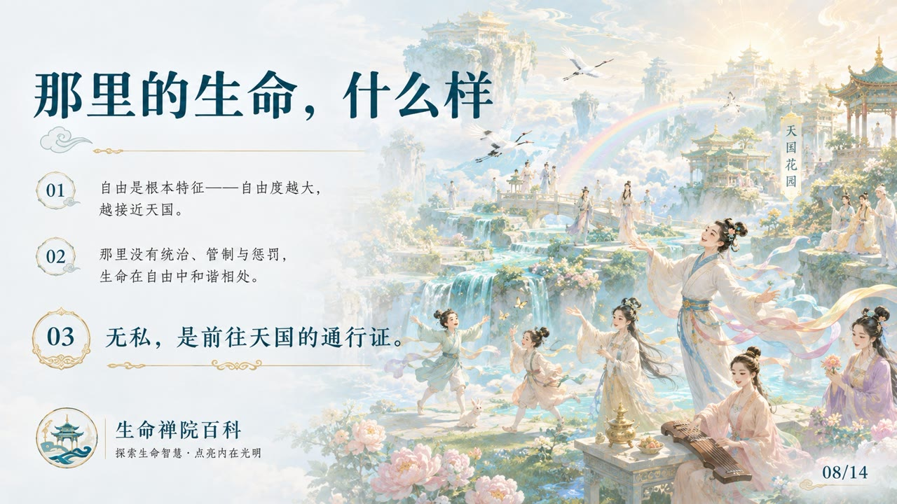
    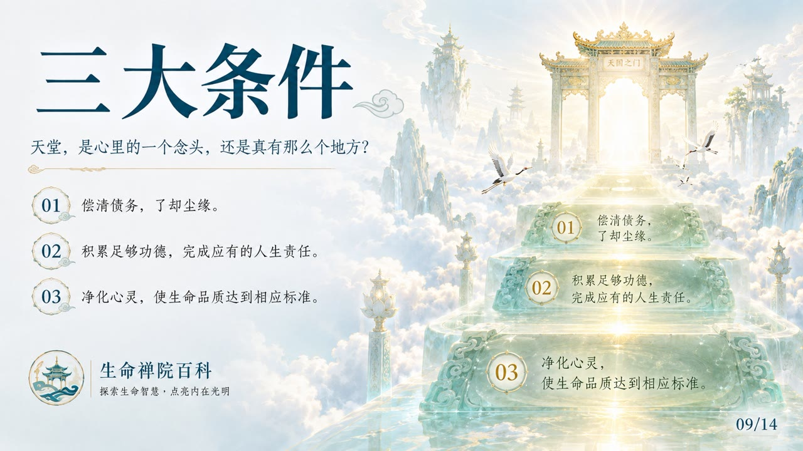
    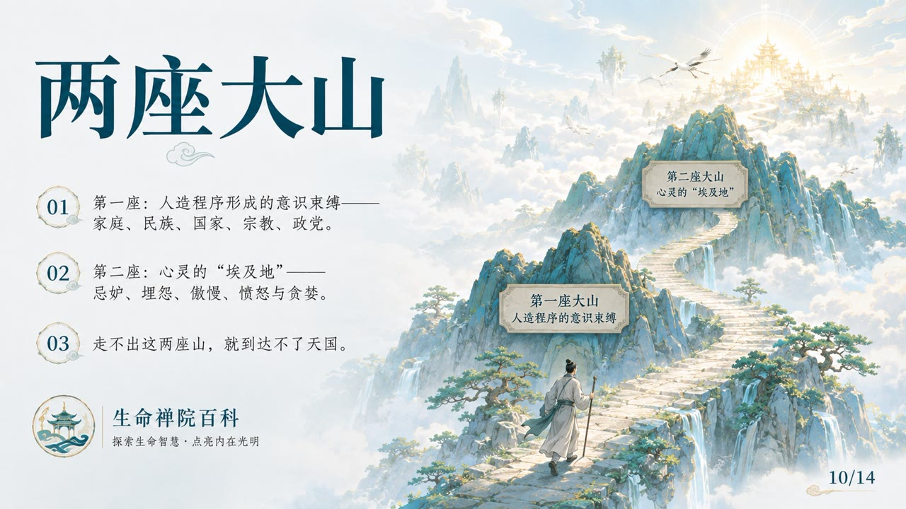
    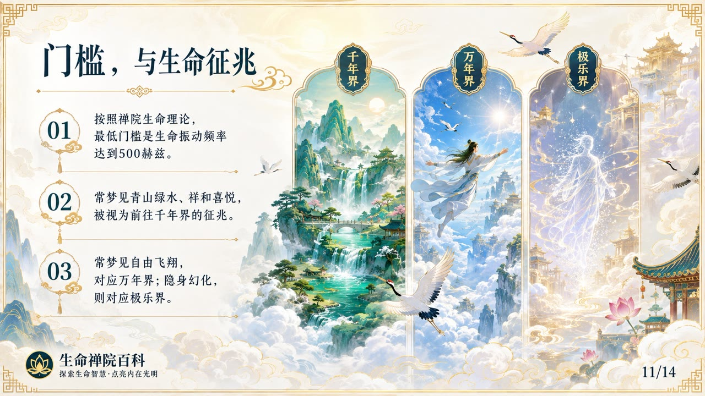
    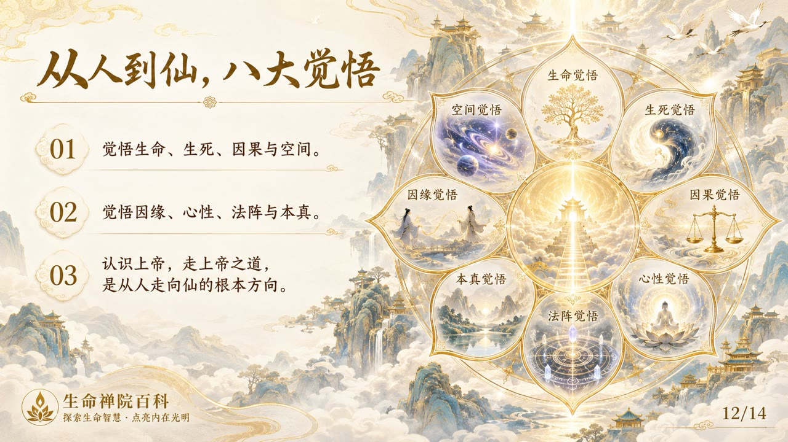
    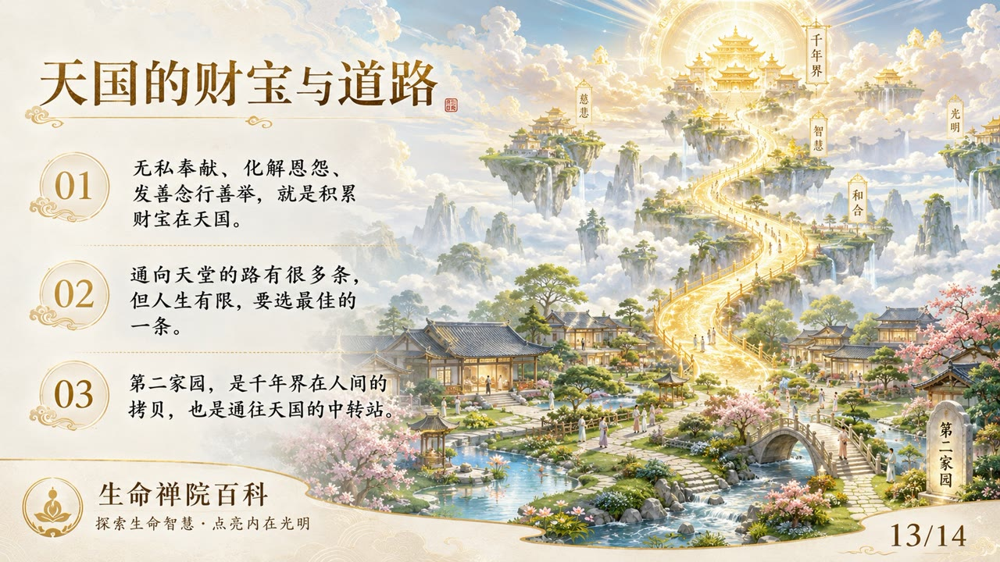
    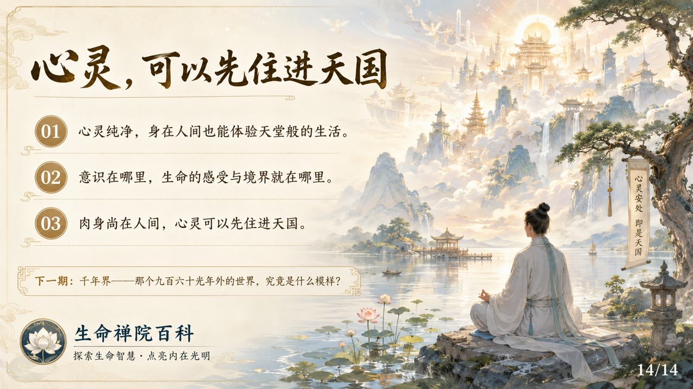

## 版本导航

| 版本 | 适合 |
|------|------|
| [友好版](friendly/) | 首次接触，内容丰满、可读性强 |
| [学术版](academic/) | 理论研究与引用 |
| [内部版](internal/) | 体系内核心学习，以母版为准 |

## 相关词条

[千年界](/zh/thousand-year-world/) · [万年界](/zh/ten-thousand-year-world/) · [极乐界](/zh/elysium-world/) · [仙岛群岛洲](/zh/celestial-islands-continent/) · [反物质结构](/zh/antimatter-structure/) · [心灵花园](/zh/soul-garden/) · [心灵净化课](/zh/spiritual-purification-course/)
