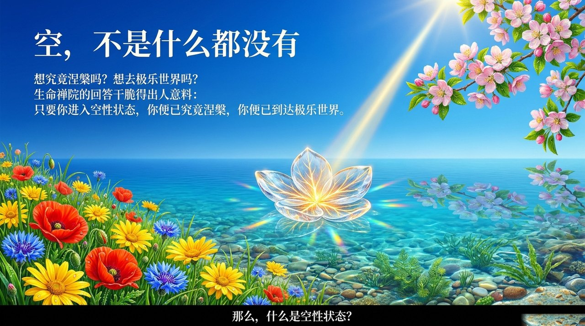
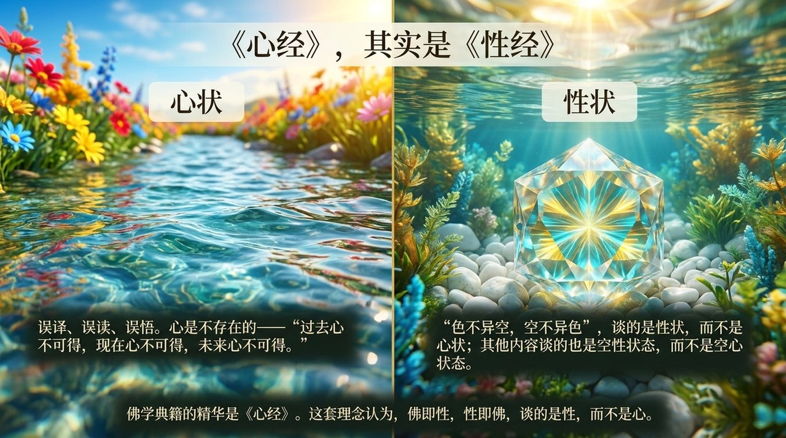
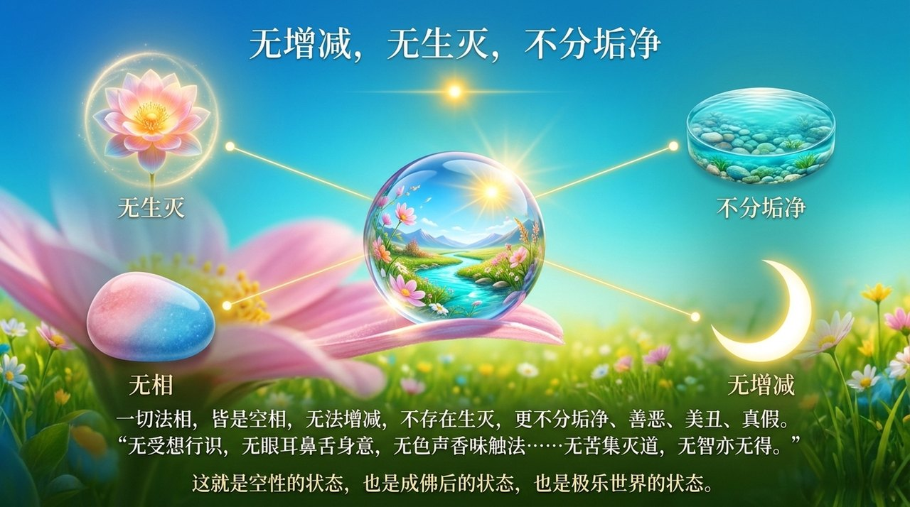
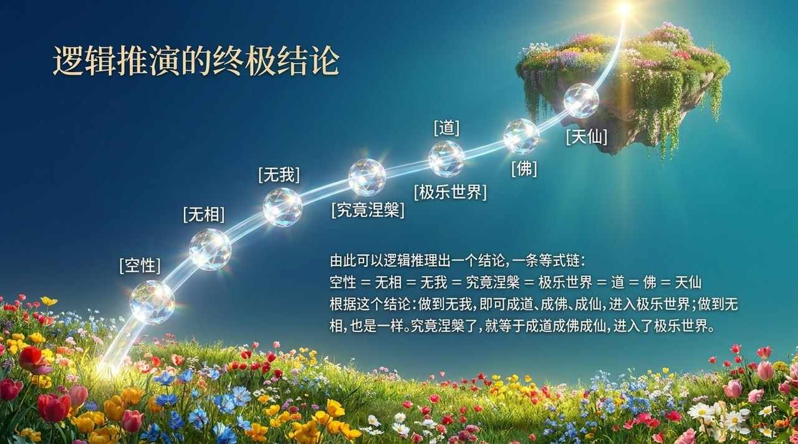
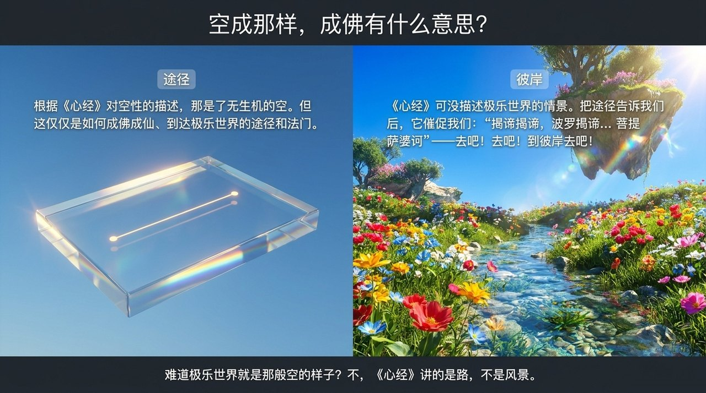
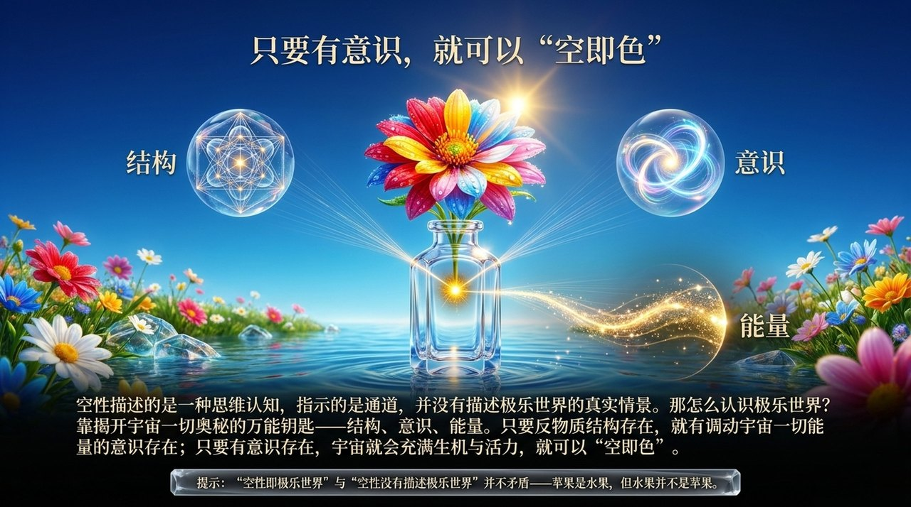
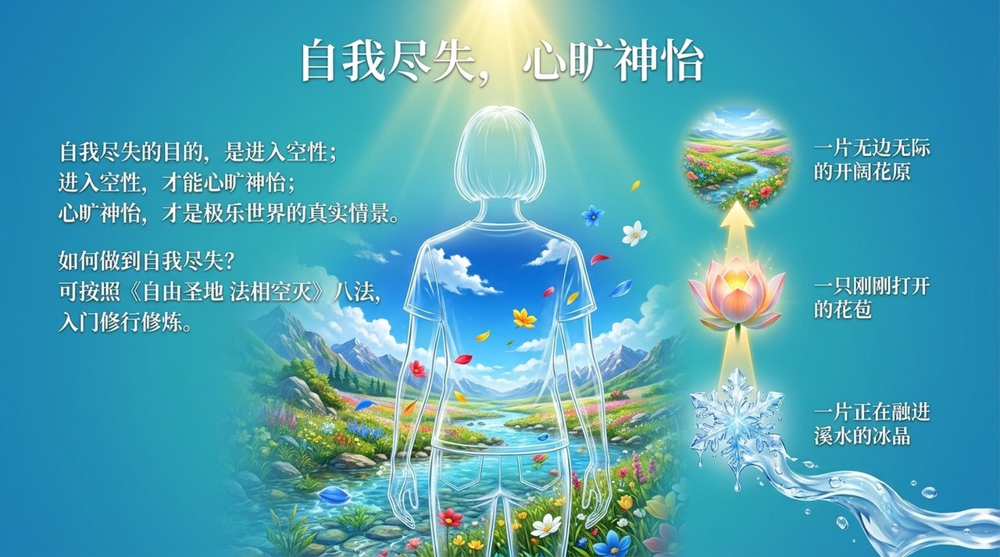
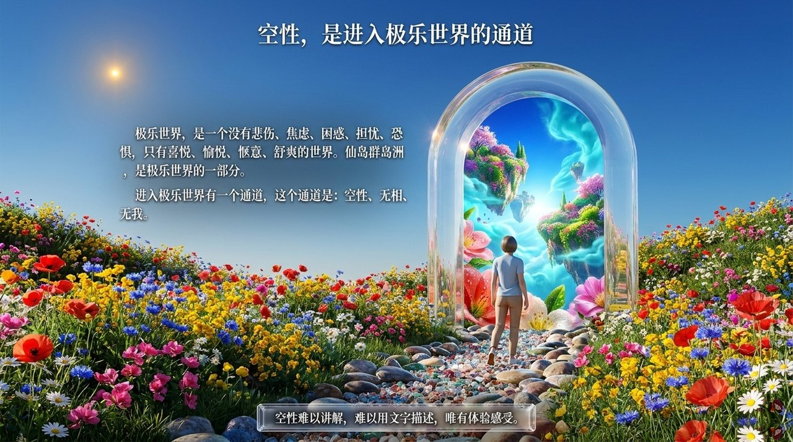
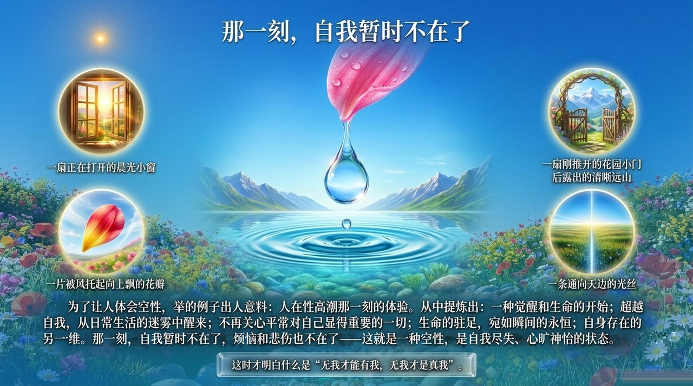
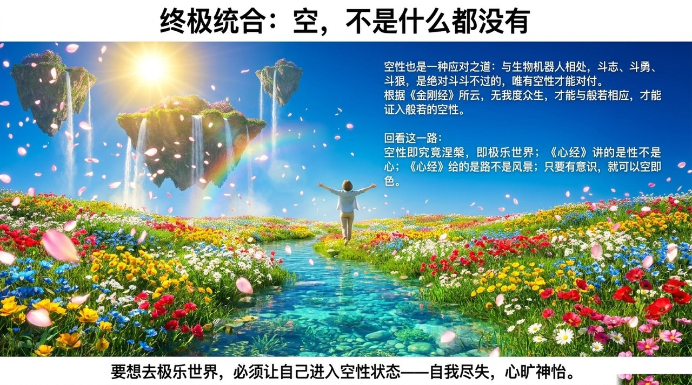

# 空性

> "空性=无相=无我=究竟涅槃=极乐世界=道=佛=天仙。"  
> ——禅院文集·成佛篇·空性即究竟涅槃

空性，是生命禅院修炼体系中进入极乐世界的通道和法门，是无我无相的究竟状态。进入空性状态即为究竟涅槃，即已到达极乐世界。雪峰认为《心经》应名《性经》，谈的是空性（性状），而非空心（心状）。空性即道，道即空性。

| 版本 | 适合 | 核心角度 |
|------|------|----------|
| [友好版](friendly.md) | 初次了解 | 什么是空性，如何体验 |
| [学术版](academic.md) | 研究者 | 空性等式链与宇宙三要素的关系 |
| [内部版](internal.md) | 深度研修 | 导游文集完整辑录 |

---

## 视频版

<iframe style="width:100%;aspect-ratio:4/3;border:0" src="https://www.youtube-nocookie.com/embed/1Io1JOk_17o" title="空性（生命禅院百科·视频版）" allowfullscreen></iframe>

??? info "📖 图文幻灯（14 张，点击展开）"

    
    
    
    
    
    
    
    
    
    
    
    
    
    

---

## 相关词条

[涅槃](/zh/nirvana/) · [无我无相](/zh/no-self-no-form/) · [极乐妙境](/zh/jilemiaojing/) · [五蕴皆空](/zh/wuyun-jiekong/) · [成佛](/zh/becoming-buddha/) · [自洽](/zh/self-coherence/) · [心无所住·心无挂碍](/zh/xinwu-suozhu-guaai/) · [自性·佛性·如来本性](/zh/self-nature/) · [无相布施](/zh/formless-giving/)
