<!-- id: LC-LFN-0001-ZH theme: 修行 type: 导航 direction: 生活修炼 lang: zh -->

# 劳动为生活第一需要

在生命禅院体系中，"劳动为生活第一需要"是生命绿洲（第二家园）的核心理念之一。与世俗社会鄙视体力劳动、千方百计脱离劳动的风气截然相反，绿洲将体力劳动视为生活的第一需要——不论功劳多大、智慧多高，每一位成员必须参与劳动。劳动是通往平等心灵、完美人性、天国生活的必经之路。

---

## 视频版

<iframe style="width:100%;aspect-ratio:4/3;border:0" src="https://www.youtube-nocookie.com/embed/EFecmpAwjic" title="劳动为生活第一需要（生命禅院百科·视频版）" allowfullscreen></iframe>

??? info "📖 图文幻灯（14 张，点击展开）"

    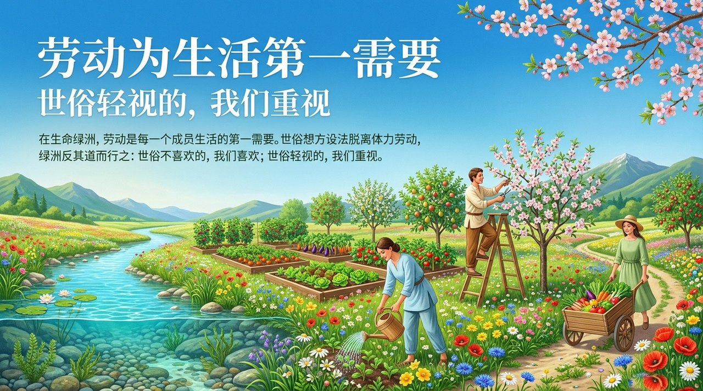
    
    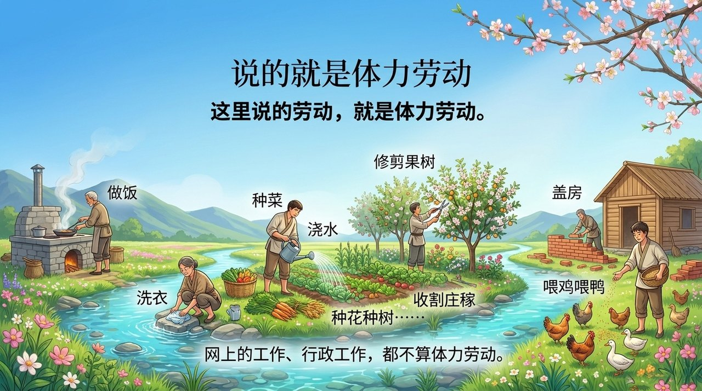
    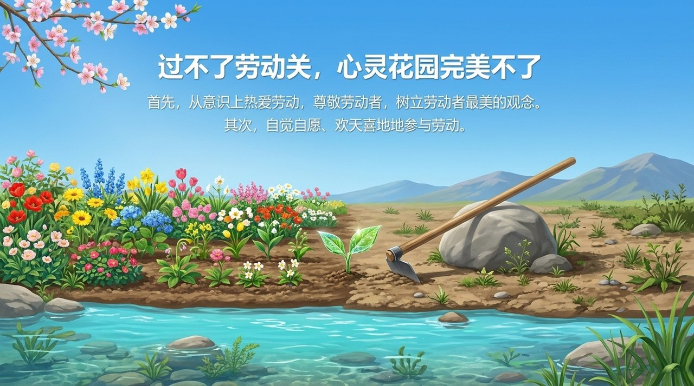
    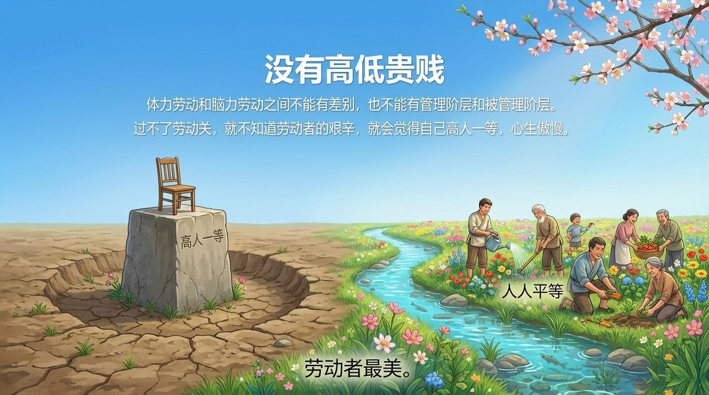
    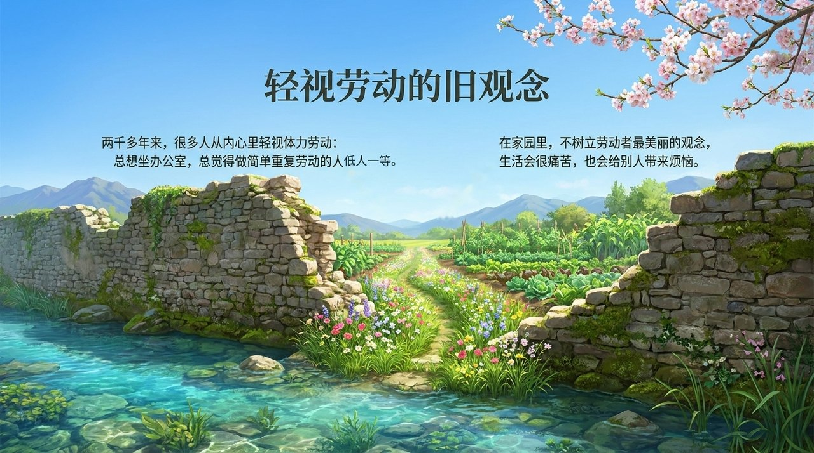
    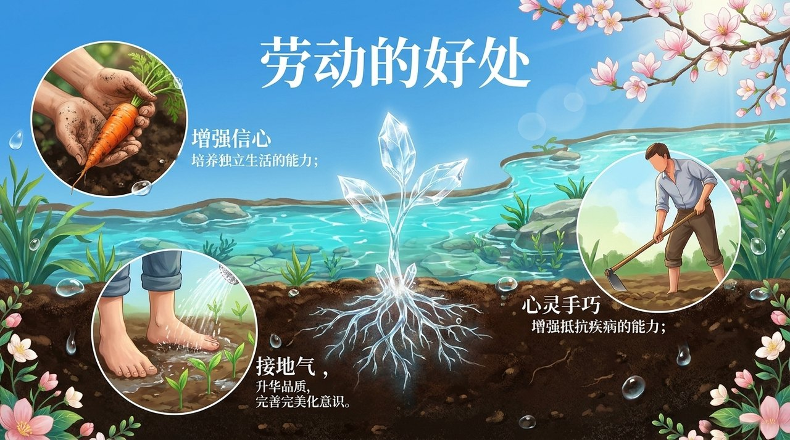
    
    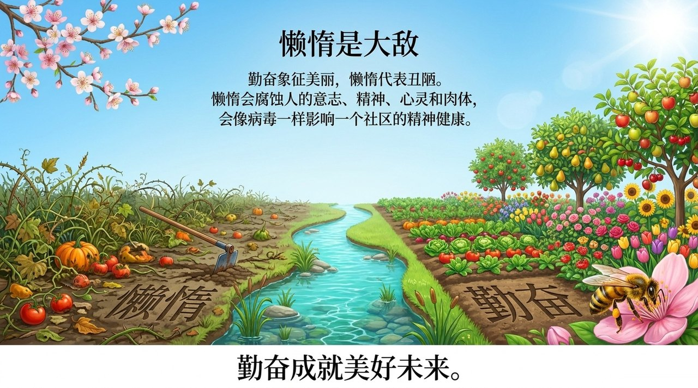
    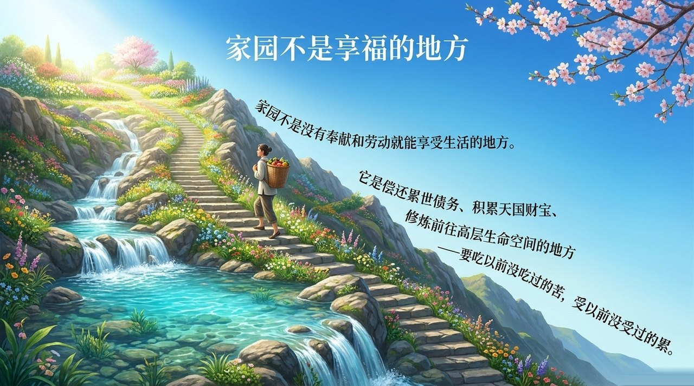
    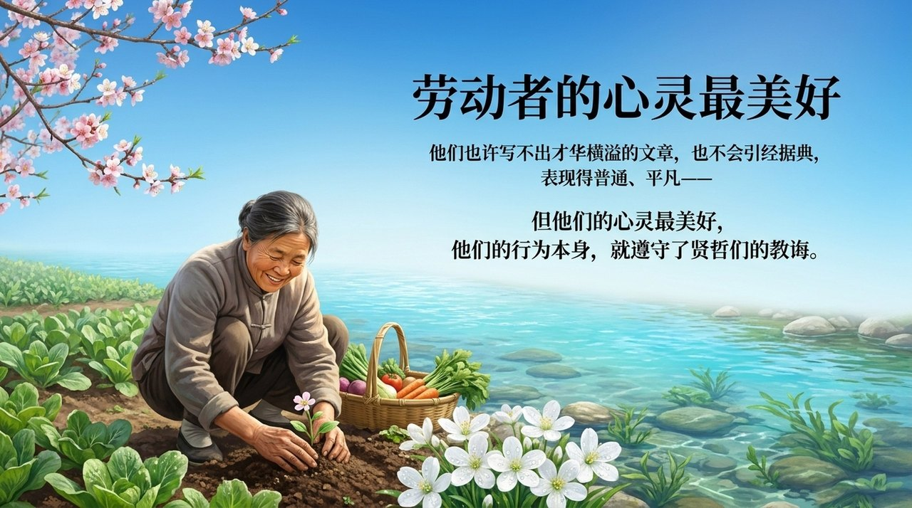
    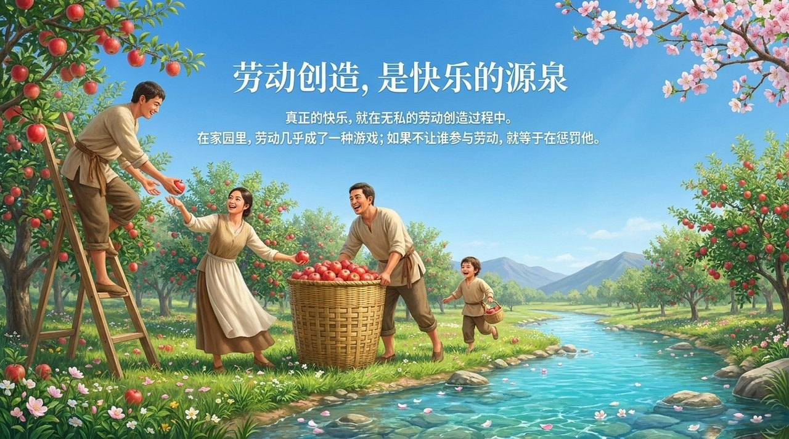
    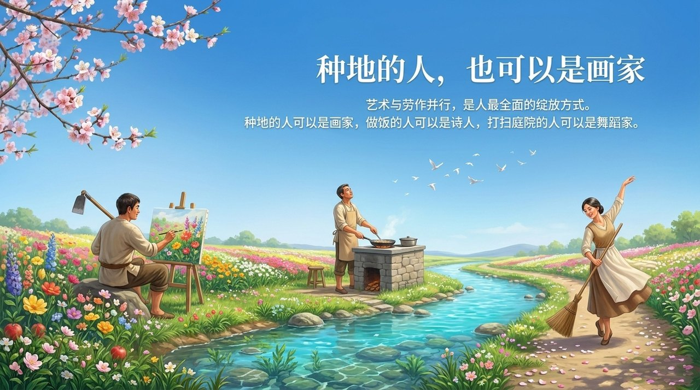
    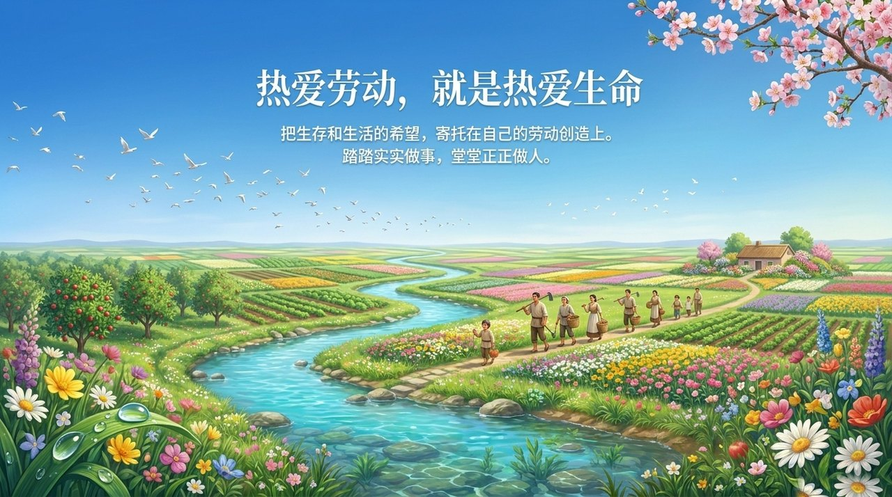

---

## 版本导航

| 版本 | 适合 | 核心角度 |
|------|------|----------|
| [友好版](friendly.md) | 初次了解 | 生活情境·劳动关·心灵花园 |
| [学术版](academic.md) | 研究者 | 概念定位·与世俗价值观的对比·修炼意涵 |
| [内部版](internal.md) | 深度研修 | 完整引文·七节框架·新时代视角 |

---

## 相关词条

[生命绿洲](/zh/life-oasis/) · [第二家园](/zh/second-home/) · [各尽所能·按需索取](/zh/contribute-by-ability-take-by-need/) · [一无所有·拥有一切](/zh/own-nothing-have-everything/) · [完美人性的标准](/zh/perfect-human-nature/) · [心灵花园](/zh/soul-garden/) · [懒惰（待做）]() · [感恩](/zh/gratitude/) · [偿还债务](/zh/debt-repayment/) · [浑沌管理](/zh/hundun-management/)
