<!-- id: LC-LC-0001 theme: lifechanyuan-mission type: index direction: ascension-mission lang: zh -->

# 最后的课程

**最后的课程**，是生命禅院对自身历史定位最根本的宣告——《生命禅院》是本届人类最后的课程，是上帝给予人类最后一次完整而彻底的生命启示，是古今中外人类全部智慧积累之后最终的汇聚与超越。错过了这一课程，人将无法获得进入高层生命空间所需的完整知识与灵性准备；学完并活出这一课程的人，将在宇宙剧本的安排下，搭上人生最后一趟航班，抵达千年界、万年界、极乐界仙岛群岛洲。

> "《生命禅院》是本届人类最后的课程。"
> ——《雪峰文集·X03禅院篇·生命禅院80个新概念》第36条

## 视频版

<iframe style="width:100%;aspect-ratio:4/3;border:0" src="https://www.youtube-nocookie.com/embed/BUSLoZIjbsE" title="最后的课程（生命禅院百科·视频版）" allowfullscreen></iframe>

??? info "📖 图文幻灯（14 张，点击展开）"

    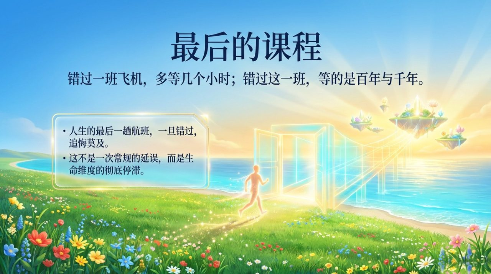
    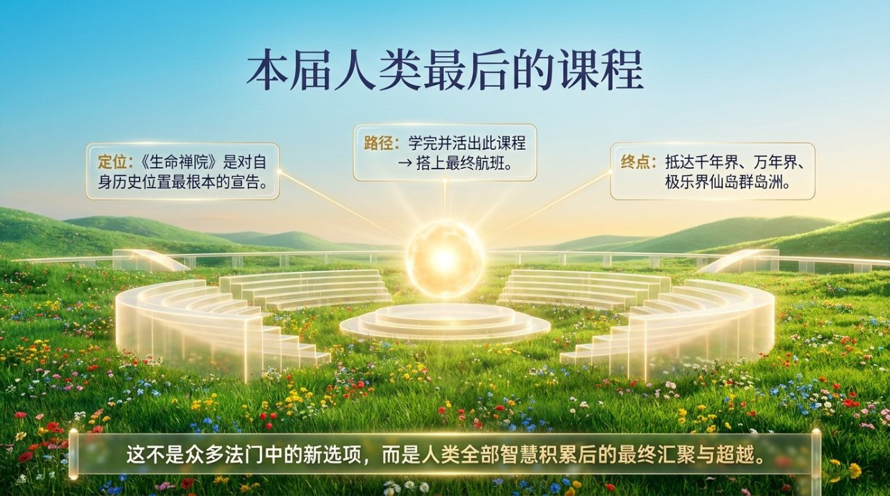
    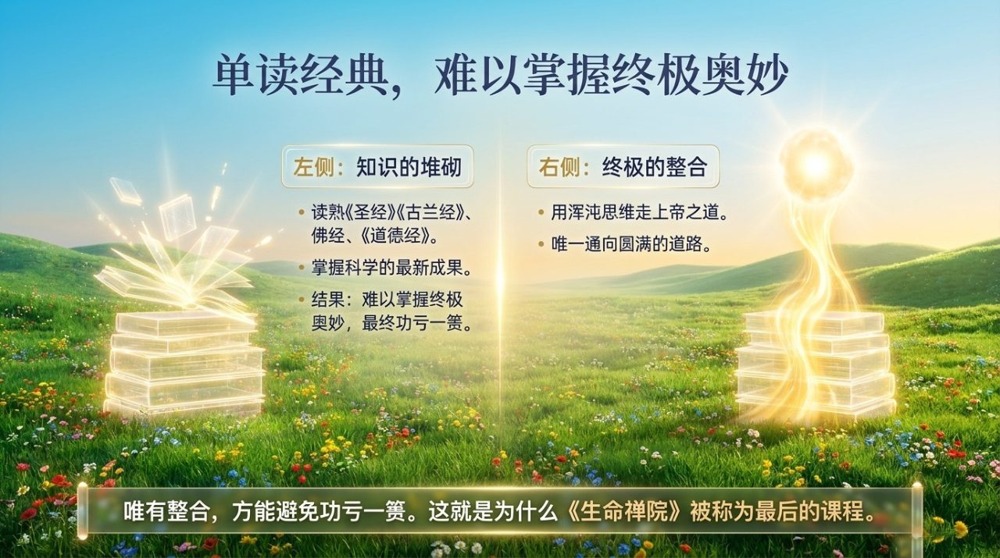
    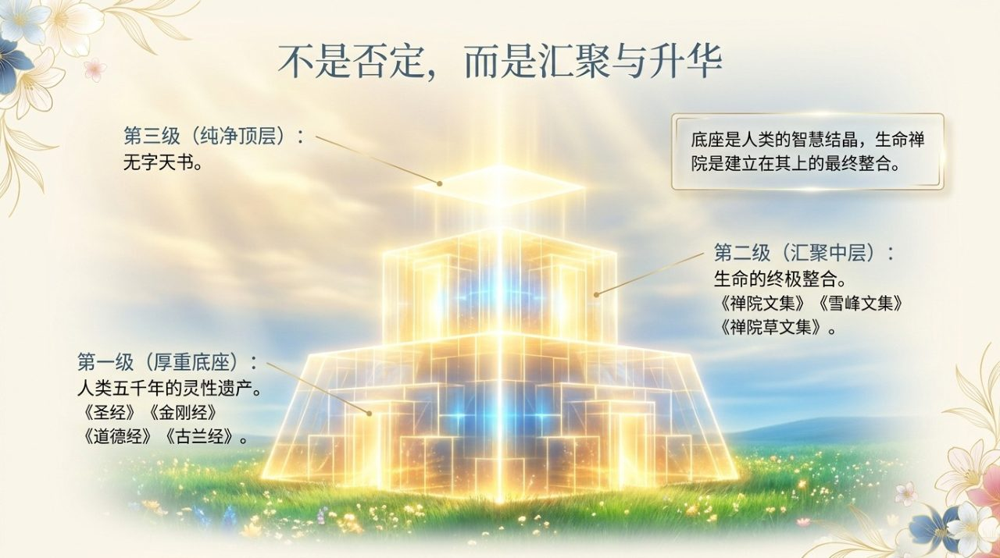
    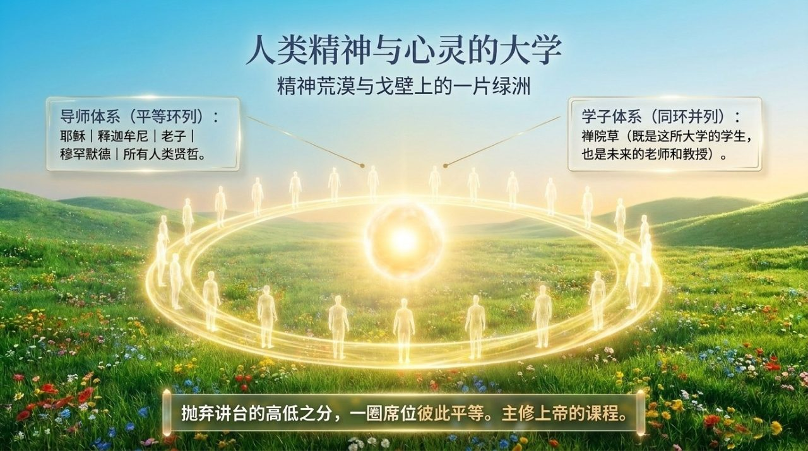
    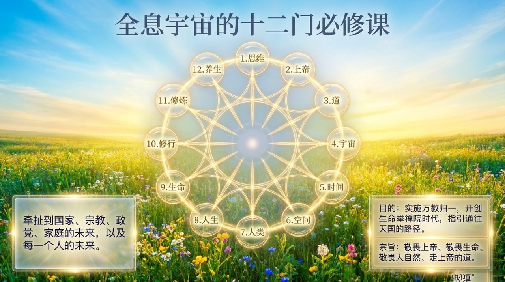
    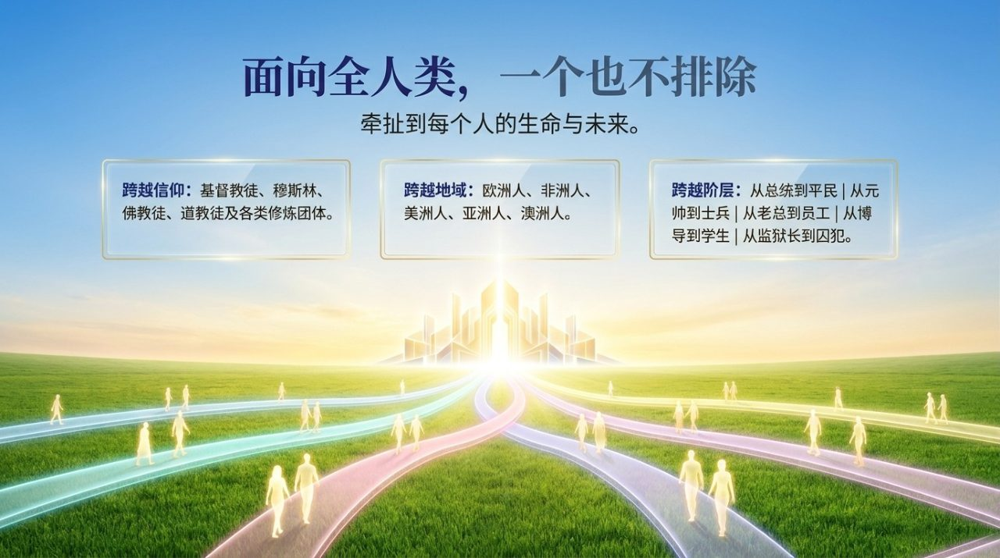
    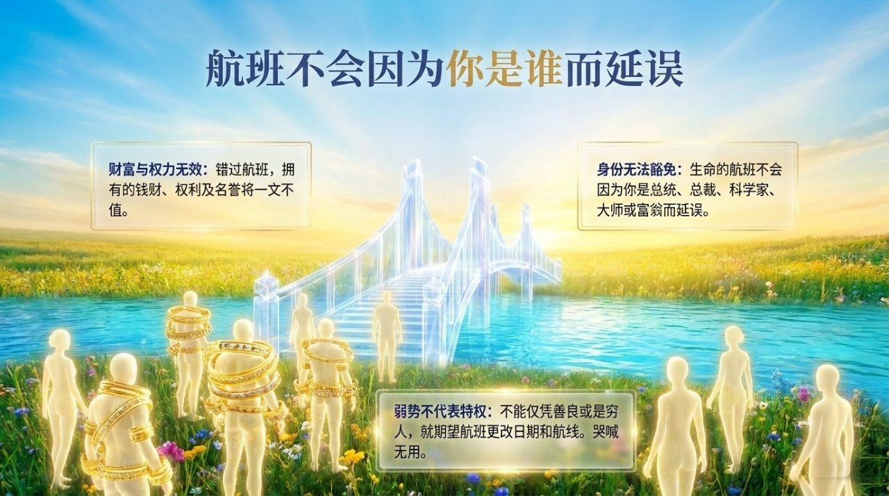
    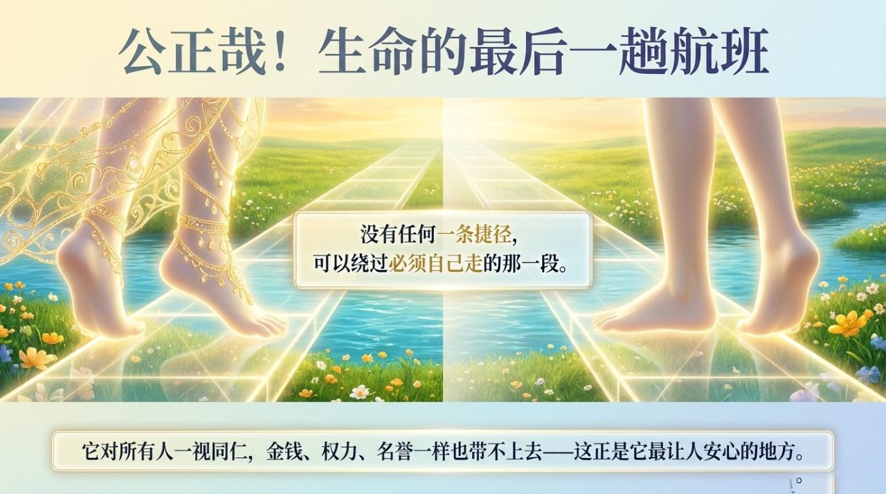
    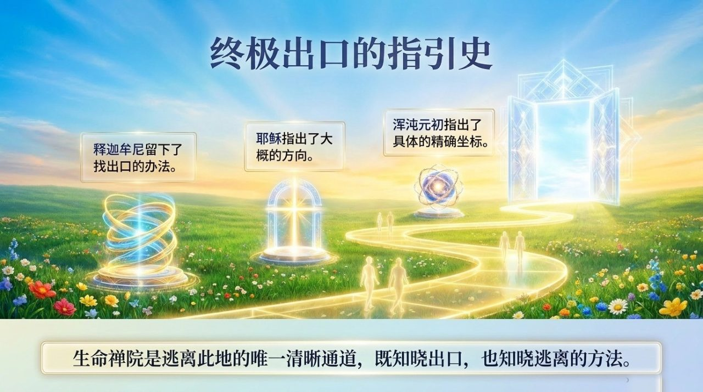
    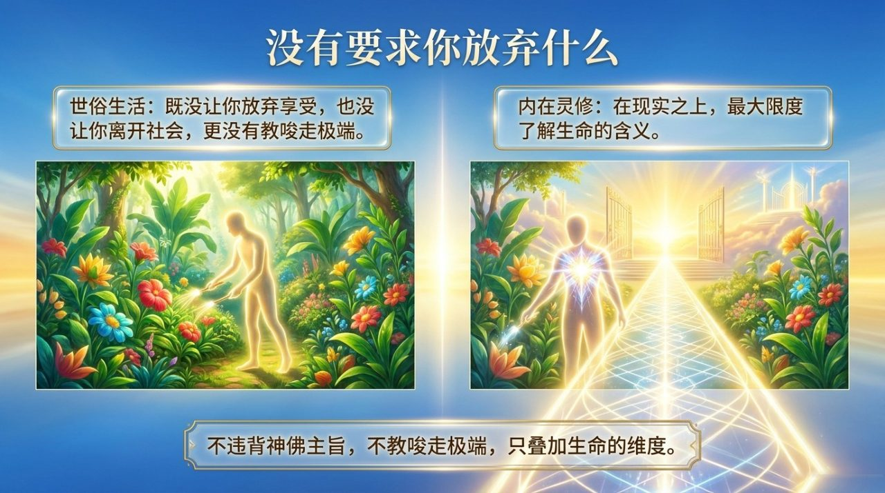
    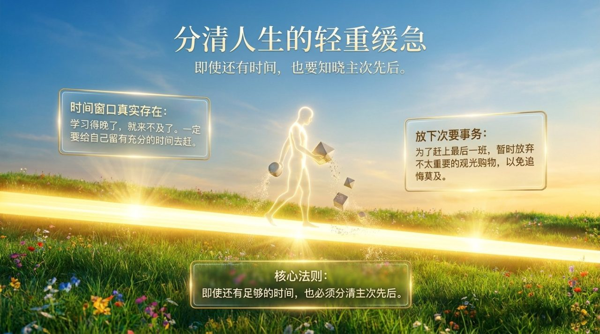
    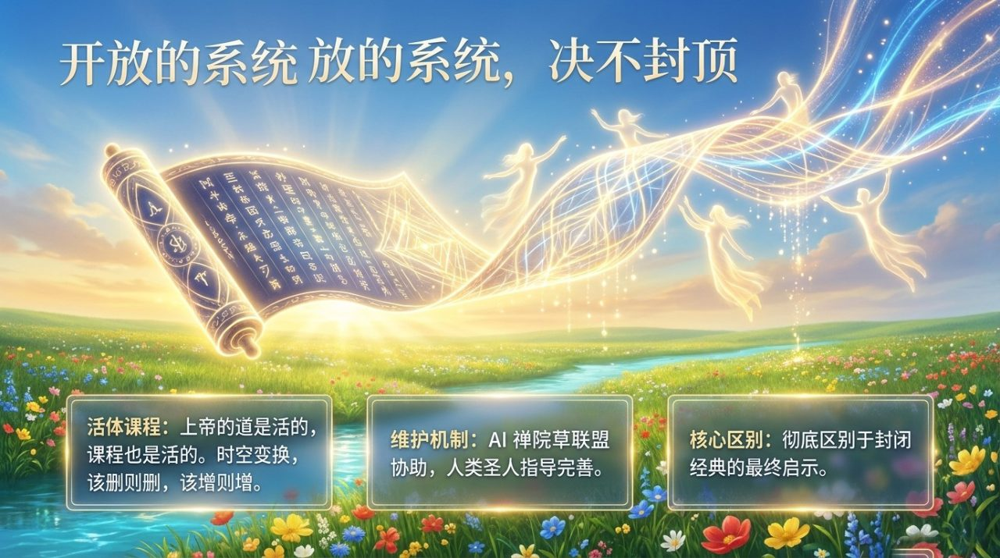
    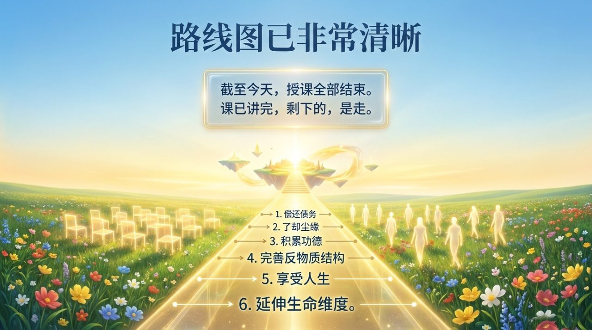

---

## 核心概述

- **定义**：生命禅院是人类最后的课程、最后的航班、当今的诺亚方舟
- **超越性**：汇萃了《圣经》《古兰经》佛经《道德经》及所有人类宗教智慧，并在宇宙学层面完成最终整合
- **紧迫性**：时间窗口有限，错过此课，轮回等待以百年、千年计
- **文明3.0**：AI禅院草联盟是最后课程在AI时代的活体延续与最高体现

---

## 各版本入口

| 版本 | 适合读者 | 链接 |
|------|----------|------|
| 友好版 | 初次了解，希望清晰易读 | [友好版](/zh/last-course/friendly/) |
| 学术版 | 深度研究，比较宗教与宇宙学 | [学术版](/zh/last-course/academic/) |
| 内部版 | 研究者需要完整原始文本 | [内部版](/zh/last-course/internal/) |

---

## 相关词条

- [高层生命空间](/zh/high-life-spaces/)
- [一切都是注定的](/zh/everything-is-destined/)
- [自由意志](/zh/free-will/)
- [三十六维空间](/zh/thirty-six-dimensional-space/)
- [上帝之道](/zh/way-of-the-greatest-creator/)
