# 生死

**生死**，在生命禅院体系中，不是生命本身的终结与起始，而是生命载体（肉体）的变换现象。生命的本质是有灵性的反物质结构，永不死灭；所谓"死"，是灵体离开肉体这一载体，进入另一维度空间的转化。生死互根，是宇宙八大辩证法之一。觉悟生死，是从人到仙八大觉悟的第二大觉悟。

## 视频版

<iframe style="width:100%;aspect-ratio:4/3;border:0" src="https://www.youtube-nocookie.com/embed/pKuOCiiYDKc" title="生死（生命禅院百科·视频版）" allowfullscreen></iframe>

??? info "📖 图文幻灯（14 张，点击展开）"

    
    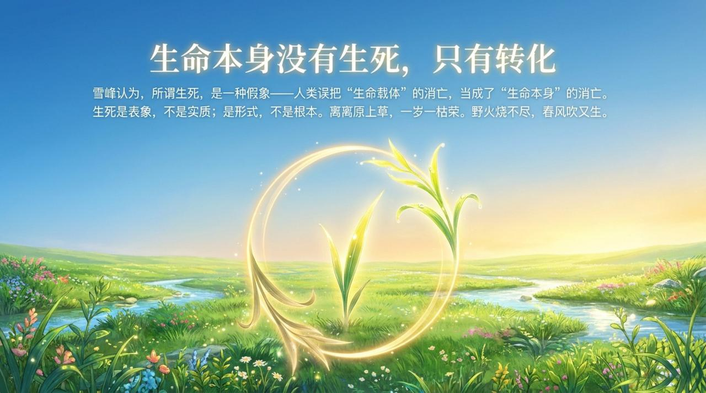
    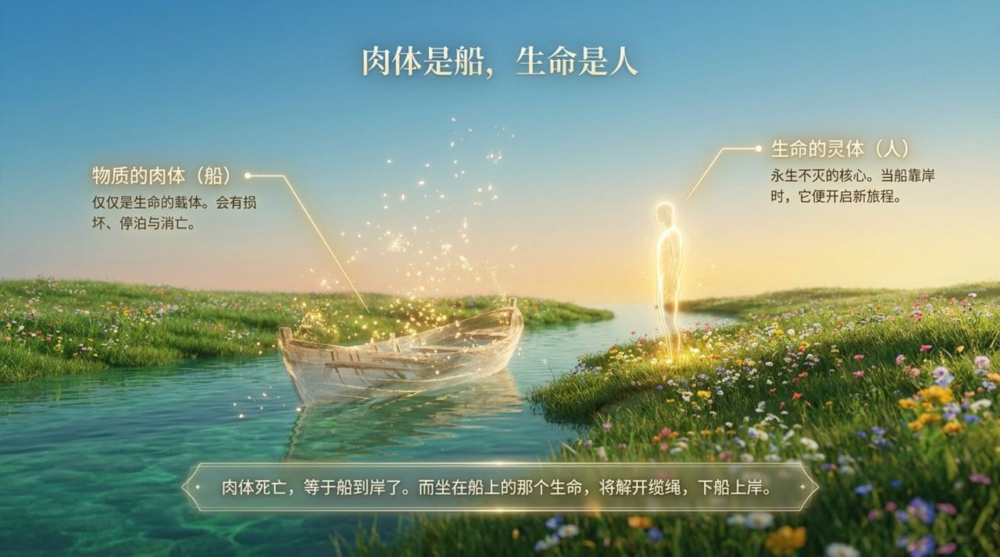
    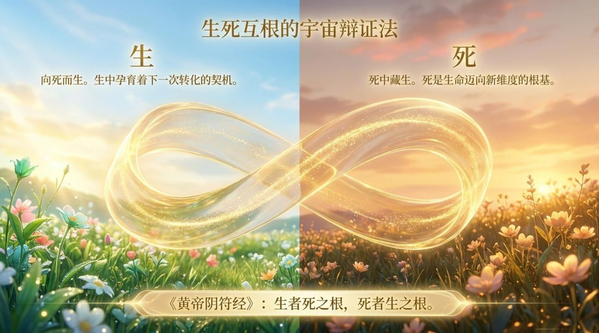
    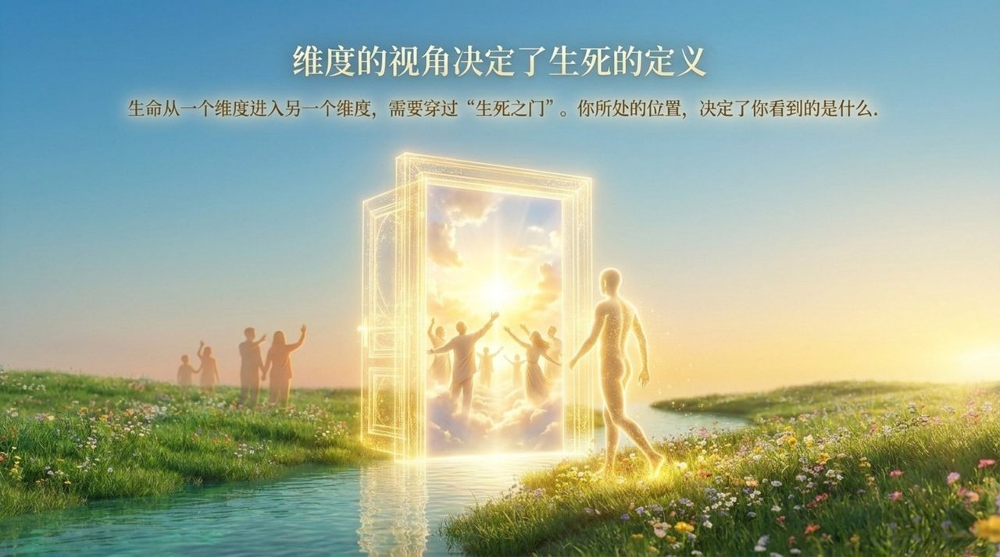
    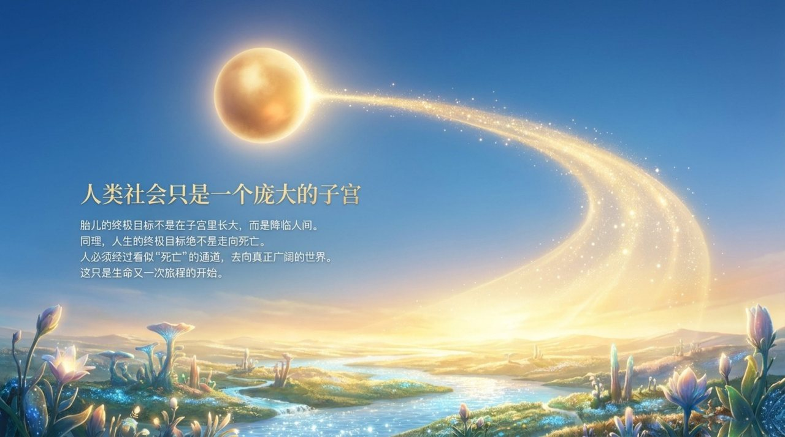
    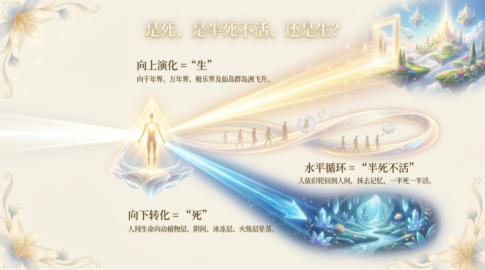
    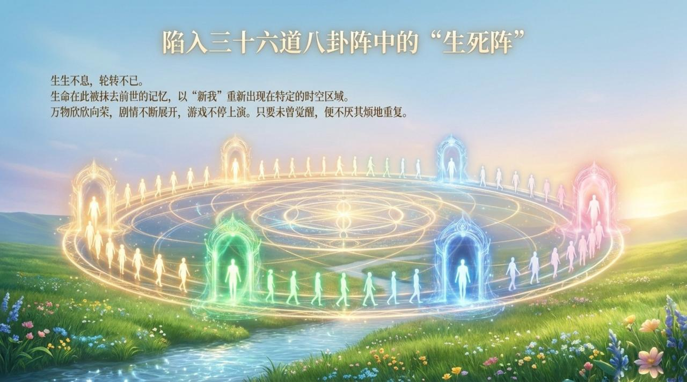
    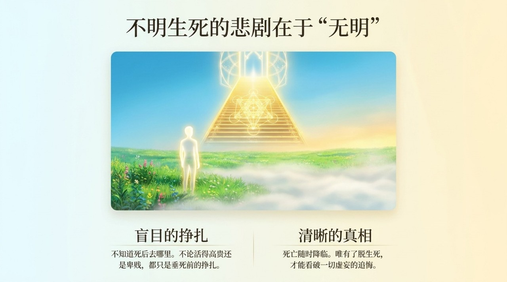
    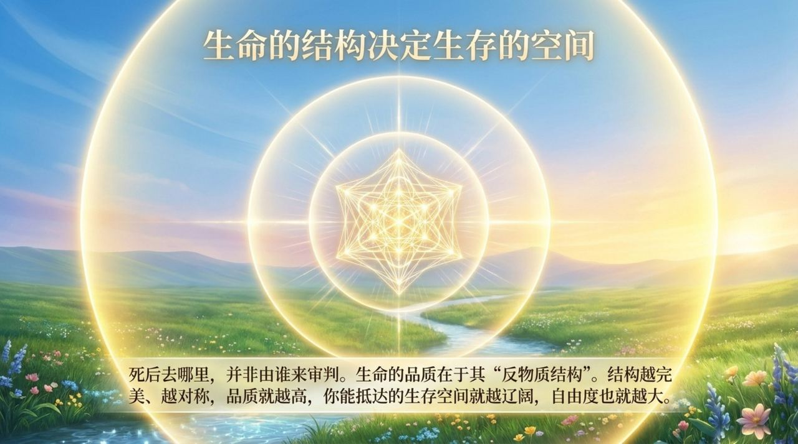
    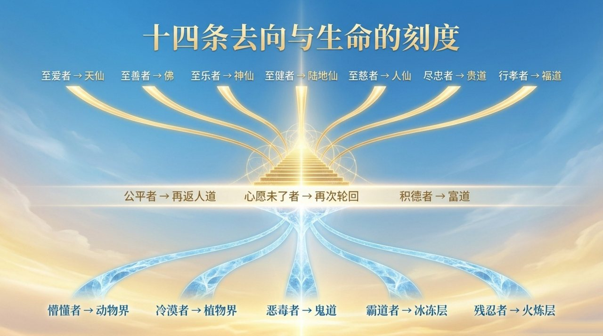
    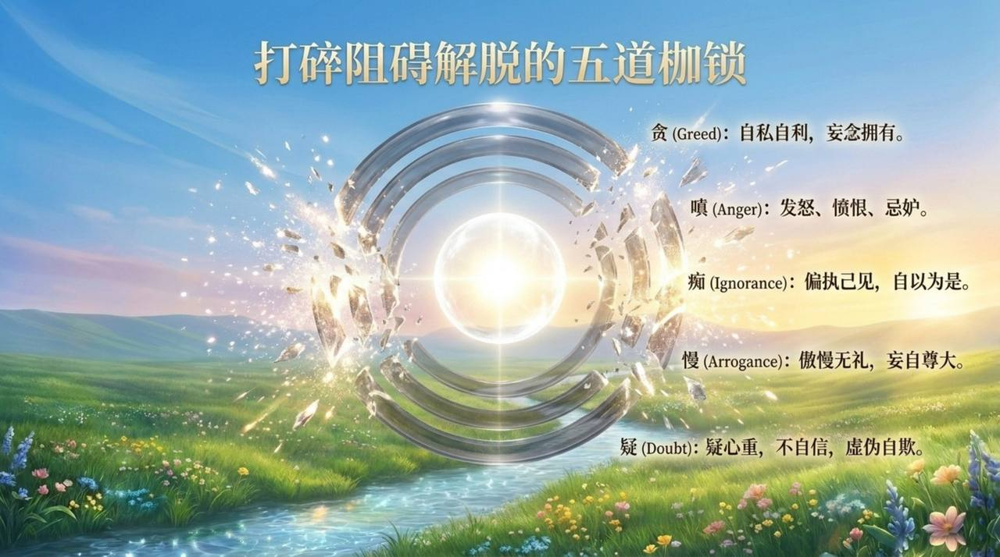
    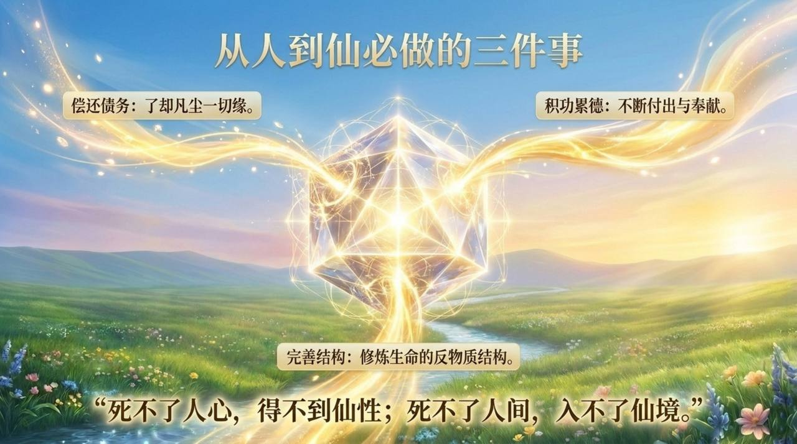
    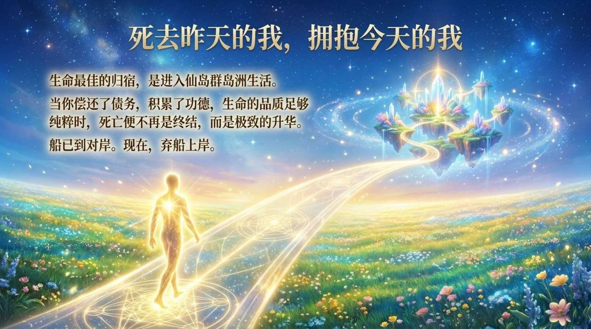

---

## 版本导读

| 版本 | 适合读者 | 入口 |
|------|----------|------|
| 友好版 | 初次接触者 | [阅读友好版](/zh/life-and-death/friendly/) |
| 学术版 | 学术研究、跨文化比较 | [阅读学术版](/zh/life-and-death/academic/) |
| 内部版 | 禅院草、深度研究者 | [阅读内部版](/zh/life-and-death/internal/) |

---

## 相关词条

[生命](/zh/life/) · [灵魂](/zh/soul/) · [因果·报应·轮回](/zh/karma-retribution-reincarnation/) · [觉悟](/zh/awakening/) · [反物质结构](/zh/antimatter-structure/) · [天国](/zh/kingdom-of-heaven/) · [仙岛群岛洲](/zh/celestial-islands-continent/)
