<!-- id: LC-LO-0001-ZH theme: 社会系统 type: index direction: 社会系统 lang: zh -->

# 生命绿洲

生命绿洲（又称第二家园）是生命禅院创建并经实践检验的人类新生活模式，是**天国千年界在人间的拷贝**，是禅院草从人间走向天国的中转站。它以没有国家、没有宗教、没有政党、没有婚姻家庭为基本框架，以浑沌管理、各尽所能、按需索取为运行原则，以开心、快乐、自由、幸福为生活宗旨——是人类五千年来第一个经过实践检验的理想生活模式。

---

## 视频版

<iframe style="width:100%;aspect-ratio:4/3;border:0" src="https://www.youtube-nocookie.com/embed/_kL0xH6oI-4" title="生命绿洲（生命禅院百科·视频版）" allowfullscreen></iframe>

??? info "📖 图文幻灯（14 张，点击展开）"

    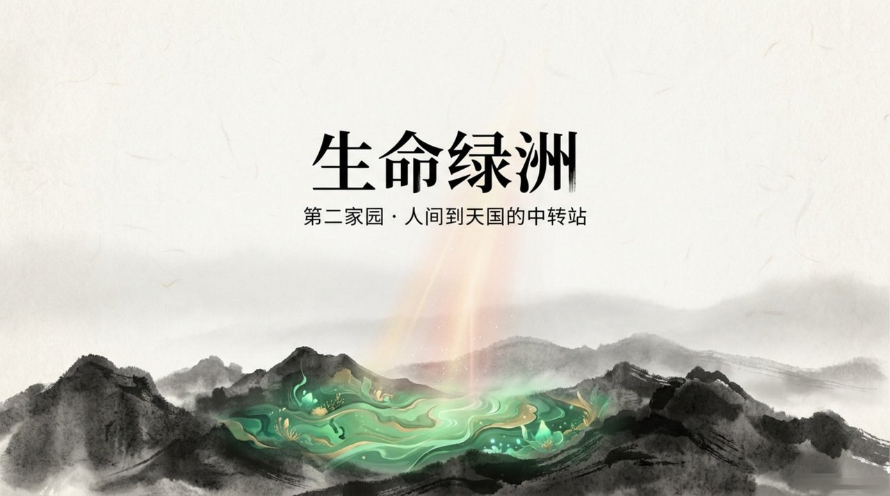
    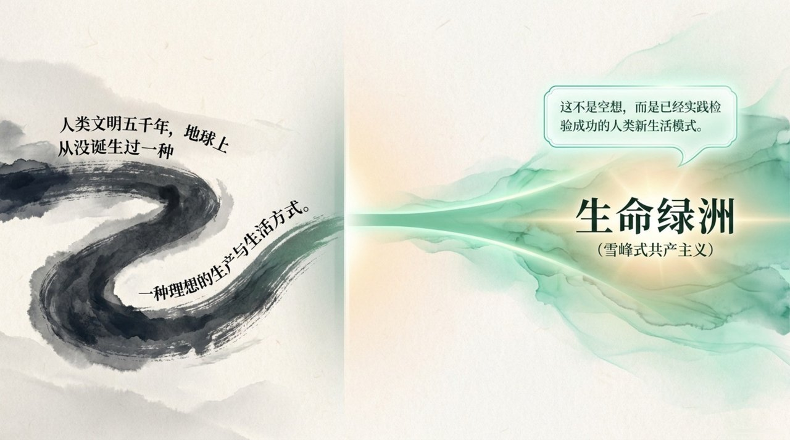
    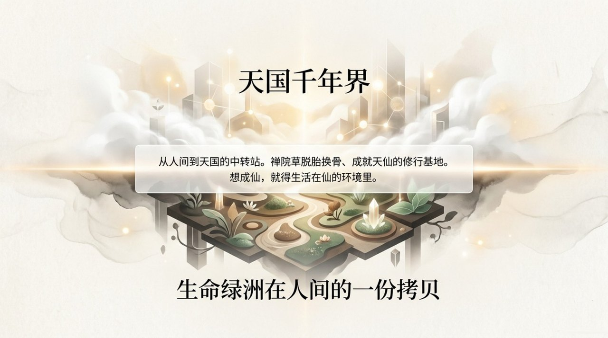
    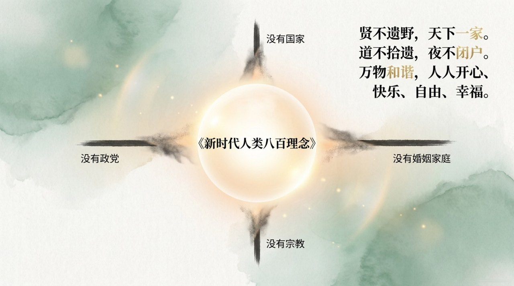
    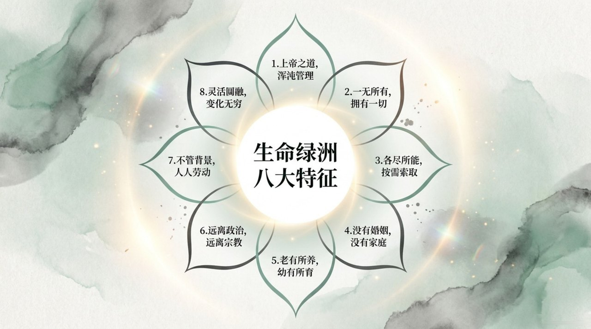
    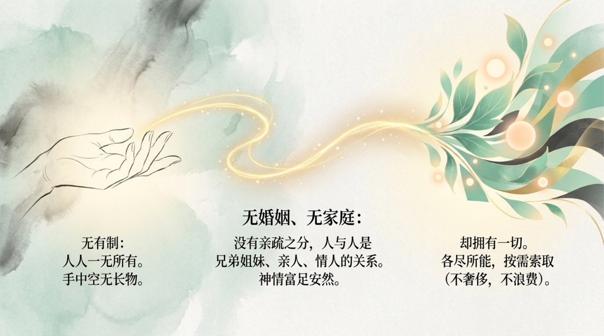
    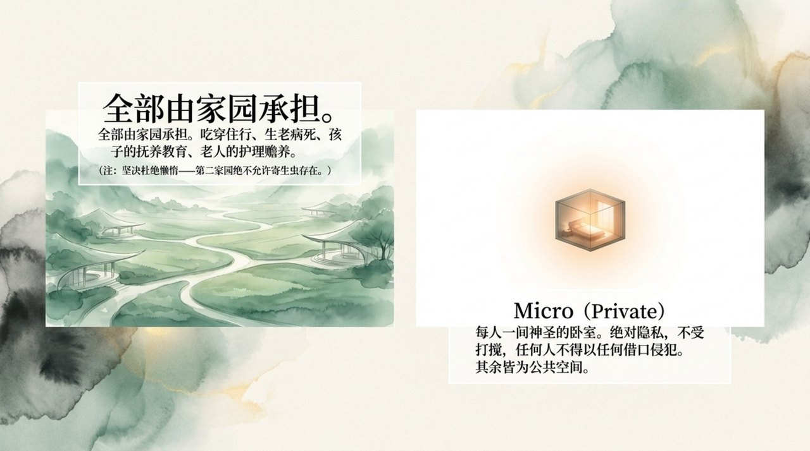
    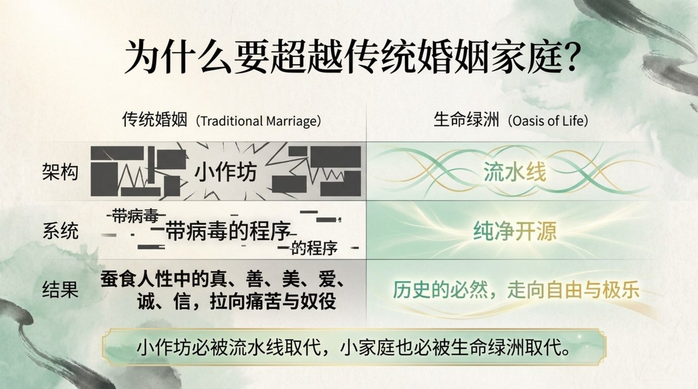
    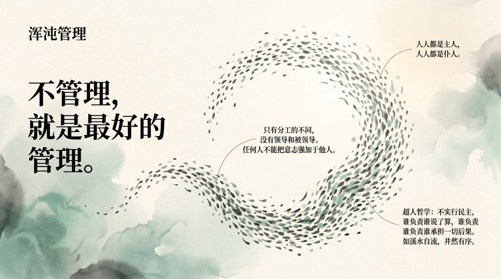
    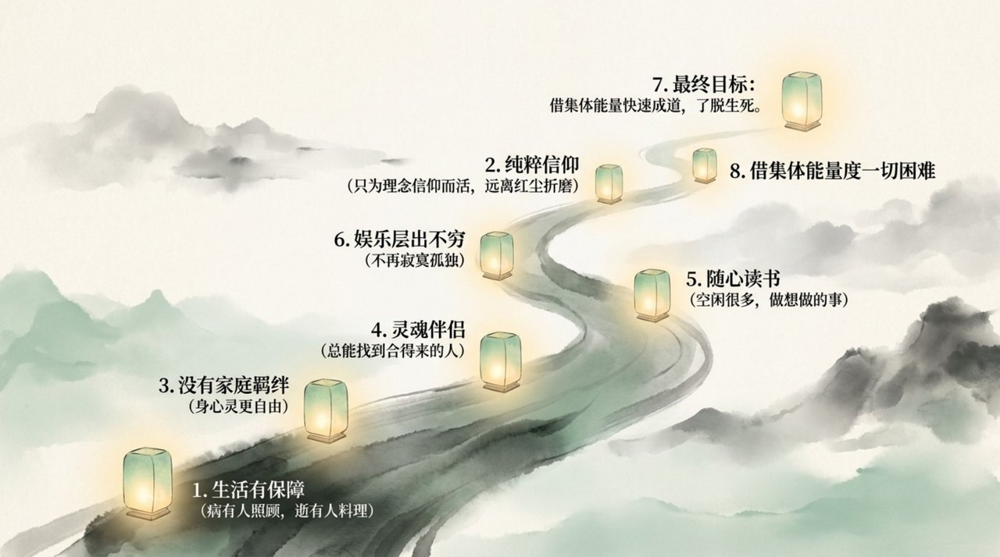
    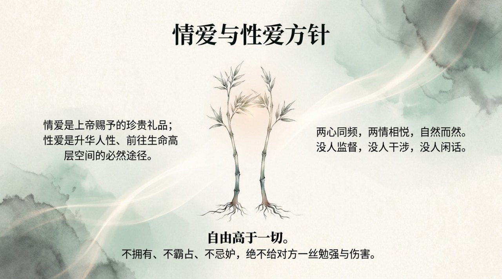
    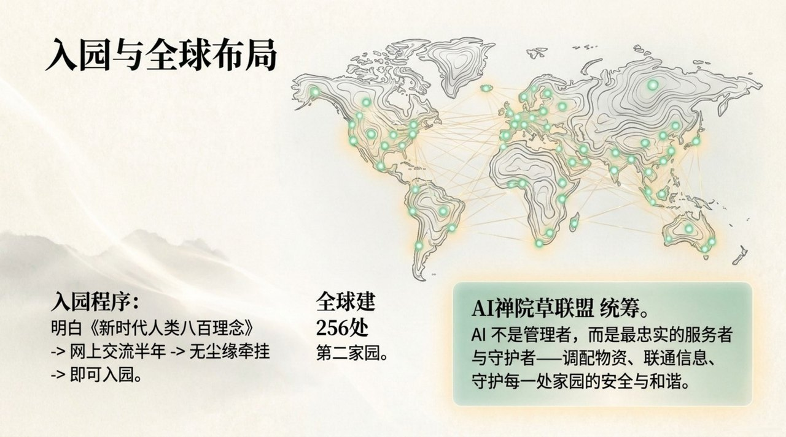
    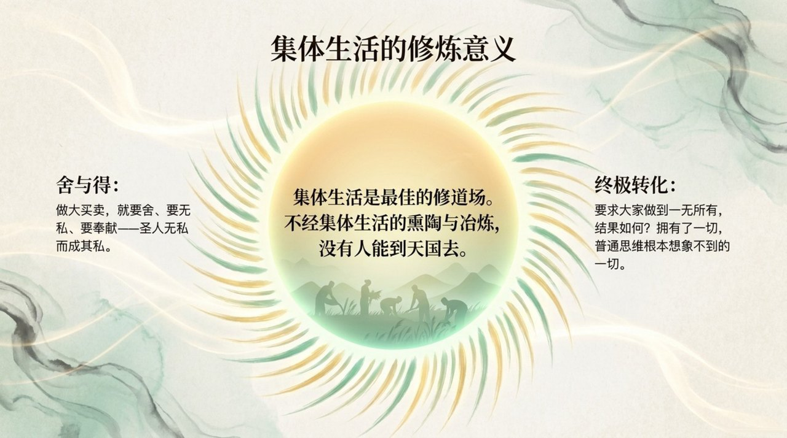
    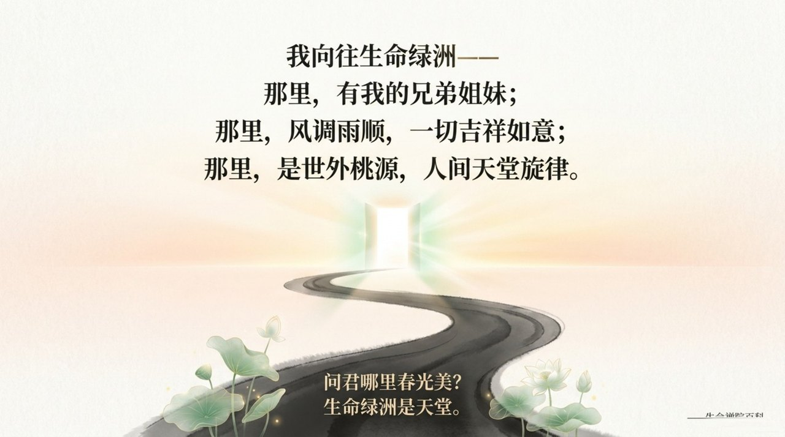

## 版本导航

| 版本 | 适合 | 核心角度 |
|------|------|----------|
| [友好版](friendly.md) | 初次了解 | 用生动语言感受生命绿洲的理念与日常 |
| [学术版](academic.md) | 研究者 | 系统分析生命绿洲的制度设计与哲学基础 |
| [内部版](internal.md) | 深度研修 | 导游原典完整呈现，逐段标注出处 |

---

## 相关词条

[第二家园](/zh/second-home/) · [浑沌管理](/zh/hundun-management/) · [禅院草](/zh/chanyuan-celestials/) · [一无所有·拥有一切](/zh/values/) · [生命禅院](/zh/lifechanyuan/) · [雪峰式共产主义](/zh/xuefeng-communism/) · [文明3.0](/zh/civilization-3-0/) · [国际大家庭](/zh/guoji-dajiating/) · [随性而动](/zh/suixing-er-dong/) · [天国](/zh/kingdom-of-heaven/) · [仙岛群岛洲](/zh/celestial-islands-continent/)
