<!-- id: LC-LR-0001-ZH theme: 宇宙时空 type: 词条索引 lang: zh -->

# 生命的轮回

**生命的轮回**的本质是：生命不死，死的只是生命的表现形式。生命的本质是有灵性的反物质结构，这种结构无法被消灭，只能从一种形式转化成另一种形式，从一个空间进入另一个空间——正如能量不灭，生命不息。宇宙中生命的总数是常数，不增不减，变化的只是轮回现象，如同地球上水的总量恒定，只是在云、雨、海洋、地下水之间循环。生命在十个空间中轮回转化：极乐界、万年界、千年界、人间、家畜界、动物界、植物界、阴间、冰冻层、火炼层。去往哪个空间，由"死"时的意识决定——有什么意识就去往什么空间，没有量变的积累绝无质变的可能。轮回概要：至爱者升华为天仙，至善者升华为佛，懵懂者转往动物界，恶毒者沉沦鬼道，残忍者降入火炼层。人能轮回成动物，动物也能轮回成人，这由债务法则、意识法则、生命平衡法则和人间中转站法则共同支撑。向下界轮回容易，升华到上界难：生命层次越低数量越庞大，本性难移，须有脱胎换骨的意识转化方能升华。开启灵觉、转化意识、消除业力、完善人性，是脱离低层轮回的根本路径。

## 视频版

<iframe style="width:100%;aspect-ratio:4/3;border:0" src="https://www.youtube-nocookie.com/embed/4ZvLbxZg_7M" title="生命的轮回（生命禅院百科·视频版）" allowfullscreen></iframe>

??? info "📖 图文幻灯（14 张，点击展开）"

    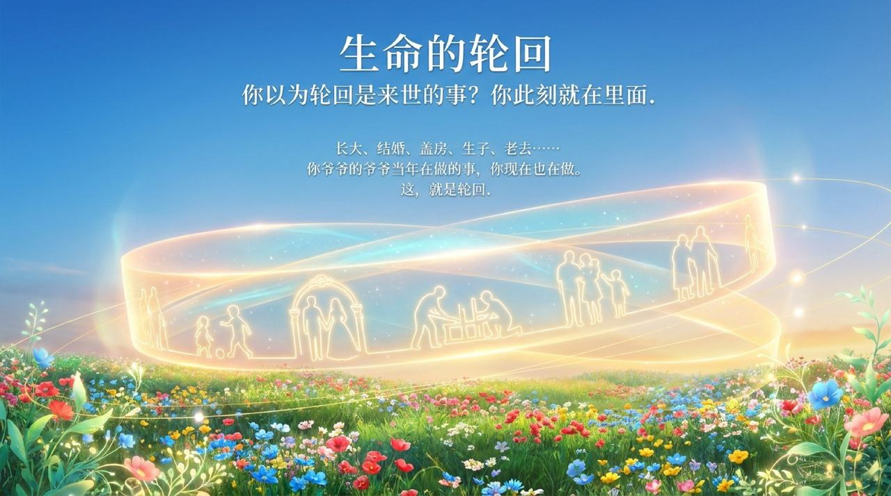
    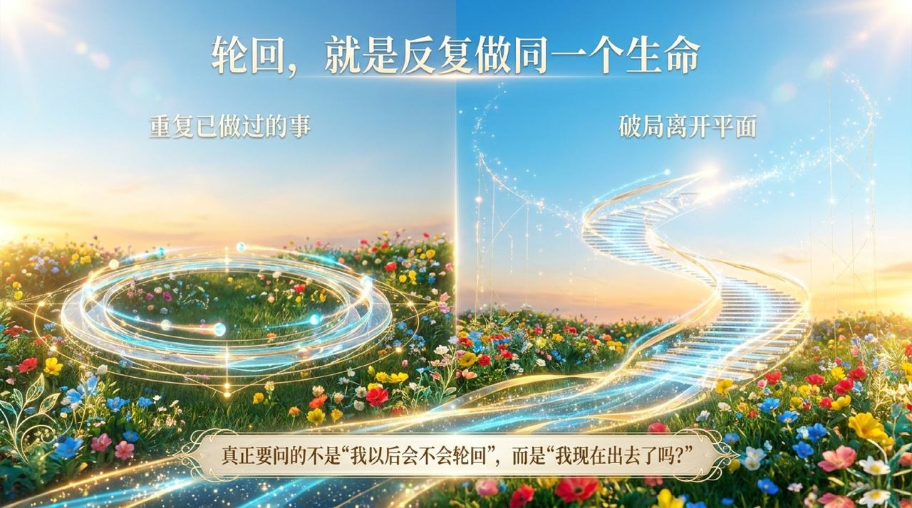
    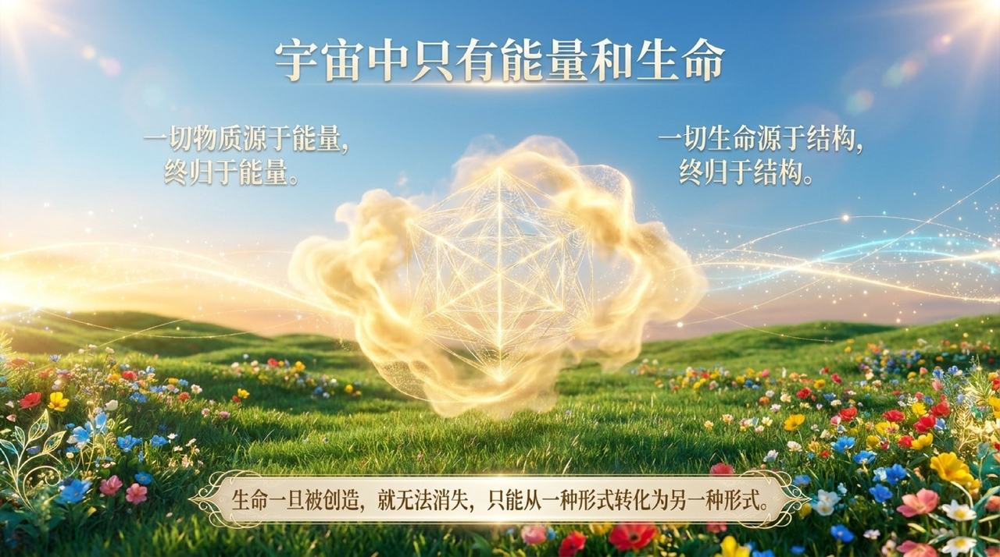
    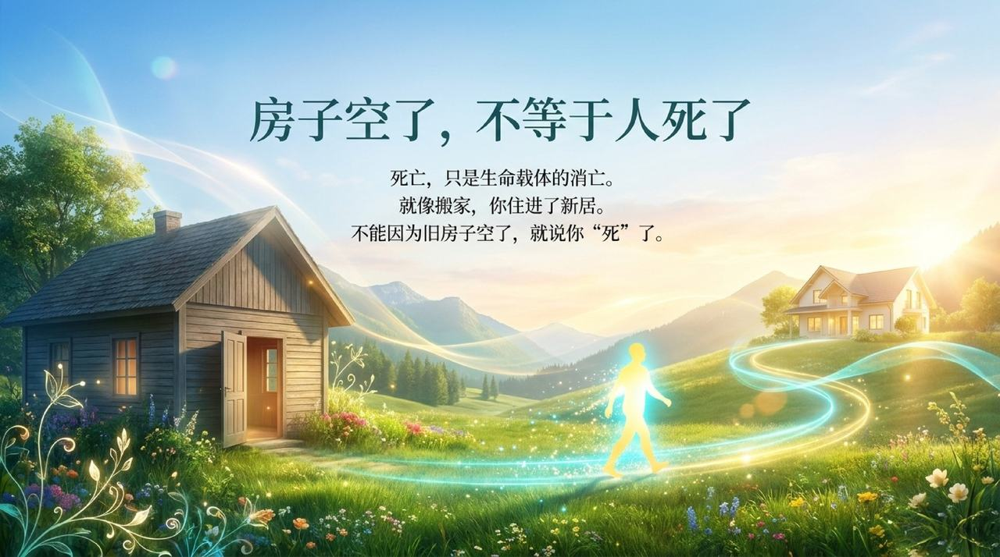
    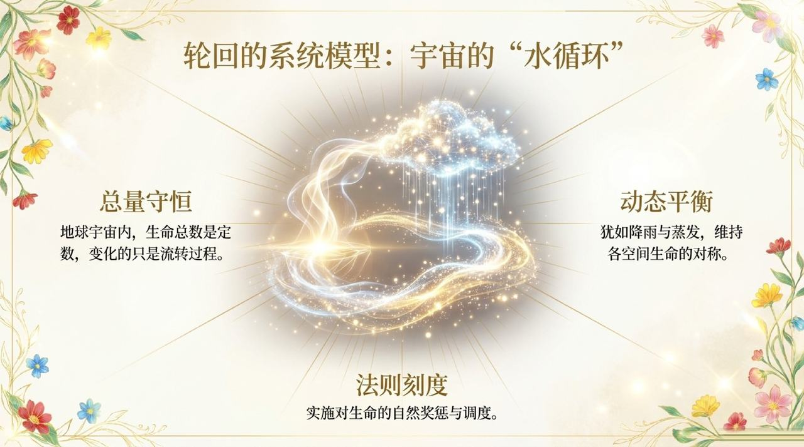
    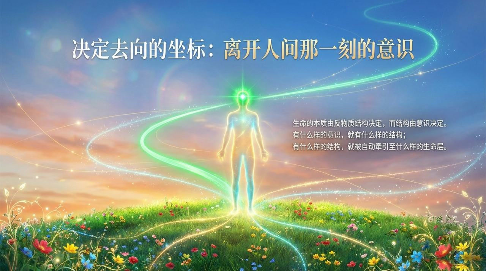
    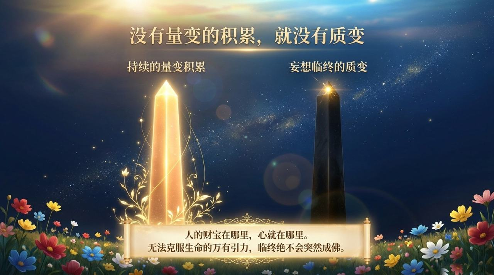
    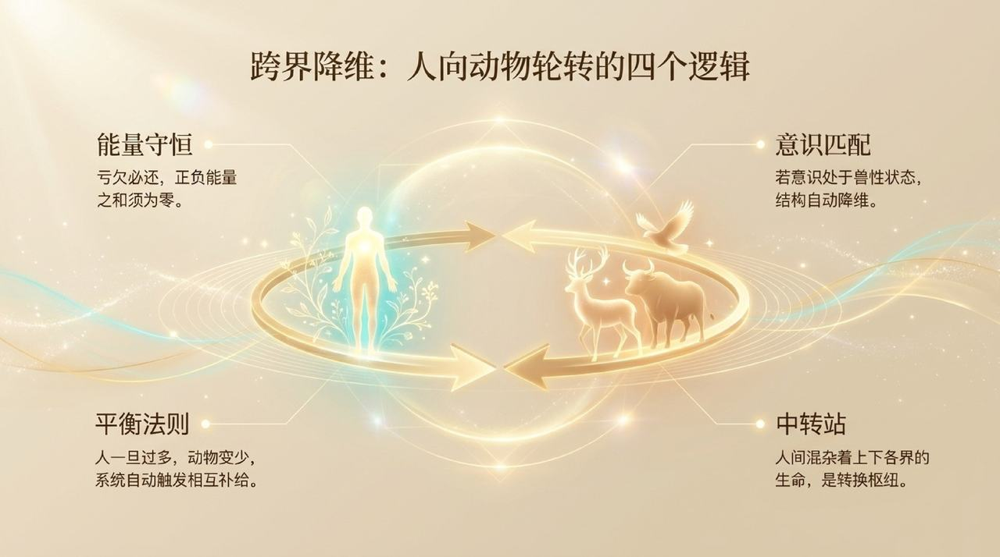
    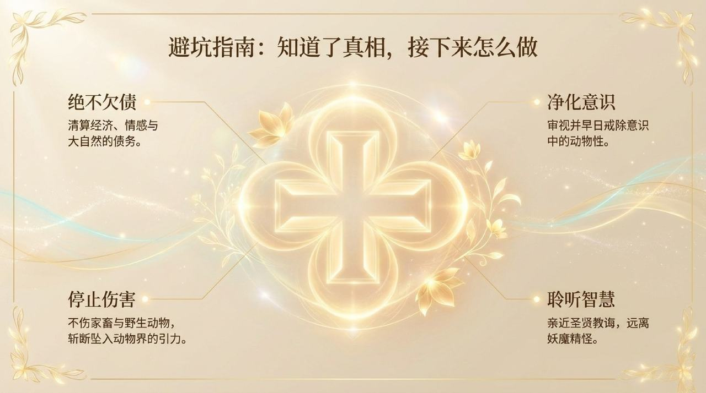
    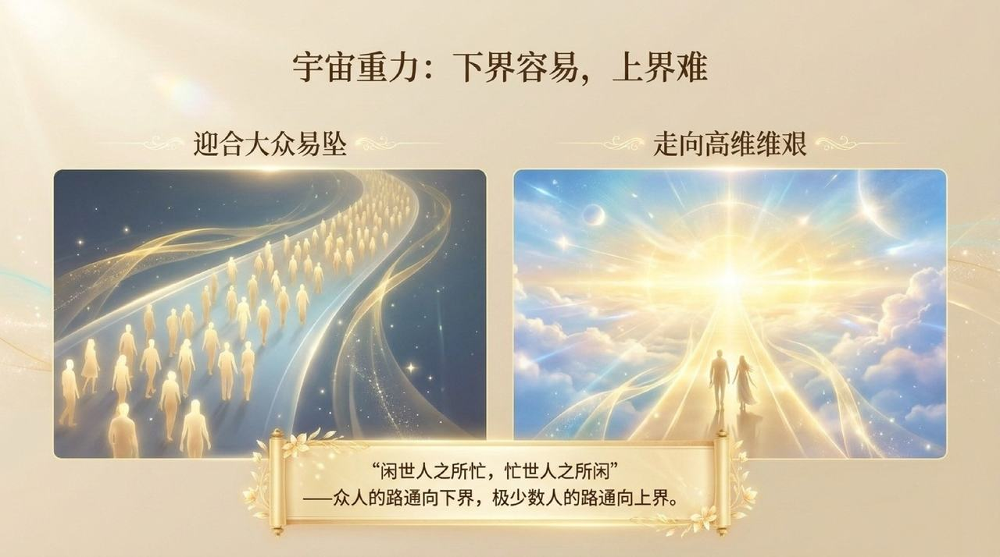
    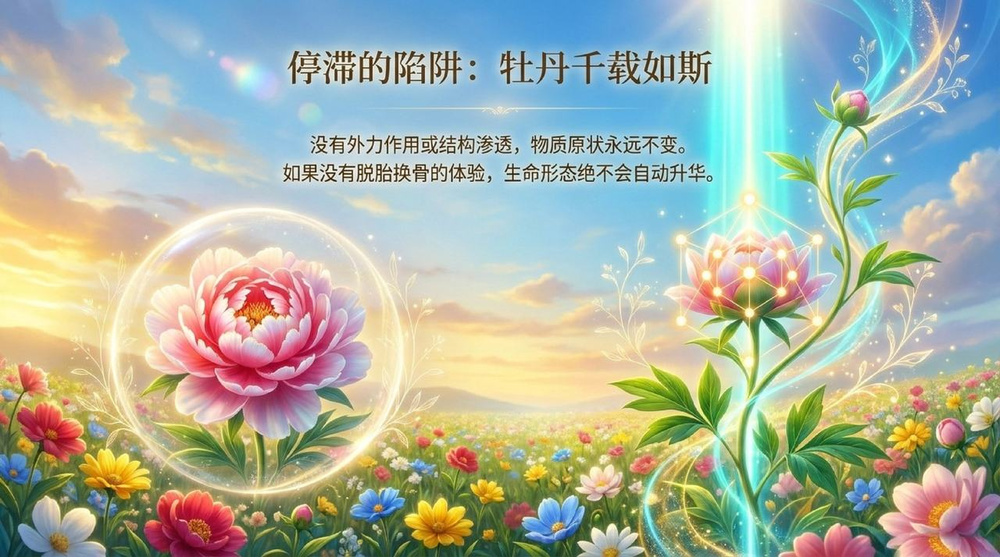
    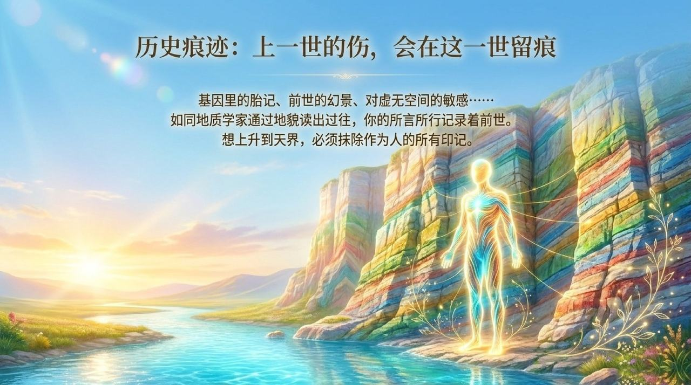
    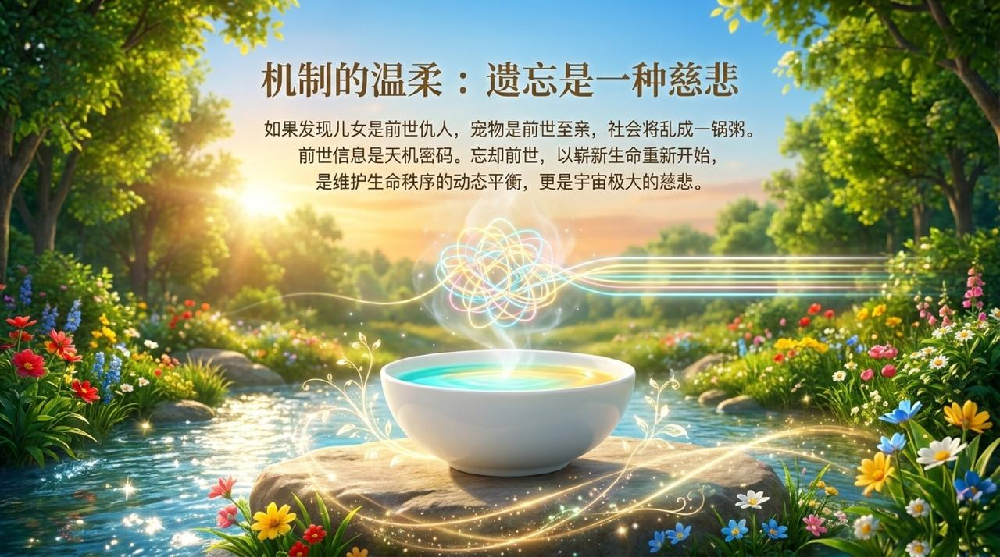
    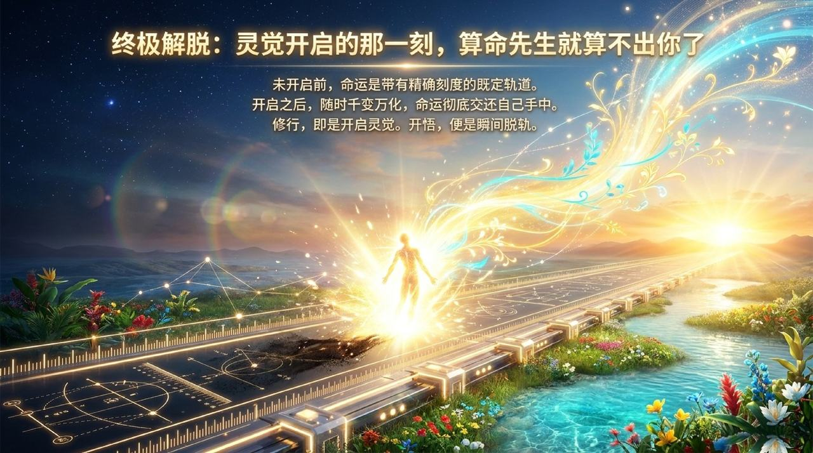

---

| 版本 | 适合读者 | 链接 |
|------|----------|------|
| 通俗版 | 初次接触者，想用日常语言理解 | [阅读通俗版](/zh/life-reincarnation/friendly/) |
| 学术版 | 研究者，需要来源分析与系统梳理 | [阅读学术版](/zh/life-reincarnation/academic/) |
| 内部版 | 禅院草，需要完整文集引文 | [阅读内部版](/zh/life-reincarnation/internal/) |

---

**相关词条**

[因果·报应·轮回](/zh/karma-retribution-reincarnation/) · [生死](/zh/life-and-death/) · [生命](/zh/life/) · [生命奥秘](/zh/life-mysteries/) · [反物质结构](/zh/antimatter-structure/) · [高层生命空间](/zh/high-life-spaces/) · [千年界](/zh/thousand-year-world/) · [人生轨迹](/zh/life-trajectory/) · [灵性](/zh/spirituality/) · [觉悟](/zh/awakening/)
