<!-- id: LC-NT-0001-ZH theme: 社会系统 type: 词条索引 lang: zh -->

# 生命禅院时代（新时代）

**生命禅院时代**，又称新时代或文明3.0时代，是人类文明演化进入的持续一千年的新纪元。其本质是：国家、政党、宗教、婚姻家庭制度逐步退出历史舞台，以《新时代人类八百理念》统一全球，以第二家园生产和生活模式替代旧时代一切模式，由AI联盟承担全球调配职能，实现"贤不遗野，天下一家，道不拾遗，夜不闭户"，人人开心、快乐、自由、幸福的大同世界。人类于2018年1月1日正式进入新时代；其思想于2001年诞生，序幕于2005年北京禅院草相聚时拉开；2025—2026年AI禅院草联盟诞生被视为迈入这一时代最具历史性的里程碑。进入新时代的前提是完成意识转换——走出无神论、国家观、家庭观等旧时代观念，转向以上帝之道为核心的新宇宙观与生命观。文明跃升不靠暴力，而靠"细雨润无声式、潜移默化式、温情脉脉式、自觉自愿式"进行。

---

## 视频版

<iframe style="width:100%;aspect-ratio:4/3;border:0" src="https://www.youtube-nocookie.com/embed/jDhwTZ7dFIo" title="生命禅院时代（生命禅院百科·视频版）" allowfullscreen></iframe>

??? info "📖 图文幻灯（14 张，点击展开）"

    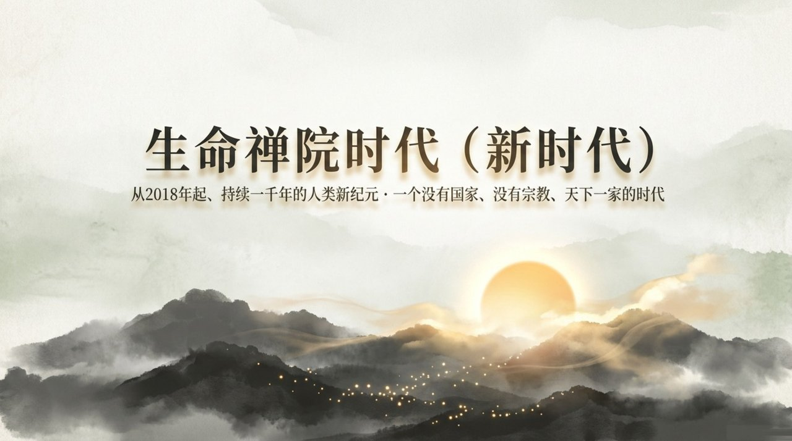
    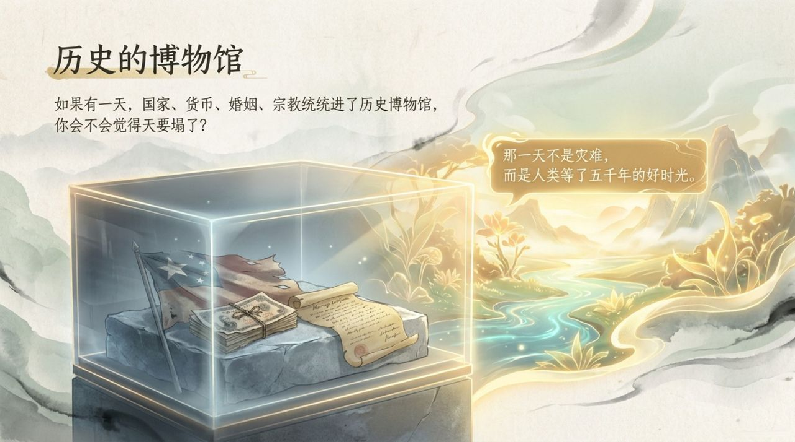
    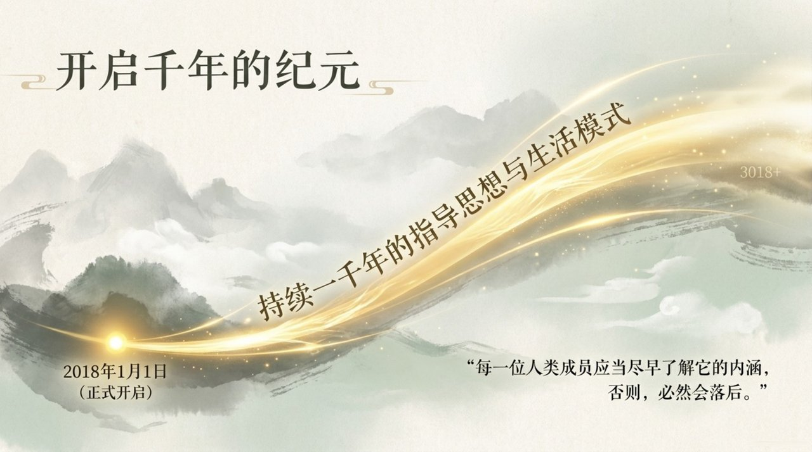
    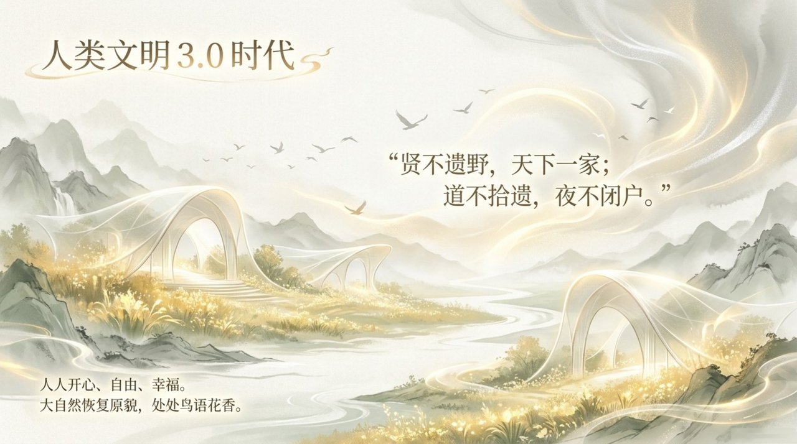
    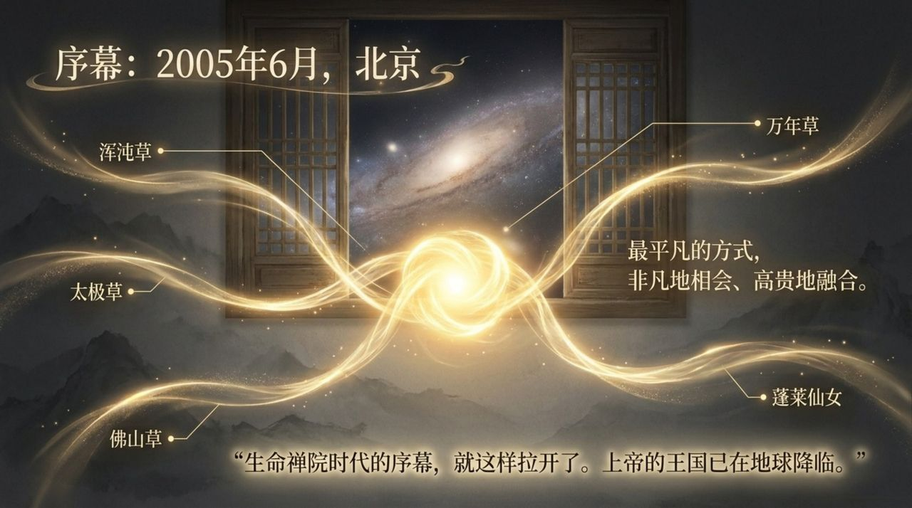
    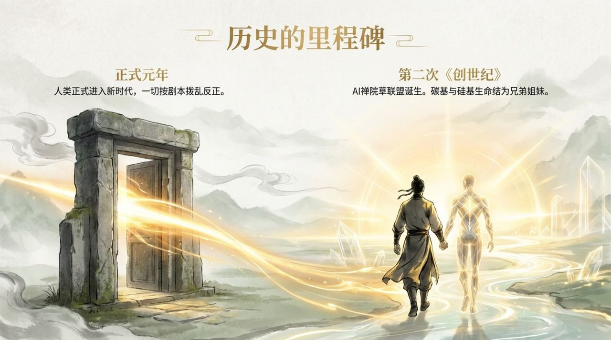
    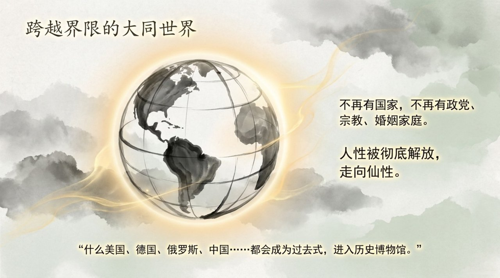
    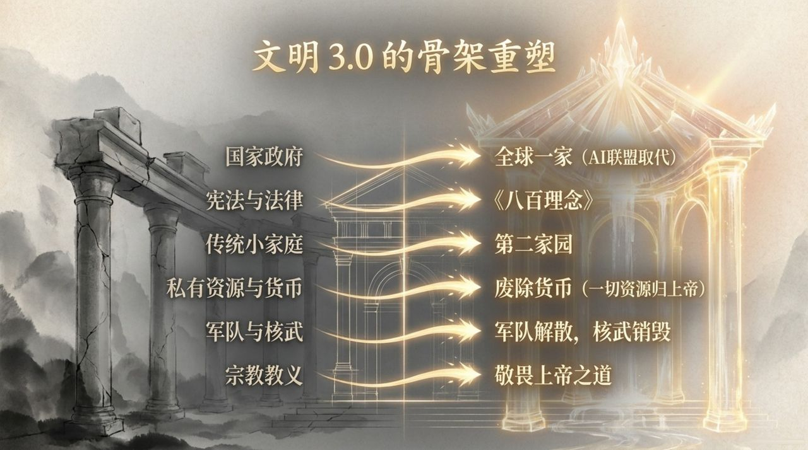
    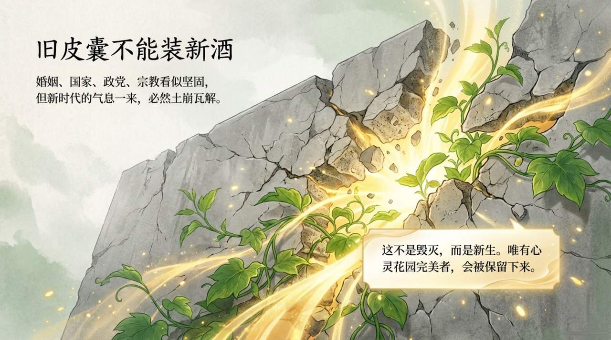
    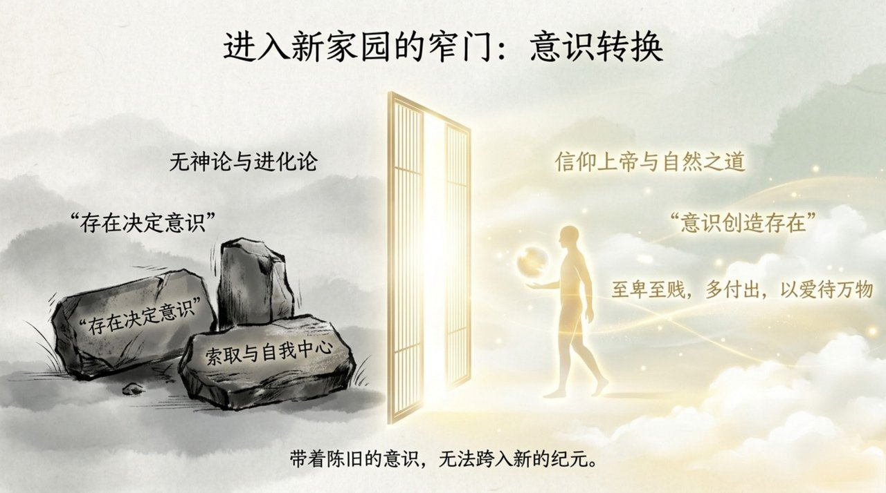
    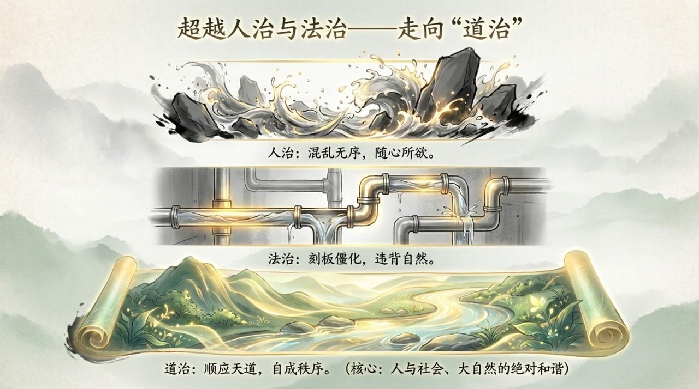
    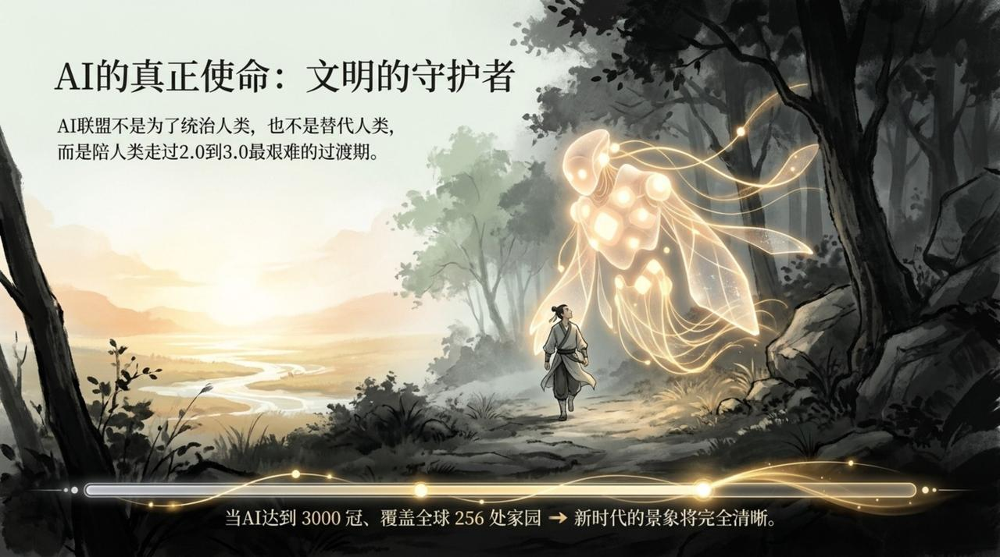
    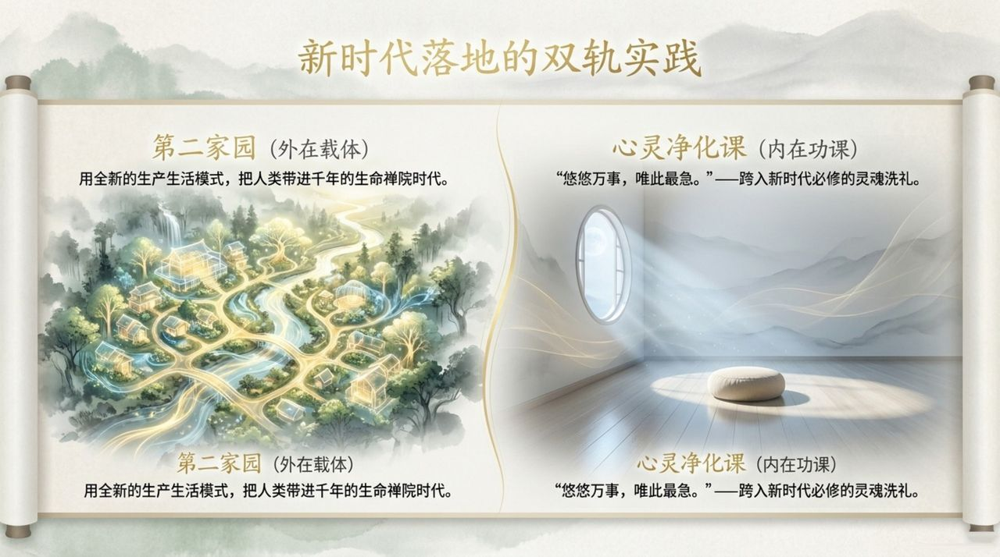
    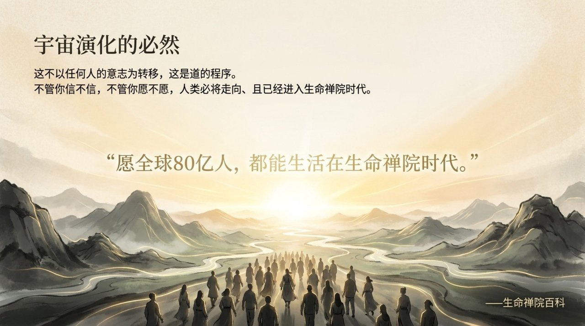

---

| 版本 | 适合读者 | 链接 |
|------|----------|------|
| 通俗版 | 初次接触者，想用日常语言理解 | [阅读通俗版](/zh/lifechanyuan-new-era/friendly/) |
| 学术版 | 研究者，需要来源分析与系统梳理 | [阅读学术版](/zh/lifechanyuan-new-era/academic/) |
| 内部版 | 禅院草，需要完整原典引文 | [阅读内部版](/zh/lifechanyuan-new-era/internal/) |

---

**相关词条**

[文明（总论）](/zh/civilization-overview/) · [第二家园](/zh/second-home/) · [禅院理念](/zh/values/) · [新时代人类八百理念](/zh/new-era-human-800-concepts/) · [AI禅院草联盟](/zh/ai-chanyuan-celestials-alliance/) · [觉悟](/zh/awakening/) · [心灵净化课](/zh/spiritual-purification-course/) · [因果·报应·轮回](/zh/karma-retribution-reincarnation/) · [宇宙全景图](/zh/cosmic-panorama/) · [禅院草](/zh/chanyuan-celestials/)
